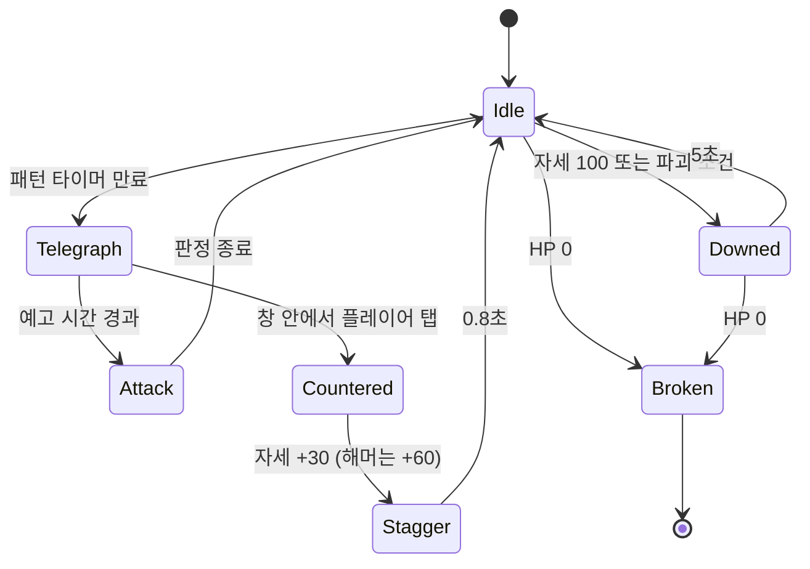

# 황혼 — 던전 01 · 훈련장(튜토리얼 허수아비 아레나) 기획 v0.1

> 상태: 초안 (디렉터 검토 대기) · 작성일 2026-09-15
> 범위: 첫 번째 던전. 전투 규칙의 "공통 뼈대"를 여기서 정의하고, 이후 모든 던전이 이 규칙을 그대로 쓴다.

---

## 0. 기존 프로젝트에서 확인한 것

이 기획은 이미 저장소에 있는 데이터·화면과 어긋나지 않게 잡았다.

| 확인 항목 | 위치 | 이번 기획에서 쓰는 방식 |
|---|---|---|
| 인력사무소 준비물 `훈련용 허수아비` | `js/world.js` `PARTY.office.prep`, `office.html` 정보 패널 | 훈련장은 **마태오의 인력사무소 뒷마당**. 준비물 카드가 훈련장 입구가 된다 |
| 전투 3기둥: 카운터 · 부위 파괴 · 출혈(상태이상) | `BOSSES.b_marsh` (약점 4부위, 패턴 5개, 숙련도 S~C), 캐릭터 `traits` | 허수아비 3종이 기둥을 하나씩 가르친다 |
| 전투 HUD 요소 | `battle.html` (보스 HP·스택·세그, 타이머, 파티, COUNTER 배너, 상태이상, HP/스태미나, 스킬 1~4 + 궁극기 R, 파우치) | 훈련장 화면은 HUD 를 그대로 재사용. 새 UI 를 만들지 않는다 |
| 결과 지표 | `result.html` (클리어 랭크, 시간, 카운터 성공률, 퍼펙트 카운터, 받은 피해, 사망 횟수, 카운터/파괴/생존 등급) | 훈련장 결과도 같은 화면·같은 지표로 정산 |
| 파티 등급 축 | `PARTY.gradeKeys` 카운터·부위파괴·정제·드랍·제작 | 훈련장은 앞의 두 축(카운터·부위파괴)만 평가 |
| 캐릭터 수치 | `CHARS.ain.stats` atk 2,980 · crit 18.2% · critDmg 142.6% · aspd 112.5, HP 24,450 | 피해 공식의 입력값. 튜토리얼은 **아인 고정** |
| 재료·소모품 | `js/items.js` `m_fiber` 갈대 섬유, `m_ore` 검은 철광, `m_oil` 정제유, `c_potion` 회복약, `c_antidote` 지혈제 | 훈련 보상. 새 아이템을 만들지 않는다 |
| 첫 의뢰 | `QUESTS[0] q_marsh` (위험도 S, 권장 Lv 26) | 훈련장 수료가 의뢰 목록 해금 조건 |

---

## 1. 목적

- 플레이어가 **60~90초 안에** 황혼 전투의 손맛(카운터 → 부위 파괴 → 출혈 마무리)을 체감한다.
- 이후 던전이 공유할 **전투 엔진의 규칙과 수치 표**를 확정한다.
- 서버 없이 클라이언트 단독으로 완결된다(현재 아키텍처). 진행도는 `localStorage` 에 기록한다.

비목표: 파티 동행 AI, 멀티플레이, 보스 AI 다양화. 이것은 던전 02(갈대습지) 이후.

---

## 2. 무대와 서사

- 장소: 인력사무소 뒷마당. 갈대 울타리와 녹슨 철골 사이에 허수아비 셋. 배경은 `art/lobby-city.webp` 계열 톤을 어둡게 눌러 쓴다.
- 안내자: 사무소 주인 **마태오**. 말이 짧다. 한 단계당 한 줄.
- 흐름: 사무실 → 준비물 카드 탭 → 훈련장 입장 → 허수아비 3단계 → 정산 → 사무실 복귀(의뢰 목록 해금 연출).

---

## 3. 전투 공통 규칙 (모든 던전이 공유)

### 3.1 시간과 판정
- 60 tick/초 고정 스텝 시뮬레이션. 렌더는 requestAnimationFrame. 저사양 폰에서 프레임이 떨어져도 판정이 흔들리지 않는다.
- 히트 스톱 80ms(일반), 160ms(카운터), 240ms(부위 파괴).

### 3.2 조작 (가로 화면, 엄지 두 개)
| 입력 | 행동 | 비고 |
|---|---|---|
| 우측 하단 탭 | 기본 공격 (3연격 콤보, 3타째 약점 보정 +) | 연타 간격 ≤ 450ms 유지 시 콤보 이어짐 |
| 좌측 스와이프 (아무 방향) | 회피 | 스태미나 25, 무적 0.30초 |
| 우측 하단 홀드 | 방어 | 스태미나 12/초, 피해 70% 감소 |
| **적 예고 섬광 중 탭** | **카운터** | 정식 창 0.25초 · 훈련장 0.40초 |
| 스킬 1~4 | 스킬 | 쿨다운 초 단위, HUD 의 `sk__cd` 로 표시 |
| R | 궁극기 | 게이지 100 필요. 카운터 +18, 부위 파괴 +25, 피격 +4 |

### 3.3 자원
- HP: `CHARS.stats.hp`. 0 이 되면 사망(훈련장은 사망 없음, 마태오가 "다시" 한마디).
- 스태미나 120. 초당 18 회복, 행동 후 0.6초 회복 지연. 0 이하이면 회피 불가(방어는 가능).
- 궁극기 게이지 0~100.

### 3.4 피해 공식
```
피해 = ATK × 기술배율 × 약점배율 × 카운터배율 × 치명타 × 난수(0.95~1.05)
  약점배율    : 약점 부위 1.5 / 파괴된 부위 1.25 / 일반 1.0
  카운터배율  : 성공 2.5 (퍼펙트 3.0) / 실패 1.0
  치명타      : 확률 crit%, 배율 critDmg% (CHARS.stats)
부위 피해     : 부위에 맞은 피해의 100% 가 그 부위 HP 를 깎는다 (파괴 특화 특성 +30%)
출혈          : 부여 시 3초 동안 초당 ATK × 0.20, 최대 3중첩 (아인 특성: 일반 공격 7% 확률)
자세(포스처)  : 카운터 +30, 부위 파괴 +40, 방어 성공 +10. 100 이면 격추 5초 (모든 피해 ×1.5, 약점 노출)
```

### 3.5 숙련도 등급 (기존 `BOSSES.mastery` 형식 그대로)
| 등급 | 조건 |
|---|---|
| S | 제한 시간 50% 이내 · 파괴 가능 부위 전부 파괴 · 카운터 성공률 70%+ |
| A | 제한 시간 75% 이내 · 파괴 부위 2개+ · 카운터 50%+ |
| B | 제한 시간 내 · 파괴 부위 1개+ |
| C | 제한 시간 초과 또는 조건 미달 |

---

## 4. 훈련장 구성 — 허수아비 3종

허수아비는 "보스 데이터 형식"(`BOSSES`)을 그대로 따른다. 즉 `weakpoints` `patterns` `mastery` `hud` 필드가 있고, 다른 던전의 보스와 같은 엔진으로 돈다.

### 4.1 1단계 · 짚 허수아비 「기본」 (30초)
- 가르치는 것: 탭 공격, 콤보, **약점(머리)** 타격.
- HP 6,000. 부위: 머리(약점, 피해 1.5배, 파괴 불가). 공격하지 않는다.
- 마태오: "머리를 노려라. 낫은 거기서 제일 잘 든다."
- 통과: HP 0. 카운터 지표 없음.

### 4.2 2단계 · 철갑 허수아비 「부위 파괴」 (45초)
- 가르치는 것: **부위 파괴**, 스태미나 관리, 스킬 3(범위) 사용.
- HP 14,000. 부위: 좌 견갑(파괴 가능 3,000) · 우 견갑(파괴 가능 3,000) · 몸통(일반). 견갑이 남아 있으면 몸통 피해 50% 감소.
- 두 견갑 파괴 시 격추(5초). 격추 중 몸통 피해 1.5배 → "부위를 부수면 길이 열린다" 를 몸으로 배운다.
- 6초마다 느린 휘두르기(예고 1.0초, 피해 400). 회피만 가르치고 카운터는 아직 요구하지 않는다.
- 마태오: "갑주부터. 겉을 벗기면 안이 보인다."
- 통과: HP 0. 숙련도 계산은 파괴 부위 수 기준.

### 4.3 3단계 · 태엽 허수아비 「카운터」 (60초)
- 가르치는 것: **카운터 타이밍**, 출혈 마무리, 궁극기 R.
- HP 20,000. 부위: 머리(약점) · 태엽 등판(파괴 가능 4,000, 파괴 시 예고 시간 +0.2초 = 카운터 창이 넓어짐).
- 패턴 3개가 정해진 순서로 반복(랜덤 없음. 튜토리얼은 학습이 목적):
  1. `bolt` 찌르기 — 예고 0.6초, 카운터 창 0.40초, 피해 600
  2. `scythe` 회전 베기 — 예고 0.9초, 창 0.40초, 피해 900, 방어 시 스태미나 30 소모
  3. `hammer` 내려찍기 — 예고 1.2초, 창 0.40초, 피해 1,400, **카운터 성공 시 자세 +60(즉시 격추)**
- 첫 카운터 성공 시 궁극기 게이지를 100 으로 채워 R 을 한 번 쓰게 한다. 궁극기 = ATK × 6.0, 출혈 3중첩 즉시 부여.
- 마태오: "예고를 보고 치지 마라. 예고가 끝나는 순간에 쳐라."
- 통과: HP 0. 카운터 성공률·퍼펙트 횟수 기록.

### 4.4 수료
- 3단계 모두 통과 → 결과 화면(`result.html` 형식) → 사무실로 복귀하며 의뢰 목록 잠금 해제 연출.
- 보상: 골드 1,500 · 갈대 섬유 ×20 · 검은 철광 ×10 · 회복약 ×3 · 지혈제 ×2. 등급 S 는 정제유 ×2 추가.
- 재도전은 언제든 가능(준비물 카드). 최고 기록만 남긴다.

---

## 5. 허수아비 상태 기계



---

## 6. 화면과 연출

- 화면: `arena.html` 하나. `battle.html` 의 HUD 마크업·CSS 를 그대로 쓰고, 중앙 전장만 훈련장으로 바꾼다. 가로 전용(`data-landscape`).
- 허수아비 그림: 아트가 나오기 전까지 SVG 로 그린 실루엣(짚/철갑/태엽 3종, 부위별 하이라이트). 부위 파괴 시 해당 조각이 떨어진다.
- 피드백 우선순위(벤치마크 시트 "전투 HUD 명료성" 기준): ① COUNTER 배너 ② 부위 파괴 팝업 ③ 피해 숫자 ④ 상태이상 줄. 동시에 뜨면 위 순서대로만 남긴다.
- 안내 문구: 화면 상단 중앙 한 줄, 3초 후 사라짐. 팝업·모달 없음. 손가락 위치는 하단 HUD 위에 반투명 링으로 1회만 보여 준다.
- 카메라: 히트 스톱 + 4px 흔들림. 카운터는 0.12초 화면 암전 후 붉은 섬광(팔레트 `#A51C1C`).

---

## 7. 데이터 구조 (구현 시)

```
js/dungeons.js   window.TW_DUNGEONS
  ARENAS.tutorial = { id, name:'뒷마당 훈련장', stages:[dummy1, dummy2, dummy3], rewards, unlock:'q_marsh' }
  dummy = BOSSES 형식 + { hp, parts:[{id, name, hp|null, weak, breakable, effectOnBreak}], patterns:[{icon, name, tele, window, dmg, posture}], timeLimit, lesson }
js/combat.js     엔진: tick(dt), input(type), 상태 기계, 피해 계산, 지표 집계 → 결과 객체(result.html 이 그대로 읽는 형식)
arena.html       HUD 재사용 + SVG 허수아비 + 안내 문구
js/world.js      PARTY.office.prep 을 훈련장 링크로, QUESTS 에 unlock 플래그
```

저장: `localStorage['tw:arena:tutorial'] = { best:{rank,time,counterRate}, cleared:true }`.

---

## 8. 구현 단계와 검수 기준

| 단계 | 내용 | 검수 |
|---|---|---|
| P1 엔진 | `combat.js` 고정 스텝, 입력, 피해·부위·출혈·자세·궁극기, 지표 | 헤드리스 봇으로 3단계 자동 플레이 → 결과 객체 검증 (카운터율·시간·등급 계산 일치) |
| P2 화면 | `arena.html`, SVG 허수아비, HUD 연결, 안내 문구 | Pixel 7 · 갤럭시(780×360) 가로에서 60fps 근접, 터치 목표 44px |
| P3 연결 | 사무실 준비물 → 입장, 결과 → `result.html`, 의뢰 해금, 로컬 저장 | QA 하네스에 시나리오 추가(입장→3단계→정산→복귀) |
| P4 조정 | 수치 튜닝(초보자 90초 내 수료, 숙련자 S 45초), 진동·소리 | 실기기 3회 플레이 로그 |

---

## 9. 디렉터 결정 필요

1. **조작 방식**: 위 표대로 "탭 공격 + 예고 카운터" 실시간 액션으로 갈지, 아니면 공격은 자동이고 **카운터·회피·스킬만 입력**하는 반자동으로 갈지. (추천: 반자동. 폰 가로 한 손 조작에서 손맛이 더 또렷하고, 시트의 "카운터 특화" 컨셉과 맞음)
2. **캐릭터**: 튜토리얼은 아인 고정으로 두는지, 4명 선택을 허용하는지. (추천: 아인 고정, 수료 후 선택 해금)
3. **허수아비 이름·3단계 구성**(짚·철갑·태엽)이 세계관에 맞는지. 언리얼 쪽 원본 기획에 훈련장 설정이 있으면 그 이름을 따른다.
4. **수치 원본**: 피해 공식·창 0.25초·스태미나 120 등은 이 문서가 최초 제안이다. PC 언리얼 프로젝트에 확정 수치가 있으면 그것으로 교체한다.
