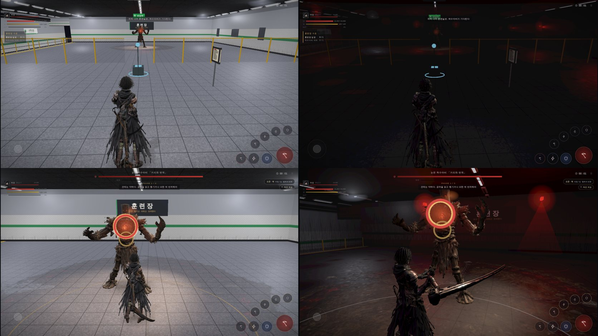
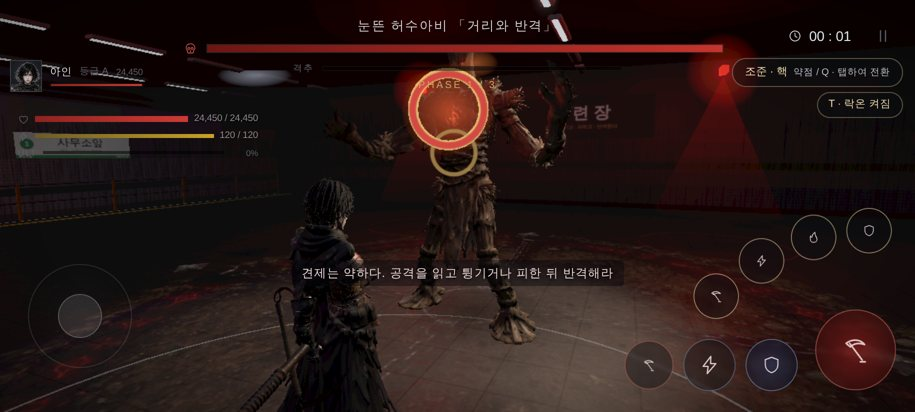

# 101 — 전투 카메라 · 서한역 조명 (목표 그림 1 차, 2026-09-26)

디렉터: 「UI는 지피티가 하고 너는 카메라랑 조명부터 해」 — 목표 그림(서한역, 눈뜬 허수아비와 붉은 비상등, 젖은 바닥, 낮은 어깨 너머 구도).
UI(HUD)는 건드리지 않았다(GPT 담당).

## 1. 전투 카메라 (`js/game3d.js` `CAM.fight`, `updateCamera`)

목표 그림은 **낮은 3/4 등 뒤** 구도다 — 캐릭터가 화면 왼쪽에 크게, 보스는 오른쪽에서 올려다보인다. 전에는 어깨 너머라도 캐릭터가 보스 바로 앞에 서서 보스를 가렸다(전투 캡처: 캐릭터·보스 가로 위치 모두 0.46).

- **락온 전투에서만** 새 구도로 옮겨 간다(0.8 초 시정수, 들어가고 풀 때 튀지 않게). 탐색 구도는 그대로.
- 카메라는 옆으로 1.7 m, 주시점은 거의 안 옮김 → **비스듬히** 보여 캐릭터(왼쪽)·보스(오른쪽)가 갈라진다. 거리 2.6 m·높이 거의 눈높이(피치 0.07)·화각 52°.
- 비껴 보기는 «플레이어→보스 선» 기준이라, 락온 추적을 전투 구도에선 1.2 m 까지·데드존 2.3° 로 좁혔다(원래 2.6 m·20°). 안 그러면 다가오던 방향에 멈춘 카메라가 비껴 보기를 상쇄했다.
- 결과(1672×941, 보스와 3.1 m): 머리 가로 0.37, 보스 0.54 · 캐릭터 키가 화면 높이의 약 60%. 모바일 가로(915×412)에서도 같은 구도.
- 휠 거리·흔들림·킥·벽 충돌은 그대로. 숫자는 모두 「근거 없음」(캡처로 맞춤).
- 주의: 전투 중 카메라가 스스로 도는 양이 늘었다(84 번 멀미 기준: 최대 69°/s 제한은 그대로). 멀미 얘기가 나오면 `CAM.fight.dead` 를 올린다.

## 2. 서한역 조명 (`SUBWAY_MOOD`, `buildSubway`)

- **어둡게**: 배경 거의 검정, 붉은 기 도는 짙은 안개(밀도 0.055), 노출 ×0.82, 하늘광 ×0.42, 달빛(주광) 0.55.
- **형광등 절반 꺼짐**: 꺼진 관은 회색 재질, 켜진 관만 빛(세기 6).
- **붉은 비상등**: 보스 뒤 두 개(보스 실루엣) + 선로 쪽 + 남쪽 벽 줄. 위에서 아래로 사라지는 빛기둥(가산 합성 원뿔). 폰은 등 개수 한도(4)가 있어 비상등을 형광등보다 먼저 단다.
- **젖은 바닥**: 거칠기 지도(웅덩이는 매끈) + 가짜 주변 반사(어둠 위 작은 붉은 점·차가운 형광 줄). 처음엔 웅덩이가 붉은 페인트처럼 보여 반사를 줄였다.
- **벽·천장**: 때가 흘러내린 더러운 타일, 어둡게.
- **캐릭터가 읽히게**: 보조 역광을 붉게(비상등이 등 뒤에서 윤곽), 사람·보스만 받는 앞쪽 보조광 하나 추가(역광만 있으면 검은 실루엣).
- 훈련장의 흰 «지금 튕겨라» 바닥 표시는 원래 설계(훈련장 전용 가르침)라 그대로 — 어두워져 더 눈에 띈다.

## 3. 검증

- `npm test` 394/394. 오류 없이 d01 입장·전투·베기(데스크톱·모바일 가로 캡처).
- 전 빌드와 같은 조건으로 나란히 캡처(위 그림).

## 4. 남은 것 (목표 그림 대비)

- 배경 미술: 역명판 «서한역 333», 낙서, 부서진 전동차, 출구 표지, 계단 — 다음 단계.
- 베기 궤적·피·불꽃 이펙트, 보스 모델(눈 시계 머리), 아인 모델·모션(100 번 A·B).
- 폰 실기에서 프레임 확인(가산 원뿔 3 개·포인트라이트 한도 4).
