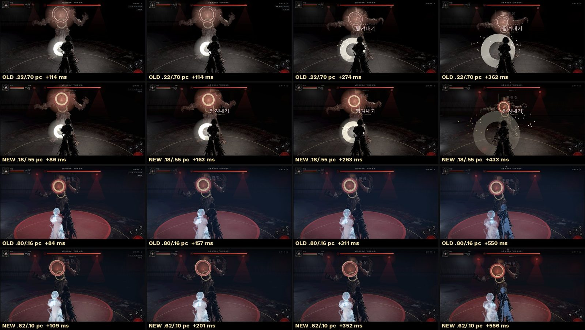
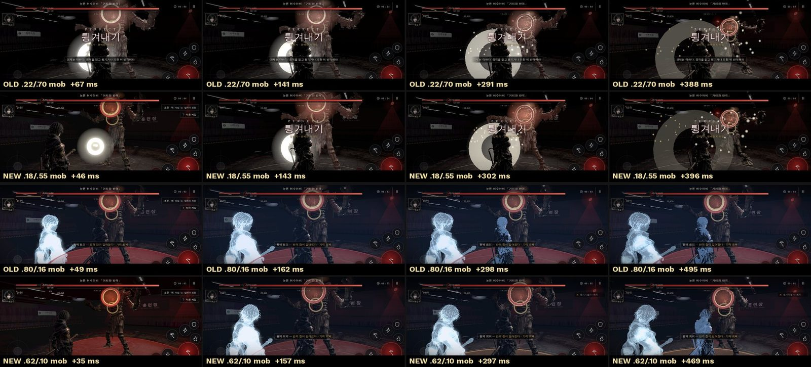
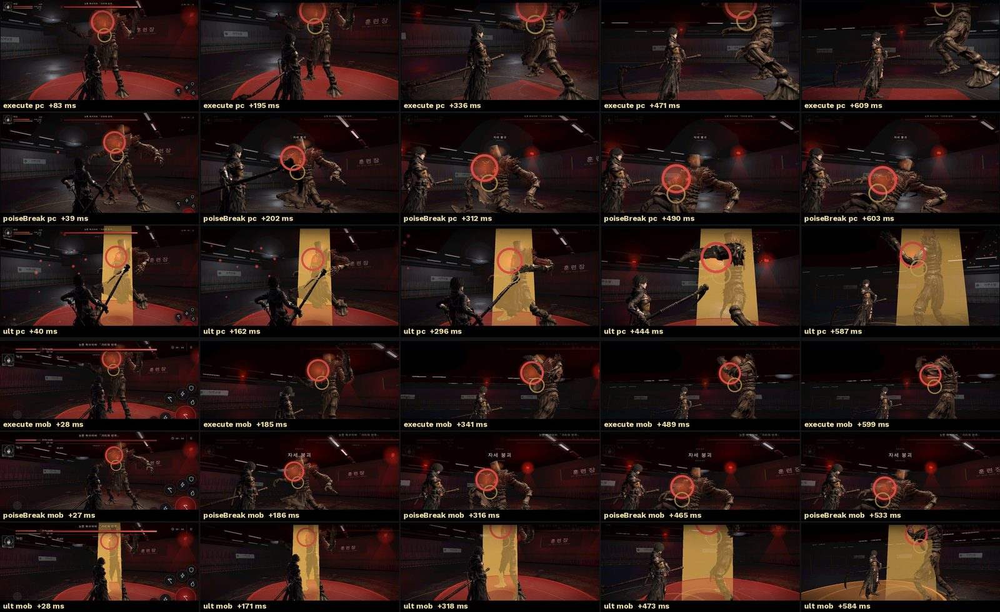
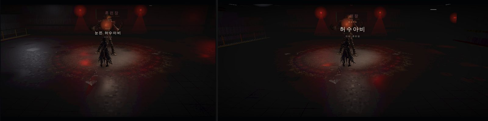
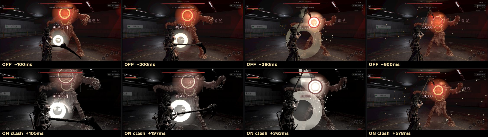
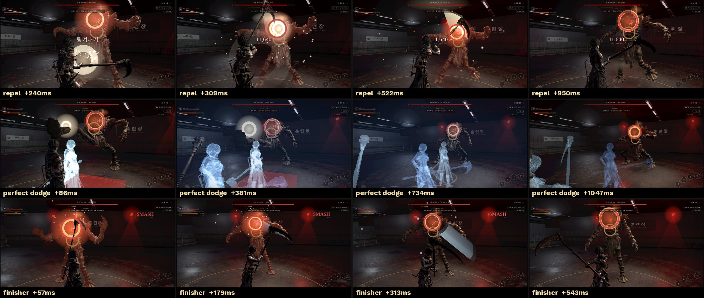

# 103 — 연출 감독 + L1 «순간» 연출 1 차 (2026-09-26)

> GPT 의 HUD 계약 문서 `103-cinematic-combat-hud.md` 와 번호가 같다(둘 다 103). 이 문서는 연출 감독(Claude) 쪽, 저 문서는 HUD(GPT) 쪽 — 사이의 약속은 `tw:cinematic` 이벤트 하나다.

디렉터: 「연출 감독이랑 L1부터 진행해보고 시안을 보여줘. 이미지로 봐야지」 (102 번 기획의 9 장 1 순위)

## 1. 만든 것

### 연출 감독 `js/cine-director.js`
전투 이벤트 → «연출 한 박자». **판정·수치는 안 건드린다** — 보이는 것(카메라·시간·빛·색·소리)만.

- **박자 표(`BEATS`)** — 기획이 표만 고쳐 조정한다. 값은 모두 「근거 없음」(캡처로 맞춤).

| 박자 | 부르는 때 | 시간 | 카메라 | 빛 | 색 | 소리 |
|---|---|---|---|---|---|---|
| 흘림 deflect | 이른 카운터 | 0.55 배 · 0.11 초 | 12% 붙음 · 화각 -4° | 푸른 섬광 약 | — | — |
| 튕김 repel | 카운터 | 0.40 배 · 0.17 초 | 15% 붙음 · 살짝 돎 · 화각 -4° | 섬광 · 비상등 35% 꺼짐 | 채도 -25% | 배경음 50% 눌림 |
| 맞대기 clash | 완벽 카운터 | 0.22 배 · 0.33 초 | **18%** 붙음(후보, 전 22%) · 두 무기 사이 쪽으로 봄 · 돎 · 화각 -4° · 타격 방향 흔들림 1 회(기존) | 흰 섬광 · **비상등 85% 꺼짐** | **채도 -55%**(후보, 전 -70%) | 85% 눌림 |
| 완벽 회피 perfectDodge | 맞기 직전 회피 | 0.18 배 · 0.76 초 · 연출 **0.62 초**(후보, 전 0.80) | 15% 붙음 · 반대로 돎 · 화각 -4° | 비상등 50% | 채도 -35% + 푸른 막 **0.10**(후보, 전 0.16) | 60% 눌림 |
| 연계 마무리 comboFinish | 스매시·3 연계째 적중 | 0.35 배 · 0.14 초 | 14% 붙음 · 화각 -4° | 따뜻한 섬광 · 비상등 25% | — | — |

- **규칙**: L1 은 조작을 뺏지 않는다(입력 버퍼 그대로) · 판정이 확정된 뒤에만 부른다(판정 전 슬로 없음) · 같은 박자는 0.12 초 안에 두 번 안 부른다 · 센 박자(맞대기)가 도는 중엔 약한 박자(흘림)를 생략 · 처형·페이즈 같은 컷이 도는 중엔 L1 생략.
- **카메라 규칙(디렉터 지시)**: 101 번 3/4 등 뒤 구도에서 순간 붙고(맞대기 후보 18%, 전 22%; 나머지는 «맞대기가 가장 세다» 를 지키려고 12~15%), 화각은 -4° 였다가 0.3 초 안에 돌아온다(`FOV_BACK`). 밀착은 박자 길이 안에서 빠진다.
- **훈련 표식(d01)**: 바닥의 큰 원형 타이밍 표식은 L1 연출 중에만 투명도 ×0.5(`ZONE_DIM`, 45~55%)로 낮춘다. 표식·색·채움(«언제») 정보는 그대로.
- **HUD 계약(v02, GPT)**: 박자가 시작되면 `window` 에 `tw:cinematic {id, tier, duration(ms)}`, 끝나거나 취소되면 `tw:cinematic:end`. HUD 는 이걸 받아 L1 에선 정보만 물리고(조작 유지), L2·L3 에선 조작 UI 를 비운다. 이름은 계약대로 `deflect / repel / clash / perfectDodge / comboFinish`.
- **L2·L3 훅**: `execute / ult / poiseBreakCinematic / bossBigTellCinematic`(L2), `bossIntro / phase / victory`(L3) — `CINE.hook(id, 초)` 로 «이미 있는 컷» 의 시작만 HUD 에 알린다. 카메라·시간은 아직 game3d 의 기존 컷 그대로(다음 단계). `poiseBreakCinematic`·`bossBigTellCinematic` 은 아직 부르는 데가 없다(컷 자체가 없어서). 컷이 끝나는 곳(등장 4.2 초·페이즈 2.85 초)·사망에서 `CINE.cancel()` → `tw:cinematic:end`.
- **L2·L3 예산**(다음 단계): 조작 뺏김 누적 8% 상한, L2 는 20 초에 1 번 — 이미 들어 있다.
- **강도 설정 `SET.cine`**: `cinema`(1.25 배) · `normal` · `minimal`(0.5 배, L1 만) · `off`(예전 고정 연출만). 설정 화면의 선택 칸은 GPT(UI) 몫 — 값은 `localStorage['tw:settings'].cine`.

### 게임 연결 (`js/game3d.js`)
- 카운터(흘림·튕김·맞대기)·완벽 회피·연계 마무리 이벤트에서 `cineBeat()` → 시간 배율은 기존 `slowmo` 로(0.16 초 입력 계약 유지), 소리는 `SFX.duck`.
- 카메라: 스무딩이 끝난 뒤에 얹는다 — 순간에 바로 붙고, 접점 쪽을 보고, 조금 돈다.
- 빛: 붉은 비상등 세기에 `1-dip` 을 곱한다(맞대기 순간 꺼졌다 켜짐). 섬광은 접점 자리 포인트라이트.
- 색: 캔버스 바로 위 `.cine-grade` 막의 `backdrop-filter`(채도·대비) — UI 는 색이 안 빠진다.
- 온라인 아바타는 아직 안 붙였다(다음).

## 1-2. L2 흐름 컷 — 처형 · 궁극기 · 자세 붕괴 (구도 선택기)

디렉터 규칙: 게임 카메라에서 자연스럽게 들어가 같은 카메라로 돌아온다 · 벽/보스 몸에 안 막히는 2~3 후보 중 선택 · 1.0~2.2 초 · 조작을 뺏는 동안 무적 · 한 판 8% 이내 · 20 초에 1 번 · 피해/판정/회피 무적/이동 거리 불변.

| 컷 | 부르는 때 | 길이 | 후보(보스 기준, «보스→플레이어» 축에서 돈 각) | 전투 시계 |
|---|---|---|---|---|
| execute | 처형 시작 | 1.7 초(들어감 0.6 · 복귀 0.5) | 옆 +75° 3.4 m h1.1 → 옆 -75° → 낮은 정면 4.2 m h0.8 · 둘 사이를 본다 | 돈다(처형 동작이 진행) |
| ult | 궁극기 타격 순간 | 1.2 초 | 넓게 +100° 4.0 m h1.4 → -100° → 뒤 4.8 m h1.0 | 돈다 |
| poiseBreak | 격추(downed) | 1.1 초 | 낮게 +55° 3.6 m h0.7 → -55° → 정면 4.4 m h0.9 · 보스 가슴을 본다 | **멈춘다**(처형 창을 안 깎는다) |

- 선택(`chooseShot`): 후보 순서대로 «벽에 안 막히고(주시점→카메라 선을 0.3 m 간격으로 `world.isSolid`) · 보스 몸 안이 아니고 · 플레이어가 보스 뒤에 숨지 않는» 첫 구도. 다 막히면 연출 감독은 거절하고 예전 고정 컷이 돈다(HUD 훅만).
- 카메라 비행은 기존 `cineCam`(들어감 → 유지 → `back:true` 로 게임 카메라 복귀). 조작 차단은 기존 `cine` 플래그, 무적은 피격 판정 훅 `HK.inZone` 을 거짓으로(`l2Invuln`) — combat.js 는 안 건드린다. `hold` 컷은 `battle.tick` 만 건너뛴다(`cineHold`).
- 예산은 연출 감독이 센다: `lostT/fightT ≤ 0.08`, `l2Gap 20 s`. `minimal`·`off` 강도에선 L2 없음.
- HUD: `tw:cinematic {tier:'L2', id:'execute'|'ult'|'poiseBreak', duration}` → 조작 UI 를 비우고 얇은 매트(GPT v04, 문서 105). poiseBreak 만 «BREAK» 캡션. 끝나면 `tw:cinematic:end`.
- L3 훅은 장면 제목을 detail 에 싣는다(105): bossIntro `{title:보스 이름, subtitle:던전 이름}` · phase `{phase:n, title:단계 이름, subtitle:등장 문구}` · victory `{title}`.
- `bossBigTellCinematic`(큰 기술 예고)은 플레이어가 반응해야 하므로 입력을 유지하고 조작 HUD 도 안 숨긴다 — HUD 엔 L1 로 알린다(`keepInput`). 부르는 데는 아직 없다.
- HUD 패치 적용 순서: v02(103) → v03(104, 설정 `tw:settings.cine` 을 감독·HUD 가 같이 씀 + 설정 화면의 «시네마틱 연출» 네 단계) → v04(105, L2/L3 매트·장면 제목). v03·v04 는 blob 정보 없는 평문 diff 라 `git apply --3way` 가 안 돼 GNU `patch -p1` 로 넣었다(모든 헝크 성공, 오프셋만). v03 테스트의 주석 정규식 하나는 v04 가 같은 주석을 «104·105» 로 바꿔서 `104(·105)?` 로 넓혔다.
- 온라인(raid.cjs)은 아직 안 붙였다.

## 1-3. L1 기존값 / 후보값 비교 (2026-09-26, 디렉터 지시)

| | 기존(main 91754b5) | 후보 | 채택 |
|---|---|---|---|
| 맞대기 채도 | -70% | **-55%** | 후보 — 비상등·보스의 붉은 기가 남아 서한역 분위기가 유지된다. -70% 는 거의 흑백이라 «다른 화면» 처럼 보였다 |
| 맞대기 밀착 | 22% | **18%** | 후보 — 붙는 느낌은 충분하고 폰에서 덜 튄다 |
| 완벽 회피 길이 | 0.80 초 | **0.62 초** | 후보 — 잔상이 사라지기 전에 조작감이 돌아온다 |
| 완벽 회피 푸른 막 | 0.16 | **0.10** | 후보 — 잔상이 더 또렷 |

캡처 방식: 판정 타이밍에 기대지 않고 같은 순간을 `cineDemo` 로 재생, 브라우저 시계 0.6% 배속으로 프레임을 찍어 목표 시각(+60·150·300·400 ms)에 가장 가까운 프레임을 골랐다. 위 기존값, 아래 후보값.

- 처형 컷은 처음엔 보스 머리가 위로 잘려(보스가 커서 «둘 사이» 주시점 1.2 m 가 낮았다) 주시점을 보스 머리 높이의 60% 로, 카메라를 3.6 m·h 1.3 으로 올렸다.
- 캡처 원본: 스크래치패드 `gs/ab3/`(pc_*/mob_* 프레임과 로그) — 저장소엔 시트만 넣었다.

## 2. 시안

시간을 늦춰(브라우저 시계 0.55% 배속) 박자를 프레임 단위로 찍었다(1280×720, d01 훈련장 허수아비). 맞대기는 위: 연출 감독 끔(`off`) · 아래: 켬(`normal`). 끔 쪽 시각은 방아쇠 시점을 못 재서 «~» 로 맞춘 근사값. 캡처는 GPT HUD v01 병합 전 화면이다(연출은 HUD 와 무관 — 색 막은 캔버스 위·UI 아래).

- 맞대기: 받아친 뒤 0.1~0.4 초 색이 빠지고(거의 흑백) 카메라가 붙는다. 0.58 초엔 붉은 색이 돌아온다.
- 튕김: 채도 -25% · 붙음이 약해서 끔과 차이가 작다 — «자주 나는 박자» 라 일부러 약하게.
- 완벽 회피: 푸른 막 + 잔상, 약 1 초.
- 확대 검수: 붙은 프레임(맞대기 +197 ms)을 1.5 배 확대 — 몸·무기 찢어짐·늘어남 없음.
- 완벽 회피의 «끔» 비교 캡처는 회피 판정 시점이 안 맞아 못 찍었다(다음에 보완).

## 3. 검증
- `tests/cinematic-director.test.mjs` — 계약: 판정 뒤 `tw:cinematic` 발행(id·tier·ms) · update 는 시간 배율을 내지 않는다(판정 전 슬로 없음) · 밀착 15~25% · 화각 -4° 뒤 0.3 초 복귀 · 종료·취소·reset 에 `tw:cinematic:end` · L2/L3 훅 계층·길이·컷 중 L1 생략 · game3d 연결 위치(판정 case 뒤).
- `tests/cine-l2.test.mjs` — L2: 후보 2~3·길이 1.0~2.2·구도 선택(막히면 다음, 다 막히면 null)·tw:cinematic L2·무적·hold·20 초·8% 예산·강도·L2 중 L1 생략·game3d 연결(훅으로 무적, 전투 시계 멈춤, 표식 감쇠 45~55%, combat.js 무변경).
- `tests/cine-director.test.mjs` — 모든 L1 박자는 조작을 안 뺏고 끝나면 0 으로 돌아온다 · 맞대기 > 튕김 > 흘림(시간·붙음·채도) · off/최소/영화 강도 · 우선순위·간격.
- `npm test` 전체(HUD v02 병합 후 — 수는 커밋 메시지·보고에).
- 시안 이미지는 HUD v02·카메라 수치 변경(15~25%) 전 캡처다 — 다음 캡처에서 갱신.

## 4. 남은 것 · 디렉터 확인
- 맞대기의 흑백이 너무 센지(지금 -70%) — «시간이 멈춘 순간» 으로 읽히는지.
- 카메라 붙음 17% 가 멀미 없는지 — 폰에서.
- 다음: L2 처형 구도 선택기(102 번 9 장 2).
