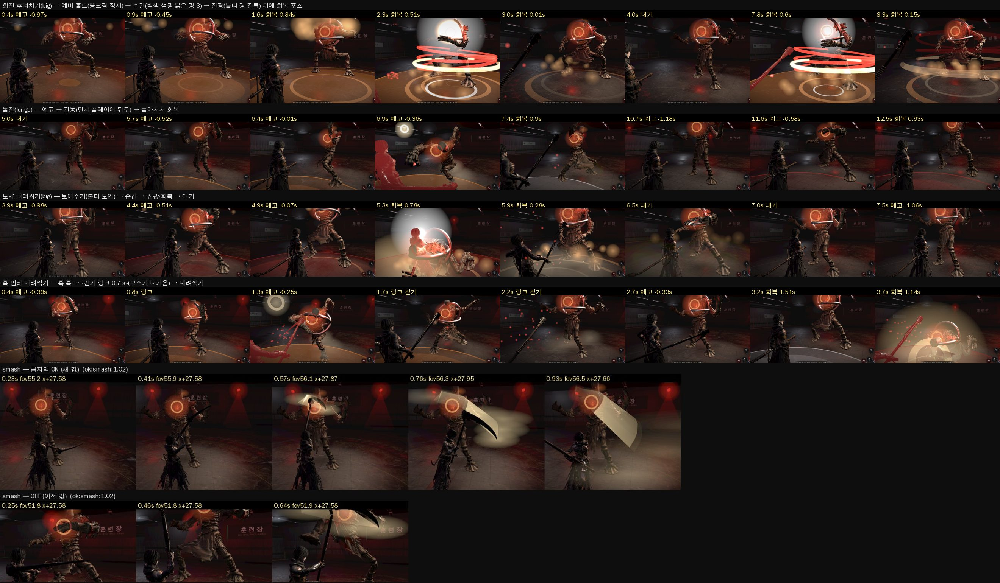
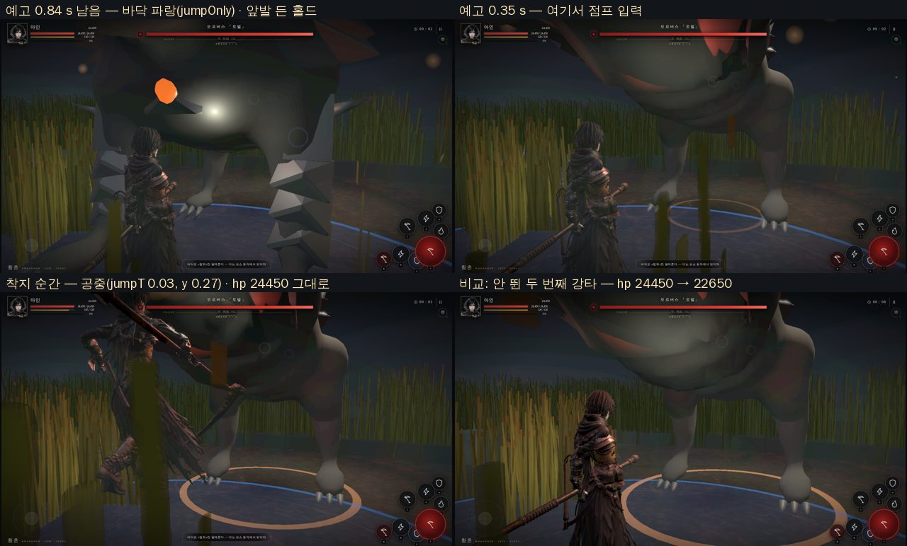
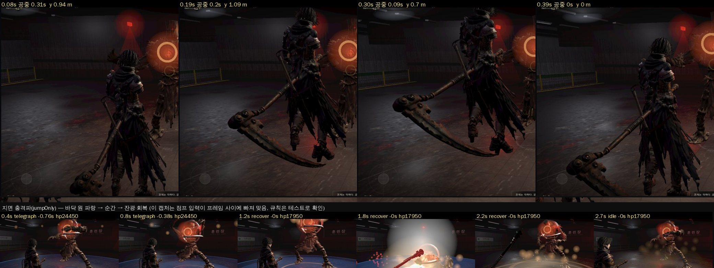
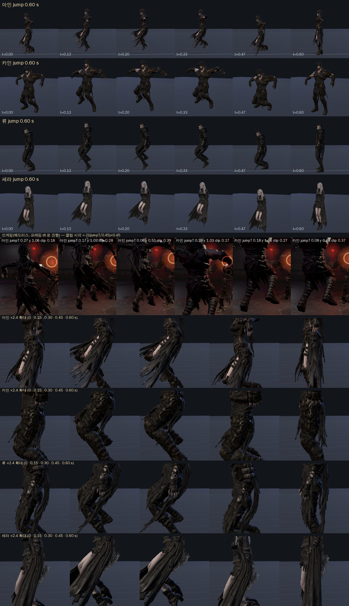
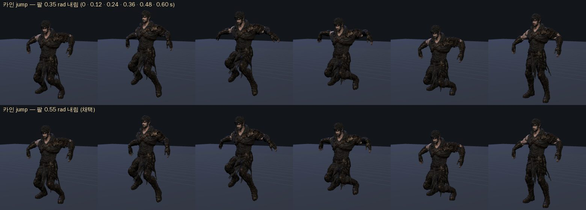

# 113. 렐라나식 보스 모션 · 큰 스킬 적용 (문서 112 의 실행, 2026-09-27)

디렉터 지시: 「전부 해. 그리고 스킬 모션도 저 게임처럼 큼지막하게」.

문서 112 §3(모션 쪽 5 항목)·§4(규칙 쪽) 중 «중립 걷기» 까지 넣었다. **점프 회피는 조작 패드 버튼이 필요해 GPT 의 UI 계약과 같이 가야 하므로 이번엔 뺐다**(§6). 판정 시계·피해·회피 무적(0.30 s)·자세 규칙은 그대로다 — 바뀐 것은 클립 표본 위치 곡선, 이벤트 필드, 연출, 그리고 «걷기 링크» 와 «관통 이동» 두 가지 규칙이다.

## 1. 바뀐 것

| 항목 | 어디 | 무엇 |
|---|---|---|
| 예비 홀드 프레임 | `js/boss-motion.js` `tellCurve` | 예고 진행률 → 클립 위치를 다시 깎는다. 정점(접점 클립의 84 %)까지 «빨리» 간 뒤 마지막 0.3 s 를 그 자세에서 4 % 만 움직이며 버티고, 마지막 0.1 s 에 접점까지 꽂는다. `hold` 비트(모르버스 대지 강타)는 combat 의 windup 곡선이 이미 «들고 버티기» 라 그대로. 양끝(0·1)은 그대로라 접점 프레임이 안 움직인다 |
| 회복 «무릎 → 기립» | `boss-motion.js` `settleCurve` + 프로필 `settle` | 회복 구간 앞 40 % 에 남은 클립을 다 쓰고 끝 자세에 «착지» 한 채, 그 위에 보스별 가라앉음(허수아비: 골반 -4.5 cm·척추 앞숙임 0.30 rad·머리 들기; 모르버스·수문기·계전기·모근체·기갑·소생기 각각)을 0.18 에 최대 → 천천히 0 으로 얹는다 |
| 관통 돌진 | `js/dungeons.js` d01 2·3 단계 «돌진» `lunge:{dist,dur}` · `js/game3d.js` `startLunge/tickLunge` · `server/raid.cjs` | 타격 순간부터 0.3 s 동안 플레이어를 지나 210~230 px 뒤까지 **실제로 이동**(Bs, 벽 충돌은 `moveEntity`). 판정은 이미 끝난 뒤라 공정성 불변. 끝나면 시선 고정을 풀어 돌아선다 — 그 돌아섬이 다음 예비 |
| 큰 기술 3 단 | `dungeons.js` `big:true`(양손·회전·도약 내려찍기; 모르버스는 rank S) · `game3d.js` `fxBigTell/fxBigStrike/fxAfterglow` | 보여주기: 예고 내내 핵으로 불티 10 개가 모이고 바닥 링이 커지며 핵 조명 +7 → 순간: 백색 스프라이트(1.6→5.8 배)·흰 링 0.16/0.28 s·흔들림 → 잔광: 회복 시간만큼 바닥 링이 퍼지고 불티가 떠오르며 조명이 식는다(빈틈을 이펙트가 덮는다). 첫 박에만 보여주기, 마지막 박에만 순간·잔광 |
| 회전 궤적 잔상 | `game3d.js` `fxBossRing` | `spin`·`scythe` 타격에 붉은 토러스 링 3 개(높이 3 단, 기울기 다름)가 0.36 s 동안 28 % 커지며 사라진다 — 렐라나 불꽃 회전의 붉은 링 |
| 중립 걷기 링크 | `js/combat.js`(`E.walk`, `snapshot.enemy.walking`) · `game3d.js`(busy·시선 고정 제외, oneshot 해제) · `server/raid.cjs` · d01 3 단계 «훅 연타 내려찍기» 2 박 `gap:0.7, walk:true` | 훅·훅 뒤 0.7 s 동안 보스가 플레이어 쪽으로 걸어온 뒤 내려찍는다(렐라나 B 연계의 «1 초 걷기»). 1.0 s 로 하면 레이드 봇 시험(`tests/party-raid`)이 3 단계에서 전멸해 0.7 s 로 |
| 이벤트 필드 | `combat.js` · `raid.cjs` | `telegraph`: `big·lunge`, `swing`: `icon·big·lunge·recovery` — 솔로·온라인이 같은 연출을 받는다 |
| 큰 스킬 «큼지막» | `js/swing-body.js` `WEIGHT`(skill1 1.30→1.40 · skill2 0.70→0.95 · skill3 1.40→1.45 · skill4 0.55→0.85) `LEAN_BIG 0.30`(무게 1.3 이상) · `js/weapon-trail.js` 마디 18→28, 큰 기술 궤적 잔류 0.16→0.30 s, 바깥 띠 폭 power 비례(최대 1.34 배), 칼바람 1.35 배 · `game3d.js` `skillLungeOffset`(접점 뒤 전진 스매시 0.45·궁 0.60·스킬1 0.42·스킬3 0.55 m, 연출 오프셋) · 화각 +5° | YAW 상한 0.52 는 그대로(두 손 IK 한계, 문서 64). A/B 스위치 `window.TW_BIG_SKILLS=false` |

테스트: `tests/boss-motion-rellana.test.mjs`(곡선 양끝·홀드 폭·회복 곡선·프로필 settle·이벤트 필드·d01 데이터·레이드 걷기/관통·배선). 전체 `npm test` 는 커밋 메시지에.

## 2. 검수 — 캡처 (d01 3 단계, 1280×720, 시간 지연 캡처)

| 항목 | 캡처에서 본 것 | 판단 |
|---|---|---|
| 예비 홀드 | 회전·도약 모두 예고 중반부터 «웅크린 정지 자세» 가 유지된다(예고 -0.97 s 와 -0.45 s 프레임이 거의 같은 포즈) | 렐라나식 «지금이다» 가 생겼다 |
| 큰 기술 순간 | 백색 스프라이트 + 흰 바닥 링 + 붉은 토러스 링 3 개(회전) | 한 프레임에 «터졌다» 가 읽힌다. 첫 캡처에서 불티 스프라이트가 0.35~0.9 배로 뿌연 덩어리였다 → 0.16~0.46 으로 줄임(도약 캡처는 줄인 값) |
| 잔광 · 회복 포즈 | 회복 0.5~0.15 s 프레임: 붉은 링이 남고 불티가 떠오르며 보스는 상체를 깊이 숙인 포즈(척추 0.30 rad·골반 -4.5 cm) → 대기에서 곧게 선다 | «무릎 → 기립» 이 보인다. 숙임이 깊어 보이면 settle 의 Spine 0.30 → 0.22 로 (디렉터 판단) |
| 관통 돌진 | 예고 -0.36 s 에 이미 몸이 앞으로 던져지고(먼지), 회복 0.9 s 프레임에 보스가 플레이어 자리를 지나 뒤에 있으며, 다음 예고에서 돌아서 있다 | 동작·위치 모두 됨. 헤드리스(swiftshader 1~2 fps)에서는 프레임 dt 로 움직여 이동이 늦게 보이지만 실기 60 fps 에선 0.3 s 안에 끝난다(`lungeprobe`) |
| 걷기 링크 | 훅 2/3 뒤 `link·walking` 프레임 2 장: 보스 x 1386 → 1326 → 1324(플레이어 쪽으로 걸어옴, 플레이어는 맞아 밀려남) → 3/3 내려찍기 → 회복 1.51 s(0.9 × 1.7, 3 박 연계) | 렐라나 B 연계의 «걷기 1 박» 이 됐다. 0.7 s 는 레이드 봇 시험 상한 |
| 스매시 A/B | ON: 화각 52→56°, 접점 뒤 +0.37 m 전진(x 27.58→27.95), 궤적이 0.3 s 남아 호 전체가 한 컷에 보인다. OFF: 화각 52°, 제자리 | «큼지막» 방향은 맞다. 단 헤드리스는 프레임이 드물어 리본 마디가 벌어져 궤적이 «판» 처럼 보인다 — 실기 60 fps 검수가 필요(폰 캡처 부탁) |
| 확대 검수 | 스매시 ×2: 손·자루·날 찢어짐 없음 | 체간 진폭(무게 1.45·기울기 0.30)은 두 손 IK 한계 안 |
| 오류 | pageerror 0 (전 캡처) | |

## 6. 뺀 것 · 다음

- **점프 회피** — 디렉터 「규칙이랑 클립 먼저 넣어놔」 로 규칙·절차 도약을 넣었다(§7). 모바일 패드 버튼·쿨 게이지는 GPT(문서 114 §1).
- 걷기 링크를 d02·d04 연계에도 넣을지는 캡처를 보고.

## 7. 점프 회피 — 규칙과 절차 도약 (2026-09-27)

| | 값 · 위치 |
|---|---|
| 규칙 | `RULES.jump {dur:0.45, cooldown:0.8, st:15, perfect:0.14, height:1.1}` (`js/dungeons.js`). `battle.input('jump')` → `jump()` (`js/combat.js`): 구르기와 같은 취소 규칙, 기력 15, 공중 0.45 s, 쿨 0.8 s |
| 판정 | 패턴에 `jumpOnly:true` 면 **구르기 무적은 안 통하고 공중(jumpT)만 넘는다**. 그 밖의 공격은 반대 — 구르기만 통하고 공중은 맞는다(무적 아님). 넘으면 «완벽 점프»(0.14 s 안) 반격 창·기력 환급이 구르기와 같다 |
| 공중 입력 | 공격·구르기·가드 입력은 안 나간다. 착지 0.16 s 전이면 버퍼에 남긴다 |
| 스냅샷·이벤트 | `player.jumping/jumpT/jumpCd`, `enemy.jumpOnly`, `telegraph.jumpOnly`, `jump` 이벤트 |
| 보스 패턴 | d01 3 단계 «지면 충격파»: 예고 1.15 s, 피해 6500, 튕기기·방어 불가, `jumpOnly`, `big`, 바닥 원 r 280(`js/dungeon.js`). 1 단계엔 없음(«단타 유지») |
| 모르버스 «대지 강타» | d02 두 단계 모두 `jumpOnly`·`unblockable` (2026-09-27, 디렉터 「옵션도 넣어」). 홀드 비트(앞발 들고 버티기)와 튕기기 창 0.40/0.36 은 그대로 — «떨어지는 순간» 을 보고 **뛰어넘거나 튕기거나**. 구르기·방어는 안 통한다. 바닥 원 r 200·앞 160 은 그대로(`js/dungeon.js`), 화면에선 파랑. 힌트 «강타는 뛰어넘어라(I)». 레이드 봇 시험은 jumpOnly 예고에 뛴다. 캡처(헤드리스, d02):  — 예고 0.35 s 에 뛰어 hp 그대로, 안 뛴 두 번째는 1800 피해 |
| 화면 | 바닥 범위 **파랑 0x4A8BE0**, 안내줄 «구르기로는 못 피한다 — 뛰어넘어라 (I)» 1 회. PC `I` 키(`Space` 는 공격이라 못 씀), 검수 훅 `TW_DUNGEON.jump()` |
| 절차 도약 | `tickJump` (`js/game3d.js`): 루트 y = 1.1 × 4u(1−u) 포물선, 무릎 접기(UpLeg −0.85/−0.70 · Leg 1.25/1.05 rad × sin πu), 상체 0.16, 팔 ±0.35. 발 IK·팔 보정 **뒤에** 얹어 발이 바닥으로 늘어나지 않는다. 4 캐릭터 공통(Mixamo 뼈 이름). **전용 클립이 있으면 포물선만 남기고 접기는 클립이 맡는다**(§7-2) |
| 레이드 서버 | `server/raid.cjs` `jump(p)` 같은 규칙, 봇 시험은 jumpOnly 예고에 점프한다 |
| 테스트 | `tests/jump-dodge.test.mjs` 9 개(클립·배선 포함). `npm test` 460 |

### 7-1. 캡처

- 도약: 0.19 s 에 정점 1.09 m, 무릎이 접히고 발이 뜬 실루엣 → 0.39 s 착지. 낫·손·옷 찢어짐 없음. 정점 자세가 «뛰어넘기» 보다 «점프» 로 읽히므로 전용 클립(다리 모으고 상체 앞) 은 다음.
- 지면 충격파: 예고 동안 바닥 원이 파랑, 순간 백색·잔광·회복 포즈는 큰 기술 3 단 그대로. 이 캡처의 점프 입력은 헤드리스 프레임 사이에 빠져 맞았다(hp 24450 → 17950) — «넘는다» 는 `tests/jump-dodge` 가 솔로·레이드 둘 다 못박는다.

### 7-2. 전용 도약 클립 «jump» — 4 캐릭터 (2026-09-27, 「전용 도약 클립도 4캐릭터 다 만들어 넣어」)

| | 값 · 위치 |
|---|---|
| 원본 | KayKit(CC0) `Jump_Full_Short` 1.17 s (웅크림 0.27 → 이륙 0.40 → 정점 0.47 → 착지 0.68 → 착지 바닥 0.76 → 기립 1.03). `tools/3d/rig_char.py` 에 `CLIPS_ONLY=jump:Jump_Full_Short` 를 넣어 **점프만** 임시 GLB 로 굽고(전체 재굽기는 Meshy 교체 클립을 잃는다) `tools/3d/clip-jump.mjs` → `glb-put-clips.mjs` 로 `art/3d/<char>_anim.glb` 에 덧붙였다 |
| 재타이밍 | 0.60 s 클립: 앞 0.45 s(75 %) 가 규칙 `R.jump.dur` 의 공중 — 웅크림 0.06 s → 이륙 0.13 → 정점 0.22 → 착지 0.40 → 착지 바닥 0.45, 뒤 0.15 s 는 기립. 원본 시각 대응표는 `clip-jump.mjs` `MAP` |
| 골반 | 공중 상승분은 규칙 포물선(높이 1.1)이 올리므로 클립엔 15 % 만 남기고, 웅크림·착지 «가라앉음» 은 60 % 로 남겼다(두 번 올라가지 않게). 아인 rest 0.98 → 0.77~1.01 |
| 얹은 것 | 정점 창 0.10~0.40 s 에 «뛰어넘기» 실루엣: 상체 앞숙임 0.22 rad(Spine)+0.06(Spine1), 허벅지 −0.25/−0.20, 무릎 +0.30/+0.26 (다리 모으기). 값은 §7-1 의 판단에서 정한 것 — **실측 근거 없음**, 시트로 검수 |
| 재생 | `jump` 이벤트 → `jumpClipStart()`(`playOnce('jump')`, 정지) → 매 프레임 `jumpClipScrub()`: 공중이면 `time = (1−jumpT/dur)×0.60×0.75` 로 **규칙 시계에 묶어** 스크럽, 착지(jumpT 0)면 풀어서 기립 0.15 s 를 흘려 보내고 회피 결(`transitionFor` dodge/roll 과 같은 0.13 s)로 대기에 흐려진다. 솔로·온라인 핸들러 둘 다. 클립 없는 캐릭터는 절차 접기(`tickJump`)가 그대로 |
| 손 | 아인 두 손 그립은 공중에 왼손을 놓는다(`ain-two-hand.js` 의 roll/dodge 와 같은 비활성 목록에 jump) — 낫은 오른손에 남는다 |
| 검수 |  — 4 캐릭터 모두 웅크림 → 무릎 모은 정점 → 착지 가라앉음 → 기립이 읽힌다. 인게임 프레임의 클립 시각이 jumpT 와 맞는다(아인 jumpT 0.27 → 0.18 s, 0.06 → 0.39 s). ×2.4 측면 확대(0·0.15·0.30·0.45·0.60 s): 아인 치마 자락·카인 무릎·류 허벅지·세라 무릎 모두 찢어짐·늘어남 없음. pageerror 0 |
| 카인 팔 | 디렉터 「카인 팔 벌림 줄여」 → `clip-jump.mjs` `ARMS=0.55`(위팔을 몸쪽으로 0.55 rad, 0.03~0.50 s 창). 0.35 와 0.55 를 나란히 굽어 비교(작업 폴더 `shots/kain_arms_ab2.png`): 0.35 는 여전히 어깨 높이, 0.55 는 팔꿈치가 허리께로 내려오고 몸통 파고듦 없음. 카인 GLB 만 다시 넣었다(다른 셋은 그대로).  |
