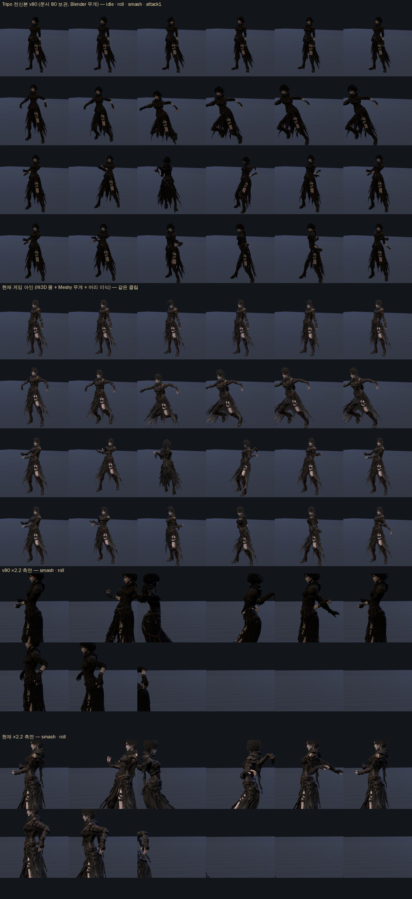

# 115. 레퍼런스 — Tripo P2.0 (AI 리토폴로지·UV·모듈식 캐릭터) 평가 (2026-09-27)

디렉터가 준 유튜브 [youtu.be/CINFu5UbYAQ](https://youtu.be/CINFu5UbYAQ) — PixelArtistry(Philip) 의 「Tripo P2.0 Review: A Major Breakthrough for Production-Ready 3D Assets」, 15 분 40 초, **Tripo 협찬 영상**(5:43 에 명시). 유튜브는 봇 확인으로 프레임을 못 받아 Higgsfield 플러그인의 장면 분석(33 장면, 음성 전사 + 화면 묘사)으로 봤다. 그래서 **화면 캡처는 없고**, 아래 «품질» 판단은 리뷰어의 말과 화면 묘사에 기댄 것이다 — 우리 자산으로 직접 돌려 봐야 확정된다.

## 1. 영상이 보여준 것 (시각 순)

| 시각 | 기능 | 리뷰어가 본 결과 |
|---|---|---|
| 1:32~3:14 | **Smart Mesh + Quad 토폴로지**(P2.0, 폴리 수 지정, 리뷰어는 5k 기준) | 하드서피스(녹음 장비)에서 «불필요한 선이 없는» 쿼드. 삼각형이 군데군데 남는다. 세부는 다 잡힌다 |
| 3:14~5:12 | **Smart UV**(20 크레딧, 무료 재시도 3 회, 활용률 표시) | 활용률 83 %. 이음선을 «보이지 않는 안쪽» 에 둔다 — 사람 아티스트가 자르는 자리. 부위별 텍셀 우선순위(얼굴 > 부츠)는 못 정한다, 대칭 겹치기 없음 |
| 5:12~5:43 | 텍스처 8K + **조명 제거(Remove Lighting)** | 글자는 여전히 깨진다 |
| 6:08~7:45 | **Edit Mesh — 상자로 영역 지정 → 그 부분만 재생성**, 이전/현재 나란히 비교 | 자동차의 구멍이 메워지고 나머지는 그대로. UV 는 창·문·손잡이가 분리되지만 «일부 지저분» |
| 7:45~8:56 | Blender 텍셀 밀도 검사(Texel Density Checker, 8K 기준) | 커버리지 75 % |
| 8:56~11:14 | **모듈식 캐릭터**: Tripo Image 로 인물 생성 → 「T-포즈로」 이미지 편집 → **머리·부츠·벨트·손을 따로 잘라 각각 생성**(부위별 멀티뷰) | 통짜 생성보다 부위 세부·리토폴로지 정확도가 좋고, UV 시트를 부위마다 따로 써서 텍스처 해상도가 남는다. 머리카락 가닥·눈동자 분리. «작은 아티팩트는 있다» |
| 11:14~12:36 | Blender 에서 조립(마스크·절단·Ctrl+J 병합) → Tripo 에 **기존 3D 모델 업로드** → Smart UV·텍스처 재적용 | GLB 로 내보내면 쿼드가 삼각형이 된다(우리 파이프라인엔 문제 없음) |
| 12:36~14:22 | **자동 리깅**(UE5 마네킹 · VRM 1.0 휴머노이드 템플릿) → **텍스트→애니메이션**(「make the character run」), 다단 모션(A 지점 동작 → B 지점 동작, 타이밍) | 걷기·달리기·점프·둘러보기가 «꽤 된다» |
| 14:22~15:22 | 여성 클로즈업·스타일라이즈드 집 | 머리카락 셸 분리 됨, 불필요한 이음선 일부 |
| 15:22~ | 한계 요약 | 부위 우선순위 없음, 대칭 미러링 없음, 오픈 모델엔 아직 없는 기능 |

## 2. 우리 파이프라인과 겹치는 자리

| 우리 문제 (문서) | Tripo P2.0 이 건드리는가 | 판단 |
|---|---|---|
| 자동 리깅 무게로 스킨이 찢어짐 → Meshy 무게 이식(문서 119·124) | **쿼드 리토폴로지** 가 깨끗하면 우리 `rig_char.py` 거리 무게도 덜 찢어진다. 리깅 자체도 Tripo 가 해 준다(VRM 휴머노이드 → Mixamo 이름 매핑 필요) | 시험 가치 높음 — 지금 가장 아픈 곳 |
| 얼굴·머리 세부가 통짜 생성에서 뭉개짐(문서 80: 아인·세라 전신 보류, AI 이미지→3D 폐기) | **모듈식**: 머리·손·부츠를 따로 생성해 부위별 UV·세부 확보 | 문서 80 의 «폐기» 는 통짜 기준이었다. 부위 분할은 안 해 봤다 — 재검토 근거가 된다 |
| 텍스처 이음선·UV 활용(Hi3D 결과의 UV 는 손 못 댐) | Smart UV + 조명 제거 텍스처 | 우리 염색(looks.html)·방어구 세트가 UV 에 얹히므로 깨끗한 UV 는 직접 이득 |
| 클립 파이프라인(KayKit·CMU·Meshy 클립, `clip-*.mjs`) | 텍스트→애니메이션은 «기본 로코모션» 급. 전투 클립(3 박 스매시·접점 감속)엔 못 쓴다 | 대체 아님. 대기·걷기 보조용 정도 |
| MPFB2 파라메트릭 인간으로 교체 계획(작업 126, 진행 중) | 서로 다른 길: MPFB2 는 «깨끗한 토폴로지가 처음부터» 있고 얼굴은 시트대로 못 만든다, Tripo 는 «이미지대로» 만들고 토폴로지를 뒤에서 정리한다 | 둘 다 시험해 비교하는 것이 맞다 |

## 3. 걸리는 것

- **비용·계정**: 크레딧제(UV 20 크레딧, 생성은 별도). 영상의 「초대 코드 500 크레딧」은 협찬 프로모션이라 여기 적지 않는다. 계정·결제는 디렉터 몫이고, API 키는 환경변수로만(문서 방침).
- **라이선스**: 생성 자산의 상업 이용 조건은 요금제에 따라 다르다 — **근거 없음, 약관 확인 필요**. 게임 출시 자산이면 확인 뒤에 써야 한다.
- **API 로 P2.0 기능이 다 되는지**: 영상은 웹 워크스페이스만 보여준다. 쿼드·Smart UV·Edit Mesh 가 API 에 있는지는 **근거 없음** — 있으면 `tools/3d/` 에 붙일 수 있고, 없으면 웹에서 손으로 해야 한다.
- **뼈 이름**: VRM 휴머노이드 뼈 → 우리 Mixamo 이름(`rig_char.py` `MAP`)으로 바꾸는 표가 필요하다. 손가락·손 소켓(`RightHandSlot`)은 우리가 덧붙여야 한다.
- 이 평가는 협찬 리뷰의 말을 옮긴 것이다. «83 %·75 %» 같은 수치는 리뷰어 화면의 값이고 우리 자산에서 나올 값이 아니다.

## 4. 제안 — 아인 한 캐릭터로 시험 (디렉터 승인 뒤)

1. 아인 설정 시트 정면(`art/char/`)에서 «T-포즈» 편집 → 통짜 1 개 + **머리·손·부츠 부위** 3 개 생성(쿼드, 폴리 5k/부위 2k).
2. Smart UV → 조명 제거 텍스처 → GLB 내보내기 → 우리 뷰어(`tools/3d/ain-sheet.html`)에 올려 **×2 확대 찢어짐** 검수(회피·스매시 클립).
3. Tripo 자동 리깅(VRM) 결과와 우리 `rig_char.py` 리깅을 같은 클립으로 나란히 굽어 비교 — 문서 124 방식.
4. 되면 카인·류·세라. 안 되면 문서 80 의 보류 유지, MPFB2(작업 126) 계속.

내가 할 수 있는 것: 2·3 번 전부, 그리고 API 가 있으면 1 번 자동화. 필요한 것: Tripo 계정과 (API 가 있다면) 키를 환경변수 `TRIPO_API_KEY` 로.

## 5. 아인 시험 — 1 차 (2026-09-27, 디렉터 「아인으로 시험해봐」)

**막힌 것부터.** 생성은 Higgsfield 플러그인의 Tripo H3.1(이미지→3D · 멀티뷰→3D, `quad` 옵션)로 돌릴 수 있는데 **잔여 크레딧이 0** 이다(요금제 plus). Tripo 직접 API 키(`TRIPO_API_KEY`)도 없다. 비용은 미리 조회했다(생성 안 함):

| 생성 | 크레딧 |
|---|---|
| Tripo H3.1 멀티뷰(정면·측면·후면) · 쿼드 · 지오메트리·텍스처 detailed · PBR | 19.5 |
| Tripo H3.1 단일 이미지 · 쿼드 · detailed · PBR | 16.5 |
| Meshy 7 단일 이미지 · 쿼드 2 만 · 텍스처 · 리깅 · T-포즈 | 44 |
| **모듈식 시험 한 벌**(통짜 멀티뷰 1 + 머리·손·부츠 단일 3) | **≈ 69** |

플러그인의 Tripo 는 쿼드까지만 있고 영상의 Smart UV·Edit Mesh·리깅 템플릿은 없다. 그 셋은 Tripo 웹/API 에서만 된다 — 확인은 계정이 있어야.

소스는 준비해 뒀다(작업 폴더 `tripo/`): `art/full-ain.webp`(382×932)·`side-ain`·`back-ain` 을 PNG 로. 크레딧이 들어오면 멀티뷰 쿼드 1 + 부위 3 을 바로 돌린다.

**크레딧 없이 한 것 — 보관돼 있던 Tripo 전신본 vs 현재 게임 아인.** 문서 80 의 `art/3d/src/ain_body_v80.glb` 는 이미 **Tripo 로 만든 아인 전신**(P2.0 이전 세대, 삼각 5.8 만)에 Blender 무게와 우리 클립 28 개가 들어 있다. 같은 클립으로 나란히 굽고 `tools/3d/stretch-map.mjs`(변 길이 ÷ 바인드 길이, > 1.8 또는 < 0.45 를 «나쁜 변», 28~29 클립 × 9 프레임)로 쟀다.

| | Tripo v80 (Blender 무게) | 현재 게임 (Hi3D 몸 + Meshy 무게 + 머리 이식) |
|---|---|---|
| 삼각형 | 58,115 | 73,965 (몸 46,095 + 머리 27,870) |
| 나쁜 변 합계 | **37,301** | 61,794 |
| 1 위 | 오른 어깨 4,476 (12 %) — attack1·smash·exec | 오른 허벅지 10,705 (17 %) — walk·roll·run |
| 2 위 | 오른손 3,718 — exec·skill3·attack2 | Spine1 9,842 — counter·attack3·skill1 |
| 3 위 | 머리 3,688 — attack1·brake·counter | 왼 허벅지 5,715 — walk·dodgeB·run |
| 그림에서 | 치마 자락이 다리를 따라 자연스럽고 걷기·구르기에서 허벅지가 안 늘어난다. 대신 낫 쥔 오른팔·어깨가 attack1 에서 당겨진다(1 위) | 허벅지·골반이 walk·roll 에서 늘어난다(문서 119 의 그 문제). 팔은 v80 보다 낫다 |

읽기: **Tripo 몸이 나쁜 변을 40 % 줄인다**. 다만 이 v80 은 삼각 메시라, 영상의 «쿼드 + 부위 분할» 이 어깨·손(v80 의 1·2 위)을 더 줄일지는 크레딧이 있어야 본다. 문서 80 의 보류 이유(외형을 바꾸면 무게·쥔 손·장비 자리·시험 기준이 흔들려 전투 작업이 멈춤)는 그대로다 — 시험은 «원본 보관» 으로만 하고 게임 모델은 안 바꾼다.

**다음(디렉터):** Higgsfield 크레딧 70 이상 충전, 또는 Tripo 계정·API 키. 들어오면 ① 멀티뷰 쿼드 통짜 ② 머리·손·부츠 부위 ③ 같은 시트·같은 계측으로 v80·현재와 3 자 비교.
