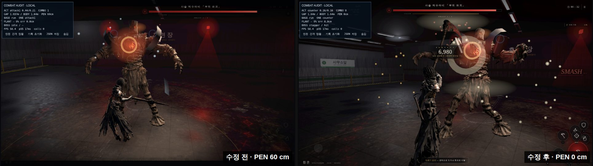
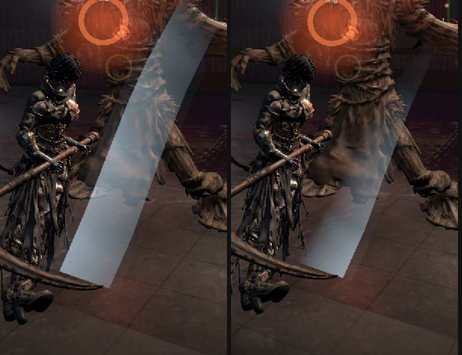
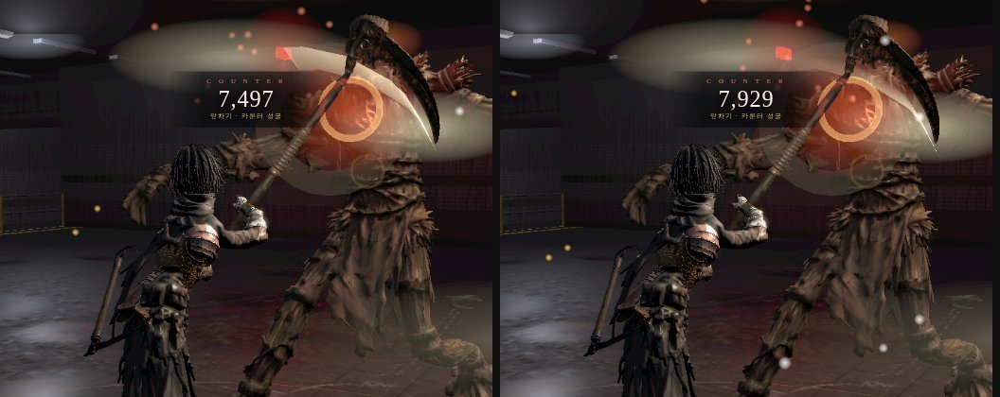

# 121 — 문서 120 남은 결함 후속: 몸 겹침 (2026-09-27)

문서 120 §7·§8 에 남긴 결함을 추천 순서대로 처리한 기록이다. 판정 코드(`js/combat.js`)는 바꾸지 않았다.

## 1. 플레이어·보스 몸 겹침

### 원인

**플레이어와 보스 사이에 몸끼리 막는 처리가 아예 없었다.**

- `world-sim.js` 의 `moveCircle` 은 벽만 막는다.
- 스틱을 보스 쪽으로 밀면 공격 사이, 그리고 공격 중 감속하며 미끄러지는 동안(`spd` τ 0.16 s) 그대로 보스 몸 안으로 들어갔다.
- 보스 쪽은 원인이 아니었다. `bossThink` 는 keep 140 px, 공격 전진(`boss-director`)은 stop 100 px 에서 멈춘다.
- 겹침이 커진 프레임을 누가 움직였는지로 나눠 셌다. 결과는 **플레이어 200 · 보스 0 · 둘 다 0** 이다.

### 새 도구 `tools/fight-overlap.mjs`

실제 `game3d.html?d=d01&combatAudit=1` 전투를 **게임 시간 60 fps** 로 돌린다.

- 가상 시계로 `performance.now` 와 `requestAnimationFrame` 을 바꿔 한 번에 1/60 s 씩 민다. 헤드리스가 초당 1~2 프레임이라 벽시계로는 게임 시간이 가지 않기 때문이다(CLAUDE.md §1).
- `WebGLRenderer.render` 만 건너뛴다(NOSHOT). 판정·이동·AI·카메라 갱신은 그대로 돈다. 40 s 전투가 약 12 s 에 끝난다.
- 봇 규칙:
  - 예고 중 카운터 가능하면 카운터, jumpOnly 면 점프, 카운터 불가면 뒤로 회피한다.
  - 사거리 안이면 공격하고, 3 타 뒤에는 스매시를 쓴다.
  - `BOT=hold`: 사람처럼 스틱을 보스 쪽으로 계속 민다.
  - `BOT=polite`: 사거리 밖일 때만 민다.
- 간격은 게임·combatAudit 과 같은 **깊이 보정 공간**(`world.dist`)에서 잰다. 처음엔 원시 좌표로 쟀다가 바로잡았다. d01 에서는 움직임이 거의 x 축이라 값이 같게 나왔다.
- `SHOT_F=프레임` 으로 그 순간을 렌더해 PNG 로 남긴다.

### 수정

- **`world.separate(p, e)`:**
  - 깊이 보정 공간에서 p 를 e 로부터 반지름 합만큼 **반지름 방향으로만** 밀어낸다.
  - 옆으로 도는 움직임은 살고, 벽은 `moveCircle` 이 막는다.
  - **보스는 움직이지 않는다.** 보스 위치는 패턴·예고 구역·판정의 기준이다.
- **`game3d.js` `step()`:**
  - `battle.tick`(보스 전진 포함) 뒤에 `if(battle && !bossLunge && !ain.dead) world.separate(P, Bs)` 를 부른다.
  - 관통 돌진은 뚫고 지나가는 것이 의도라서 뺐다.

### 전/후 (d01, 60 fps 게임 시간)

| 경우 | 전 최대 겹침 | 전 > 8 cm 프레임 | 후 최대 겹침 | 명중 수 전→후 |
|---|---|---|---|---|
| 아인 hold 24 s (seed 7) | 39.8 cm | 837 / 1440 | **0.0 cm** | 27 → 27 |
| 아인 hold 40 s (seed 3) | 65.4 cm (보스 경직 중, 카운터 뒤) | 1797 / 2400 | **0.0 cm** | 42 → 43 |
| 아인 polite 24 s | 0.0 cm | 0 | 0.0 cm | 27 → 27 |
| 카인 hold 40 s | 0.0 cm (최소 간격 1.84 m) | 0 | 0.0 cm | 34 → 34 |

- 아인 hold 40 s 의 최악 순간은 «보스 stagger, riposte 직후 attack1» 이다. 문서 120 §8 의 «카운터 뒤 보스 경직 중 붙어 치는 구간» 과 같다.
- 이 봇의 카인은 연속 공격으로 이동이 잠겨 1.84 m 안으로 들어가지 않았다. 카인 쪽 재현은 사람 조작으로 다시 볼 것.
- 명중이 줄지 않았다. polite 봇은 2.55 m 에서도 27 회를 맞히므로, 1.64 m 에서 막혀도 사거리 손해가 없다.

### 바뀌는 조작감

- **구르기로 보스를 정면으로 뚫고 지나가기는 이제 안 된다.** 몸에 막혀 옆으로 미끄러진다.
- 무적 0.30 s 와 회피 거리 판정은 그대로다.
- 뚫고 지나가게 하려면 조건에 `P.rollT<=0` 을 더하면 된다. 이때는 구르기가 끝난 순간 겹친 만큼 한 번에 밀려난다. 디렉터 판단 사항이다.

### 테스트

`tests/body-separation.test.cjs` 에 5 개를 넣었다.

- 반지름 합까지 밀어내고 보스는 움직이지 않는다.
- 깊이 보정 공간에서 잰다.
- 안 겹치면 그대로 두고, 정확히 겹치면 보는 쪽 반대로 민다.
- 벽을 뚫고 밀지 않는다.
- game3d 호출 위치와 관통 돌진 제외를 확인한다.

일부러 어긋나게 해 보고 실패하는지 확인했다.

- 수정을 되돌리면 5 개 모두 실패한다.
- `!bossLunge` 만 빼면 1 개가 실패한다.

`npm test` 는 542/542 통과다(`npm ci` 뒤. 전에는 `ws` 미설치로 서버 테스트 7 개가 실패했다).

위 그림은 `SHOT_F=2292 SEED=3 SECONDS=40 node tools/fight-overlap.mjs` 로 찍었다.

- **왼쪽(수정 전):** 아인이 허수아비 다리 사이로 들어가 있다. PEN 60 cm 다.
- **오른쪽(수정 후):** 간격 1.64 m 로 몸 반지름 합과 같고, PEN 0 cm 다.
- 같은 seed·프레임이지만 겹침이 없어진 뒤로 싸움 흐름이 갈라졌다. 그래서 오른쪽은 다른 장면(퍼펙트 카운터)이다.

## 2. 흰 궤적 «판» (문서 120 §8)

### 찾기

`tools/fight-overlap.mjs` 에 두 가지를 더했다.

- **`TRAIL=1`:** 매 프레임 궤적 리본을 잰다.
  - 리본은 `weapon-trail.js` 가 만드는 점 64 개짜리 두 겹이다.
  - 화면 bbox 를 잰다.
  - 이웃 점 간격을 잰다.
  - **밝기 가중 화면 넓이 lit** 를 잰다. 사각형마다 화면 px² × 정점색 평균 × opacity 를 더한 값이다.
- **`SHOT_ACT=smash:0.62:2`:** 두 번째 스매시가 경과 0.62 s 를 처음 넘는 프레임을 찍는다. `HIDE=trail` 로 리본만 숨겨 찍을 수 있다.

첫 명중 프레임(`SHOT_HIT=1`)에서는 판이 보이지 않았다. 대신 d01 24 s 전체에서 lit 이 가장 큰 프레임이 스매시 내려찍기였다(최대 3826, 평타 최대 954).

- 그 프레임에 바닥에서 보스 가슴 높이까지 옅은 판이 몸통 너비로 서 있다.
- 리본만 숨기면 판이 사라진다. 그래서 **궤적 리본이 판이다.**
- 이웃 점 간격은 최대 0.23 m 다. 순간이동한 점을 잇는 문제가 아니다.

### 원인 두 가지

1. **나이(age)로만 흐렸다.**
   - 스매시처럼 빠르고 곧은 동작은 점 10 개가 0.1 s 안에 다 생긴다.
   - 그래서 점들이 다 «젊어서» 균일하게 밝고, 곧은 경로라 평평한 띠가 된다.
2. **폭 방향 밝기가 거꾸로였다.**
   - 안쪽 가장자리가 a, 날끝 가장자리가 0.35a 였다.
   - 안쪽에 딱딱한 밝은 선이 서서 «판의 모서리» 가 됐다.

### 수정 (`js/weapon-trail.js` `_write`)

- **꼬리로 갈수록 가늘게:** 꼬리 폭은 머리의 0.2 배이고, 날끝 선 쪽으로 모인다.
- **꼬리로 갈수록 흐리게:** 밝기에 (1−u)^2.2 를 곱한다.
- **폭 방향 밝기를 뒤집었다:** 날끝 가장자리를 가장 밝게, 안쪽 가장자리를 0 으로 한다.
- 머리(i=0)의 폭과 밝기는 예전과 같다.
- **지수를 한 번 틀렸다.** 처음엔 안쪽 0.12·밝기 지수 1.3 으로 잡았다. lit 은 63 % 줄었는데 확대해 보니 판이 그대로였다.
  - 정점색은 **선형** 공간이다. 0.12 는 sRGB 화면에서 약 0.35 로 보인다(CLAUDE.md §2 «선형색 vs sRGB»).
  - 그래서 지수를 감마만큼(2.2), 안쪽을 0 으로 다시 잡았다.
- 값은 상단 상수 `TAPER_MIN / TAPER_W / TAPER_A / EDGE_IN` 에 있다(근거 없음·시안).

### 전/후 (d01 아인 24 s, cine minimal, lit 최대 / 중앙)

| 행동 | 전 | 후 |
|---|---|---|
| 스매시 | 3826 / 147 | 1410 / 52 |
| 카운터 | 2944 / 508 | 801 / 136 |
| 평1 | 954 / 140 | 399 / 52 |
| 평2 | 645 / 164 | 179 / 59 |
| 평3 | 659 / 53 | 200 / 19 |

- 두 번째 스매시, 경과 0.62 s 다. 왼쪽이 전, 오른쪽이 후다.
- 전: 옅은 판이 보스를 덮는다.
- 후: 날끝 쪽 빛줄기가 되고, 뒤의 보스 몸통이 비친다.
- **아직 남는 것:** 머리 쪽(현재 날 위치)은 여전히 폭 0.27 × 날 길이의 띠다.

- 카운터 경과 0.24 s 다. 왼쪽이 전, 오른쪽이 후다.
- **카운터 궤적도 눈에 띄게 약해졌다(lit −73 %).** P0 원칙 «짧고 얇게 지나가고 명중은 접점 반응으로 읽힌다» 와는 맞는 방향이다.
- 카운터를 더 밝게 두려면 `trailStyle('counter')` 세기(1.8)를 올린다. 디렉터 판단 사항이다.

### 테스트

`tests/trail-taper.test.mjs` 3 개를 넣었다.

- 꼬리 폭 < 머리 폭 / 3
- 꼬리 밝기 ≤ 머리의 5 %
- 안쪽 가장자리 ≤ 날끝의 5 %

옛 코드에서는 3 개 모두 실패한다. `npm test` 는 545/545 통과다.
