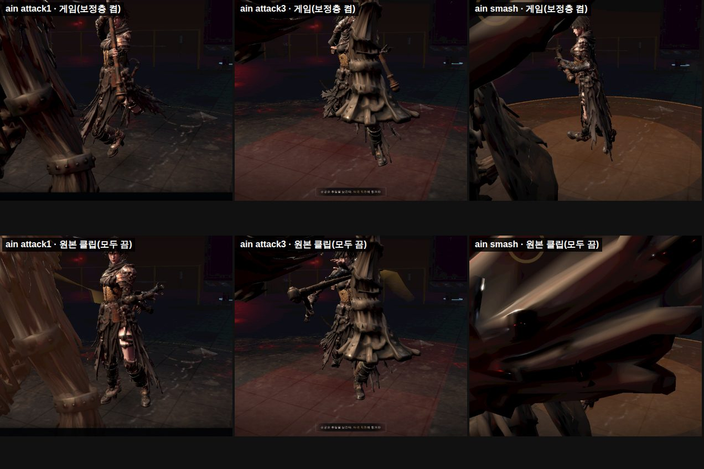
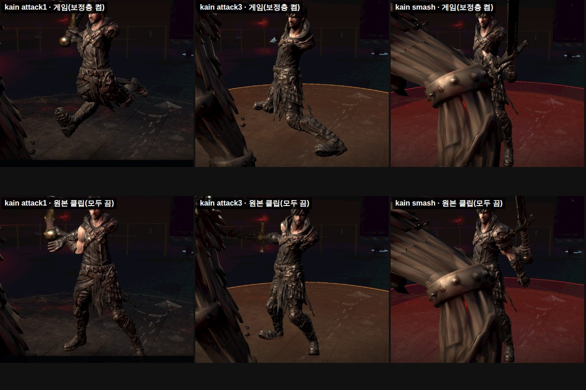
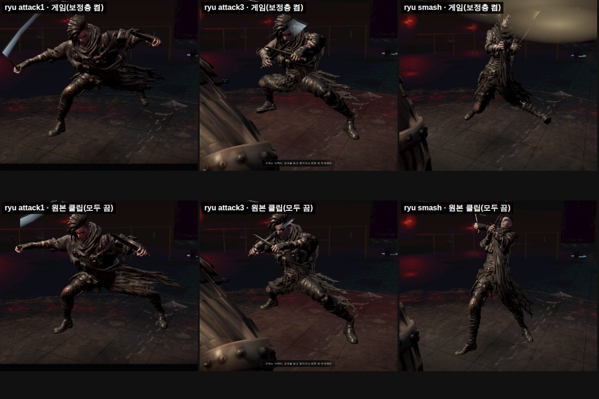
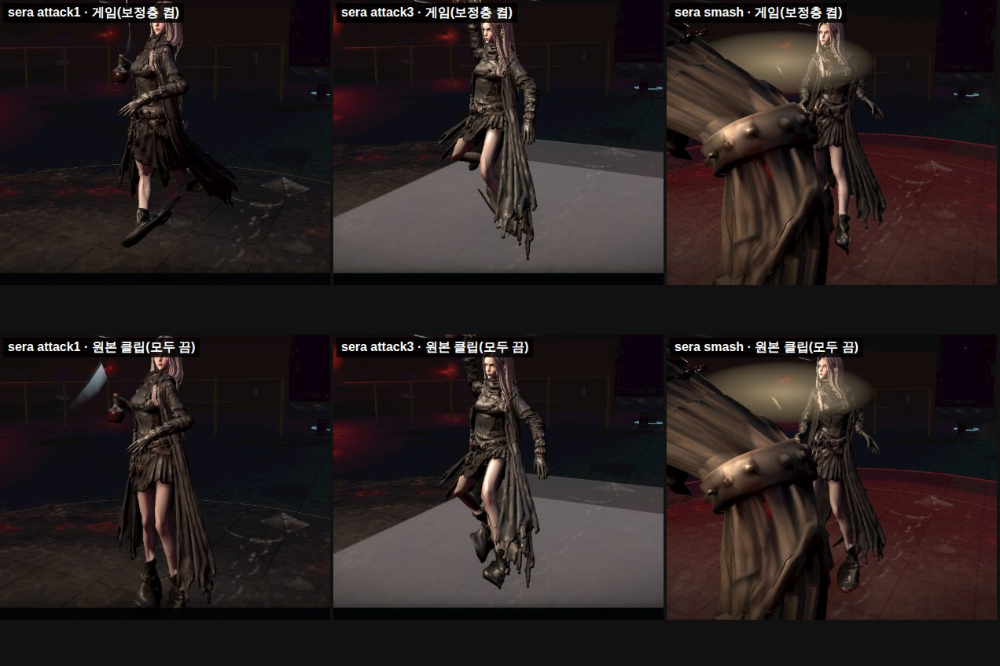

# 122 — 네 캐릭터 기본 동작 감사 (2026-09-27)

디렉터: «아인도 모션이 정상이 아냐. 카인도 검을 밖으로 들고 있는데 정상적이지 않다. 모션에 팔이 안 보인다. 기본 동작이 캐릭터 4 명 전부 제대로 구현되지 않았다. 제대로 구현하자.»

## 1. 방법 — 원본 클립 대 게임 보정층

게임은 원본 클립 위에 보정층을 차례로 얹는다.

1. **클립 전처리**: 아인은 `repairAinClips`, 나머지는 `smoothCharacterClips` 를 쓴다.
2. **믹서**
3. **`rig.apply`**: 두 손 IK·발 고정·쇄골·당김
4. **`armBlend`**
5. **`cinema`**: coil/snap/follow/drive 연출
6. **점프·기울기**

`game3d.html` 에 검수 전용 스위치 `?layersOff=` 를 넣었다.

- 층 이름: `all`·`clips`·`bind`·`rig`·`armBlend`·`cinema`·`lean`
- localhost 에서만 동작한다. 배포 화면에는 영향이 없다.

`tools/fight-overlap.mjs` 는 `LAYERS_OFF=` 로 같은 순간을 «게임 그대로» 와 «원본 클립(모두 끔)» 으로 찍는다. 카메라는 `CLOSE=Spine CLOSE_OFF=1.2,2.4,0.3` 이다.

## 2. 본 것 (위 줄 = 게임, 아래 줄 = 원본 클립 · 평1 / 평3 / 스매시)

| 캐릭터 | 원본 클립 | 게임(보정층 뒤) |
|---|---|---|
| 아인(낫) | 평3 에서 낫이 등 뒤 아래를 향한다. 공격 자세로 읽히지 않는다. | 평1·스매시가 서 있는 자세에 가깝다. 휘두름이 몸으로 읽히지 않는다. |
| 카인(대검) | 대검을 몸 밖으로 뻣뻣하게 내민다. 두 손 대검 자세가 아니다. | 연출층이 다리를 크게 벌리고, 팔은 몸 뒤·속으로 사라진다(문서 121 §6). |
| 류(쌍단검) | 네 명 중 가장 공격 자세답다. | 원본과 비슷하다. |
| 세라(시약) | 평3 은 한쪽 다리만 들고, 스매시는 서 있다. **공격 동작이 아니다.** | 원본과 같다. |

## 3. 원인

1. **원본 클립 자체가 이 캐릭터·무기에 맞지 않는다.**
   - 출처는 KayKit·Quaternius(작은 등신 CC0 캐릭터용), Meshy 자동 애니, CMU 모캡 조각이다(문서 119 §3).
   - 이것을 다른 체형·무기에 리타깃했다.
   - 대검 양손·낫·시약 투척에 맞는 원본이 없다.
2. **그 위에 절차 보정을 20 여 겹 쌓았다(문서 91~120).** 결함 하나를 막는 보정이 다른 결함을 만든다.
   - 연출층의 과장된 다리·몸통이 팔을 가린다.
   - 두 손 IK 가 원본과 싸운다(문서 121 §3).
3. **몸 메시** 는 카인이 좌우 비대칭이고 어깨가 깊다(문서 121 §6).

## 4. «제대로» 하려면 — 원본부터 바꾼다

보정층을 더 쌓는 방향은 끝났다. 캐릭터·무기별 **제대로 된 원본 동작**을 확보하고 보정층은 최소(접점 리타임·발 고정·손잡이 IK)로 줄인다. 문서 118 §8 Phase C 원칙과 같다.

원본 확보 경로는 디렉터가 정한다. 이 컨테이너에서 확인한 조건은 다음과 같다.

- GitHub 는 열려 있다.
- CMU 모캡·itch.io·Quaternius 는 막혀 있다.
- Hi3D·Meshy 인증 정보가 없다.
- Blender 가 없다.
