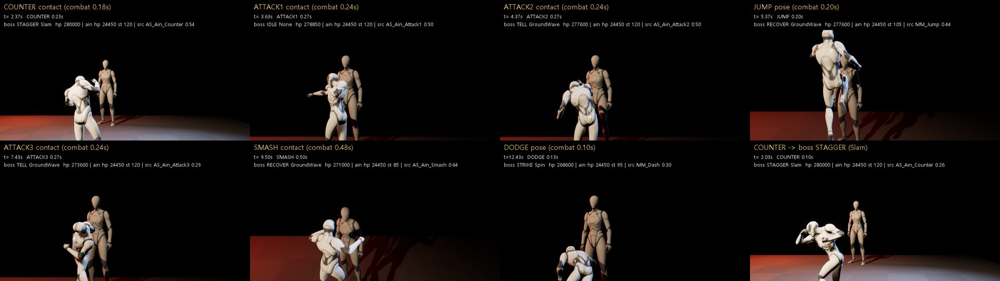
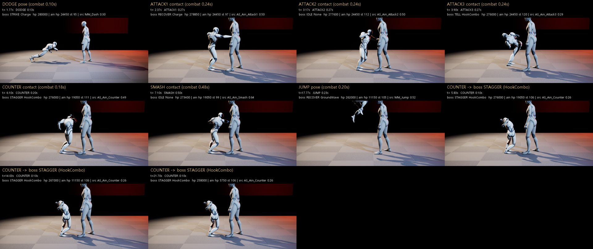

# 125 — UE 첫 빌드: 컴파일 · 자동화 · PIE · 그레이박스 애니 (2026-09-28)

디렉터 지시(요약):

1. UE 빌드·자동화를 돌린다. 컴파일 오류를 고치고, `Hwanghon.*` 자동화의 통과·실패 수를 보고한다.
2. World Settings GameMode = `HWCombatGameMode` 로 PIE 를 돌린다. 1→2→3·스매시·회피·카운터가 도는지 스크린샷으로 확인한다.
3. Paragon 애니메이션을 넣는다. 아인 몽타주 5 개(attack1/2/3·smash·counter)에 접점 노티파이를 달고, 그레이박스 20 초 전투를 캡처한다.
4. 결과를 문서로 쓰고 main 에 push 한다.

문서 번호: UI 패키지 문서가 123 을 쓰고 main 에 124 가 먼저 올라와서, 디렉터 결정으로 125 를 쓴다.

## 0. 결론 먼저

| 항목 | 결과 |
|---|---|
| 엔진 | **UE 5.8.1** (CL 56057345). 이 PC 에는 5.5 가 없다. 디렉터 결정으로 프로젝트 파일(EngineAssociation 5.5)은 바꾸지 않고 5.8 로 시험했다. |
| 컴파일 | **성공**(Editor, Win64 Development, 116 s, 33 actions). 프로젝트 코드에서 나온 오류·경고 **0**. 경고 43 건은 전부 5.8 엔진 헤더의 폐기 예고(C4996)다. |
| `UGameplayStatics::StripSaveGameHeader` | 5.8 에 있다(`GameplayStatics.h:1222`). 쓰는 곳은 `HWProgressionTest.cpp:83`·`HWQuestProgressionTest.cpp:349` 이고 그대로 컴파일된다. **5.5 에 있는지는 5.5 가 없어 확인하지 못했다.** |
| 에디터 셋업 | GLB 4 개 → 에셋 101 개, `Seohan_Combat_VS01` 생성 |
| 에셋 감사 | 101 개 중 PASS 98 · FAIL 3 (아인·카인·보스 스켈레탈 메시 `LOD<3`, LOD 1 개) |
| **자동화 `Hwanghon.*`** | **24 통과 / 0 실패 / 경고 0** (Combat 8 · Content 2 · Progression 14). 저장소 검증기 `Assert-HWAutomationReport` 도 통과 |
| `npm test` | 559 / 559 통과 |
| PIE (GameMode = HWCombatGameMode) | 1→2→3 직결(idle 0 프레임) · 스매시 · 회피 · 점프 · 카운터 → 보스 STAGGER 가 **전부 돈다** (§4) |
| 애니메이션 | **Paragon 은 못 받았다**(Epic 런처 로그인·클릭이 필요하다). 디렉터 결정으로 UE 5.8 템플릿 Manny 공격 클립을 **임시로** 쓴다. 몽타주 5 개 + 접점 노티파이 + 애니 세트를 스크립트로 만들었다(§5). |
| 20 초 캡처 | 게임 카메라·측면 카메라 각 22 초(30 fps 고정 스텝). 핵심 장면 시트는 이 문서, MP4 는 디렉터에게 직접 보냈다(§6). |

## 1. 엔진·컴파일

- 툴체인: VS Build Tools 18, MSVC 14.51.36246, Windows SDK 10.0.26100. UBT 가 «선호 버전(14.50)보다 새 컴파일러» 라고 경고했지만 빌드는 문제없었다.
- `Scripts/build_setup_test_windows.ps1` 은 `Assert-HWEngineVersion` 에서 5.8 을 거부한다. 그래서 같은 네 단계를 같은 인자로 직접 돌렸다.
  - 컴파일
  - `ue_setup.py`
  - `ue_asset_audit.py`
  - `Automation RunTest Hwanghon.;Quit` (NullRHI)
- 5.8 에디터가 처음 열면서 `Config/DefaultEngine.ini`(AndroidFileServer 보안 토큰 포함)·`DefaultInput.ini` 를 다시 썼다. **커밋하지 않고 되돌렸다.**
- 추가한 코드는 하나다: `UHWAnimNotify_Contact`(`Public/Animation/HWAnimNotify_Contact.h`).
  - 접점 표시용 노티파이이고 게임 동작은 없다. 판정 시각은 전투 시계가 정한다.
  - 엔진의 `UAnimNotify` 는 abstract 라서, 스크립트로 노티파이를 달려면 구체 클래스가 필요했다.

## 2. 자동화 결과

| 스위트 | 통과 |
|---|---|
| `Hwanghon.Combat.*` | 8 / 8 — BossCounterCancelsQueuedBeats · BossDeathLifecycle · BossReentrantDeath · BossVerticalSlicePatterns · PlayerDeathLifecycle · PlayerLivingCombatPreserved · PlayerReentrantDeath · PlayerTimingDefaults |
| `Hwanghon.Content.*` | 2 / 2 — LoadGameContent · QuestCatalogParse |
| `Hwanghon.Progression.*` | 14 / 14 — ClearLedger · EncounterLifecycle · EncounterRoutes · EncounterVictoryPersistence · GameModeQuestOutcome · QuestErrorCallbackReentry · QuestFailedSaveRetryAndReload · QuestInclusiveRandomRewards · QuestMigrationAndCorruptLoad · QuestReceiptValidation · QuestStateAllClearCombinations · QuestStateAndClaim · SaveRoundTrip · TruncatedProfileRejected |

로그 첫 프레임의 `LogAutomationTest: Error: Condition failed` 15 줄은 엔진 내부 `UE::UnifiedErrorTest` 에서 나온다. 프로젝트 테스트가 아니다.

## 3. PIE 를 어떻게 돌렸나

`Scripts/ue_pie_capture.py` 가 에디터 안에서 PIE 를 켜고 봇이 조작한다.

- **시간**: `-benchmark -fps=30` 으로 한 프레임을 1/30 s 로 고정한다. 스크린샷이 오래 걸려도 게임 시간이 밀리지 않는다.
- **입력 경로**: 입력 바인딩과 같은 공개 호출을 쓴다. `UHWCombatComponent::Request{Attack,Smash,Dodge,Jump,Counter}`, `UHWLockOnComponent::ToggleLockOn`.
- **봇의 규칙**:
  - 락온하고 접근한 뒤 1→2→3 → 스매시를 반복한다.
  - 보스 Strike 에 들어가면 패턴에 따라 반응한다.
    - Slam → 카운터(카운터 가능 비트 0.12 s)
    - HookCombo → 회피 뒤 1.03 s 에 카운터(3 타가 카운터 가능, 1.15 s)
    - GroundWave → 점프(jumpOnly)
    - Charge·Spin → 회피
- **기록**: 프레임마다 상태를 `Saved/Capture/pie_log_<view>.json` 에 쓰고, 2 프레임마다 `HighResShot 1280x720` 을 찍는다.

5.8 에서 밟은 것:

- **풀 에디터의 `-ExecutePythonScript`**: 스크립트를 실행한 직후 `QUIT_EDITOR` 를 보낸다. `-ExecCmds="py <스크립트>"` 로 띄워야 에디터가 떠 있다.
- **슬레이트 틱 횟수**: `-benchmark` 에서는 슬레이트 post-tick 이 게임 한 프레임에 백 번 넘게 불린다. 게임 시간이 바뀐 틱에서만 움직이게 했다.
- **PIE 월드에 스폰**: Python 으로는 PIE 월드에 액터를 스폰할 수 없다. 그래서 측면 캡처용 `ReviewCamera` 를 맵에 미리 둔다. 자동 활성화는 없다.

## 4. PIE 결과 — 22 초, GameMode = HWCombatGameMode



(위: 게임 카메라. 칸마다 전투 시계 기준 접점 프레임. 아래 자막은 로그에서 가져왔다.)



보스 패턴 순서는 무작위라서 두 번의 실행에서 패턴이 다르게 나왔다. 두 실행 모두 22 초이고 스크립트는 같다(카메라만 다름).

| | 게임 카메라 실행 | 측면 카메라 실행 |
|---|---|---|
| 보스 Strike | Slam · GroundWave ×4 · Spin | Charge · HookCombo ×3 · Spin · GroundWave |
| 1 → 2 → 3 직결 | 3 회. 모두 앞 동작이 끝난 **다음 프레임**에 다음 동작이 시작된다(idle 0 프레임) | 3 회, 같음 |
| 스매시 | 2 회 | 2 회 |
| 회피 · 점프 | 회피 1 · 점프 4 (GroundWave 전부 피함) | 회피 5 · 점프 1 (Attack2 → Jump 방어 캔슬) |
| 카운터 | Slam 1 회 → **보스 STAGGER** | HookCombo 3 타 3 회 → **보스 STAGGER ×3** |
| 아인이 맞은 것 | Spin 3 타 1 회 (−2,500) | HookCombo 2 타 ×3 · Spin 3 타 1 회 |
| 체력 | 보스 280,000 → 255,600 · 아인 24,450 → 21,950 | 보스 280,000 → 258,000 · 아인 24,450 → 5,750 |

규칙이 PIE 에서 그대로 동작하는 것도 확인했다.

- **회피 무적은 0.30 s 다.** Spin 3 타(0.46 s)와 HookCombo 2 타(0.40 s)는 회피 뒤에 맞는다. 회피로 막을 수 있는 것은 1 타(와 Spin 2 타)까지다.
- **공격 중 방어 캔슬은 0.39 s 부터다.** 봇 첫 판에서 Attack3 0.03~0.23 s 에 누른 점프·회피가 거절되었고, 그대로 맞아 아인이 17.2 s 에 죽었다. 사망 처리도 PIE 에서 동작했다.
- 봇은 이 결과를 보고 고쳤다: 다음 타의 방어 캔슬 시점보다 보스 Strike 가 먼저 오면 콤보를 끊는다(`hold-combo`). 위 표는 고친 뒤의 실행이다.

접점 확인:

- 소스 접점 = 판정 시각이 되도록 앞뒤 구간 속도를 바꾸는 «접점 리타임» 이 의도대로 동작한다.
- 판정이 난 프레임(보스 HP 가 줄어든 프레임)과 소스가 접점 노티파이를 지나는 프레임이 **같은 프레임**이다(30 fps 양자화 안에서).
- 예: Attack1 판정 프레임 elapsed 0.267 s 에서 소스 위치 0.501 (접점 0.467 을 막 지남).

## 5. 애니메이션 — 임시 원본(Manny) · 몽타주 · 접점 노티파이

> **갱신(같은 날): 원본을 Paragon: Countess 로 교체했다 → 문서 127.** 아래는 Manny 임시 원본 기록이다. `HW_ANIM_SOURCE=manny` 로 다시 만들 수 있다.

Paragon 은 Fab 에서 받아 «프로젝트에 추가» 해야 한다. 이는 Epic 런처(데스크톱 앱) 로그인과 클릭이 필요한 일이라, 이 세션에서는 할 수 없었다.

디렉터 결정으로 UE 5.8 에 들어 있는 ThirdPerson 템플릿 Manny 공격 클립으로 **통로를 먼저 완성**했다. 모든 에셋은 `Scripts/ue_graybox_anim_setup.py` 가 만든다(.uasset 은 커밋하지 않는다).

- `Content/Characters/Mannequins`: 엔진 `Templates/TemplateResources/High/Characters` 의 복사본. Epic 콘텐츠, UE 전용 라이선스.
- `/Game/Animation/Ain/Graybox/`:
  - `AS_Ain_{Attack1,Attack2,Attack3,Smash,Counter}`: 복제 시퀀스. 런타임은 이것을 재생한다.
  - `AM_Ain_*`: 몽타주 5 개.
  - 둘 다 `HWContact` 트랙에 `UHWAnimNotify_Contact` 를 단다.
- `DA_Ain_Graybox`(`UHWAnimationSetAsset`):
  - `SourceContactNormalized` = 노티파이 시각 ÷ 길이.
  - 슬롯은 `DefaultSlot`(ABP_Unarmed 의 슬롯 노드).
  - Dodge = MM_Dash, Jump = MM_Jump.
- 맵:
  - World Settings GameMode = `HWCombatGameMode`
  - `Ain_Graybox`: HWAinCharacter + SKM_Manny_Simple + ABP_Unarmed, Player0 자동 빙의
  - 보스에는 SKM_Quinn_Simple 1.25 배를 **자리 표시용 몸**으로 입혔다. C++ 보스는 보이는 메시가 없는 캡슐이다. 판정·캡슐은 그대로다.

런타임 몽타주 경로:

- `UHWPlayerPresentationComponent` 는 `PlaySlotAnimationAsDynamicMontage` 를 쓴다. 이 함수는 AnimSequence 만 받는다.
- 그래서 바인딩에는 시퀀스(AS_)를 넣는다.
- 몽타주(AM_)는 에디터에서 접점을 보고 다듬는 용도다.

접점 시각 — 에픽 저작값과 실측이 3 프레임(60 fps) 안에서 맞는다:

| 동작 | 원본 | 길이 | 에픽 `DoAttackTrace` | 실측(골반→손·발 수평 거리 최대) | 쓴 값(정규화) | 리타임 배속 접점 전 / 후 |
|---|---|---|---|---|---|---|
| Attack1 | MM_Attack_01 | 1.000 s | 0.467 s | 0.467 s (오른손) | 0.467 | 1.94× / 1.27× |
| Attack2 | MM_Attack_02 | 1.000 s | 0.467 s | 0.467 s (왼손) | 0.467 | 1.94× / 1.27× |
| Attack3 | MM_Attack_03 | 1.667 s | 0.400 s | 0.354 s (오른발) | 0.240 | 1.67× / **3.02×** |
| Smash | MM_ChargedAttack | 1.833 s | 1.161 s | 1.200 s (오른손) | 0.633 | 2.42× / 1.00× |
| Counter | MM_Attack_02 (대역) | 1.000 s | 0.467 s | — | 0.467 | 2.59× / 1.40× |

- 에픽 값은 TP_ThirdPerson Combat 변형의 `AM_ComboAttack`(0.467 / 1.467 / 2.400 s)과 `AM_ChargedAttack`(1.161 s)에 달린 노티파이에서 읽었다.
- 배속은 전투 시계 기준이다. attack 0.66 s(접점 0.24), smash 1.15 s(0.48), counter 0.56 s(0.18).

이 임시 원본의 한계(Paragon 에서 볼 것):

1. **맨손이다.** 낫·대검 궤적이 없다. 동작 문법(1·2 좌우 교대, 3 발차기, 차지 펀치)만 본다.
2. **Attack3 의 접점 뒤가 3 배속으로 눌린다.** 원본 1.67 s 중 접점 뒤 1.27 s 를 0.42 s 에 넣기 때문이다. «가장 큰 finisher · 강한 follow» 를 만들려면, 접점 뒤 길이가 0.4~0.6 s 인 원본을 골라야 한다.
3. **카운터 전용 원본이 없다.** Attack2 를 대역으로 썼다.
4. Hit/Stagger 는 템플릿에 라이플 자세 클립만 있어서 묶지 않았다.

Paragon 을 받은 뒤 — 문서 124 §2 계획(카인 = Kwang/Greystone, 이동 = Game Animation Sample)에도 같은 통로를 쓴다:

1. 디렉터가 Fab 에서 팩을 `HwanghonCombatUE` 에 추가한다.
2. IK Retargeter 로 Paragon 에서 Manny(또는 캐릭터 골격)로 옮긴다.
3. `ue_graybox_anim_setup.py` 의 `CLIPS` 표(원본 경로·접점 초)만 바꿔 다시 돌린다.
4. `ue_pie_capture.py` 로 같은 22 초를 다시 찍어 이 문서의 시트와 나란히 본다.

## 6. 20 초 캡처

- 게임 카메라(락온, 플레이 그대로)와 측면 카메라(`ReviewCamera`, 두 몸 전체와 발)로 각각 22 초씩 찍었다.
- `Scripts/make_capture_media.py` 가 프레임과 로그로 두 가지를 만든다.
  - 자막(행동·경과·보스 상태·HP·소스 위치)을 넣은 MP4 (15 fps 실시간)
  - 위의 핵심 장면 시트
- MP4 는 저장소에 올리지 않고 디렉터에게 직접 보냈다.

## 7. 본 것 — 다음에 고칠 것

1. **보스가 보이지 않는다.** `AHWBossCharacter` 에 보이는 메시가 없다. 이번에는 캡처용으로 Quinn 을 입혔다. 보스 패턴 애니(tell/strike/recover)는 아직 묶이지 않았고, 문서 119 §6-3 에 해당한다.
2. **화면이 검다.** 바닥 일부를 빼면 배경이 까맣다.
   - `HWSeohanLightingRig` 의 SkyLight 에 광원(하늘 캡처나 큐브맵)이 없어 채움광이 0 에 가깝다.
   - 벽은 스포트 두 개 밖이라 불빛이 닿지 않는다.
   - 지시서의 «검정/빨강 덩어리 화면 금지» 에 걸린다.
3. **락온 카메라가 인물을 화면 아래로 몬다.** 다리가 잘리는 프레임이 많다. 카메라가 수평을 보고 인물은 화면 아래 3 분의 1 에 놓인다. 지시서의 «전신과 무기 궤적이 읽히는 거리» 를 아직 만족하지 못한다.
4. **접점에서 몸이 겹친다.** 접점 거리는 102.9 cm, 곧 두 캡슐이 맞닿은 거리다(첫 실행의 모든 타격에서 측정). 맨손 뻗음이 86 cm 라 주먹이 보스 몸 안으로 들어간다. 무기 원본을 넣은 뒤 사거리(260/300 cm)와 멈춤 거리를 다시 맞춘다.
5. 감사 FAIL 3 (LOD<3) 은 GLB 에 LOD 가 하나뿐이라서다. Hero 에셋 단계에서 해결할 일이다.
6. **5.5 확인**: 5.5 를 설치하면 `build_setup_test_windows.ps1` 을 수정 없이 돌려 이 문서의 수치를 다시 확인한다.

## 8. 재현

```powershell
# 1) 빌드·셋업·감사·자동화 (5.5 가 있으면 원클릭 스크립트 그대로)
powershell -ExecutionPolicy Bypass -File ue/HwanghonCombatUE/Scripts/build_setup_test_windows.ps1 -UERoot 'C:\Program Files\Epic Games\UE_5.5' -HwanghonRepo (Get-Location).Path

# 2) 그레이박스 애니(맵이 있어야 함)
UnrealEditor-Cmd.exe ue/HwanghonCombatUE/HwanghonCombatUE.uproject -ExecutePythonScript=<절대경로>/Scripts/ue_graybox_anim_setup.py -unattended

# 3) PIE 캡처 (HW_CAPTURE_VIEW=game|side, HW_CAPTURE_SECONDS=22)
UnrealEditor.exe ue/HwanghonCombatUE/HwanghonCombatUE.uproject /Game/Maps/Seohan_Combat_VS01 -ExecCmds="py <절대경로>/Scripts/ue_pie_capture.py" -benchmark -fps=30 -ini:EditorPerProjectUserSettings:[/Script/UnrealEd.EditorPerformanceSettings]:bThrottleCPUWhenNotForeground=False

# 4) 영상·시트
python ue/HwanghonCombatUE/Scripts/make_capture_media.py <Saved/Screenshots/WindowsEditor> <Saved/Capture/pie_log_side.json> <출력 접두사>
```
