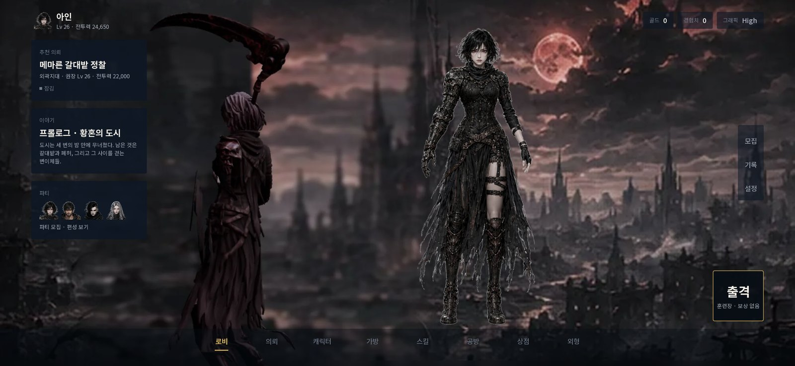
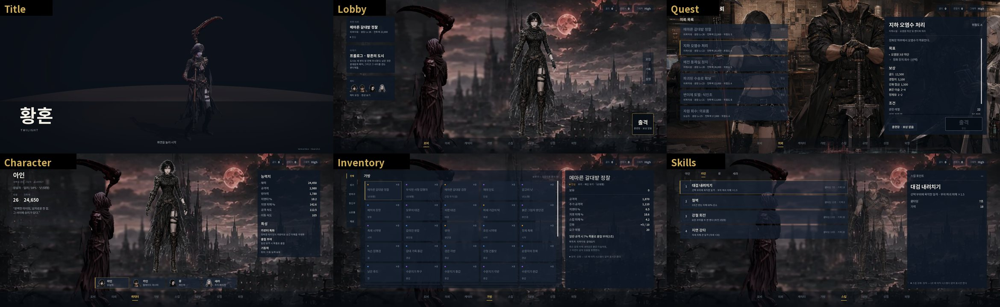
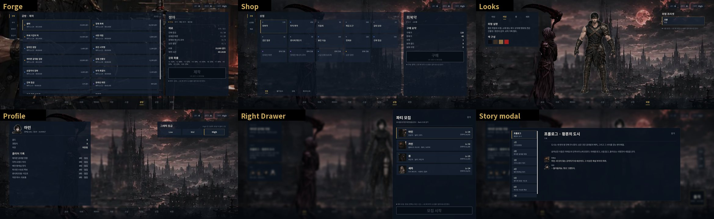
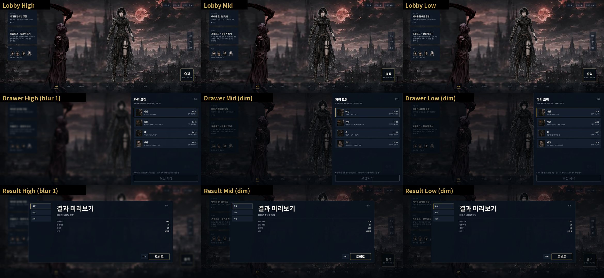
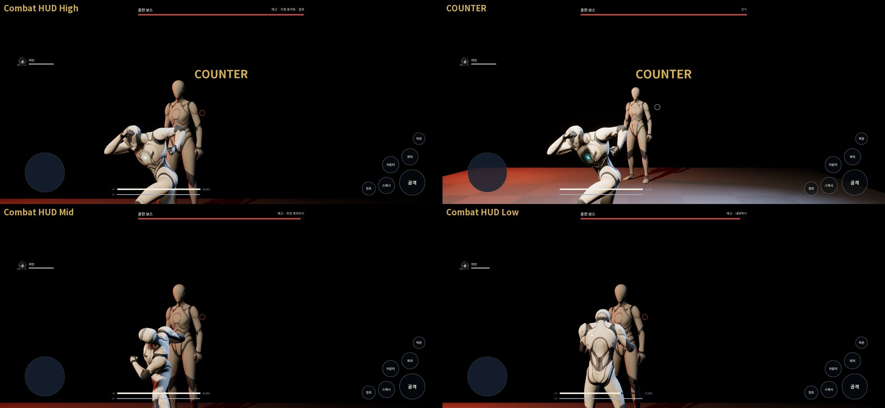

# 126 — Clean Mobile UI v1 적용 기록 (UE, 2026-09-28)

디렉터 지시: `CLAUDE_APPLY_CLEAN_UI_V1.md`

- 패키지 `HWANGHON_CLEAN_MOBILE_UI_V1.zip` 의 설계는 문서 123 이다.
- 테마 토큰을 먼저 넣는다.
- Native UI 와 WBP 14 종을 같은 토큰으로 만든다.
- Combat HUD 는 중앙을 비운다.
- 모바일 블러는 절제한다.
- 2340×1080 으로 캡처해 비교한다.
- FullGame 시스템은 깨지 않는다.

이 문서는 그 적용 결과다. 엔진은 UE 5.8.1 이다(문서 125 §1).

## 0. 결론 먼저

| 항목 | 결과 |
|---|---|
| 테마 토큰 | 패키지 그대로 넣었다. **색 공간 버그 1 건을 고쳤다**(§2). JSON↔C++ 동기 테스트를 추가했고, 일부러 어긋나게 하면 실패한다. |
| Native UI | `HWFrontendRootWidget` 셸 + 화면 13 종 + 전투 HUD. 모든 색·여백·글자 크기는 `UHWUIThemeLibrary` 토큰에서 온다. |
| WBP 14 종 | `ue_ui_setup.py` 가 만든다. 네이티브 클래스를 부모로 한다. |
| 컴파일·테스트 | 오류 0. `Hwanghon.*` 자동화 **24/24** 그대로(FullGame 무손상). `npm test` **565/565** |
| 2340×1080 캡처 | 정지 컷 25 장 + UI 없는 쌍둥이 4 장 + **20.0 초 내비게이션 영상**(300 프레임 · 15 fps) |
| 합격 기준 | 모두 통과. «작은 텍스트 판독» 은 디렉터가 와일드 리프트 캡처와 견주어 지금 크기로 확정했다(§4). |

## 1. 넣은 것

| 층 | 파일 | 내용 |
|---|---|---|
| 토큰 | `Public/UI/HWUIThemeLibrary.h` · `Private/UI/HWUIThemeLibrary.cpp` · `Content/Data/ui_theme.json` | 패키지 그대로. **단, 색 공간 한 곳을 고쳤다**(§2). |
| 설계 | `docs/design/123-clean-mobile-ui-v1.md` · `tests/ue-clean-ui-v1.test.mjs` | 패키지 그대로 |
| 토큰 동기 검사 | `tests/ue-ui-theme-sync.test.mjs` | JSON 과 C++ 의 색(sRGB 헥스·알파)·치수·글자 크기가 같은지, 색이 `FColor` 를 거쳐 선형으로 가는지 검사한다. 일부러 어긋나게 하면 실패한다(Gold 헥스 1 자리 → 1 실패, hex/255 직접 입력 → 2 실패). |
| 도구 | `HWUIKit` | 글자·패널·카드·바·배치 헬퍼. 값은 모두 토큰에서 가져오고 헥스·여백 하드코딩은 없다. 모서리는 스펙대로 최대 6. |
| 폰트 | `Assets/Fonts/NotoSansKR-{Regular,Medium,Bold}.ttf` + `OFL.txt` | Noto Sans KR 가변 폰트는 기본 인스턴스가 Thin(100)이다. 그래서 400/500/700 정적 인스턴스를 만들고 한글·라틴·기호만 남겼다(각 2.5 MB). 라이선스는 OFL. |
| 표시 데이터 | `HWUICatalog` | `game_content.json` 에서 캐릭터·아이템·상점·제작·강화·스킬·스토리·의뢰 설명을 **읽기만** 한다. 서브시스템은 건드리지 않는다. |
| 셸 | `HWFrontendRootWidget` | 투명 배경 · TopBar 72 · BottomNav 88(8 항목) · 화면 층 · 오른쪽 드로어 820 · 모달 1680×720 · 토스트. Back/Esc 동작 순서는 모달 → 드로어 → 로비. |
| 화면 | `HWFrontendScreens` · `HWGridScreens` · `HWOverlayWidgets` | Title · Lobby · OfficeQuest · Character · Skills · Looks · Profile · Inventory/Forge/Shop(공통 골격) · Recruit(드로어) · Result · StoryDialogue(모달) |
| 전투 | `HWCombatHUD` (`AHWCombatHUD` + 위젯) | `HWCombatGameMode` 생성자에 `HUDClass` **한 줄**을 넣었다. 그 밖의 FullGame 코드는 바꾸지 않았다. |
| 프론트엔드 | `HWFrontendGameMode` / PlayerController | `/Game/Maps/HW_Frontend`, World Settings GameMode 로 지정 |
| WBP 14 종 | `Scripts/ue_ui_setup.py` | `/Game/UI/Screens/WBP_{Title,Lobby,OfficeQuest,Character,Inventory,Skills,Forge,Shop,Looks,Profile,Recruit,CombatHUD,Result,StoryDialogue}`. 각각 네이티브 클래스를 부모로 한다. 비어 있는 WBP 는 네이티브 토큰 레이아웃을 그린다. 디자이너가 트리를 그리면 그 트리가 우선한다. 이미 있는 WBP 는 덮어쓰지 않는다. |
| 아트 | `Scripts/prepare_ui_art.py` → `ue_ui_setup.py` | UE 는 WebP 를 임포트하지 못한다. 그래서 웹 아트 20 장(로비·타이틀·사무소·공방 배경, 전신 4, 얼굴 5, 초상 4 등)을 PNG 로 바꿔 `T_*` UI 텍스처로 넣는다. 밉과 스트리밍은 끈다. |
| 캡처 | `HWUITourSubsystem` · `Scripts/run_ui_tour.ps1` · `measure_ui_captures.py` · `make_frames_video.py` | `-HWUITour` 가 있을 때만 생긴다. 일반 플레이·PIE·자동화에는 없다. 버튼과 같은 호출로 화면을 돌며 정지 컷, 15 fps 내비게이션 프레임, UI 없는 쌍둥이 컷을 남긴다. 그다음 전투로 들어가 HUD 를 High/Mid/Low 로 찍고 끝낸다. |

`.uasset` 은 커밋하지 않는다(문서 125 §5). 위 스크립트로 다시 만든다.

## 2. 패키지에서 고친 것 — 색 공간

패키지 `HWUIThemeLibrary.cpp` 는 헥스를 255 로 나눈 **sRGB 값을 `FLinearColor` 에 그대로** 넣었다(Gold `#D0AE5A` → `FLinearColor(0.816, 0.682, 0.353)`).

- UMG/Slate 는 `FLinearColor` 를 선형으로 읽는다. 그러면 모든 토큰이 밝고 흐리게 나온다(Gold 는 약 `#E8D59E`).
- CLAUDE.md §2 의 «bpy 선형색 vs JS sRGB» 와 같은 함정이다.
- 고친 방식: 헥스를 `FColor(0xD0, 0xAE, 0x5A, 0xFF)` 로 적고 `FLinearColor(FColor)` 로 변환한다(sRGB → 선형). JSON 과 한 글자씩 대조할 수 있다.
- `tests/ue-ui-theme-sync.test.mjs` 가 이 규칙을 지킨다.

## 3. 시스템이 없는 화면을 어떻게 보였나

UE 에 시스템이 있는 것은 네 가지뿐이다.

- 의뢰: `HWGameContentSubsystem`
- 프로필: 골드·경험치·클리어·저장
- 출격 흐름: `HWQuestRunSubsystem`
- 그래픽 등급

가방·상점·공방·스킬·외형·모집·스토리는 `game_content.json` 에 **데이터만** 있다(QUEST_PROGRESSION_KR.md 156~162).

- 이런 화면은 정보 구조(카테고리·격자·상세)를 그대로 보인다.
- 동작(장착·구매·제작·모집)은 **비활성 CTA + «UE 에 아직 시스템이 없어 표시만 한다»** 로 둔다. 가짜 기능은 만들지 않았다.
- 가방은 프로필 보유 수를 쓴다. 새 프로필은 보유가 0 이라 «보유 0 — 도감으로 표시» 라고 캡션을 단다.
- **출격**:
  1. `PrepareQuest`/`PrepareTraining` → `OpenPreparedEncounter` 순서로 시도한다.
  2. 지금은 `UHWEncounterSettings.Routes` 가 비어 있어 실패한다.
  3. 그러면 그 오류를 토스트로 보이고, 그레이박스를 **기록 없는 훈련**으로 연다. 수동 맵 열기는 퀘스트 보상을 주지 않는다(QUEST_PROGRESSION_KR.md 103).
- 새 프로필은 모든 의뢰가 «잠김»(튜토리얼 클리어 필요)이다. 그래서 로비 CTA 캡션은 «훈련장 · 보상 없음» 이다.

## 4. 합격 기준 측정 (2340×1080)

측정 방식: `Scripts/measure_ui_captures.py`.

- 컷마다 같은 프레임의 «키 아트만» 쌍둥이를 찍는다.
  - 프론트엔드: 배경과 영웅 그림만 남긴다(이 둘도 UMG 다).
  - 전투: UI 를 끈 3D 화면이다.
- 두 컷의 차이를 12 px 칸으로 센다. 칸 안에서 바뀐 픽셀이 8 % 이상이면 UI 가 닿은 칸이다.
- 강조색은 불투명한 UI 요소(차이 > 60, 채도 ≥ 45) 중 토큰색 반경 40 안에 드는 픽셀만 센다.

지표를 세 번 고쳤다(CLAUDE.md §2 «지표부터 의심»):

1. 처음에는 UI 를 전부 끈 쌍둥이를 썼다. 프론트엔드에서는 아트까지 사라져 로비 UI 덮음이 86 % 로 나왔다. → 키 아트만 남기는 쌍둥이로 바꿨다.
2. 1/4 로 줄인 마스크를 썼더니, 가는 글자와 어두운 패널이 평균되어 2 % 로 나왔다. → 원본 해상도 칸으로 바꿨다.
3. TextMuted 회색(#727D8C)이 Success 초록과 RGB 거리 47.5 라 «초록 강조색» 으로 잡혔다. → 채도 조건을 넣었다.

| 화면 | UI 덮음 | 중앙(가로 25~75 %, 세로 10~90 %) 열림 | 강조색 | 판정 |
|---|---|---|---|---|
| 로비 (High) | 14.7 % | **99.1 %** | Gold | 통과 |
| 의뢰 | 52.6 % | **62.5 %** | Gold | 통과. 처음에는 상세가 오른쪽 60 % 를 덮어 10.0 % 였다. 오른쪽 720 폭(30 %)으로 줄였다. |
| 가방 | 70.4 % | 4.4 % | Gold | 중앙은 스펙 §6 이 정한 격자 자리라 이 기준에서 뺀다. 공방·상점도 같다. |
| 전투 HUD (High) | 10.8 % | **87.5 %** | Gold(COUNTER 순간) + Danger | 통과 |

| 합격 기준 (지시 §6) | 결과 |
|---|---|
| Hero/배경이 UI 보다 먼저 보인다 | 로비 UI 덮음 14.7 %. 영웅이 중앙 오른쪽을 차지하고 UI 가 닿지 않는다. |
| 중앙 50 % 이상 열림 | 로비 99.1 · 의뢰 62.5 · 전투 87.5 %. 격자 화면은 제외(위). |
| 강조색 = Gold + 상태색 1 개 이하 | 측정한 네 화면 모두 만족. 등급 태그(희귀도 점)는 8 px 점이라 문턱 아래다. |
| 패널 중첩 2 단 이하 | 구조상 «패널 > 카드» 까지다. 결과·스토리 모달의 왼쪽 탭 영역이 따로 배경을 가져 3 단이었다. 배경을 없앴다. |
| 중요 CTA 1 개 | 로비 «출격», 의뢰 «출격»(훈련장은 보조 글자 버튼), 결과 «로비로»(«다시» 는 보조). 공방·상점·모집은 시스템이 없어 비활성 CTA 1 개다. |
| 모든 화면이 같은 위·아래 간격 | 셸 하나(SafeTop 24 + TopBar 72, BottomNav 88 + SafeBottom 22)를 모든 화면이 쓴다. |
| 드로어/모달 구조가 화면마다 같다 | 같은 머리(제목 왼쪽, «닫기» 오른쪽 위)와 같은 틀(PanelStrong, 1 px Line)을 쓴다. |
| 작은 텍스트도 모바일 캡처에서 읽힌다 | **디렉터 판정: 통과**(와일드 리프트 캡처와 견준 결과, 지금 크기 유지). 참고 수치: 토큰을 UMG pt 로 읽으면 Body 15 → 20 px, Caption 12 → 16 px, Micro 10 → 13 px 다. 6.4″ 2340×1080(403 ppi)에서는 Body 7.9 dp, Micro 5.3 dp 다. 흔히 쓰는 본문 최소 12 sp 에 못 미친다. |

블러 정책(지시 §5): High 는 드로어·모달 뒤에 `BackgroundBlur` **1 장**만 쓴다. Mid/Low 는 `OverlayDim` + `PanelStrong` 만 쓴다(§5 등급 시트). 화면에 상주하는 블러는 없다.

## 5. 캡처











- 20 초 UI 내비게이션 영상(`Saved/UITour/ui_navigation.mp4`, 2340×1080, 15 fps)은 저장소에 올리지 않고 디렉터에게 직접 보냈다.
- 순서: Title → Lobby → 의뢰(선택 전환) → 캐릭터(카인 전환) → 가방 → 스킬 → 공방 → 상점 → 외형 → 로비 → 오른쪽 드로어 → 스토리 모달 → 결과 모달 → 프로필.

## 6. 본 것 · 남은 일

1. **글자 크기 — 디렉터 결정(2026-09-28): 지금 크기 유지.** 디렉터는 와일드 리프트 모바일 캡처(프로필·대전 기록·통계·매칭)를 기준으로 «이 정도면 다 보인다» 고 판단했다. 토큰은 패키지 값 그대로 둔다. 실기기에서 다시 확인한다.
2. **출격 경로가 없다.** `UHWEncounterSettings.Routes` 가 비어 있어 `PrepareQuest`/`PrepareTraining` 이 실패한다. 그래서 새 프로필은 튜토리얼 클리어를 기록할 길이 없고, 의뢰는 계속 «잠김» 이다. UI 는 오류를 보여 주고 기록 없는 훈련을 연다. 라우트 설정은 FullGame 몫이다.
3. **`UHWGraphicsQualitySubsystem::ApplyTier` 가 해상도와 창 모드까지 다시 적용한다**(`ApplySettings(false)`).
   - PC 에서는 등급을 바꿀 때마다 창 모드가 바뀔 수 있다.
   - 저장된 GameUserSettings 에 `Version` 이 없으면 WindowedFullscreen 으로 초기화된다. 캡처가 3440×1440 으로 나온 원인이 이것이었다.
   - 모바일에는 영향이 적지만, PC 설정 화면을 만들 때 분리해야 한다.
4. **UMG 애니메이션은 실제 시간으로 돈다.** 드로어 0.2 s, 모달 0.16 s. 고정 30 fps 캡처에서는 프레임이 빠르면 전환 중간이 찍힌다. 투어는 프레임과 실제 시간을 함께 기다리고, 컷 뒤 3 프레임은 다음 단계로 넘어가지 않는다. 게임 동작은 바꾸지 않았다.
5. **조이스틱은 자리 표시다.** 왼쪽 아래 원은 쉬고 있는 모습만 그린다. 모바일 터치 이동은 엔진 터치 인터페이스에 달려 있고, 실기기에서 맞춰야 한다. 오른쪽 액션 버튼은 키 바인딩과 같은 `Request*` 를 호출해서 동작한다.
6. **아이콘 세트가 없다.** 아래 내비게이션과 오른쪽 레일은 글자 표시다. `BottomNavIcon 30` 토큰은 아이콘이 들어오면 쓴다.
7. **PERFECT 는 표시하지 않는다.** 완벽 회피·완벽 카운터를 구분하는 API 가 없어, 중앙 표시는 COUNTER(보스 반응 Counter)와 BREAK(보스 상태 Break)만 한다.
8. **WBP 14 종은 비어 있는 자식 클래스다.** 레이아웃은 네이티브다. 디자이너가 WBP 에 트리를 그리면 그 트리가 우선한다(`UHWScreenWidget::RebuildWidget`).
9. 전투 배경이 검은 문제(문서 125 §7-2)는 HUD 판독과 별개로 남아 있다.

## 7. 재현

```powershell
python ue/HwanghonCombatUE/Scripts/prepare_ui_art.py
UnrealEditor-Cmd.exe ue/HwanghonCombatUE/HwanghonCombatUE.uproject -ExecutePythonScript=<절대경로>/Scripts/ue_ui_setup.py -unattended
powershell -ExecutionPolicy Bypass -File ue/HwanghonCombatUE/Scripts/run_ui_tour.ps1      # Saved/UITour/*.png, ui_navigation.mp4
python ue/HwanghonCombatUE/Scripts/measure_ui_captures.py ue/HwanghonCombatUE/Saved/UITour
node --test tests/ue-clean-ui-v1.test.mjs tests/ue-ui-theme-sync.test.mjs
```
