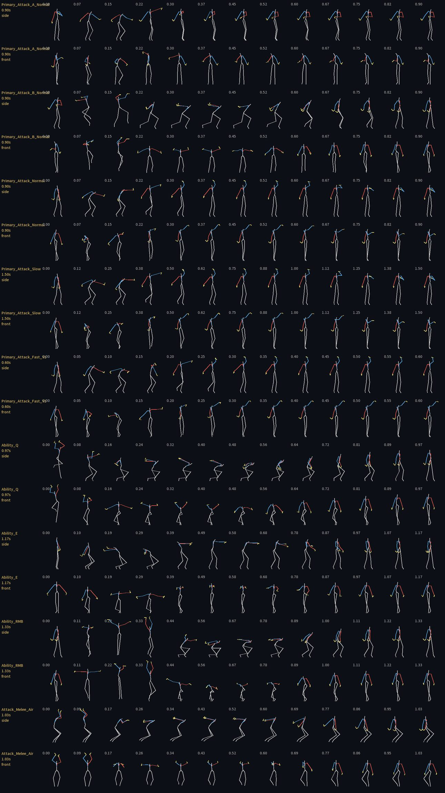
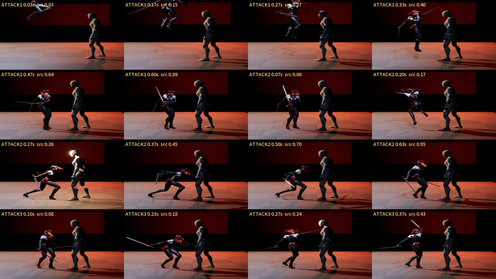
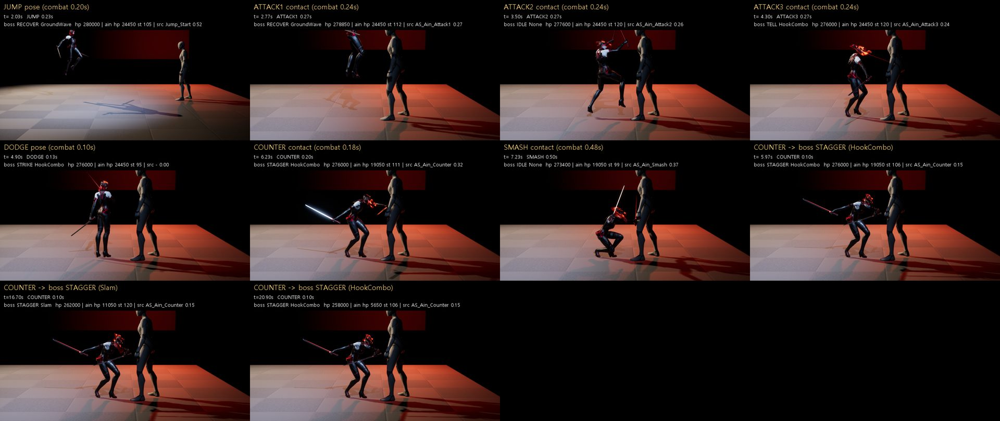
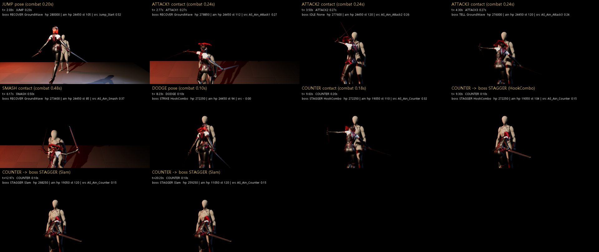

# 127 — 아인 그레이박스 애니를 Paragon: Countess 로 교체 (2026-09-28)

디렉터:

- 문서 125 의 임시 원본(템플릿 Manny 맨손 클립)을 Paragon 으로 바꾼다.
- 글자 크기는 지금으로 충분하다(문서 126 §6-1).
- «나머지는 하던대로 계속.»

## 0. 결론 먼저

| 항목 | 결과 |
|---|---|
| 원본 | **Paragon: Countess**. 디렉터가 받아 둔 5.8 프로젝트에서 복사했고 커밋하지 않는다. |
| 몽타주 5 개 + 접점 노티파이 | 칼날 전방 뻗음과 속도로 접점을 잡았다(§2). `ue_graybox_anim_setup.py` 로 다시 만든다. |
| 몸·슬롯 | `SM_Countess` + Countess AnimBP, 슬롯 **UpperBody**. FullBody 로는 공격이 몸에 보이지 않았다(§3 에서 확인). |
| 22 초 캡처 ×2 | 1→2→3 직결 7·8 회, 스매시 3, 카운터 3 → 보스 STAGGER 3 (게임·측면 각각) |
| 재생 확인 | 공격 프레임 464·467 개 **전부** UpperBody 슬롯 몽타주 재생 중(프레임 로그 `montage`) |
| FullGame 코드 | 변경 없음(스크립트만) |

## 1. 원본 — 어디서 왔나

- **Paragon: Countess** (Epic, Fab 무료, UE 전용 라이선스)를 썼다.
  - 디렉터가 예전 프로젝트 `Documents/Unreal Projects/UEIntroProject 5.8/Content/ParagonCountess` 에 받아 둔 것(5.8, 2,727 에셋, 1.8 GB)이다.
  - 같은 `/Game/ParagonCountess` 경로로 복사했다. 팩은 저장소에 넣지 않는다.
  - `ue_graybox_anim_setup.py` 는 `/Game/ParagonCountess` 가 없으면 `HW_PARAGON_COUNTESS_SRC` 에서 복사한다. 그것도 없으면 Manny 임시 원본(문서 125)으로 돌아간다.
- Countess 는 Paragon 의 **암살자형 쌍날 근접 영웅**이다. 아인의 게임 데이터 직업도 «암살자» 다. 다만 **낫은 아니다**. 무기 궤적(낫의 큰 호)은 낫 원본이 들어올 때 다시 본다.
- 다른 Paragon 영웅은 Epic 런처 → Unreal Engine → Fab 라이브러리(또는 fab.com)에서 «라이브러리에 추가 → 프로젝트에 추가 → HwanghonCombatUE» 로 받는다.
  - 카인 = Kwang/Greystone (문서 124 §2)
- 몸도 Countess 를 그대로 쓴다: `SM_Countess` + `Countess_AnimBlueprint`(FullBody·UpperBody 슬롯).
  - 리타깃을 거치지 않으니 원본 품질이 그대로다.
  - 보스는 계속 Quinn 자리 표시다.

## 2. 클립 고르기와 접점

- Paragon 몽타주의 노티파이는 콤보 창(`SaveAttack`·`ResetCombo`)뿐이고, **타격 프레임 표시가 없다**.
- 그래서 칼날 뼈(`weapon_l/r`, `sword_tail_*_02`)를 60 Hz 로 뽑아 두 가지를 쟀다.
  - **전방(+Y) 뻗음 최대**
  - **그 근처 속도 최고**
- 후보 9 개는 스틱 피겨로 그려 **눈으로** 골랐다.
- 처음에 쓴 «수평 뻗음» 은 옆으로 벌린 팔도 잡는다. 그래서 Ability_E 가 0.20 s 에 뻗는 것처럼 나왔는데, 전방 성분으로 다시 재니 0.58 s 의 느린 찌르기(약 400 cm/s)였다. 치는 동작이 아니라 피니시에서 뺐다.

| 동작 | 클립 | 길이 | 접점 | 근거 | 리타임 배속 접점 전 / 후 |
|---|---|---|---|---|---|
| Attack1 | Primary_Attack_A_Normal | 0.900 s | 0.200 s | 칼날 속도 최고 오른 0.187 · 왼 0.221 | 0.83× / 1.67× |
| Attack2 | Primary_Attack_B_Normal (깊은 런지) | 0.900 s | 0.187 s | 전방 뻗음 0.170 · 속도 0.187 | 0.78× / 1.70× |
| Attack3 | Primary_Attack_Normal | 0.900 s | 0.170 s | 왼칼 4,440 cm/s | 0.71× / 1.74× |
| Smash | Ability_RMB (도약 내려찍기) | 1.333 s | 0.467 s | 전방 뻗음 0.450 · 골반 최저 0.533(착지) | 0.97× / 1.29× |
| Counter | Primary_Attack_Fast_V1 | 0.600 s | 0.167 s | 두 칼날 속도 최고 0.167 | 0.93× / 1.14× |

배속은 전투 시계 기준이다(3 타 0.66/0.24, 스매시 1.15/0.48, 카운터 0.56/0.18).

- 문서 125 의 Manny 는 접점 앞을 1.7~2.6 배로 당겼다.
- Countess 는 접점이 빨라서 **접점 앞이 오히려 느려진다**(0.7~1.0×). 접점 뒤는 1.1~1.7× 다.
- Attack3 의 «접점 뒤 3 배 압축» 문제(문서 125 §5-2)는 사라졌다(1.74×).

## 3. 22 초 캡처 (같은 봇, 같은 규칙)

| | 게임 카메라 | 측면 카메라 |
|---|---|---|
| 보스 Strike | GroundWave ×2 · HookCombo · Slam ×3 | GroundWave ×2 · HookCombo ×2 · Slam ×2 |
| 1 → 2 → 3 | 직결 7 회(1→2, 2→3). 나머지 2 회는 보스 예고 때문에 봇이 끊음 | 직결 8 회, 끊음 2 회 |
| 스매시 · 카운터 | 3 · 3 (STAGGER 3) | 3 · 3 (STAGGER 3) |
| 체력 | 보스 280,000 → 256,650 · 아인 24,450 → 11,050 | 보스 → 258,000 · 아인 → 5,650 |

- **처음 캡처에서는 공격이 몸에 보이지 않았다.**
  - 원래 슬롯은 FullBody 였다(C++ 바인딩 기본값). 1·2·3 타·스매시·카운터 접점 컷이 모두 거의 같은 선 자세였다.
  - Paragon 자체 몽타주는 UpperBody 를 쓴다. 슬롯을 UpperBody 로 바꾸니 휘두르기·런지·찌르기·도약 내려찍기가 나왔다.
  - 프레임 로그에 «몽타주 재생 중 + 활성 슬롯» 을 넣어 확인한다(`ue_pie_capture.py` `anim_state`).
  - 이 슬롯은 다리까지 움직인다(2 타 런지).
- **샘플 조종 캐릭터의 컴파일 실패.** Countess 의 샘플 캐릭터(`CountessPlayerCharacter`)는 UE5 에서 컴파일되지 않는다. UE4 VR 노드 `ResetOrientationAndPosition` 과 옛 입력 축 때문이다.
  - AnimBP 가 이 캐릭터로 형변환하므로 함께 로드된다. 그러면 PIE 가 «오류 있는 블루프린트» 확인창에서 멈췄다.
  - 복사본에서 **이벤트 그래프만 지우고**, AnimBP 노티파이가 부르는 `ResetCombo`·`ComboAttackSave` 를 빈 함수로 되돌렸다. Paragon 자체 콤보용이고, 우리 콤보는 전투 시계가 맡는다.
  - 순서가 중요하다. 지운 뒤 한 번 컴파일해야 새 함수 이름에 `_0` 이 붙지 않는다.
- 영상(게임·측면, 15 fps 실시간)은 디렉터에게 직접 보냈다.

## 4. 본 것 · 남은 일

1. **Countess 는 낫이 아니다.** 쌍날 궤적이라 아인의 낫 호(큰 원)는 아직 없다. 낫 원본은 영상→모캡이나 낫 에셋이 필요하다(문서 124 §1).
2. **회피 클립이 없다.** Countess 에는 구르기·대시가 없어서 회피는 AnimBP 로코모션으로 보인다. 후보는 `TravelMode_Start`(질주 시작)다.
3. **접점에서 몸이 겹친다**(문서 125 §7-4, 캡슐 거리 102.9 cm). 칼날 뻗음 70~85 cm 가 보스 몸 안으로 들어간다. 사거리·멈춤 거리 조정은 그대로 남아 있다.
4. **보스는 여전히 Quinn 자리 표시다.** tell/strike/recover 애니가 없다(문서 119 §6-3).
5. **메시 예산.** Countess 는 모바일 예산을 넘는 Paragon 원본이다(`SM_Countess` 24 MB, 팩 1.8 GB). 그레이박스 동작 기준으로만 쓰고, 영웅 에셋 단계에서 교체한다.
6. 1 타가 점프 직후 공중에서 시작되는 것은 봇이 GroundWave 점프 뒤 바로 눌렀기 때문이다. 게임 규칙상 허용된다.
7. **카인**: 같은 통로(`SOURCES` 에 항목 추가)로 Kwang/Greystone 을 붙인다. Fab → 프로젝트에 추가 → HwanghonCombatUE.
