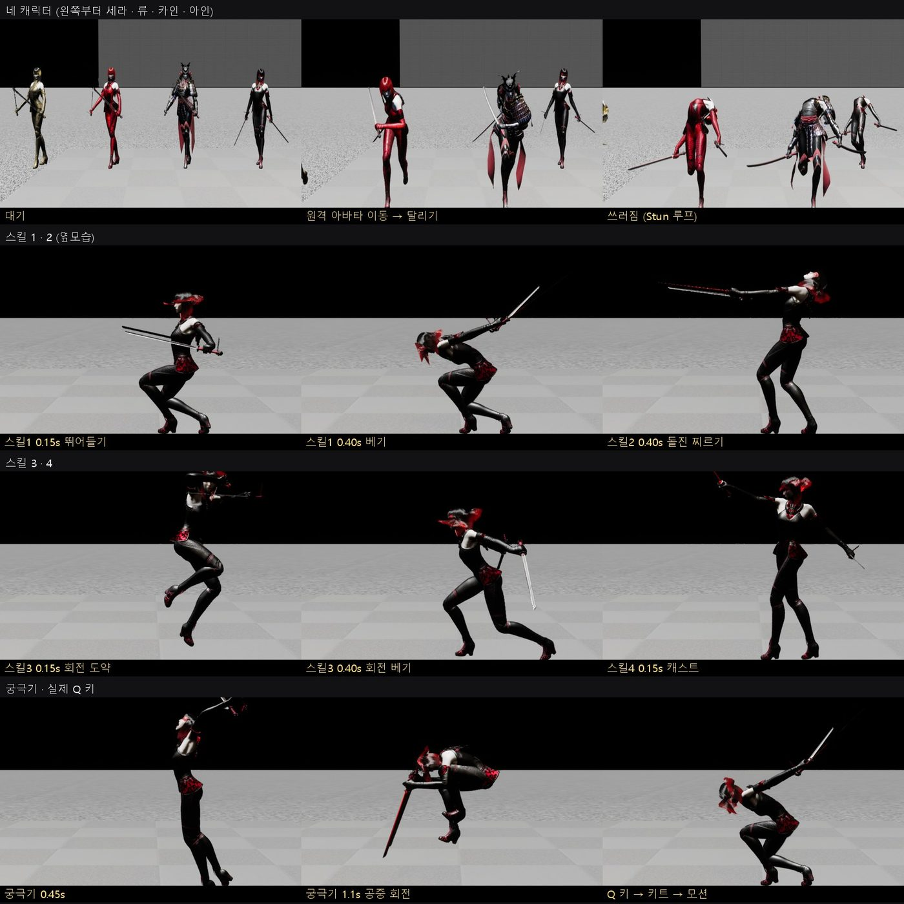
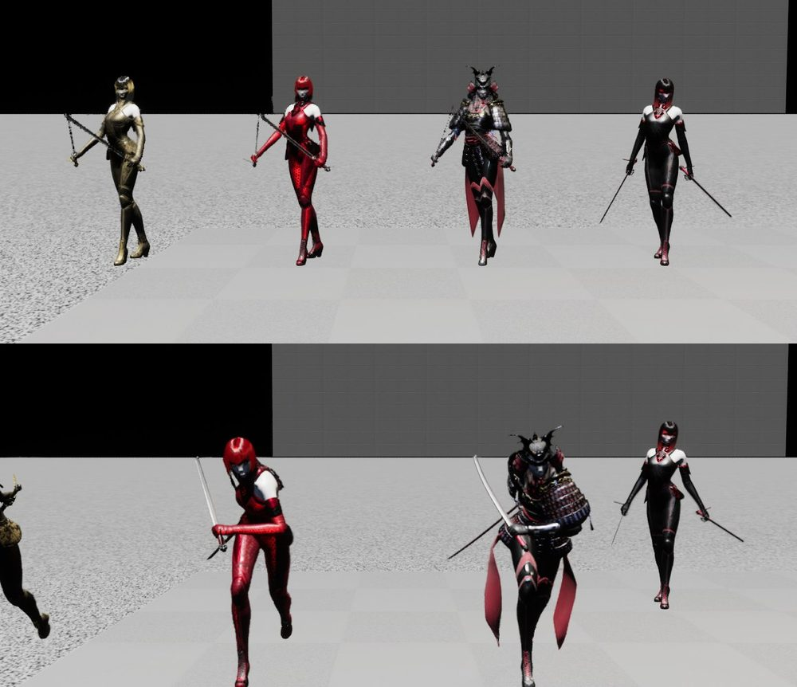
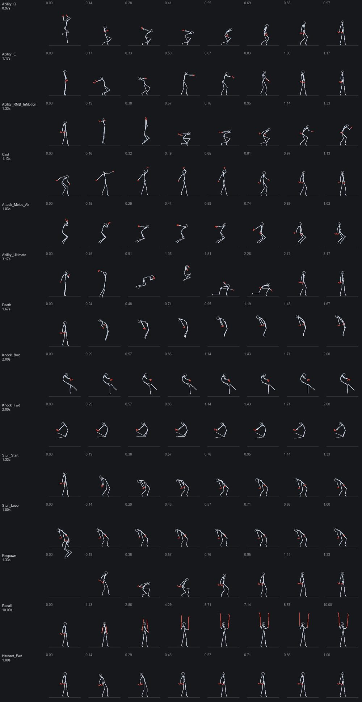
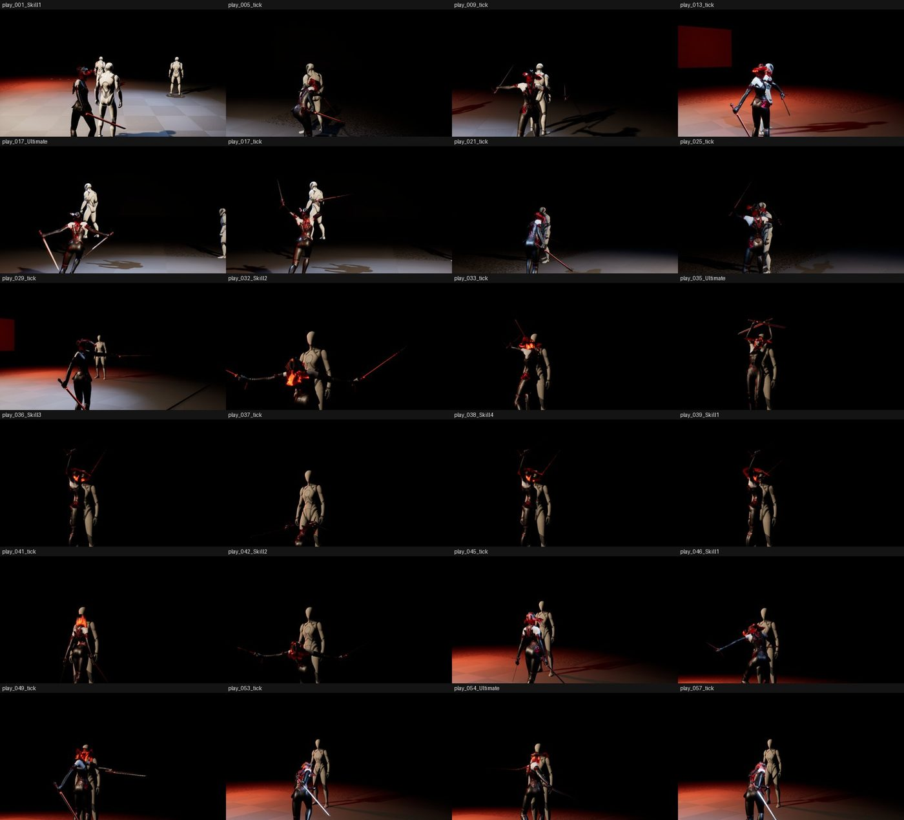

# 129 — 기존 Countess 모션을 SYSTEM CORE 네 캐릭터에 적용 (2026-09-28)

디렉터: «기존에 모션 애니메이션 해놓은거 적용시켜볼래?» «하고 나서 항상 조사해보고 비교하면서 확대 수정하고»

기존 모션은 문서 127 의 Paragon: Countess 세트다. 공격 1·2·3·스매시·카운터에 접점 노티파이가 붙어 있다.
문서 122 에서 원본이 맞지 않는다고 판정한 웹판 클립(`Characters/Ain/ain_anim*` 등)은 쓰지 않았다.

## 0. 결론

| 항목 | 결과 |
|---|---|
| 문서 127 방식의 문제 | 맵에 **배치한 아인 한 개**에만 몸을 입혔다. 그래서 두 가지가 틀어졌다. ① `Seohan_Combat_VS01` 에서 캐릭터 선택이 무시됐다(배치 폰이 먼저 빙의). ② 코드로 스폰되는 폰은 **몸이 없었다**. 온라인 레이드·던전·카인/류/세라 전부 해당. |
| 바꾼 방식 | `UHWCharacterVisualSettings`(DefaultGame.ini)가 캐릭터마다 몸·AnimBP·모션 세트를 정한다. 클래스로 스폰된 폰이 BeginPlay 에서 입는다. 배치 폰은 없앴다. |
| 네 캐릭터 구분 | Countess 스킨 네 벌: 아인 기본 · 카인 Shogun · 류 RedRevo · 세라 Gilded |
| 새 모션 슬롯 | 스킬 1~4 · 궁극기 · 쓰러짐 · 사망 (§2, 스틱 피겨로 고르고 측정) |
| 온라인 | 서버 동작 클립(`skill1..4`·`ult`·`exec`)을 본인 폰과 원격 아바타가 재생한다. 원격 아바타도 몸을 입고 달린다. |
| 보스·던전 적 | 몸 없는 캡슐이었다. 이제 Quinn·Manny 대역 몸을 입는다. |
| 검증 | 자동화 **26/26, 경고 0** · 쇼케이스 게이트(Q 키 → 키트 → 모션) PASS · 2P 온라인 회귀 · Seohan 에서 카인 선택 → HWKainCharacter |

## 1. 조사 → 비교 → 확대 → 수정 기록

한 번 찍고 끝내지 않았다. 매번 뼈 좌표를 재고 확대해서 고쳤다.
`-HWQA=showcase` 는 RHI 창(1280×720)에서 같은 장면을 매번 다시 찍는다.
`MeasureBody` 는 골반·머리·손·칼·발의 뼈 위치를 액터 기준 cm 로 기록한다.

| 회차 | 본 것 | 잰 것 | 고친 것 |
|---|---|---|---|
| 1 | 네 명 모두 팔을 든 같은 자세. 두 스킨이 회색 점토. 양 끝 잘림. 어둡다. | 대기 샘플에서 몽타주 재생 중. 로그에 `LevelStart_Montage` | 팩 AnimBP 의 등장 연출과 셰이더 컴파일이었다. 4 초 기다린 뒤 찍게 바꿨다. 카메라 900 cm, FOV 50. 확인 전용 조명을 넣었다. |
| 1 | 원격 아바타 쓰러짐이 1 초 뒤 풀린다 | `montage 0`, 머리 68 cm(서 있음) | 루프 클립을 1 회로 재생하고 있었다. `bLoop` 면 반복하게 했다. |
| 1 | 0.75 초 샷이 이미 끝난 동작을 찍었다 | 느린 프레임에서 내 타임라인이 게임 시간보다 늦었다 | 월드 시간 기준으로 바꿨다 |
| 2 | 스킬·궁극기가 전신으로 보인다. 옆모습 뒤에 아바타가 겹친다. | | 옆모습을 찍을 때는 아바타를 숨긴다 |
| 2 | 확대하니 어깨가 하얗게 날아가고 얼굴이 어둡다 | | 조명을 카메라 쪽 앞에서 약하게(2.2) |
| 3·4 | 원격 아바타가 움직여도 대기 자세 | 이동 1 초에 15 cm, 속도 19 cm/s | 촬영 쪽 목표 위치가 틀렸다. 서버처럼 시작점 + 350 cm/s 로 바꿨다. |
| 5 | 이동(323 cm, 349 cm/s)해도 발 위치가 대기와 같다 | 왼발 (19, 5, -78) 그대로 | Countess AnimBP 는 `IsAccelerating`(가속도)로 달리기로 넘어간다. `UHWRemoteAvatarMovement` 가 스냅샷 속도·가속도를 싣는다(시뮬레이션은 하지 않는다). |
| 6 | 달린다 | 왼발 (-64, -7, -61) — 보폭 | |
| — | 원격 아바타의 대역 캡슐이 없다 | 로그 `Failed to find /Engine/BasicShapes/Capsule` | 5.8 에는 Capsule 이 없다. Cylinder 로 바꿨다(몸이 없을 때만 보인다). |
| — | 자동화 경고 7 | 테스트 월드 폰이 팩 AnimBP 를 입는다(0 나누기 스크립트 경고) | 그리지 않는 실행(`FApp::CanEverRender()` false)에서는 몸을 입히지 않는다. 경고 0. |

## 2. 슬롯에 넣은 클립 — 고른 근거

- 후보 클립의 뼈를 8 개 시점에서 뽑았다(`Scripts/ue_anim_pose_dump.py`).
- 옆·앞 스틱 피겨로 그렸다(`Scripts/make_pose_sheet.py`).
- 어깨선 회전량과 골반·발 높이를 쟀다.

| 슬롯 | 게임 뜻 | 클립 | 근거 |
|---|---|---|---|
| 스킬1 | 강타(낫 베기·대검 내려치기…) | `Ability_Q` 0.97 s | 뛰어들며 낮게 벤다 |
| 스킬2 | 회피형(그림자 걸음·도약·안개) | `Ability_E` 1.17 s | 앞으로 돌진 찌르기 |
| 스킬3 | 광역 회전(피의 회전·강철 회전·칼날 폭풍) | `Primary_Attack_B_Slow` 1.5 s | 어깨선 **296°** 회전. `Ability_RMB` 는 720° 지만 이미 스매시다. |
| 스킬4 | 버프(결의·표식·회복 결계) | `Cast` 1.13 s | 칼을 들어 올리는 시전 |
| 궁극기 | | `Ability_Ultimate` 3.17 s | 도약 → 공중 회전 → 착지 |
| 쓰러짐 | 부활 대기(온라인 hp 0, 협동 출혈) | `Stun_Loop` 루프 | 팩에 **누운 자세가 없다**. `Death` 는 떠오르고(골반 113 → 179 cm), `Knock_*` 는 공중(발 30~60 cm). Stun 은 발이 땅에 있고 크게 꺾인다(머리 115 cm). |
| 사망 | 솔로 최종 사망 | `Stun_Start` 마지막 프레임 유지 | 같은 이유 |

- 슬롯은 문서 127 과 같은 `UpperBody` 다. 쇼케이스에서 다리까지 같이 움직였다(스킬1 웅크림, 궁극기 도약).
- 다만 조건이 있다. 이동 중에는 AnimBP 의 하체 달리기와 섞인다.

## 3. 실제 플레이 (1P 던전, 게임 카메라)

- `-HWQA=local -HWQAShots= -HWQAShotEvery=4` 로 찍었다.
- 스킬을 쓸 때마다 0.3 초 뒤에도 찍었다.
- 아인이 Countess 몸으로 스킬·궁극기를 쓴다.
- 던전 적(Manny)과 보스(Quinn)도 몸이 보인다.

## 4. 코드

| 파일 | 변경 |
|---|---|
| `Animation/HWCharacterVisualSettings` (새) | 캐릭터 id → 몸·AnimClass·모션 세트·오프셋·배율 |
| `Config/DefaultGame.ini` | 아인·카인·류·세라 + `boss`·`enemy` 대역 |
| `HWAinCharacter::BeginPlay` · `HWBossCharacter` · `HWDungeonEnemy` | 몸이 비어 있으면 설정의 몸을 입는다. Super 전에 입어서 발표 컴포넌트가 anim instance 를 잡는다. |
| `HWAnimationSetAsset` | Skill1~4·Ultimate·Downed·Death, `GetAbilityBinding`, `GetServerClipBinding` |
| `HWPlayerPresentationComponent` | 키트 `OnAbilityActivated` → 원샷, `PlayServerClip`, 쓰러짐·사망 자세(전투 액션 경로와 분리) |
| `HWRaidRemoteAvatar` | 몸, `ApplyAction`(서버 클립·쓰러짐), `UHWRemoteAvatarMovement`(스냅샷 속도·가속도 → 달리기), Cylinder 대역 |
| `HWRaidWorldBridge` | 원격 아바타에 동작 전달, 본인 폰에 서버 스킬 클립 전달 |
| `Scripts/ue_graybox_anim_setup.py` | 새 슬롯 바인딩. `Seohan_Combat_VS01` 의 배치 아인을 없앤다(선택 캐릭터가 스폰된다). |
| `Scripts/ue_anim_pose_dump.py` · `make_pose_sheet.py` (새) | 스틱 피겨 검수 |
| `Tests/HWSystemQASubsystem` | `-HWQA=showcase`, `MeasureBody`, 플레이 중 샷 |

- 게임 규칙은 바꾸지 않았다. 몸·모션은 표현만 한다.
- 온라인에서는 서버가 알려 준 클립만 재생한다.

## 5. 남은 것

- **누운 쓰러짐·사망 자세가 없다.**
  - 템플릿 Manny 의 `MM_Death_*` 는 다른 스켈레톤이다. IK Retargeter 로 Countess 에 옮겨야 쓸 수 있다.
  - 웅크린 자세도 읽히지만, «쓰러짐» 은 누운 자세가 더 분명하다.
- **네 캐릭터가 같은 모션을 공유한다.**
  - 대검(카인)·쌍단검(류)·시약(세라)용 원본(Paragon Kwang/Greystone 등)은 아직 받지 않았다.
  - 받으면 `DefaultGame.ini` 의 캐릭터별 `AnimationSet` 만 바꾸면 된다.
- 보스는 Quinn 대역이고 **패턴 모션이 없다**(`BossPatterns` 바인딩 비어 있음).
- Countess AnimBP 는 스폰할 때 `LevelStart` 등장 연출을 틀고, 첫 프레임에 0 나누기 스크립트 경고를 낸다(팩 동작).
- 레이드 맵 조명은 스포트 리그뿐이라 어둡다. 쇼케이스의 조명은 확인 전용이다.
