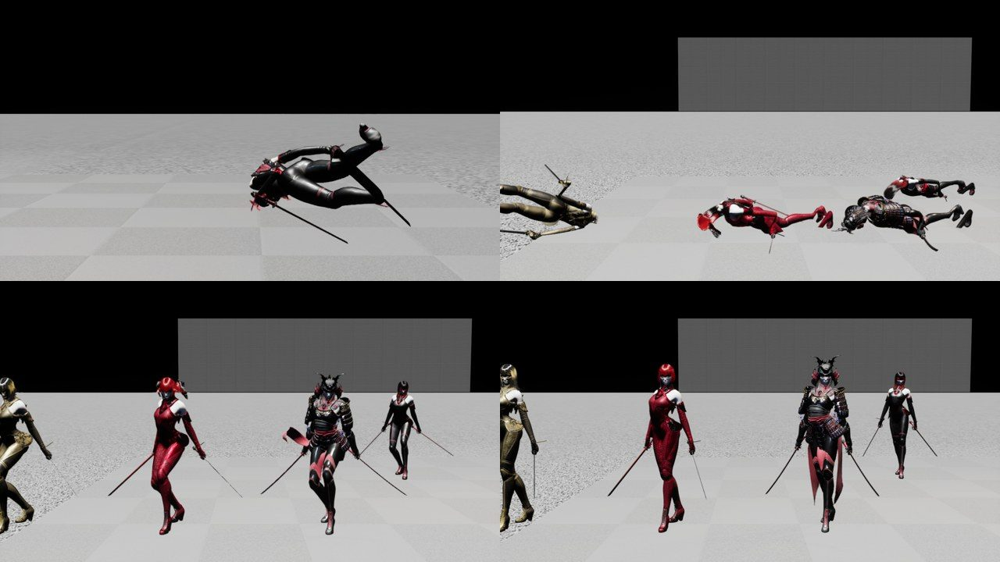
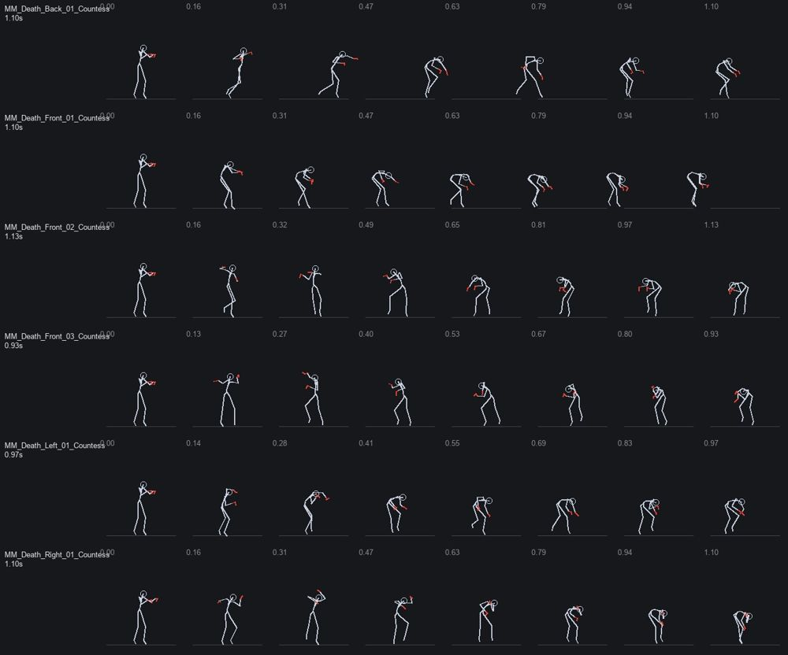

# 130 — 쓰러짐은 래그돌로 눕히고, 부활은 일어나는 모션으로 (2026-09-28)

문서 129 에서 남은 것: 팩에 **누운 자세가 없어서** 쓰러짐을 웅크린 Stun 으로 대신하고 있었다.

디렉터: «작업하다가 만약 안되면 무료에셋이나 리깅 애니메이션 조사해서 적용할래?»

## 0. 결론

| 항목 | 결과 |
|---|---|
| 1차: Manny `MM_Death_*` 6 개를 Countess 로 리타깃 | **리타깃 자체는 성공했다**(IK 리그 자동 생성·체인 자동 매핑·자동 정렬, `Scripts/ue_retarget_to_countess.py`). 하지만 **원본도 눕지 않는다**. 원본 끝 프레임의 골반이 85~88 cm 다. 넘어지는 도중에 래그돌로 넘기는 용도의 클립이다. |
| 2차: 래그돌 | 네 스킨 모두 물리 에셋(`PA_Countess_Phat_Extents`)이 있다. 쓰러지면 래그돌로 **바닥에 눕는다**. 1.7 초 뒤 골반·머리·발이 모두 바닥 높이(-76 ~ -87 cm, 발바닥 -92 cm)다. |
| 부활 | 래그돌을 끄고 캡슐에 다시 붙인 뒤 `Respawn` 0.4 초부터 재생한다(웅크림 → 일어섬). 0.35 초에 골반 7 cm, 1.5 초에 대기 자세(머리 68 cm)가 된다. |
| 무료 에셋 | 래그돌로 해결되어 이번에는 받지 않았다. 캐릭터별 무기 모션이 필요할 때 다시 본다(§3). |
| 검증 | 자동화 26/26 경고 0. 쇼케이스(RHI)에서 플레이어·원격 아바타 네 명 쓰러짐 → 부활. |

## 1. 리타깃 시도 — 숫자

- 방법: `IKRigController.apply_auto_generated_retarget_definition` → `IKRetargeterController.auto_map_chains`·`auto_align_all_bones` → `duplicate_and_retarget`.
- 5.8 에서는 `target_path` 인자가 추가됐다.

| 클립 | 원본 끝 골반 / 머리 (cm) | 리타깃 끝 골반 / 머리 |
|---|---|---|
| MM_Death_Front_01 | 88 / 85 | 106 / 99 |
| MM_Death_Back_01 | 85 / 121 | 102 / 124 |

- 원본도 서 있는 높이의 골반으로 끝난다. 템플릿 캐릭터는 이 뒤를 래그돌로 넘긴다.
- 리타깃 클립은 `/Game/Animation/Retarget` 에 두었다. 쓰지는 않는다.

## 2. 래그돌 — 찍고, 재고, 고친 기록

| 회차 | 본 것 · 잰 것 | 고친 것 |
|---|---|---|
| 1 | 모두 누웠다. 하지만 캐릭터끼리 겹쳐 쌓이고, 하나는 머리로 서서 다리를 들었다. | 래그돌끼리는 부딪히지 않게(PhysicsBody 무시). 선형·각 감쇠 0.8·2.5 |
| 2 | 쌓임은 사라졌다. 플레이어만 0.7 초에 뒤로 공중제비를 돈다(발 +33 cm, 골반 -17 cm). | 넘어지기 전에 `Stun_Start` 로 무릎을 꺾는 방식을 시도했다 |
| 3 | 무릎 꺾기 몽타주 위에서 래그돌을 켜니 **몸이 7~18 m 튀어 올랐다** | 되돌렸다. 시작 속도를 0 으로 둔다. |
| 4 | 튀는 건 사라졌다. 플레이어의 공중제비는 그대로다. 원격 아바타는 정상이다. | 차이는 본인 폰의 캡슐이었다. 래그돌 동안 캡슐은 쿼리 전용(물리 밀기 없음)으로 바꾸고, 부활 때 되돌린다. |
| 5 | 0.7 초에 뒤로 눕듯이 넘어지고(발 -2 cm), 1.7 초에 네 명 모두 바닥이다. 부활하면 일어선다. | — |

## 3. 코드

| 파일 | 변경 |
|---|---|
| `HWCharacterVisualSettings::SetRagdoll` (새) | Ragdoll 프로필, 폰·다른 래그돌 무시, 감쇠, 시작 속도 0, 캡슐 쿼리 전용. 해제 때 캡슐에 다시 붙이고 원래 상대 위치로 돌린다. 물리 에셋이 없거나 그리지 않는 실행이면 false 를 돌려주고, 호출한 쪽이 Stun 자세로 대신한다. |
| `HWPlayerPresentationComponent` | 죽음·쓰러짐 → 한 프레임 뒤 래그돌. 부활 → `GetUp` |
| `HWRaidRemoteAvatar` | 같은 흐름. 서버의 쓰러짐·부활 스냅샷을 따른다. |
| `HWAnimationSetAsset` | `GetUp`, `GetUpStartSeconds`(0.4) |
| `Scripts/ue_graybox_anim_setup.py` | GetUp = `Respawn` |
| `Scripts/ue_retarget_to_countess.py` (새) | Manny → Countess 자동 리타깃(다른 클립에도 쓸 수 있다) |

- 래그돌은 표현만 한다. 캡슐·위치·부활 판정은 그대로 서버(온라인)와 전투 컴포넌트(1P)가 정한다.

## 4. 남은 것

- 무기별 캐릭터 모션: 대검·쌍단검·시약 원본이 필요하다.
  - Paragon Kwang/Greystone 등은 Fab 로그인이 필요하다.
  - 오픈 라이선스 모캡(CMU 등)을 받으면 `ue_retarget_to_countess.py` 로 옮길 수 있다.
- 보스는 Quinn 대역이고 패턴 모션이 없다. 다음 작업이다.
- 래그돌은 매번 물리 결과가 조금씩 달라서 누운 방향도 달라진다(재현 캡처에서 앞·뒤 모두 나왔다).
