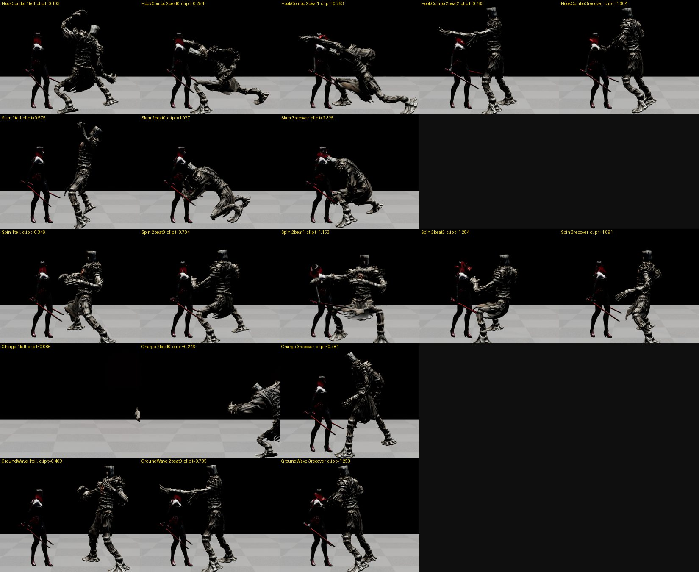
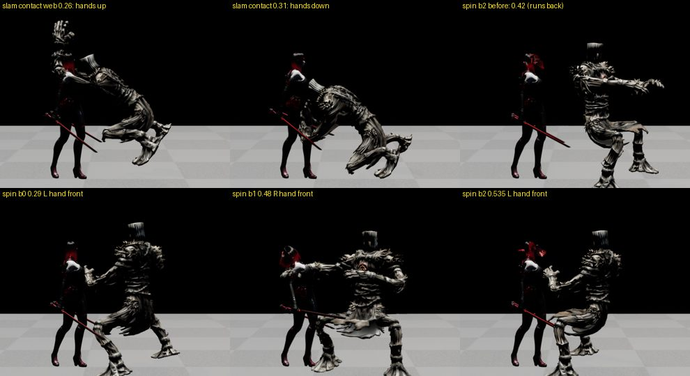
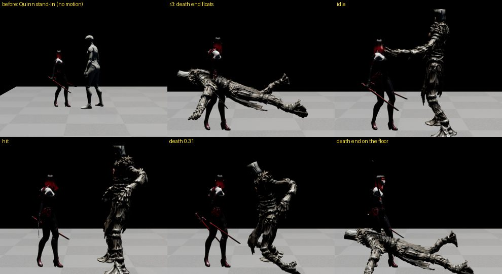

# 132 — 보스에 자기 모션을: 훈련장 보스 클립을 패턴 시계에 맞춰 재생 (UE 5.8.1, 2026-09-28)

문서 130 에서 남은 것: 보스가 Quinn 대역(`ABP_Unarmed`)이라 **패턴 모션이 없었다**.

디렉터 상시 지시:

- «하고 나서 항상 조사해보고 비교하면서 확대 수정하고»
- «만약 안되면 무료에셋이나 리깅 애니메이션 조사해서 적용할래?»

## 0. 결론

| 항목 | 결과 |
|---|---|
| 몸 | 웹 훈련장 보스(`art/3d/boss_anim.glb` → `/Game/Bosses/Training/boss_anim`, Mixamo 뼈대)를 그대로 입혔다. 새로 받은 에셋은 없다. |
| 모션 | AnimBP 없이 단일 노드로 재생한다. `UHWBossPresentationComponent` 가 보스 전투 시계에 맞춰 클립을 **스크럽**한다. 예고·타격·회복이 한 클립이다. |
| 접점 | 게임 비트 = 클립 접점. 다섯 패턴(비트 9 개) 모두 로그에서 확인했다(§2). |
| 바닥 | 다른 리그에서 옮긴 클립 셋은 22~35 cm 떠 있었다. 사망은 끝에서 52 cm 떠서 누웠다. 둘 다 바닥에 붙였다. |
| 온라인 | 서버 snapshot 의 `pattern.icon`(hookL/slam/…)과 `teleDur`/`recoveryDur` 로 같은 클립을 재생한다. 진행도는 v2.4 의 `windup`/`recovery` 를 쓴다. |
| 검증 | 자동화 30/30(경고 0). 실검수 `system-core-qa.cjs all` 은 전 게이트 PASS. 보스 쇼케이스 5/5 패턴. |

## 1. 왜 단일 노드인가

- 먼저 Manny 템플릿 `ABP_Unarmed` 를 보스 뼈대로 옮겨 보았다(`Scripts/ue_boss_training_setup.py` 초판).
  - IK 리그 자동 생성 → 체인 자동 매핑 → `duplicate_and_retarget`.
  - 애니 21 개와 블렌드스페이스는 나왔다. **AnimBP 는 복제되지 않았다**(5.8 배치 리타깃은 블루프린트를 건너뛴다).
- 웹 게임도 이 보스를 AnimBP 없이 `AnimationMixer` 로 클립 하나씩 튼다. 그래서 같은 방식으로 간다.
  - `HWCharacterVisualSettings` 의 "boss" 항목에 `AnimClass` 가 없으면 몸을 `AnimationSingleNode` 로 둔다.
  - 프레젠테이션은 매 프레임 `SetPosition` 으로 보스 상태를 따라간다.

| 보스 상태 | 보이는 것 |
|---|---|
| Tell | 첫 비트 클립을 0 → (접점 − 첫 비트 시각)까지 늘여 재생한다. 예고가 느리게 읽힌다. |
| Strike | 비트마다 실제 속도로 재생하고, 비트 시각에 그 클립의 접점이 온다. 같은 클립의 연속 비트는 접점 사이를 보간한다(Spin). |
| Recover | 마지막 클립의 나머지를 회복 시간에 맞춘다. |
| Stagger / Break | `stagger` / `down` |
| 피격(Idle·Recover 중) | `hit`. 예고·타격은 끊지 않는다. |
| 사망 | `death` 끝 프레임 고정 |
| 그 밖 | 속도 30 cm/s 이상이면 `walk`(속도 비례), 아니면 `idle` |

## 2. 찍고, 재고, 고친 기록

쇼케이스는 `-HWQA=bossshow` 다. 죽지 않는 플레이어를 두고 보스가 실제로 싸운다.

- 패턴마다 예고 60% · 각 비트 · 회복 50% 에서 옆모습을 찍는다.
- 뼈 좌표(Mixamo 이름 → 표준 키)를 함께 남긴다.
- 보인 클립·시각은 로그에 남긴다.

| 회차 | 본 것 · 잰 것 | 고친 것 |
|---|---|---|
| r1 | 모든 샷에서 같은 자세였다. 로그상 몸이 **Quinn · AnimBP** 였다. | 맵에 배치된 보스에 옛 스크립트가 Quinn 을 구워 둬서 설정이 안 먹었다. 배치 보스의 몸을 비웠다(`ue_graybox_anim_setup.py` 도 이제 비운다). |
| r3 | 패턴이 움직인다. 하지만 **사망 끝이 공중에 누워 있었다.** 골반 76 cm, 머리 100 cm, 가장 낮은 뼈 52 cm. | GLB 를 직접 읽었다. 원본 `death` 끝 Hips 가 0.89 m 이고 루트 애니메이션은 없다. **웹 모델도 똑같이 뜬다.** 사망·다운 중에는 가장 낮은 뼈를 바닥 +3 cm 로 내린다(측정 기반). |
| r3 | **내려찍기 접점에서 손이 머리 위(바닥 +201 cm)** 였다. | 60 프레임을 샘플링했다. 웹 hitFrac 0.26 은 손이 내려가기 시작하는 순간이다(웹 주석 «손·발 최고속» = CLAUDE.md §2 의 틀린 지표). 손이 다 내려온 0.31 로 옮겼다. |
| r3 | kick · slam · spin 이 떠 있었다. | 발가락 최저점을 idle 과 비교했다. kick 22.0 · slam 22.8 · spin 34.7 cm(원본 리그 차이). `ClipGroundOffsetCm` 으로 그 클립 동안만 몸을 내린다. 스크립트가 자동으로 잰다. |
| r4 | GroundWave 가 안 나왔다. 2 페이즈 전용 패턴이다. Charge 는 5 m 밖에서만 나온다. | 쇼케이스가 4 패턴 뒤 체력을 2 페이즈로 밀고, Charge 전에는 보스를 뒤로 뺀다. |
| r5 | 회전 베기 비트 1·2 가 같은 자세였다. 팔이 **등 뒤**에 있었다. | 손 각도를 60 프레임 추적했다. 한 바퀴(0.24→0.53) 중 팔이 앞을 지나는 순간은 왼손 0.29, 오른손 0.48, 왼손 0.535 다. 비트를 그 셋에 맞췄다. |
| r7 | 여전히 비트 2 가 0.42 로 **거꾸로 갔다**. 로그로 실제 재생 시각을 찍어 보았다. | 원인: `FName` 은 대소문자를 구분하지 않는다. 온라인 아이콘 `spin` 이 로컬 `Spin`(3 비트)을 덮어써 1 비트가 되었다. 겹치는 키는 로컬 바인딩을 쓴다. |
| r8 | 비트가 모두 목표 시각에 맞았다(아래). | — |

r8 에서 실제로 보인 클립 시각:

| 패턴 | 예고 60% | 비트 (실제 / 목표) | 회복 50% |
|---|---|---|---|
| HookCombo | hookR 0.22 | hookR 0.545/0.54 · hookL 0.543/0.54 · hammer 0.482/0.48 | hammer 0.80 |
| Slam | slam 0.17 | 0.311/0.31 | 0.67 |
| Spin | spin 0.14 | 0.293/0.29 · 0.480/0.48 · 0.535/0.535 | 0.79 |
| Charge | charge 0.08 | 0.223/0.22 | 0.71 |
| GroundWave | hammer 0.25 | 0.483/0.48 | 0.77 |

- 접점 근거:
  - 훅·해머·볼트·회전 오른손은 웹 hitFrac 과 60 프레임 측정(팔 최대 전진)이 2~4% 안에서 같다.
  - 내려찍기 0.31, 킥 0.41(발 최대 전진), 사이드 0.50(칼날 정면), 돌진 0.22(앞으로 미는 순간)는 측정으로 옮겼다.
  - 웹 0.62 는 이미 일어선 뒤다.
- 내려찍기는 **점프 내려찍기**다. 접점에서 발이 아직 떠 있고 0.66 에 착지한다.

## 3. 코드

| 파일 | 변경 |
|---|---|
| `HWBossPresentationComponent` | 단일 노드 경로(`TickSingleNodePose`, `PatternClipAt`, `GroundBody`). AnimBP 몸은 기존 몽타주 경로 그대로다. |
| `HWAnimationSetAsset` | `BeatSequences`(비트별 클립), `BossIdle/Walk/Death`, `ClipGroundOffsetCm` |
| `HWCharacterVisualSettings::ApplyTo` | `AnimClass` 가 없으면 단일 노드로 둔다. |
| `HWBossCharacter` | 몸의 애님 세트를 프레젠테이션에 넘긴다. `GetPresentedPattern`, `GetPresentationStatePhase`, `ApplyAuthoritativeMotion`(온라인 아이콘·예고/회복 길이). 네트워크 모드는 표시용 시계만 돈다. |
| `HWRaidNetworkSubsystem` / `HWRaidWorldBridge` | snapshot `pattern.icon`, `teleDur` 를 읽어 보스에 넘긴다(v2.4 필드와 함께). |
| `Scripts/ue_boss_training_setup.py` | `DA_Boss_Training` 을 만든다: 패턴 → 클립·접점, 온라인 아이콘, 바닥 오프셋을 자동 측정한다. |
| `Tests/HWSystemQASubsystem` | `-HWQA=bossshow`. `MeasureBody` 에 Mixamo 뼈 이름을 더했다. |
| `Config/DefaultGame.ini` | "boss" = boss_anim, DA_Boss_Training, yaw −90, 0.85 배(머리 244 cm → 캡슐 230 cm) |

- 전투 판정은 바꾸지 않았다. 표시만 바꿨다.
  - 로컬: 비트·피해·카운터는 `AHWBossCharacter` 그대로다.
  - 온라인: `server/raid.cjs` 가 판정한다. 이번에 서버는 바꾸지 않았다.

## 4. 남은 것

- 원본 GLB 의 `death`·`down` 은 공중에서 끝난다. 웹 게임도 같은 문제가 있을 것이다(웹은 이번에 건드리지 않았다).
  - `tools/3d/pose-sheet.html?clip=death` 로 확인이 필요하다.
- 몸이 어두운 금속 재질이라 레이드 맵 조명에서 더 어둡다(조명은 범위 밖).
- 돌진 샷은 보스가 9 m 밖이라 프레임 가장자리에 걸린다(쇼케이스 카메라 한정).
- 사이드·볼트·킥은 온라인 아이콘으로만 쓰인다. 로컬 패턴표에는 없다.
