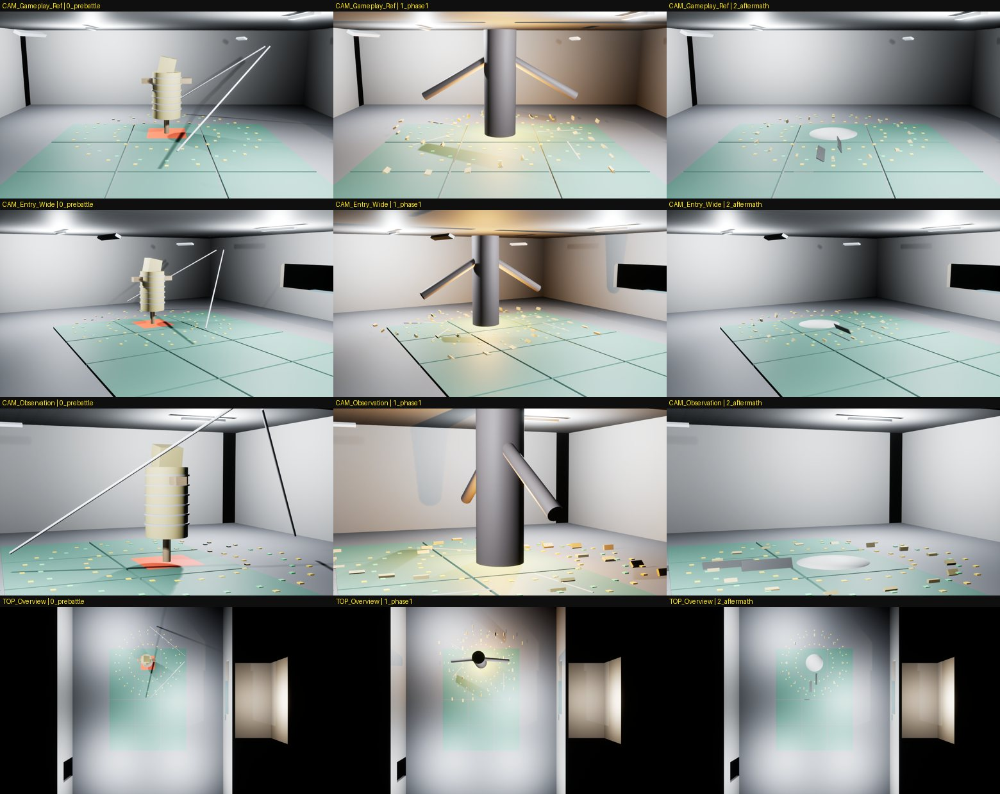
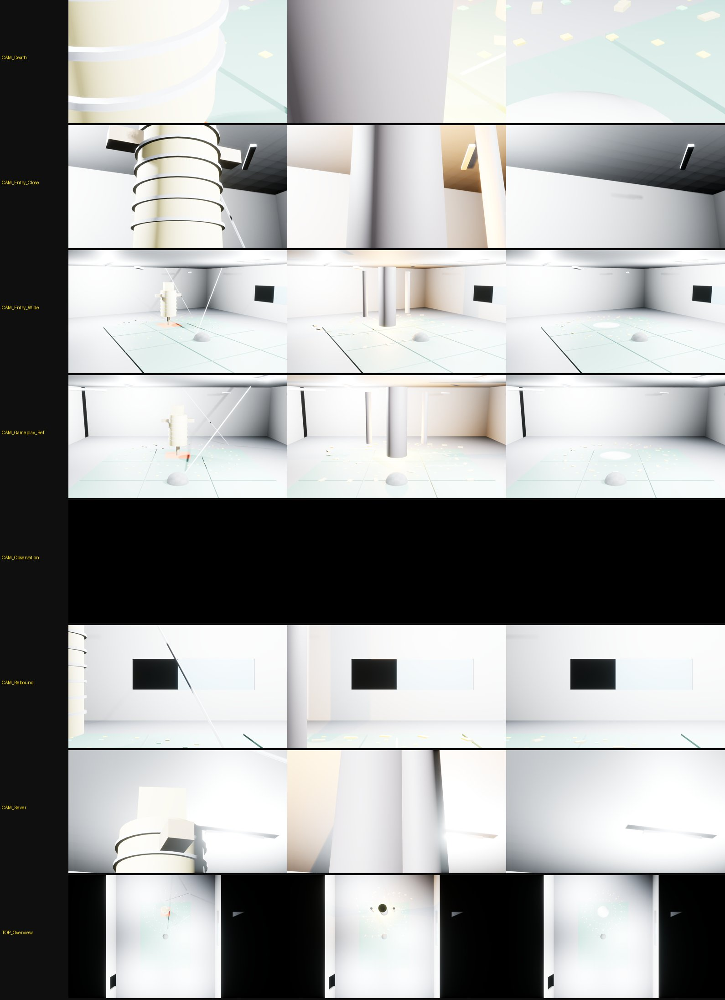

# 136 — EP01 첫 보스 아레나: 지하 훈련장 그레이박스 · Phase Data Layers · Sequencer · 무료 에셋 매핑 (2026-09-28)

지침: `docs/design/132-story-boss-dungeon-pipeline-v1.md`(디렉터), `133-dungeon-free-samples-youtube-v1.md`.
보스 스펙: `docs/dungeons/boss_training_heosuabi_DUNGEON_SPEC.md`. 원문: `docs/story/source/황혼_1부_소설판_제01화_마감본.txt`.

> `HWANGHON_DUNGEON_RESEARCH_IMPLEMENTATION_V1.zip` 본체는 받지 못했다(업로드에 sha256·132·133 만 있음 — sha256 `d88dddae…40e1b7`). 동봉 `CLAUDE_STORY_DUNGEON_IMPLEMENTATION_V1.md` 는 디렉터 메시지의 지시 전문을 최상위 지침으로 대신했다. zip 이 오면 대조한다.

## 0. 결론

| 항목 | 결과 |
|---|---|
| 맵 | `/Game/Hwanghon/Story/EP01/EP01_TrainingRoom_World` — World Partition. `Scripts/ue_ep01_arena_graybox.py` 가 매번 새로 짓는다(Content 는 커밋하지 않음) |
| 공간(원문) | 낮은 천장 3.2 m(L381 «대검을 세우면 끝이 닿는다»), 낡은 매트 4×3, 형광등 6(둘은 깨져 매달림), 관측창 + 마태오 부스(L457), 철사슬 여섯 바퀴 짚단(L11·L373), 발밑 문양 |
| 치수(원문 없음, TBD_CANON 설계값) | 방 16×12 m, 보스 위치 방 중앙에서 +3 m, 문(남쪽) — 사무소·훈련장 공간 관계는 원문 미서술 |
| 직접 배치(132: 절차 생성 금지) | `GP_BossSpawn`, `GP_AinStart`, `GP_KainStart_HalfStepBehind`(L107 반보 뒤), `GP_MateoWindow`, 보스 둘레 링 3 개 — 너무 붙음 1.5 m / 낫 띠 바깥 2.3 m / 회전 도달 2.6 m(원문 «낫은 원이다» L499-L501) |
| Data Layers (런타임) | Base 115 · Story_PreBattle 13 · Phase1 36 · **Phase2_Damaged 0 · Phase3_Critical 0**(원문에 이 보스의 아레나 변화 없음 — 이유 없는 변화 금지) · Aftermath 20 · Cinematic 7 카메라 |
| Sequencer (같은 월드) | `LS_EP01_SC015_BossEntry` 8 s(컷 4, 원문 줄 마커 6, 폭발 프레임에 PreBattle→Phase1 레이어 전환) · `LS_EP01_SC016_SC017_Rebound` 4 s · `LS_EP01_SC018_Sever` 3 s · `LS_EP01_SC019_BossDeath` 6 s(Phase1→Aftermath) |
| Chaos | 쓰지 않았다 — EP01 원문에서 **파괴되는 구조물이 없다**(허수아비는 몸이 터지는 것, 구조물 아님) |
| PCG | 쓰지 않았다 — 그레이박스 단계. 마지막 단계(132 §9)에서 짚·먼지 set dressing 만 |
| 검수 모드 | `-HWQA=arenashow` — 레이어 상태 3 개 × 시네 카메라 7 + 조감 1 = 24 장 |

## 1. 찍고 고친 것

| 회차 | 본 것 | 고친 것 |
|---|---|---|
| 1 | 전부 하얗게 날아감(자동 노출 + 밝은 조명), 보스 팔·떨어진 형광등이 기울지 않음, 관측창 카메라 새까맣게, 모든 상태에 흰 반구 | 고정 노출 포스트프로세스(Base 레이어), 조명 세기 낮춤 / 파이썬 `Rotator` 위치 인자는 (roll, pitch, yaw) — 키워드로 넘김 / 창은 뚫린 개구부 + 부스 조명 / 흰 반구 = 기본 게임 모드의 DefaultPawn → 검수 모드에서 모든 폰 숨김 |
| 2 | 레이어 전환 정상. 1 페이즈의 3 m 강선체가 천장(3.2 m)에 거의 닿는다 | — (원문 «키 3 m» + «낮은 천장» 이 만드는 압박 그대로) |

## 2. 첫 환경 QA (132 §첫 번째 환경 QA)

| 항목 | 판정 |
|---|---|
| 플레이어·보스 실루엣이 배경에서 분리 | PASS — 어두운 보스 / 밝은 벽·매트 |
| 보스 charge lane | 해당 없음(원문 패턴은 회전·팔꿈치). 회전 도달 링으로 대신 검증 |
| 모든 Phase 에서 이동 공간 | PASS — 보스 둘레 2.6 m 밖으로 방 끝까지 4~5 m |
| 카메라가 벽을 과도하게 뚫지 않음 | **주의** — 천장 3.2 m. 3 인칭 카메라 높이 상한이 필요하다(원문 조건) |
| boss/part lock-on 가림 | PASS — 기둥·가구 없음 |
| Story Entry / Death 카메라 위치 | PASS — `CAM_Entry_*`, `CAM_Observation`, `CAM_Death` |
| Phase 뒤 nav/arena collision | PASS — 파편은 낮은 판, 가루 더미 높이 25 cm |

## 3. 무료 에셋 매핑 (부품·기법 창고 — 완성 맵 복사 금지)

확보: Derelict Corridor · Dark Ruins 는 Fab 라이브러리에 추가함(디렉터 계정, 프로젝트 설치는 Epic 런처). Electric Dreams · Valley of the Ancient · Content Examples 는 Epic 샘플 프로젝트 — 런처에서 별도 프로젝트로 받아 **필요한 메시·머티리얼·기법만** 옮긴다.

| 보스 아레나(원문) | 주 창고 | 가져올 것 | Chaos(원문에서 실제로 부서지는 것만) | Data Layer 근거 |
|---|---|---|---|---|
| EP01 지하 훈련장 | Derelict Corridor | 콘크리트 벽, 배관, 케이블, 형광등 기구, 노후 표면 | 없음 | 폭발 전/후/가루 |
| EP02–03 강남역 지하상가 광장 → 2호선 침수 선로 | Derelict Corridor · Electric Dreams(웅덩이·유체) | 지하상가 타일·셔터, 침수 물 표면 | 셔터(클레이브 방패), 기둥 절단(EP03) | 광장 → 선로 추락 |
| EP04 남산 케이블카 승강장·전망대 / EP17 골짜기 | Dark Ruins(대형 구도·조명) · Valley of the Ancient(골짜기) | 높이·원경 구도, 바위 | 원문 확인 후(TBD) | 조우(후퇴) / 격파 |
| EP06–07 여의도 금융가 빌딩 협곡(안개) | Dark Ruins · Electric Dreams(PCG 잔해) | 스케일 대비, 안개 조명 | 원문 확인 후(TBD) | 다리 절단 전/후 |
| EP08–09 한강 침수 터널·수문 | Derelict Corridor · Electric Dreams(유체) | 터널 배관, 수면 | 수문 낙하는 파괴가 아니라 장치 동작(애니) | 수문 1 / 수문 2 / 봉쇄 |
| EP14–15 판교 연구단지 지하·로비 | Derelict Corridor | 연구소·계단·시약 창고 | 원문 확인 후(TBD) | 재생 / 분열 / 격파 |
| EP16–17 물류창고 앞마당 · 골짜기 | Dark Ruins · Valley of the Ancient · Electric Dreams(식생 PCG) | 창고 외벽, 골짜기 지형 | 원문 확인 후(TBD) | 무음의 전장 |
| EP21–22 계룡 주 격납고 | Derelict Corridor + Dark Ruins(스케일) | 격납고 구조, 장갑차 잔해 | 부포탑(원문: 급탄로 절단·파괴) | 진입 실패 / 관절 / 과부하 |
| EP22–23 소독약 복도 · 각인 표본 보관실(원형 홀) | Derelict Corridor | 복도, 표본 선반 | 원문 확인 후(TBD) | 소개 / 결착 |
| EP25–26 고흥 발사장 도로·활주로 | Electric Dreams(대형 외부·PCG) · Dark Ruins(조명) | 활주로, 의장대 사열 공간 | 원문 확인 후(TBD) | 지휘 / 같은 원 / 외운 원 |
| EP27 발사대 아래 지하(결정의 산) | Dark Ruins · Valley of the Ancient(코어 보스 구성) | 동굴, 결정 | 원문 확인 후(TBD) | 코어 소등 순서 |
| EP28 발사대 탑(증폭기) | Content Examples(Chaos 필드) | Geometry Collection, Anchor/Master Field | **탑 전체**(원문: 주각 응력점 → 바다 쪽으로 넘어감) — 132 원칙대로 큰 붕괴는 Cache/Sequencer | 노래 / 주각 / 붕괴 |

- «원문 확인 후(TBD)»: 각 화의 `_scenes/EPxx.json` 보스 항목 `EnvironmentInBattle` 을 읽고 파괴 여부를 확정한다. 원문에 없으면 파괴를 넣지 않는다.

## 4. 게임·애니 공용

- 한 월드(`EP01_TrainingRoom_World`)를 게임과 영상이 같이 쓴다. 차이는 Sequencer 와 `DL_Cinematic` 카메라뿐이다.
- 시퀀스 마커 라벨은 원문 줄 번호(L417 …)다 — 연출이 원문에서 벗어나면 마커로 바로 보인다.

## 5. 남은 것

1. 보스 몸: 허수아비 턴어라운드(`docs/story/source/design/bosses/turnaround/training_heosuabi.jpg`)로 모델·리그 — 지금은 원기둥 대역.
2. 보스 AI: 원문 패턴(회전 + 숨 예고, 근접 팔꿈치)만. 기존 UE 훈련 보스 패턴(Hook/Charge/Slam/GroundWave)은 이 보스 캐논이 아니다.
3. 카인 동료(1P AI / 2P) 결정 — EP01 계획 §3.1.
4. 3 인칭 카메라 천장 상한.
5. Derelict Corridor 등 설치(런처) 후 그레이박스를 메시로 교체.
