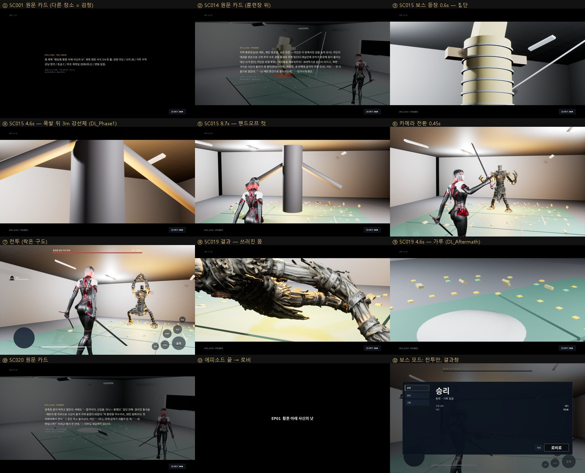
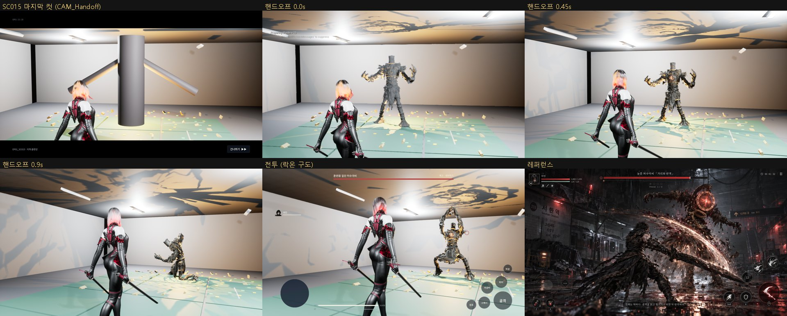

# 137 — 스토리 모드: 애니메이션 → 카메라 전환 → 보스전, 전투 구도, 보스 모드 (2026-09-28)

## 0. 디렉터 지시 (2026-09-28)

- 스토리 모드로 시작한다.
- 허수아비를 만날 때까지는 만화영화(애니메이션)로 스토리가 진행된다. 구간마다 건너뛸 수 있다.
- 애니메이션 구간은 1인칭이 아니다. 시네마이기 때문이다.
- 보스를 만나면 카메라 시점이 자연스럽게 바뀌며 보스를 상대한다.
- 전투 구도는 레퍼런스 이미지 그대로다(«이 구도지»). 아래 §3.
- 스토리 모드 밖의 보스전에서는 애니메이션이 나오지 않는다.
- 필요한 플러그인·샘플은 직접 받는다. 아래 §6.

> «1인칭» 과 레퍼런스: 레퍼런스는 아인의 등 뒤에서 몸이 크게 보이는 어깨 너머 시점이다. 기술 용어로는 근접 3인칭이다. **레퍼런스 이미지를 기준으로 구현했다.** 몸이 안 보이는 진짜 1인칭을 뜻했다면 카메라 값만 바꾸면 된다(§3 표).

## 1. 결론

| 항목 | 결과 |
|---|---|
| 게임 시작 | `GameDefaultMap` = `EP01_TrainingRoom_World`. 월드 기본 게임 모드 = `AHWStoryGameMode` |
| 에피소드 흐름 | `AHWStoryDirector` 가 `Content/Data/novel_game_master.json` 의 EP01 장면 22 개를 소설 순서대로 20 구간으로 편성한다(BOSS_BATTLE 3 장면 SC016–SC018 은 전투 한 구간) |
| 애니메이션 구간 | `LS_<SceneId>_*` 시퀀스가 있으면 재생한다(지금은 SC015 등장, SC019 결과). 없으면 **원문 장면 카드**를 띄운다: 장면 ID · 장소 · 원문 요약 · 원문 줄. 다른 장소는 검정, 훈련장은 방 위에 반투명. 레터박스, 구간별 건너뛰기(버튼 / Space / Enter / Esc / 패드 B / 안드로이드 뒤로) |
| 보스 진입 | SC015 마지막 컷(`CAM_Handoff`, 아인 등 뒤)에서 멈춘 화면을 그대로 잡고, 1.4 s 큐빅 블렌드로 아인 뒤 전투 카메라로 넘어간다. 컷 없음. 그 순간 3 m 강선체 대역이 실제 보스로 바뀌고 락온이 걸린다 |
| 전투 | 기존 전투 HUD(보스 이름 = 원문 «훈련용 짚단 허수아비»). 결과창은 띄우지 않는다 — 다음은 스토리가 정한다 |
| 보스 격파 | 1.8 s 뒤 SC019 결과 시퀀스 → SC020–SC022 카드 → «EP01 황혼 아래 사신의 낫» → 6 s 뒤 로비(`HW_Frontend`) |
| 아인 사망 | 2.5 s 뒤 **전투부터 다시**(`?HWStoryStart=Battle`). 앞 애니메이션은 다시 틀지 않는다 |
| 보스 모드 | `?HWStory=0`: 같은 월드, 애니메이션 없이 전투부터. 결과창(다시/로비로). «다시» 가 `HWStory=0` 을 유지한다 |
| 전투 구도 | 레퍼런스 대비 실측(§3): 아인 머리 x 0.46 (레퍼런스 0.43), 보스 x 0.72 (0.69) |
| 테스트 | UE Automation 30/30, npm test 634/634, 스토리 전체·보스 모드·사망 후 재도전 QA 3 회 모두 ok |



## 2. 구조

```
EP01_TrainingRoom_World (World Partition, 게임과 애니 공용 한 월드)
 └ AHWStoryGameMode ── 폰 = 아인 (소설의 주인공), HUD = AHWStoryHUD (전투 HUD + 스토리 레이어)
     └ AHWStoryDirector
         구간 = novel_game_master.json 의 EP01 장면 (소설 순서)
         Cinematic: LS_<SceneId>_* 재생 (bPauseAtEnd) 또는 원문 카드
         BossBattle: 보스 스폰 (GP_BossSpawn), 대역(HW_BossStandIn) 숨김, 락온, 조작 켬
         Data Layer 상태: 등장 전 PreBattle → 등장 끝 Phase1 → 결과 끝 Aftermath
                           (시퀀스의 레이어 트랙과 같은 전환을, 건너뛰어도 맞도록 구간 경계에서 다시 건다)
```

- 새 장면 애니메이션을 만들면 `/Game/Hwanghon/Story/EP01/Sequences/LS_EP01_SC004_옥상` 처럼 이름만 맞추면 된다. 카드가 자동으로 그 시퀀스로 바뀐다.
- 시퀀스는 이름으로 찾으므로 아무 것도 참조하지 않는다. 그래서 `DefaultGame.ini` 에서 `/Game/Hwanghon/Story` 를 항상 쿡하게 했다.
- 원문 JSON 은 이미 `Data` 스테이징 대상이다.

## 3. 전투 카메라 — 레퍼런스 구도

레퍼런스를 재서 역산했다.

| | 아인 머리 x, y | 보스 x |
|---|---|---|
| 레퍼런스 | 0.43, 0.35 | 0.69 |
| 이전 카메라 (팔 420, 오프셋 65/70, FOV 52) | — | 아인 뒤에 겹침 |
| 1 차 (팔 240, 오프셋 55, FOV 70) | 0.37, 0.33 | 0.45 — 여전히 겹침 |
| 2 차 yaw +27° | −0.50 — 화면 밖 | −0.03 (부호 반대) |
| **최종 락온** (팔 200, 오프셋 Y 128 · Z 25, 카메라 yaw −27°, FOV 70) | **0.46, 0.29** | **0.72** |

- 구도: 아인을 오른쪽 어깨 뒤 3/4 방향에서 크게 잡고, 대상은 오른쪽 1/3 에 둔다.
- 락온일 때만 이 구도를 쓴다(`LockFraming` 블렌드, 속도 4). 이 구도는 카메라가 «앞» 과 27° 어긋난다. 락온 없이 쓰면 앞으로 걸어도 비스듬히 가는 것처럼 보인다.
- 락온이 없으면 평범한 어깨 너머 시점이다(팔 240, 오프셋 55/30).
- 값은 `AHWAinCharacter` 의 `Locked*` / `Free*` 프로퍼티에 있다. 모든 캐릭터·모든 전투에 같다.



## 4. 찍고 고친 것

| 본 것 | 원인 | 고친 것 |
|---|---|---|
| 스크린샷에 레터박스·카드가 없다 | 캡처가 UI 를 빼고 찍었다 | `Shot(name, bShowUI)` — 스토리 검수는 UI 포함 |
| SC015 4.6 s 에 3 m 강선체가 없다. 짚단은 사라졌다 | 레이어 트랙 한 줄에 «Phase1 활성» 과 «PreBattle 해제» 두 섹션이 90..285 로 겹쳤다. 한 행의 겹친 섹션은 하나만 평가되어 활성이 묻혔다(doc 136 시퀀스도 같았다) | 상태마다 트랙을 따로 만든다 → 강선체 나옴 |
| 결과 컷이 천장만 비춘다 | 컷이 서 있는 3 m 대역을 겨눴는데, 전투 뒤에는 실제 보스가 바닥에 누워 있다 | `CAM_Result_Low` 추가. 결과 시작 때 몸을 스폰 지점에 둔다 |
| 천장에 보스 그림자가 크게 번진다 | 바닥 가까운 `P1_EmberGlow` 가 그림자를 던진다 | 그 조명의 그림자를 끔 |
| 전투 구도에서 아인이 화면 밖으로 나간다 | 카메라 yaw 부호가 반대였다 | −27° |
| 보스 모드 «다시» 가 스토리 처음으로 간다 | 시작 맵이 스토리 모드가 됐는데 재시작이 옵션을 버린다 | `HWStory` 옵션만 유지한다. 퀘스트 런 ID 는 끝난 런에 다시 붙지 않도록 버린다 |

## 5. 원문 대조 (TBD_CANON)

| 항목 | 원문 | 레퍼런스 이미지 | 처리 |
|---|---|---|---|
| 장소 | 지하 훈련장(낮은 천장, 매트, 관측창). 마감본 L379–L460 | 서한역 승강장·전동차 | **원문을 따른다.** 이미지는 구도만 가져왔다 |
| 보스 이름 | 훈련용 짚단 허수아비 | «눈뜬 허수아비 「거리와 반격」» | HUD 는 원문 이름. «눈뜬»·부제는 TBD_CANON |
| 페이즈 | 이 보스의 아레나에는 원문상 변화가 없다(doc 136) | PHASE 1/3 | 패턴 페이즈는 가능하다. 환경 레이어는 여전히 비운다 — TBD_CANON |
| 카인 | 전투에 함께 있다(반보 뒤, 되돌림 SC017) | 없음 | 아직 없다. 1P AI / 2P 결정 대기(EP01 계획 §3.1) |

- 보스 몸과 패턴은 아직 웹 훈련 보스 대역이다. 원문 패턴(숨 예고 회전, 근접 팔꿈치)은 다음 작업이다.
- 원문 카드는 애니메이션이 만들어지기 전의 자리표시다. 순서와 문장은 원문 그대로이고, 장면을 지어내지 않는다.
- SC001 처럼 장소가 원문에 없는 장면은 카드에 `TBD_CANON` 이 그대로 보인다.

## 6. 플러그인·샘플

- **이번 구현**: 엔진 모듈 `LevelSequence` · `MovieScene` 만 썼다(엔진 기본, 받을 것 없음).
- **다음에 켤 것**(엔진 기본 플러그인, 다운로드 없음):
  - PCG — set dressing 단계
  - Chaos / GeometryCollection — EP03 기둥, EP28 탑
  - Movie Render Queue — 애니메이션 에피소드 렌더
- **Fab 샘플**:
  - Derelict Corridor · Dark Ruins 는 Fab 라이브러리에 있다(«Saved in My Library»).
  - 페이지에는 «View in Launcher» 뿐이다. UE 형식이라 브라우저로 받을 파일이 없다.
  - 설치(프로젝트 생성/추가)는 Epic 런처 창에서 버튼을 눌러야 한다. 제게는 런처 창을 누를 도구가 없다.
  - 런처에서 받아 두면 필요한 메시·머티리얼만 이 프로젝트로 옮긴다.
- **Epic 샘플**: Electric Dreams · Valley of the Ancient · Content Examples 는 런처 «샘플» 탭에서 받는다.
- **감사 도구**: 병합한 `tools/ue/run-dungeon-research-audit.ps1` 를 돌렸다.
  - 후보 260 행(대부분 기존 나이아가라). 샘플 출처 행은 0 건 — 아직 설치된 샘플이 없다.
  - 샘플을 설치한 뒤 다시 돌린다.

## 7. 검수

```
# 스토리 전체 (카드 1.6 s 로 단축, 보스는 QA 가 4 s 뒤 처치)
UnrealEditor.exe HwanghonCombatUE.uproject /Game/Hwanghon/Story/EP01/EP01_TrainingRoom_World -game -windowed -ResX=1280 -ResY=720 -HWQA=storyshow -HWQAShots=<dir>
# 보스 모드
... EP01_TrainingRoom_World?HWStory=0 ... -HWQA=storyshow
# 사망 → 전투부터 재도전
... EP01_TrainingRoom_World?HWStoryStart=EP01_SC015 ... -HWQA=storyshow -HWQAStoryDie
```

- 샷마다 로그에 카메라 위치·FOV 와 아인 머리/골반·보스의 화면 좌표를 남긴다. §3 표가 그 값이다.
- `-HWQA=arenashow`(doc 136)에서는 연출 액터가 꺼진다.

## 8. 파일

- 신규:
  - `Public|Private/Game/HWStoryDirector.*`
  - `Public|Private/Game/HWStoryGameMode.*`
  - `Public/UI/HWStoryHUD.h`, `Private/UI/HWStoryHUD.cpp`
- 수정:
  - `HWAinCharacter`: 락온 구도
  - `HWCombatHUD`: 스토리가 결과를 가진다, 보스 이름
  - `HWOverlayWidgets`: 다시 = 같은 모드
  - `HWSystemQASubsystem`: `storyshow`, UI 포함 샷
  - `Build.cs`: `LevelSequence`, `MovieScene`
- 스크립트: `Scripts/ue_ep01_arena_graybox.py`
  - 대역 태그
  - `CAM_Handoff` · `CAM_Result_Low`
  - SC015 9.5 s(+핸드오프 컷, L459–L461)
  - 레이어 트랙 분리
  - 월드 게임 모드
- 설정:
  - `DefaultEngine.ini`: `GameDefaultMap`
  - `DefaultGame.ini`: `/Game/Hwanghon/Story` 쿡
- 병합: `HWANGHON_DUNGEON_RESEARCH_IMPLEMENTATION_V1.zip`(sha256 `d88dddae…40e1b7` 일치). `scripts/verify_dungeon_research.py` PASS, 테스트 6/6.
