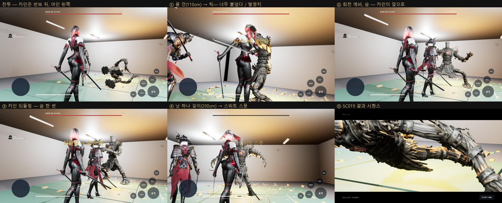

# 138 — EP01 허수아비 전투를 원문대로: 회전·팔꿈치, 낫의 띠, 카인의 되돌림, 끊기 (2026-09-28)

원문: `docs/story/source/황혼_1부_소설판_제01화_마감본.txt` L461–L566.
명세: `docs/dungeons/boss_training_heosuabi_DUNGEON_SPEC.md`.

## 0. 결론

EP01 보스는 이제 원문의 규칙으로만 싸운다. 스토리 모드와 보스 모드가 같다.

| 원문 | 게임 규칙 | 코드 |
|---|---|---|
| L463–L469 양팔을 벌리고 어깨가 감기고 허리가 비틀리고 발이 자리 잡음 → **숨이 들어갔다** → 반 박자 | **회전**: 예고 1.3 s(마지막이 숨), 3 타, 도달 2.6 m | `UHWHeosuabiRules::Spin()` |
| L477–L489 품 안까지 파고들자 자루가 걸려 «틱—» 튕김, **되돌아온 것은 팔꿈치** | 1.5 m 안쪽 공격은 **피해 0**, «틱— 너무 붙었다». 곧바로 **팔꿈치**(예고 0.28 s, 넘어뜨림). 1.5 m 안쪽에 서 있어도 팔꿈치 | `FilterPlayerHit` → `StartCanonPattern(Elbow)` |
| L497–L501 «낫은 원이다. 너무 멀면 닿지 않고, 너무 가까우면 돌지 않는다» | 아인 공격은 **1.5–2.4 m 띠**에서만 든다. 2.4 m 밖은 «닿지 않는다» | `Classify` |
| L511–L529 카인이 대검을 수직으로 꽂아 받아 **되돌림** → 자세 붕괴, «길어야 숨 한 번» | 회전 첫 타 때 카인이 보스 앞(아인 쪽, 2.6 m 안)에 있으면 **되돌림**: 회전 취소, **Break 2.0 s**. 다른 방법으로는 Break 하지 않는다 | `InterceptBeat` |
| L533–L563 «딱 낫 하나 길이» → 원의 가장 바깥이 이음매에 → «스위트 스폿!» → 관절 | Break 안에서 **띠 안의 공격 한 번 = 절단**(즉시 사망 → SC019). 띠 안이라도 Break 밖의 타격은 체력만 깎고 **끝내지 못한다** — «죽이는 게 아니다. 끊는 것이다» | `FilterPlayerHit` |
| 멀리 있으면 | 4.2 m 밖이면 걸어서 다가온다. 패턴은 회전과 팔꿈치뿐 | `TickComponent` |

- 이 규칙은 EP01 보스에게만 붙는다(`UHWBossCanonRules` 컴포넌트).
- 웹 훈련 보스(Seohan)와 레이드 보스의 동작은 그대로다. 보스 쪽 변경은 훅 세 개(패턴 선택·피격 판정·비트 가로채기)뿐이고, 규칙이 없으면 예전 경로를 탄다.
- 다음 보스(클레이브 …)도 같은 부모 클래스로 원문 규칙을 붙인다.

## 1. 카인 — 1P 에서 AI

원문의 되돌림은 카인이 한다. 이게 없으면 Break 가 열리지 않는다. 그래서 명세의 제안(1P = AI 동료, 2P = P2)대로 **1P 에서 카인을 AI 로 넣었다.**

- 평소에는 아인의 반보 뒤(L107)에 서 있다. 카메라가 아인 오른쪽 어깨 위라서 카인은 **왼쪽**에 둔다.
- 회전 예고(숨)가 보이면 보스 앞, 아인 쪽 1.75 m 로 뛰어든다(«비켜!» L509). 거기서 되돌린다.
- Break 동안에는 옆으로 비켜서 아인의 선을 연다.
- 보스는 아인만 노린다(카인은 위협 대상에서 뺐다). 원문의 싸움은 아인의 것이다.
- 2P 로 카인을 조작하는 경우는 아직 없다(온라인 레이드 구조가 필요 — 디렉터 결정 뒤).

## 2. 검증

- **UE 자동 테스트**: 33/33 통과. 새 테스트 3 개는 다음을 확인한다.
  - `Hwanghon.Canon.Heosuabi.Band`: 띠 경계(110 / 150 / 200 / 250 cm), 거리별 패턴, 숨 예고 길이.
  - `…OnlyTheSeverEndsIt`: 너무 가까우면 피해 0 + 팔꿈치, 너무 멀면 0, 띠 안 1천만 피해도 죽지 않음, Break 안 너무 가까우면 여전히 튕김, Break 안 띠 = 사망. **대조군**: 규칙이 없는 같은 보스는 같은 타격에 죽는다.
  - `…KainRebound`: 카인이 보스 뒤 / 회전 밖이면 실패, 앞(아인 쪽)이면 되돌림 + Break.
- **일부러 깨 보기**(CLAUDE.md §4): 띠 바깥 240 → 400 으로 바꾸면 `Band` 와 `OnlyTheSeverEndsIt` 가 실패한다. 되돌려 놓았다.
- **실제 입력 검수**(`-HWQA=storyshow`, 스토리·보스 모드 둘 다 ok): 실제 공격 입력으로 원문 흐름을 따라간다.
  1. 110 cm 공격 → `deflect` + `elbow`
  2. 330 cm 에서 회전 → 카인 `rebound`, 보스 Break
  3. 200 cm 공격 → `sever` → 사망 → SC019 → 에피소드 끝
  - 한 단계라도 안 일어나면 실패로 끝난다.
  - QA 가 끼어들기 전에도 보스가 걸어와 회전했고, 카인이 스스로 되돌렸다.

## 3. 찍고 고친 것

| 본 것 | 원인 | 고친 것 |
|---|---|---|
| 전투 화면이 아인 등 클로즈업으로 가득하다 | 반보 뒤 카인의 캡슐에 카메라 팔이 부딪혀 줄어들었다 | 캐릭터·보스 캡슐과 메시가 카메라 채널을 무시한다(모든 전투) |
| 카인이 화면 앞을 가린다 | 반보 뒤 자리가 카메라와 같은 쪽(오른쪽 뒤)이었다 | 왼쪽 뒤. Break 때는 옆으로 비킨다 |

## 4. 남은 것 (TBD)

- **몸·애니**:
  - 팔꿈치 전용 클립이 없어 짧은 오른 훅이 대역이다.
  - 회전 예고에 «숨» 모션(어깨 감기·허리 비틀림·발 고정)이 따로 없다. 기존 회전 클립의 예비 동작을 쓴다.
  - 보스 몸은 웹 훈련 보스 대역이다. 3 m 강선체 모델은 디자인 시트로 제작해야 한다.
  - 카인의 «대검 수직 꽂기» 도 기존 카운터 모션이다.
- **절단 연출**: 원문은 슬로(«세상이 늘어졌다»)와 결정 드롭이다. 지금은 판정과 콜아웃(«스위트 스폿»)뿐이고, 결정 회수는 SC019 시퀀스가 맡는다.
- **체력 바**: 원문에 체력이 없다. 바는 남겨 두되 절단으로만 끝난다. 표시 방식(숨기기 / 자세 게이지로)은 디렉터 결정.
- **2P 카인**: 온라인 구조 필요.
- **아인 자신의 되돌림**: 원문상 아인은 되돌리지 못한다. 지금 아인의 카운터 입력은 이 보스의 회전에 효과가 없다(회전은 일반 카운터 불가).
