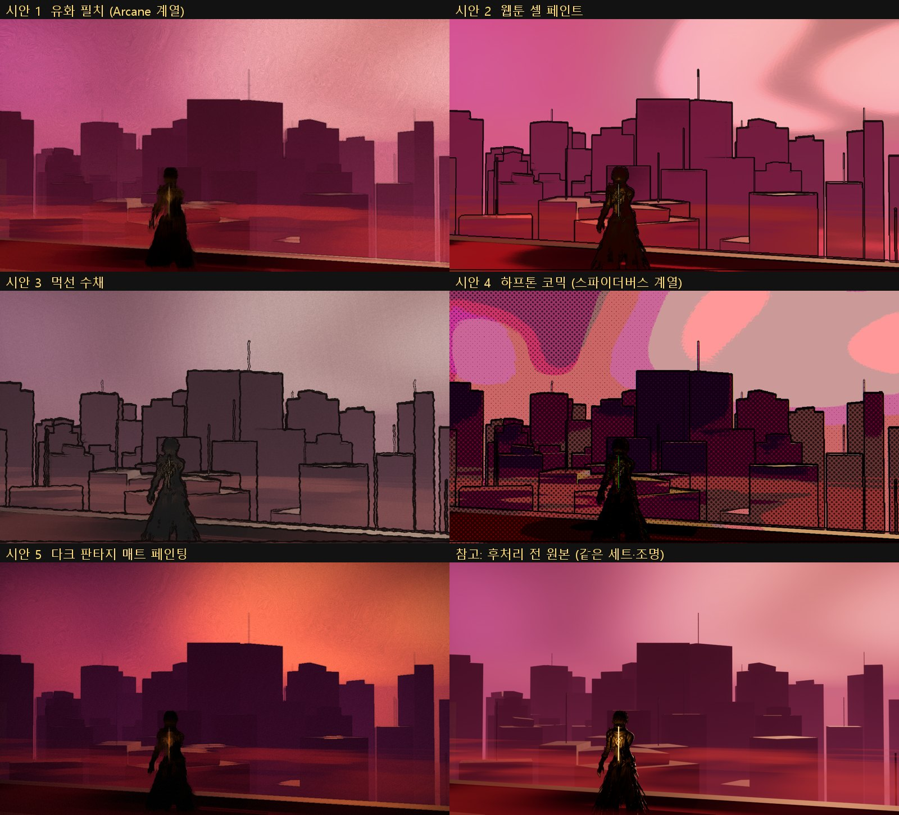

# 139 — 애니메이션 화풍 시안: EP01 SC004 옥상, 회화풍 5종 (2026-09-28)

디렉터 결정(2026-09-28):
- 게임 요소를 빼고 애니메이션을 먼저 에피소드별로 만든다.
- 화풍은 **C(회화풍 스타일라이즈드)** 로 한다.
- 영상 전에 시안 이미지를 보고 고른다.



## 장면 (원문 L51–L70)

- 보라와 핏빛의 황혼.
- 강남 폐빌딩 옥상, 무릎 높이 붉은 안개.
- 아인의 등 스파인 코어(주황 선).
- 옥상 배치·주변 도시는 원문에 없는 설계값(TBD_CANON)이다.

## 시안

모두 언리얼 실시간 렌더다. 같은 세트·조명에 후처리 머티리얼 하나씩만 바꿨다.

| 시안 | 내용 | 기법 |
|---|---|---|
| 1 유화 필치 | Arcane 계열. 붓 결이 보이는 면 | Kuwahara + 방향장 붓 결 |
| 2 웹툰 셀 페인트 | 명암 3–4 단, 깔끔한 선 | 밴드 조명 + 깊이/밝기 윤곽선 |
| 3 먹선 수채 | 흔들리는 먹선, 바랜 색, 종이 결 | 채도 낮춤 + 선 떨림 + 종이 노이즈 |
| 4 하프톤 코믹 | 스파이더버스 계열. 망점, 판 어긋남 | 5 단 포스터 + 45° 망점 + 색수차 |
| 5 다크 매트 페인팅 | 보라 그림자 / 불씨 하이라이트, 비네트 | Kuwahara + 붓 결 + 색보정 |

## 한계 (시안이 보여 주는 것과 아닌 것)

- **화풍의 방향만 보여 준다.**
  - 세트는 박스 블록아웃이다. 도시에 창문·잔해·간판이 없다.
  - 아인은 게임용 대역 모델이다.
  - 원문은 **잿빛으로 바랜 단발**인데 모델은 검은 머리다.
- 고른 뒤 할 일:
  - 그 방향의 셰이더를 다듬는다.
  - 텍스처는 손그림 느낌으로 만든다.
  - 세트를 제작한다(Fab 샘플·한국 소품).
  - 캐릭터를 시트대로 만든다.
- 외부 이미지 생성은 쓰지 않았다(크레딧 0). 모든 컷은 우리가 실제로 뽑을 수 있는 것이다.

## 재현

```
UnrealEditor-Cmd HwanghonCombatUE.uproject -ExecutePythonScript="Scripts/ue_style_frames_sc004.py" -unattended -nullrhi
UnrealEditor HwanghonCombatUE.uproject /Game/Hwanghon/Story/EP01/Style/EP01_SC004_StyleFrames -game -windowed -ResX=1920 -ResY=1080 -HWQA=styleshow -HWQAShots=<dir>
```

## 찍고 고친 것 (7 회)

- **1 차**: 가까운 빌딩이 화면을 막았고, 아인이 옆을 보며 금색으로 빛났다. 안개는 평평한 주황 바닥이었다.
- **2–3 차**: 맵 삭제 후 재생성이 조용히 실패했다(«already exists»). 새 액터가 다른 레벨로 갔다. 이제는 기존 맵을 비우고 다시 짓는다.
- **4 차**: 높이 안개가 하늘까지 씻어 냈다. 하늘을 `is_sky` 로 뺐다.
- **5 차**: 스파인 코어 조명이 20 cm 거리 4 cd(≈100 lux)라 온몸이 금색이었다. 발광 선 + 0.25 cd 로 바꿨다.
- **6–7 차**: 하늘을 보라·핏빛으로 어둡게 했다. 아인을 프레임 안쪽 1/3 로 옮겼다. 붓 결을 방향장으로 바꿨다.
