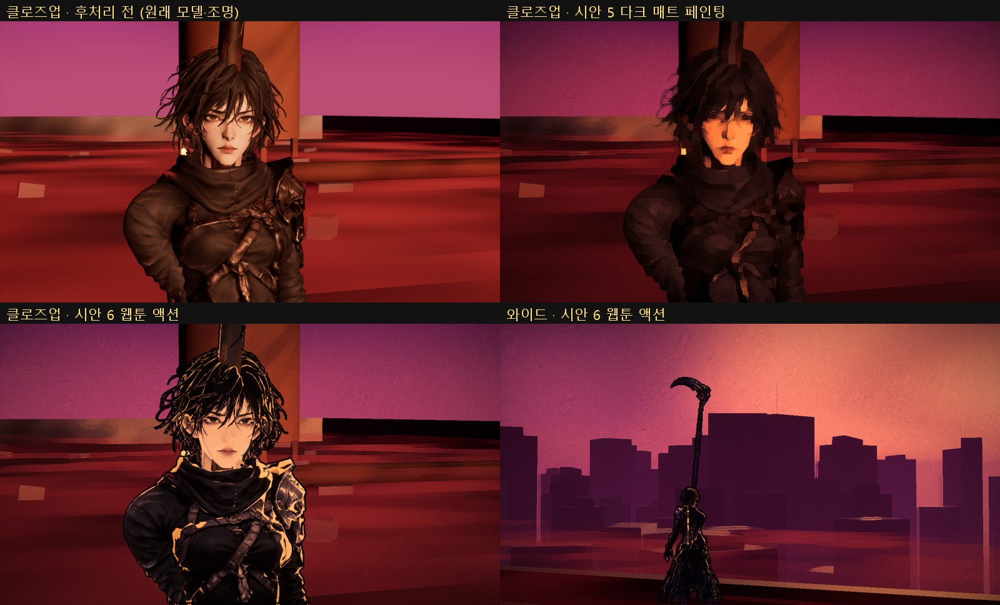

# 140 — 시안 6: 한국 액션 웹툰 룩 테스트 (2026-09-28)

## 배경

- 디렉터 레퍼런스는 웹툰 두 편이다. 파스텔 로맨스 웹툰 포스터와, «별을 품은 소드마스터»(네이버웹툰, 작화 주노) 같은 액션 판타지 계열.
- 조사 결과, 황혼에는 액션 판타지 계열이 맞는다(아래 세 이유). 디렉터가 테스트를 승인했다.
  - 디자인 시트가 이미 날카로운 웹툰 얼굴 + 어두운 갑옷이다.
  - 원문 비주얼(스파인 코어, 낫 끝, 문양, 안광)이 «어두운 배경 + 발광»이다.
  - 언리얼로 된 선례가 있다: 명조: 워더링 웨이브.
- 특정 작가의 캐릭터·그림·구도는 가져오지 않는다. 목표는 «황혼 캐릭터 × 한국 액션 웹툰 룩»이다.

## 구현 (Scripts/ue_style_frames_sc004.py)

| 요소 | 방법 |
|---|---|
| 캐릭터 셀 음영 | `M_Toon_Webtoon` (Unlit). 저녁 해 방향 기준 2 단 명암(경계 0.04), 보라 그림자 `ST`, 주황 하이라이트 `LC`, 딱 끊기는 주황 림 `RC`. 얼굴(`MI_Toon_AinHead`)은 경계를 −0.35 로 내려 대부분 밝은 단에 둔다 |
| 먹 윤곽선 | 후처리(`STYLE_6_WebtoonAction`)가 캐릭터 커스텀 뎁스의 단차에서 선을 긋는다 — 실루엣과 머리 덩어리만 |
| 배경 | 캐릭터 픽셀(커스텀 뎁스)은 그대로 두고, 세계만 Kuwahara + 붓 결 + 다크 매트 색보정 |
| 무기 | 웹 게임의 낫 메시를 `mixamorig_RightHandSlot` 에 붙였다 |
| 검수 | `-HWQA=styleshow`: 카메라 여럿(와이드 + 3/4 정면 클로즈업) × 룩 7. `ONLY_<룩>` / `HIDE_<룩>` 태그로 모델을 바꿔 끼운다 |

## 찍고 고친 것

- **1 차**: 부풀린 메시 외곽선(inverted hull, 오버레이 머티리얼)이 머리카락 카드마다 선을 그려 낙서처럼 됐다.
- **2 차**: 선 굵기 0.55 → 0.3 cm 로 줄였다. 여전히 복잡했다.
- **3 차**: 외곽선을 후처리로 옮겼다. 커스텀 뎁스 단차에서 실루엣과 머리 덩어리만 먹선으로 긋는다.

## 한계와 다음

- **모델**:
  - 웹 게임용 모델이라 텍스처에 조명이 구워져 있다. 셀 음영 위에 사실적 음영이 섞인다.
  - 머리카락이 카드 방식이다.
  - 제대로 하려면 셀 전용 모델이 필요하다(평평한 베이스 컬러, 덩어리 헤어, 얼굴 노멀 편집 또는 SDF 그림자).
- **캐논**: 원문 머리는 잿빛으로 바랜 단발이다. 모델은 검은 머리다.
- **발광 이펙트**: 아직 없다(스파인 코어는 등 쪽이라 정면에서 안 보임, 낫 끝 주황, 불꽃). 다음 테스트에서 넣는다.
- **세트**: 여전히 블록아웃이다.
- **VRM4U**(MIT) 플러그인은 로컬에만 설치했다(`.gitignore`). Seed-san 샘플은 얼굴이 귀여운 애니풍이라 이 방향과 맞지 않아 쓰지 않았다.
