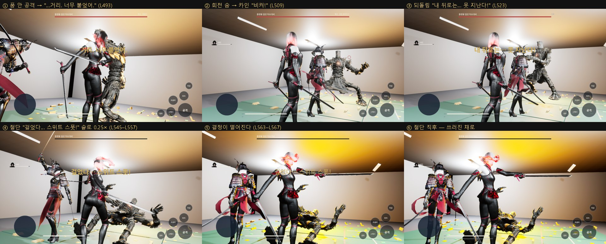

# 141 — EP01 원문 대조 검수 (Canon QA) · 절단 연출 · 원문 대사 (2026-09-28)

기준: `docs/story/source/황혼_1부_소설판_제01화_마감본.txt`.
장면: `docs/story/_scenes/EP01.json` (22 장면). 게임: 스토리 모드(doc 137), 전투 규칙(doc 138).
던전 지침 §10 의 «8. 소설 Canon QA» 에 해당한다.

## 1. 장면별 대조

| 장면 | 원문 | 게임 | 판정 |
|---|---|---|---|
| SC001–SC013 | 계측 서식, 콜드 오픈, 상황보고, 옥상, 회상, 카인, 벙커, 한 장인, 유진, 마태오 | 원문 장면 카드(요약 + 원문 줄) | 순서·내용 원문 그대로. **애니메이션 없음**(보류) |
| SC014 | 훈련장, 카인이 검을 눕혀 듦, 짚단 치기 | 훈련장 위 원문 카드. PreBattle 레이어(사슬 짚단·문양) | 짚단 치기 **플레이 없음** — 원문은 카인이 친다. TBD |
| SC015 | 문양 → «카인! 물러나!» → «…뭐?» → 폭발 → 3 m 강선체 → 이중 음성 → 마태오 | 시퀀스 9.5 s. 컷·원문 줄 마커 7, 폭발에 레이어 전환 | 연출 순서 일치. **대사 자막 없음**, 마태오 모델 없음 |
| SC016 거리 | 양팔 → 회전 준비 → 숨 → «지금—!» → 너무 붙음 → 틱 → 팔꿈치 → «…거리. 너무 붙었어.» | 회전(숨 예고 1.3 s), 1.5 m 안 공격 = 피해 0 + 팔꿈치 + «…거리. 너무 붙었어.» | 일치. «지금—!» 은 없음(플레이어가 뛰어드는 순간이라 강제하지 않음) |
| SC017 되돌림 | «비켜!» → 대검 수직 → 되돌림 → «내 뒤로는… 못 지난다!» → 숨 한 번 | 카인 AI 가 숨에 뛰어듦 «비켜!» → 되돌림 «내 뒤로는… 못 지난다!» → Break 2 s | 일치. 대검 수직 꽂기 모션은 기존 카운터 대역 |
| SC018 끊기 | 뛰지 않음 → 낫 하나 길이 → «이번엔—» → 세상이 늘어짐(채도 폭발) → 원의 바깥 → «걸었다… 스위트 스폿!» → 콰드득 | Break 안 띠(1.5–2.4 m) 공격 = 절단 «걸었다… 스위트 스폿!» → **슬로 0.25× 1.2 s + 채도·프린지** → 사망 | 일치. «이번엔—» 없음 |
| SC019 결과 | 결정이 굴러떨어짐 → 손바닥 → «…또 가루야.» → 회색 가루 | 절단 순간 **주황 결정이 관절에서 떨어짐**(물리, 발광) → 결과 시퀀스 → Aftermath 레이어(가루) | 결정 낙하 일치. 손바닥 받기 모션 없음 |
| SC020–SC022 | 마태오 합격, 장부 «손실», 출격문 | 원문 카드 → 에피소드 끝 → 로비 | 순서 일치. 애니 보류 |

## 2. 원문에 없는 것이 들어갔는가 (금지 항목)

| 확인 | 결과 |
|---|---|
| 잡몹 방 / 엘리트 방 / 목표 방 | 없음. 스토리 → 등장 → 전투 → 결과 → 스토리 |
| 체력 페이즈·아레나 변화 | 없음(Phase2/3 레이어 비움). 체력 바는 남아 있으나 절단으로만 끝난다 |
| 원문에 없는 보스 패턴 | 없음. 회전·팔꿈치만(훈련 보스의 훅·돌진·내려찍기·지면파 미사용) |
| 원문에 없는 대사 | 전투 콜아웃을 원문 대사로 교체했다(이전: «틱— 너무 붙었다», «되돌림 — 숨 한 번» 등 내 문장) |
| 원문 밖 장면 | 없음. 원문에 장소가 없는 SC001 등은 카드에 `TBD_CANON` 이 그대로 보인다 |

## 3. 이번에 넣은 것

- **절단 연출**(L545–L567):
  - 절단 순간 1.2 s(실시간) 동안 전역 시간 0.25×. 채도 1.75, 대비 1.15, 프린지 2.5 가 들어왔다 빠진다.
  - 관절 높이에서 엄지손톱만 한 주황 결정이 떨어진다(물리, 주황 점광원).
- **쓰러진 채로 죽는다**:
  - 절단은 Break(다운) 안에서 들어간다. 그런데 사망 클립이 선 자세에서 다시 시작해 «다시 일어서는» 것처럼 보였다.
  - 이제 다운 클립을 끝까지 이어 재생한다(`HWBossPresentationComponent`).
- **결정 발광**: 엄지손톱 크기라 작다. 주황 빛 웅덩이(12, 반경 2.2 m)로 눈에 띄게 했다.
- **채도**: 1.75 는 밝은 천장을 노랗게 날렸다. 1.45 로 낮췄다.
- **원문 대사 콜아웃**: 너무 붙음 L493, 닿지 않음 L499, «비켜!» L509(카인이 숨에 뛰어드는 순간), 되돌림 L523, 절단 L557.

## 4. 남은 차이 (TBD / 제작)

- SC014 짚단 치기(카인), SC015·SC019 대사 자막, 마태오, «이번엔—», 손바닥 받기.
- 모션:
  - 보스 숨 예고
  - 팔꿈치(지금은 훅 대역)
  - 카인 대검 수직 꽂기
  - 아인 솟구침
- 모델:
  - 3 m 강선체(지금은 웹 훈련 보스)
  - 아인 잿빛 단발(지금은 검은 머리)
- 애니메이션 장면(SC001–SC014, SC020–SC022): 보류(디렉터 2026-09-28).

## 5. 회귀 검수 (보스 훅·카메라 충돌·절단 변경 뒤)

- `node tools/ue/system-core-qa.cjs all`: **ALL GATES PASS**.
  - 로컬 identity 4 · 류 던전 · 선택
  - 1P 전멸·재도전
  - 2P 다운·부활·클리어 보상
  - 4P 전 게이트: 재접속 2 종, 클라이언트 동기 533/537
- UE Automation 35/35. npm test 전체 통과.
- storyshow: 스토리 모드 끝까지 ok. 절단 슬로 0.25×, 결정 낙하 z 130 → 120(0.5 s 실시간).
