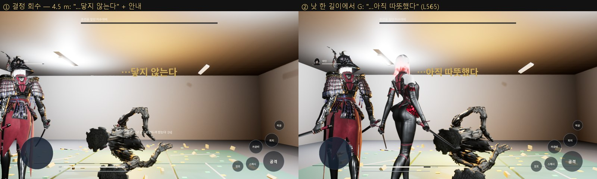

# 143 — 제1부 제작 마스터 SaveFlag · EP01 결정 회수 (2026-09-29)

기준:
- 디렉터 제작 마스터 `docs/story/source/production/황혼_1부_EP01-28_전체_제작마스터_v1.0.md`
- 원문 마감본 L563–L567
- 마스터와 원문의 전체 대조는 별도 문서로 정리한다(진행 중).

## 1. SaveFlag (마스터 §0-5, 각 화 «SaveFlag»)

- `tools/story/build_part1_saveflags.py` 가 마스터의 화별 SaveFlag 블록을 뽑는다.
  - 결과: `Content/Data/part1_saveflags.json`, 28 화 131 개.
  - npm 테스트: 28 화 전부 존재, `SF_CurrentEpisode` 가 다음 화로 이어짐, EP01 블록 일치, 모든 값이 마스터 원문에 그대로 있음, EP28 SS·Part1 완료.
- 세이브 **v4**: `UHWSaveGame::StoryFlags`(키는 `SF_*`, 값은 비어 있지 않음).
  - v3 → v4 이전은 플래그가 비어 있어야 한다.
  - 검증에 실패하면 전체를 거부한다.
  - UE 테스트 2 개.
- `AHWStoryDirector` 가 스토리 모드 에피소드 끝에 해당 화 플래그를 한 번에 저장한다.
  - EP01: `SF_EP01_COMPLETE=true`, `SF_Rank_Ain=C`, `SF_Rank_Kain=C`, `SF_Boss_TrainingDummy_State=Destroyed`, `SF_Archive_FirstCrystal=true`, `SF_CurrentEpisode=2`.
  - QA 실행은 로그만 남기고 저장하지 않는다.

## 2. 결정 회수 (마스터 EP01 «Crystal Recovery», 원문 L565)

- 원문: «엄지손톱만 한 주황색 결정 … 아인이 낫 끝으로 툭 건드려 손바닥에 받았다. 아직 따뜻했고»
- 흐름:
  1. 절단 → 결정이 떨어진다(doc 141).
  2. 1.8 s 뒤 **Recover** 단계. 조작이 돌아오고 안내가 뜬다: «결정 — 낫 끝으로 건드려 받는다 [G]». 모바일은 안내를 탭한다.
  3. **낫 한 길이(2 m)** 안에서 상호작용(G)을 누르면 줍는다. «…아직 따뜻했다» → 1.4 s 뒤 SC019 결과 시퀀스.
  - 멀면 «…닿지 않는다».
- 보스 모드에는 회수 단계가 없다(결과창).
- 검수: 4.5 m 에서 거부, 1.5 m 에서 **실제 G 키 입력**(PlayerController InputKey)으로 회수 → SC019 → 에피소드 끝.
  - 입력은 다음 프레임에 처리된다. 같은 프레임에서 확인해 한 번 실패로 나온 것을 고쳤다.

