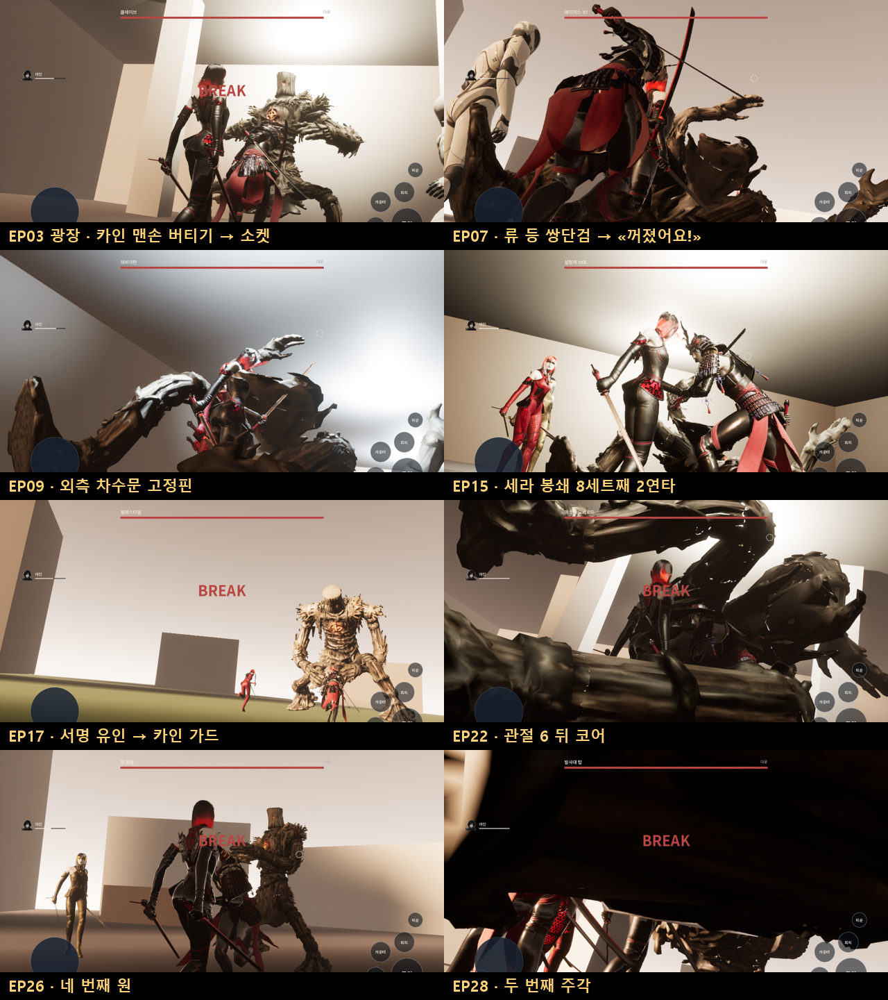

# 150 — 제1부 전권: 원문 전투 문법 하나로 34전투, 27개 월드 (2026-09-29)

디렉터 지시: «연속해서 전권 다 하자 승인받지 말고 한번에 수정하게». 원문 추출 문서(138, 142, 145–149)를
그대로 데이터로 옮겨 EP02–EP28 을 스토리 모드로 끝까지 돌게 만든다. 판정 기준은 늘 원문이다.

## 1. 원문이 반복하는 문법

28화의 전투는 하나의 문법으로 읽힌다.

> **누군가가(카인·류·세라·NPC·장소 자체) 한 순간을 연다 → 아인이 낫 한 자루 거리에서 결정타를 넣는다.**
> 그 밖의 타격은 튕기거나(셔터·배리어·읽기), 베여도 아무것도 끝내지 못한다.
> 지는 싸움은 원문이 끝내는 조건(퇴각·봉쇄·다음 장면)으로 끝난다.

EP01 허수아비(문서 138)가 이 문법의 첫 사례다. 나머지는 `UHWScriptedCanonRules` 하나로 돈다.

## 2. `UHWScriptedCanonRules` — 스크립트 문법

`Content/Data/story_episodes.json` 의 `battles[].script`. 원본은 `tools/story/build_story_episodes.py` 다.

| 키 | 뜻 |
|---|---|
| `band` | 낫 사거리 띠(cm). 안쪽은 `too_close`, 바깥은 `too_far` 로 들어가지 않는다. 기본 150–240 (EP01 원문 L477–L499) |
| `guard` | 열림 밖 타격: `deflect`(피해 0, «틱—») / `cut`(베이지만 죽지 않음) |
| `walk_in_cm` | 이보다 멀면 보스가 걸어온다. 포탑·탑은 100000(움직이지 않음) |
| `patterns[]` | 원문의 기술 이름(`ko`) + 대역 몸 클립(`clip`) + 예고·타격 설계값. 비우면 공격하지 않는다(현 중위 L7545, 발사대 탑) |
| `steps[]` | 원문 순서의 단계 |

단계(`steps[]`):

| 키 | 뜻 |
|---|---|
| `moves` | 동료·NPC 위치: `front`(보스와 아인 사이), `behind`, `back`(보스 뒤), `side`, `side_r`, `grab`(팔에 매달림), `marker:<태그>` |
| `open` | `pattern:<기술>`(그 기술의 타격 순간, 여는 사람이 제자리면 기술을 받아 내고 보스를 묶는다) / `ready`(여는 사람이 제자리에 서면) / `after:<초>` |
| `open_on` | `pattern:` 의 N 번째에만 연다. EP26 «세 합만 받아 주세요»(L14376) → 4 번째 원 |
| `opener` | 여는 사람. 없으면 장소·제3자(EP06 정체불명의 불꽃 L6397) |
| `open_s` | 열림 길이(설계값). 그동안 보스는 Break |
| `needs` | 열림 안 띠 타격 수. EP15 «같은 자리 2연타»(L10380–L10444) → 2 |
| `then` | `kill` / `next` / `end`(battle_end — 퇴각·봉쇄·장면 전환) |
| `advance_after_s` · `advance_then` | 결정타 없이 원문이 넘기는 단계(퇴각 명령, 동료의 일격) |

비트(`step_<id>`, `opened`, `guarded`, `decisive`, 스크립트 이름 비트)는 `callouts` 로 원문 대사를 띄운다.
`decisive`·`sever` 는 EP01 의 절단 연출(0.25배 슬로, 채도 폭발, 결정 낙하)을 그대로 쓴다.
**화면에 뜨는 글은 전부 원문 대사다.** 설명문을 지어 넣지 않는다(초안에 넣었던 «셔터가 떨어졌다» 류 11개를 뺐다).

## 3. 전투 목록 (34, EP01 포함)

| 화 | 첫 장면 | 보스 | 파티 | 단계 | 여는 순간 → 결과 | 원문 결말 | 원문 |
|---|---|---|---|---|---|---|---|
| EP01 | SC016 | 짚단 허수아비 | kain | — | 문서 138 전용 규칙 | kill | L461–L567 |
| EP02 | SC014 | 클레이브 | kain, ojeonggil | 3 | 없음(셔터 «틱—», 내려찍기 뒤 퇴각) | retreat | L1774–L1936 |
| EP03 | SC009 | 클레이브 | kain, ojeonggil | 3 | 카인 맨손 버티기 → 소켓 절단 → end | phase | L2672–L3346 |
| EP03 | SC015 | 클레이브 | kain | 1 | 카인이 팔에 매달림 → kill (결정: 어른 주먹) | kill | L3346–L3418 |
| EP04 | SC010 | 셀레스티얼 | kain, ojeonggil | 3 | 없음(닿을 수단 없음, 와이어에 내려앉아 끝) | retreat | L4400–L4546 |
| EP05 | SC005 | 케이블카 드로퍼 | kain, ojeonggil | 1 | 없음(밴드 부족 후퇴) | retreat | L5047–L5102 |
| EP05 | SC011 | 케이블카 드로퍼 | kain, ojeonggil | 1 | 낙하 순간 K-3 원형 베기 → kill | win | L5394–L5428 |
| EP06 | SC008 | 에이지스-07 | kain, ojeonggil | 4 | 제3자 등 불꽃 → 다리 절단 → «빠져요!» | retreat | L6215–L6444 |
| EP07 | SC005 | 에이지스-07 | kain, ojeonggil | 2 | 없음(«셋이 필요했다. 둘밖에 없었다.») | phase | L6802–L6890 |
| EP07 | SC008 | 에이지스-07 | kain, ryu, ojeonggil | 2 | 류 등 쌍단검 → «꺼졌어요!» → kill | win | L6991–L7099 |
| EP08 | SC005 | 레비아탄 | kain, ryu, kang | 3 | 없음(흡입·잠복 → 철수) | retreat | L7446–L7531 |
| EP08 | SC007 | 현 중위 | (관전) kain, ryu, ojeonggil | 1 | 걸어 나옴 → 한 번 → kill | kill | L7537–L7561 |
| EP08 | SC010 | 레비아탄 | kain, ryu | 2 | 아가미 펼침 + 카인 발판 → 뿌리 절단 → end | retreat | L7635–L7723 |
| EP09 | SC010 | 레비아탄 | kain, ryu, ojeonggil | 4 | 미끼·내측 문·해일 → 외측 고정핀 → end | contained | L7940–L8125 |
| EP10 | SC005 | 클레이브 두 기 | kain, ryu, ojeonggil | 3 | 카인 가드(정면 돌진) → 1기 / 류 → 2기 | win | L8357–L8393 |
| EP11 | SC009 | 클레이브 | kain, ryu | 1 | 카인 3걸음 버팀(수직 강타) → 무릎 → kill | win | L8854–L8878 |
| EP14 | SC005 | 실험체 09호 | kain, ryu, ojeonggil, minkyung | 6 | 코어 절단 ×3, 재생 30/35/40초 | phase | L9844–L9895 |
| EP14 | SC007 | 실험체 09호 | 〃 | 3 | 분열 → 계단 → 고정액 봉쇄 → end | contained | L9935–L10126 |
| EP15 | SC004 | 실험체 09호 | kain, ryu, sera, ojeonggil | 11 | 세라 봉쇄 3초 × 같은 자리 2연타 × 8세트 | win | L10275–L10469 |
| EP16 | SC003 | 섀도우 팽 | kain, ryu, ojeonggil | 4 | 오정길 미끼 → 얕은 첫 상처 → end | phase | L10697–L10830 |
| EP16 | SC010 | 섀도우 팽 | 〃 | 1 | 없음(광폭, 빛기둥으로 끝) | phase | L10834–L10843 |
| EP17 | SC001 | 섀도우 팽 | kain, ryu, sera, ojeonggil | 2 | 4인 공식(류 고정) → 심부 절개 → end | phase | L10959–L11000 |
| EP17 | SC004 | 섀도우 팽 | 〃 | 1 | 난투 중 같은 자리 세 번째 → kill | kill | L11025–L11042 |
| EP17 | SC005 | 셀레스티얼 | kain, ryu, sera | 1 | 세라 결계로 접힘 되돌림 → 날개 걸기 → end | phase | L11043–L11072 |
| EP17 | SC007 | 셀레스티얼 | 〃 | 1 | 없음(세 방향 강하를 버팀) | phase | L11102–L11115 |
| EP17 | SC009 | 셀레스티얼 | 〃 | 1 | 서명 복제 유인 → 카인 가드 → kill (융합 결정) | kill | L11146–L11193 |
| EP18 | SC009 | 군 표식 집행관 | duho, duna | 2 | 두나 발현 정지(내려치기) → 찌르기 → kill | defend | L11438–L11483 |
| EP21 | SC007 | 아스널 오버로드 | kain, ryu, sera, guide | 3 | 없음(우회 실패·전탄 제압) | retreat | L12663–L12759 |
| EP21 | SC012 | 아스널 오버로드 | kain, ryu, sera | 1 | 퇴각 중 급탄로 절단 → end | retreat | L12777–L12796 |
| EP22 | SC004 | 아스널 오버로드 | kain, ryu, sera | 7 | 일제 꺾임 × 관절 6 → 카인 발판 코어 → kill | win | L12939–L13191 |
| EP23 | SC001 | 박 준장 | kain, ryu, sera | 3 | 소등·카인 미끼 → 얕게 → 재점등 두 번째 원 → kill | win | L13322–L13373 |
| EP26 | SC002 | 정 장관 | kain, ryu, sera | 3 | 가짜 명령 → 세 합 관찰 → 네 번째 원 → kill | kill | L14271–L14419 |
| EP27 | SC008 | 나노-노바 코어 | kain, ryu, sera | 6 | «지금……» ×2(류·카인) → «지금—!» → kill | kill | L14724–L14875 |
| EP28 | SC002 | 발사대 탑 | kain, ryu, sera | 4 | 소켓·표시 → 카인 «모루.» → 두 번째 주각 → kill | destroyed | L15008–L15043 |

전투 없는 화(카드로만 진행): EP12, EP13, EP19, EP20, EP24, EP25.

## 4. 원문에 맞춘 결정

- **BOSS 태그가 없는 전투**(EP05 SC005·SC011, EP08 SC007, EP10 SC005, EP11 SC009, EP18 SC009)는 원문 줄 번호로 장면을 골랐다.
  감독은 설정에 있는 장면만 전투로 연다(`first_scene`).
- **태그는 있지만 원문이 대화·장면 전환인 곳**(EP16 SC013, EP17 SC002 등)은 앞 전투에 이어지거나 카드로 남는다.
  이어진 BOSS_BATTLE 장면은 한 전투로 묶이고(감독 규칙), 사이에 다른 장면이 끼면 카드가 된다.
- **EP07 은 두 전투**다: 둘로는 안 됐고(L6880), 류가 온 뒤(L6903) 셋으로 무너뜨린다.
- **EP14 는 두 전투**다: 격파 1–3(무효), 그리고 분열·봉쇄. 재생 30/35/40초는 원문 수치 그대로 기다린다.
- **EP17 은 다섯 전투**다: 섀도우 팽 둘, 셀레스티얼 셋.
- **퇴각전**은 `advance_then: end` 로 원문 조건에서 끝난다. 이기려고 때려도 끝나지 않는다(`guard: cut` 은 체력 1 을 남긴다).
- **EP09 외측 문**: 원문에서 자르는 것은 고정핀이고 끝내는 것은 문이다(«낫이 못 한 것을 문이 했다.» L8109).
  그레이박스에서는 열림 안의 띠 타격 하나를 그 절단으로 읽는다. 핀 표적은 아트 단계에서 붙인다(TBD).

## 5. 월드 — `Scripts/ue_story_world.py`

화마다 `/Game/Hwanghon/Story/EPnn/EPnn_World`(World Partition, `HWStoryGameMode`). 전투마다 +X 로 12 m 간격의 아레나:

- 마커 `
BossSpawn`, `
AinStart`, `
<Member>Start`, `
Exit`, `
Cover`, `
InnerPins`
- 카메라 `
CAM_Entry_Wide`(그 아레나 장면의 소설 카드 배경)
- 데이터 레이어 `DL_
Pre / Fight / After`. 원문이 부수는 것(`arena.destroy`)은 앞 레이어에 멀쩡히, 뒤 레이어에 잔해로 둔다
  (여러 런타임 레이어에 든 액터는 모두 켜져야 로드되므로 레이어마다 복제).
- 종류별 셸: `outdoor`(도시 블록·능선), `indoor`(벽·천장 4 m), `underground`(9 m, 기둥), `water`(수면 높이 = 원문 수위 설계값), 바다(EP28)
- 원문 지형 소품: 셔터, 차량·장갑차, 가드레일·난간, 계단, 매대·파티션, LED 광고판, 결정 산, 탑 주각 4개

크기·배치는 설계값(TBD_CANON)이다. 아트 교체 때 마커 태그만 지키면 된다.

## 6. 검수

- `Scripts/run_story_qa.ps1` — 화마다 `-HWQA=storyshow`, 로그·샷을 화별 폴더에. QA 는 원문대로 싸운다(`QAStep`):
  열림 밖 한 번 베어 끝나지 않는지 보고, 열림마다 띠 가운데에서 벤다. 단계가 제한 시간 안에 안 넘어가면 FAIL.
- 긴 전투(EP14 재생 105초)에서 아인이 쓰러져 재도전 루프에 빠지지 않게 QA 는 체력을 채운다(`-HWQAStoryDie` 때는 안 채움).
- 한 화에 전투가 여럿이면 결정 회수·슬로 샷 상태를 전투마다 초기화한다.
- UE Automation: `Hwanghon.Canon.Scripted.OnlyTheOpeningMovesIt`, `Hwanghon.Canon.Scripted.OpenOnTheNthMove`,
  `Hwanghon.Story.Episodes.EveryFightParses`.

결과: §7.

## 7. 결과

`run_story_qa.ps1` 전 28화(EP01 회귀 포함): **28/28 FINISH ok=1**. 34전투 모두 원문 단계대로 끝났다
(퇴각·봉쇄는 battle_end, 처치는 절단 슬로 → 결과 장면). UE Automation 38/38, npm test 전부 통과.
새 테스트는 일부러 깨서 실패하는 것을 확인했다(deflect→cut, open_on 4→3, 원문에 없는 대사, 결말 불일치, 결정 회수 추가).

검수 중 고친 것:

| 증상 | 원인 | 조치 |
|---|---|---|
| EP03·EP05 열림이 핸드오프 중에 지나감 | 규칙이 카메라 전환 동안에도 돌았다 | 감독이 핸드오프 동안 규칙을 멈춘다(`SetLive`) |
| EP10 둘째 기가 안 죽음 | 원문 처치(`advance_then: kill`)가 띠 필터에 걸려 «너무 가깝다» | 원문 처치는 필터를 거치지 않는다 |
| EP23 재점등이 안 옴 | 놓친 `after:` 열림이 다시 오지 않음 | 닫히면 같은 간격으로 다시 온다 |
| EP28 주각이 안 베임 | 4배 몸에 270 cm 는 닿지 않음 | 띠 200–300 |
| EP08 카인이 안 움직임 | 수면 판에 충돌이 있어 카인이 그 밑에 끼었다 | 수면·바다는 충돌 없음(액터 단위) |
| EP14 코어가 안 베임 | 카인(정면 190 cm)이 아인 자리를 밀었다 | 카인은 옆(260) |
| 원문에 없는 대사 5개 | «…방향이 안 잡혀요.» 등 옮기며 바뀜 | 원문 그대로. 테스트가 막는다 |
| 결정 회수가 원문과 다름 | EP07 파편은 류가, EP17 은 인식표를 챙긴다 | 결정 회수는 EP01·EP03 선로·EP10 만 |

알려진 한계(아트 단계): 3배 이상 큰 몸(EP21·22·27·28)은 전투 카메라가 몸 안으로 들어간다. 큰 보스용 카메라 거리 규칙이 필요하다.
실외 아레나는 노출이 밝다.

## 8. TBD_CANON / 다음

- 보스 몸: 전부 대역(기본 보스 몸 × 크기). 크기 중 원문 수치는 클레이브 2.5 m, 에이지스 4 m, 셀레스티얼 활공체 4 m, 아스널 코어 높이 7 m 뿐.
- 여러 개체 전투(드로퍼 넷, 클레이브 두 기, 09호 3개체)는 대역 하나로 연출한다.
- 애니메이션(시네마)은 보류 중(디렉터 결정). 지금은 소설 카드 + 원문 대사 콜아웃.
