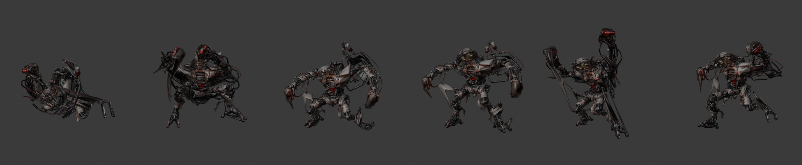
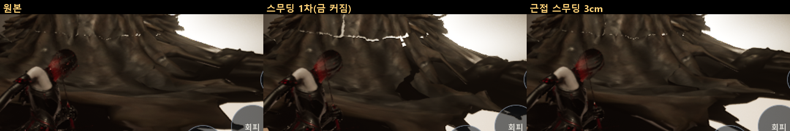
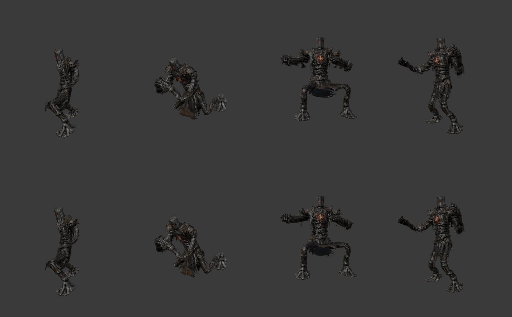
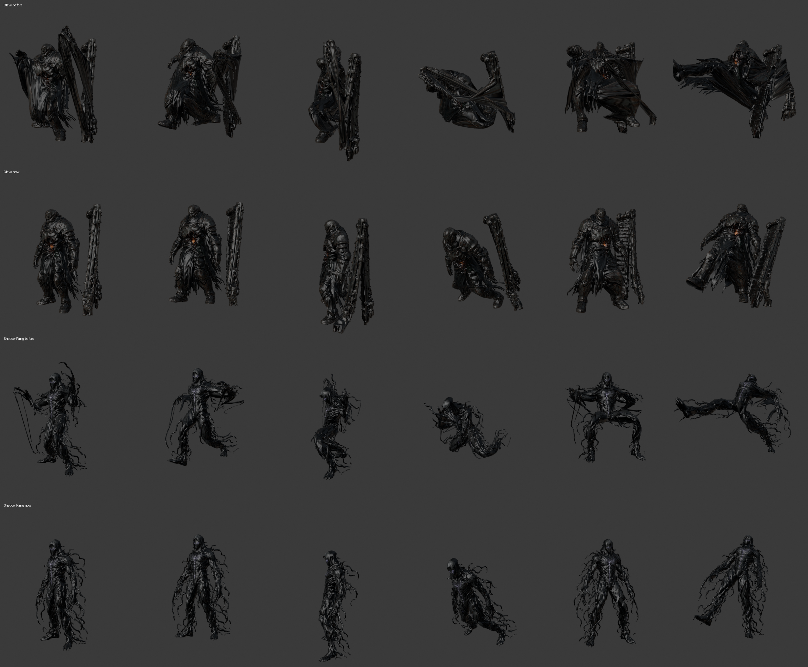
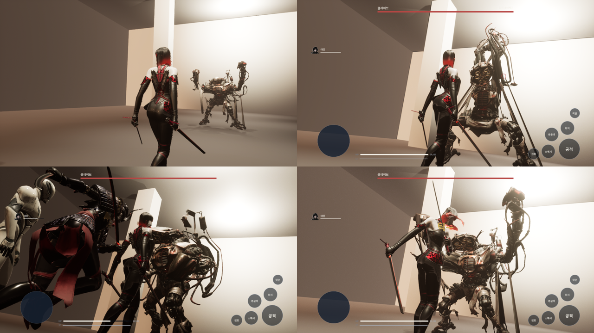
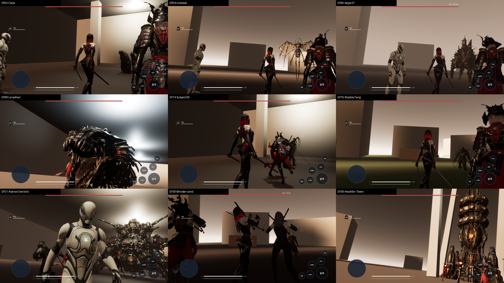

# 151 — 제1부 보스 몸: 턴어라운드 → Hi3D → 리깅 → 스토리 전투 (2026-09-29)

문서 150 의 34전투는 전부 같은 대역 몸으로 돈다. 이 문서는 원문 보스 9체의 몸을 넣는 길을 만든다.
길은 끝까지 확인했다(§4). 남은 것은 Hi3D 크레딧으로 몸을 뽑는 일뿐이다.

## 1. 입력 — `tools/3d/split_turnaround.py`

디자인 시트(`docs/story/source/design/bosses/turnaround/`)를 정면·옆·뒤로 잘라 1024 정사각(시트 배경색 여백)으로 만든다.
뷰가 붙어 있는 시트는 3등분 근처의 가장 빈 열에서 자른다. 결과 `art/3d/src/part1_views/`.

| 보스 | 나오는 화 | 뷰 | 몸 종류 | 키(원문) |
|---|---|---|---|---|
| 클레이브 | EP02·03·10·11 | 정·옆·뒤 (셔터 포함) | 사람 뼈대 | 2.5 m (L1774) |
| 에이지스-07 | EP06·07 | 정·옆·뒤 (디자인 시트 판에서) | 정적 | 4 m (L7097) |
| 레비아탄 | EP08·09 | 정·옆 | 정적 | TBD_CANON |
| 셀레스티얼 | EP04·17 | 정·옆·뒤 | 정적 | 4 m 활공체 (L11001-L11024) |
| 실험체 09호 | EP14·15 | 정·옆·뒤 | 사람 뼈대 | TBD_CANON |
| 섀도우 팽 | EP16·17 | 정·옆·뒤 | 사람 뼈대 | TBD_CANON |
| 아스널 오버로드 | EP21·22 | 정·옆·뒤 | 정적 | 코어 높이 7 m (L13171-L13189) |
| 발사대 탑 | EP28 | 정·옆·뒤 | 정적 | TBD_CANON |
| 정 장관 | EP26 | 정·옆·뒤 | 사람 뼈대 | TBD_CANON |

- 클레이브 셔터는 몸과 열이 겹쳐 따로 자를 수 없다. 같이 넣고 생성된 메시에서 섬(따로 떨어진 조각)으로 떼어 소품으로 쓴다.
- 클레이브 디자인 시트의 신장 223 cm 는 원문 2.5 m 와 다르다 → 원문을 따른다.

## 2. 리깅 — `tools/3d/rig_boss_template.py` (Blender 5.2)

```
blender -b -P tools/3d/rig_boss_template.py -- <hi3d.glb> <키 m> art/3d/part1/<id>.glb
blender -b -P tools/3d/rig_boss_template.py -- <hi3d.glb> <키 m> art/3d/part1/<id>_static.glb --static
```

- 허수아비 보스(`art/3d/boss_anim.glb`)의 mixamorig 23뼈·클립 18개를 새 몸에 입힌다. 키에 맞춰 뼈대를 균일 확대하고 골반 이동 키도 같은 배율.
- 무게는 뼈 선분까지의 거리로 가장 가까운 두 뼈에 나눈다(1/d⁴). Hi3D 메시는 구멍·겹침이 많아 자동 무게(bone heat)가 자주 실패한다 — 이 방식은 표면 모양과 무관하다.
- 사람 뼈대가 맞지 않는 몸(거미·뱀·날개·포탑·탑)은 `--static` 으로 크기·자리만 맞춘다.
- 확인: `tools/3d/render_boss_poses.py` 가 클립 가운데 프레임을 찍는다.



### 2.1 텍스처가 늘어나 보이던 것 — 무게 (디렉터 지적 2026-09-29)

기본 자세의 텍스처는 멀쩡하다. 늘어나는 것은 **동작 중의 스키닝**이다. `tools/3d/measure_stretch.py` 로 클립마다 10프레임을 돌려
모서리 길이(변형/기본)를 쟀다 — 상위 0.1% 모서리가 몇 배 늘어나는가:

| 무게 | 대기 | 오른훅 | 내려찍기 | 회전 | 걷기 | 돌진 |
|---|---|---|---|---|---|---|
| 지금 훈련 보스(원본) | 4.27 | 10.56 | 9.56 | 6.97 | 5.95 | 7.70 |
| 가장 가까운 두 뼈(1/d⁴) | 10.41 | 24.15 | 19.77 | 20.27 | 18.25 | 18.08 |
| 복셀 대용 메시 + 열 확산 | 14.36 | 37.50 | 40.43 | 23.47 | 25.02 | 26.64 |
| 원본 + 이웃 평균 6회 | 3.15 | 7.13 | 5.99 | 5.51 | 4.66 | 5.30 |
| **원본 + 이웃 평균 12회** | **3.17** | **6.70** | **6.01** | **5.16** | **4.49** | **5.26** |
| 원본 + 이웃 평균 24회 | 3.18 | 6.75 | 6.23 | 4.93 | 4.36 | 5.69 |
| 두 뼈 + 이웃 평균 12회 | 3.47 | 8.29 | 7.40 | 7.71 | 6.17 | 6.17 |
| **원본 + 이웃 평균 12회 + 3 cm 근접 (채택)** | **2.64** | **5.55** | **4.83** | **4.48** | | |

**금(흰 틈)**: 1차 스무딩을 게임에 넣자 보스 허리에 흰 금이 커졌다. 원인 둘:
UV 이음매에서 둘로 나뉜 같은 자리 정점이 서로 다르게 펴졌고(4.5–11 cm 벌어짐), 로브 자락과 몸통처럼 **닿아 있지만 정점을 나누지 않는 조각**이
각자 다른 뼈를 따라갔다. 원본에도 가는 금이 있었다(1.6–5.5 cm). 같은 자리 정점은 무게를 같게, 3 cm 안의 정점은 이웃처럼 함께 편다.
`measure_stretch.py` 가 이제 «가까운 정점 쌍이 얼마나 벌어지는가»(상위 0.1%)도 잰다:

| | 대기 | 오른훅 | 내려찍기 | 회전 |
|---|---|---|---|---|
| 원본 | 1.6 cm | 5.5 | 4.1 | 4.0 |
| 1.5 cm 근접 | 1.4 | 4.0 | 3.4 | 3.5 |
| **3 cm 근접 (채택)** | **1.0** | **3.2** | **3.2** | **3.1** |



넓게 벌리는 동작의 희미한 선은 남는다 — 따로 떨어진 조각이라서다. 새 몸을 만들 때 자락을 몸통에 붙이면 없어진다.

- 늘어나는 곳은 어깨·겨드랑이(팔 뼈 경계)와 가슴, 넓게 벌리는 동작에서는 가랑이.
- 처음 두 방식은 원본보다 나빠 쓰지 않았다(가랑이 천이 두 허벅지로 갈라져 찢어짐 / 대용 메시가 정점 12% 를 놓침).
- 훈련 보스: 원본 + 12회 + 3 cm 근접(`tools/3d/smooth_skin.py`)을 UE 에만 넣는다(`Scripts/ue_boss_training_reskin.py`). 웹은 원본 그대로.
- 새 몸: 두 뼈 무게 + 12회 + 3 cm 근접 스무딩(`rig_boss_template.py` 기본).
- 모양은 그대로다(위 원본, 아래 12회). 회전 공격에서 다리 사이 천이 한 장으로 펴지는 것은 자세 자체라 남는다.



### 2.2 새 Hi3D 몸이 훨씬 더 늘어난 것 — 몸과 클립이 안 맞았다 (2026-09-29)

제1부 보스 9체를 새로 뽑아 같은 경로로 리깅하자 클레이브의 대기 동작에서 상위 0.1% 면이 **19배**(훈련 보스 2.6배) 늘어났다.
먼저 뼈 자리를 의심했다 — 몸을 가운데 맞출 때 셔터까지 든 상자를 기준으로 했다. 몸통 기준으로 다시 맞췄지만(앞뒤 14 cm)
수치는 그대로였다. 대기 첫 프레임에서 뼈를 찍어 보니 원인은 **클립**이었다. 템플릿 클립은 권투 선수 동작이다
(대기에서 두 손이 1.1 m 올라간 가드, 훅, 발차기). Hi3D 몸은 팔이 코트에 붙은 채 내려와 있고 다리는 코트 자락 안에 있어서,
팔·다리를 들 때마다 코트와 몸통이 함께 끌려간다.

- 클립의 팔·다리·허리 회전을 쉬는 자세 쪽으로 당긴다: `--arms=0 --legs=0.3 --spine=0.25`(파이프라인 기본값 `MOTION`).
  골반 이동·회전은 그대로라 걷기·돌진·내려찍기의 몸통 움직임과 패턴 타이밍은 남는다.
- 클레이브의 셔터는 손·코트에 붙어 한 덩어리였다. 셔터 면(정점 과반이 셔터 상자 안인 면) 경계 165개 모서리를 잘라 떼어 낸 뒤
  왼손에 통째로 붙인다(원문 «왼손에 셔터»). 그대로 두면 이어진 띠(모서리 398개)가 발차기 때 전부 2배 넘게 늘어났다.

상위 0.1% 모서리 늘어남(배), 이전 → 지금:

| 보스 | 대기 | 걷기 | 오른훅 | 내려찍기 | 회전 | 발차기 |
|---|---|---|---|---|---|---|
| 클레이브 | 19.5 → **1.8** | 18.2 → **3.0** | 30.6 → **5.5** | 32.2 → **3.8** | 24.3 → **3.8** | 25.0 → **5.2** |
| 섀도우 팽 | 12.8 → **1.4** | 14.6 → **2.0** | 23.3 → **2.3** | 22.4 → **2.7** | 11.6 → **1.9** | 10.1 → **3.5** |
| 정 장관 후보 | 6.4 → **1.7** | 8.7 → **2.9** | 13.4 → **3.8** | 12.8 → **3.5** | 9.4 → **3.8** | 13.2 → **4.9** |
| 09호 | 3.6 → **1.2** | 4.2 → **1.2** | 7.7 → **1.6** | 6.5 → **1.5** | 4.5 → **1.4** | 5.8 → **1.5** |

단계별(클레이브 오른훅): 그대로 30.6 → 팔 0 26.2 → 셔터 분리 + 다리 0.5 12.8 → 다리 0.3 11.7 → 허리 0.5 7.5 → 허리 0.25 **5.5**.
대가: 팔을 쓰지 않는 무거운 동작이 된다. 몸에 맞는 전용 클립(또는 팔이 떨어진 T자 모델)이 오면 되돌린다.



## 3. UE — `Scripts/ue_boss_part1_setup.py`

- `art/3d/part1/*.glb` 를 `/Game/Bosses/Part1/<id>` 로 가져온다. 뼈대가 있으면 `DA_Boss_<id>` 를 만든다
  (`ue_boss_training_setup.build` — 허수아비의 패턴 표를 이 몸의 클립으로. 클립이 바닥에서 뜨는 높이도 다시 잰다).
- `DefaultGame.ini` 에 `boss_<id>` 몸(MeshScale 1, MeshYaw -90)을 등록하고, `story_episodes.json` 전투에 `"body": "boss_<id>"`
  또는 `"body_static": "<정적 메시 경로>"` 를 준다.
- 감독: 보스를 낳은 뒤 `WearBody` / `WearStaticBody`. 몸은 실제 키로 만들어졌으므로 전투 배율(캡슐·사거리)을 몸에서 되돌린다.
  정적 몸은 대역 뼈대를 숨기고 시계(패턴 타이밍)만 쓴다.
- 생성된 에셋은 커밋하지 않는다. 스크립트로 다시 만든다.

### 3.1 한 번에 — `tools/3d/part1_boss_pipeline.py`

```
python tools/3d/part1_boss_pipeline.py clave <Hi3D 결과.glb>
```

원본 보관(`art/3d/src/part1_hi3d/`) → 리깅(키·종류는 `build_story_episodes.py` 의 `BODIES`) → 자세 시트(`art/review/part1/<id>_poses.png`)
→ `DefaultGame.ini` 등록 → `story_episodes.json` 재생성(그 보스의 모든 전투가 `body` 를 받는다) → UE 가져오기.
클레이브는 셔터를 왼손 뼈에 통째로 붙인다(`--hold=mixamorig:LeftHand --hold-box`, 원문 «왼손에 셔터» L1774-L1796).
Hi3D 는 셔터를 몸과 한 덩어리로 만들어서 공간(머리 위로 솟은 옆 판의 발자국)으로 찾아 잘라 낸다(§2.2). 텍스처는 8192² 두 장 → 2048² 로 줄이고 JPEG(품질 90)로 싣는다 — 몸 하나 11 MB → 약 2.4 MB, 9체 106 MB → 약 25 MB.
예전 Hi3D 몸으로 끝까지 돌려 클레이브 5전투(EP02·03·03·10·11)가 몸을 받는 것을 확인하고 되돌렸다.

## 4. 끝까지 확인 (시험 몸)

예전 Hi3D 보스(`hb_ward`)를 2.5 m 로 리깅 → UE 가져오기 → `DA_Boss_trialward` → EP02 클레이브 전투에 임시로 입혀 storyshow 를 돌렸다:
FINISH ok=1. 핸드오프·걷기·패턴 클립이 새 몸에서 돈다. 시험 설정은 되돌렸다.



### 4.1 제1부 9체 (2026-09-29)

Hi3D 로 뽑은 9체(리깅 4: 클레이브·09호·섀도우 팽·정 장관 후보 / 정적 5: 에이지스-07·셀레스티얼·레비아탄·아스널 오버로드·증폭탑)를
27전투에 입혔다. 스토리 QA 28/28 FINISH ok=1.



## 5. 크레딧

Hi3D 고품질 멀티뷰 1체 65. 2026-09-29 02:27 UTC 월 갱신 전 잔액 25(이벤트). Higgsfield 0.
갱신 뒤 여러 화에 나오는 순서(클레이브 → 에이지스 → 레비아탄 → 셀레스티얼 → 09호 → 섀도우 팽 → 아스널)로 뽑는다.
