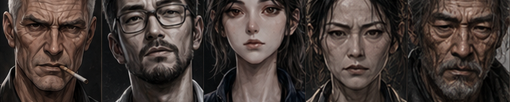
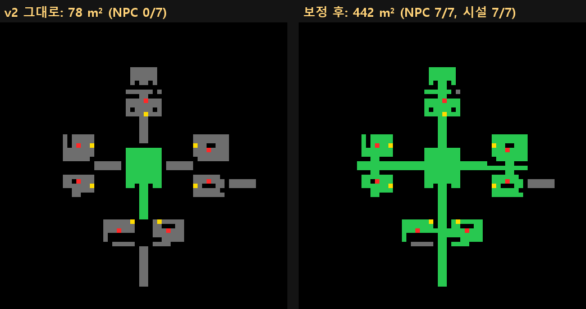
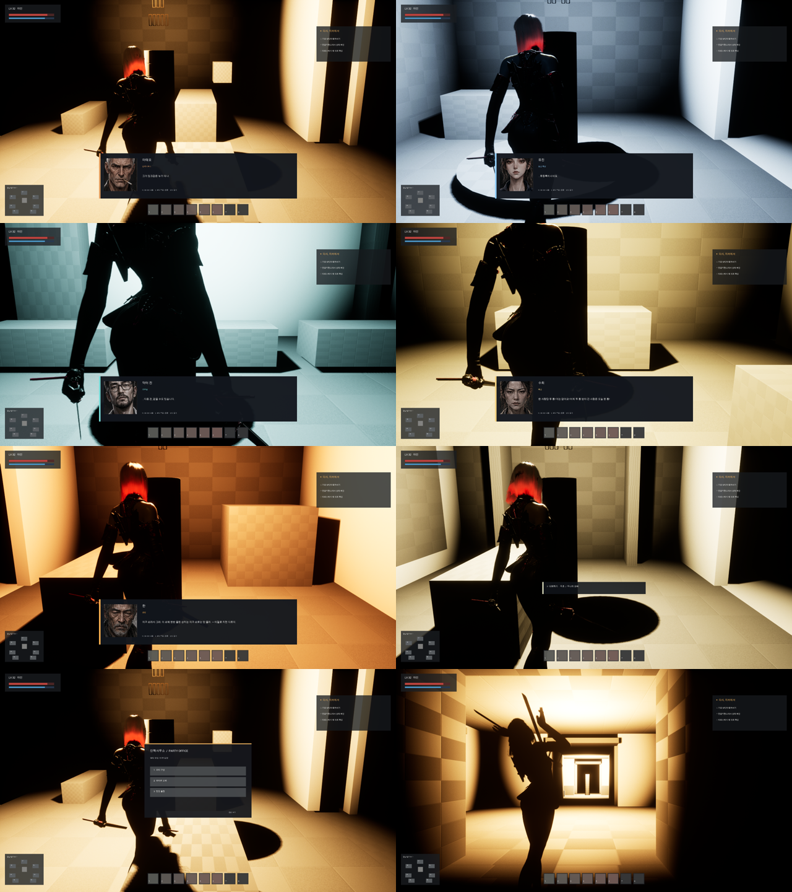

# 152 — 강남 벙커 B-1 허브: 디렉터 플러그인 v1·v2 통합 (2026-09-29)

디렉터가 올린 `HwanghonShelter` 플러그인(GPT 제작) v1(시설 7곳)·v2(시설 + NPC 7명 대화)와 NPC 디자인 시트 5장을
`HwanghonCombatUE` 에 넣었다. 플러그인은 그대로 두고(버그 두 줄만 수정, §3), 게임 쪽 연결·원문 대사·동선 보정은 우리 코드에 둔다.

## 1. 구성

| 무엇 | 어디 |
|---|---|
| 플러그인 v2 (시설·NPC·대화·허브 매니저·캔버스 HUD) | `ue/HwanghonCombatUE/Plugins/HwanghonShelter/` |
| 레벨 `/Game/Hwanghon/Maps/Hub/L_GangnamBunker_B1` | `Scripts/ue_shelter_hub.py` — 초상화 가져오기 → 플러그인 빌더 → 동선 보정 → 저장 |
| 게임모드 `AHWShelterGameMode` | 아인이 폰, 시작 때 NPC 에 원문 대사·이름·역할·초상화를 덮는다 |
| NPC 원문 대사 | `tools/story/build_shelter_npcs.py` → `Content/Data/shelter_npcs.json` (줄 번호까지 검증) |
| 초상화 | `docs/story/source/design/npc/*_sheet.png` 의 FACE DETAIL → `art/ui/npc/*_portrait.png` → `T_<Id>_Portrait` |
| 검수 | `-HWQA=sheltershow` (§4), `tests/shelter-npcs.test.mjs` |

조작(플러그인): F/Enter 대화·다음 줄, E 그 NPC 의 시설, ESC 닫기.
휴대폰(`AHWShelterTouchInput`, 게임모드가 띄운다): 이동은 엔진 가상 조이스틱, **짧게 탭 = F**, **0.5초 누르기 = E**,
**오른쪽 위 모서리 탭 = ESC**. 조이스틱이 가져가는 터치는 오지 않는다. 플러그인은 그대로 — 터치를 같은 키로 바꿔 보낸다.

## 2. 원문 대사 — 21줄 중 19줄이 창작이었다

플러그인 기본 대사 21줄을 원문과 대조하니 원문 문장은 2줄뿐(«…무등록이시네요.», «한 사람당 두 통! 더는 없어요!»).
원문에서 각 인물이 실제로 한 말을 문맥으로 화자를 확인해 17줄을 골랐다(`shelter_npcs.json`, 각 줄에 소설 줄 번호).

| NPC | 이름/역할 | 원문 대사 |
|---|---|---|
| Matteo | 마태오 · 인력사무소 | «그거 잉크값은 누가 대냐.»(L541) «얼마 드는데.»(L545) «…적어.»(L11678) |
| Yujin | 유진 · 등급 측정 | «…무등록이시네요.»(L399) «…발판 위로.»(L425) «대검 무게는 등급에 반영되지 않습니다.»(L505) «다음 분.»(L509) |
| HanJangin | **한 · 장인** | «지구 쇠라서 그래. …»(L11550) |
| OJeonggil | 오정길 · 길잡이 | L7412, L8333, L4732 |
| Duho | 두호 · 두나의 오빠 | L1550, L9357, L11592 (원문에서 아이다) |
| DrJin | 닥터 진 · 의무실 | L8265, L9706 |
| Suhui | 수희 · 배급 | L279 |

- «한 장인»은 이름이 아니라 **한(이름) + 장인(하는 일)** 이다(디렉터 2026-09-29, 원문 L297 «한 장인. … 하루 종일 쇠를 두드린다»).
- 한은 EP18 에서 죽는다(제작 마스터, `SF_NPC_HanJanginAlive=false`). 그 플래그면 공방에 한이 없다.
- 디자인 시트의 «샘플 컷» 대사도 원문이 아니라 쓰지 않는다. 시트는 초상화(얼굴)와 이후 3D(턴어라운드)에 쓴다.

## 3. 걸어서 못 가던 허브 — 재서 고쳤다

| 판 | 증상 | 원인 | 조치 |
|---|---|---|---|
| v1 | 상층 01–03 에 올라갈 길이 없다 | 캣워크까지 계단·경사로 없음 | (v2 로 대체) |
| v1·v2 | 화면에 «LIGHTING NEEDS TO BE REBUILT» | 정적 조명, 라이트맵 없음 | 조명 Movable + 월드 `force_no_precomputed_lighting` |
| v2 | **아인이 스폰되지 않는다** | PlayerStart z 90 < 캡슐 반높이 92 → 그리고 아래 행 | PlayerStart z 110 |
| v2 | 복도가 세로 판으로 서고 NPC 가 거꾸로 선다 | `unreal.Rotator(0, yaw, 0)` — 파이썬 위치 인자는 (roll, **pitch**, yaw) | 빌더의 회전 4곳을 키워드로 (플러그인 수정 1) |
| v2 | 컴파일 실패 `Engine/SoftObjectPtr.h` | UE 5.8 에는 `UObject/SoftObjectPtr.h` | include 한 줄 (플러그인 수정 2) |
| v2 | 코어에서 아무 방에도 못 간다 | 코어가 닫힌 방(벽이 복도를 끊음), 복도 끝과 방 사이 바닥 없음, 03·05·06·07 은 복도 쪽이 뒷벽이고 허공 쪽이 열림 | 문 14곳(벽을 둘로 잘라 비움), 전실 3개, 허공 쪽 벽 4개 |

`-HWQA=sheltershow` 의 도달 검사: 50 cm→100 cm 격자를 PlayerStart 에서 아인 크기 캡슐로 채워(막는 충돌만),
NPC·시설 각각 걸어서 닿는지 본다. 평면도(초록 도달 / 회색 바닥은 있으나 못 감 / 빨강 NPC / 노랑 시설):

(오른쪽 회색은 설계상 막아 둔 «벙커 연결 통로 — 후속 확장».)

두 번 스스로 틀렸다: 기존 맵을 지우고 새로 만드는 단계가 조용히 실패해 블록아웃이 **프론트엔드 맵에 지어져 저장됐다**
(태그로 71개를 지우고 게임모드를 되돌려 복구, UI 투어로 타이틀·로비 확인). 이제 스크립트는 제자리 재빌드만 하고 다른 월드면 거부한다.
또 문을 낼 벽을 고르는 조건이 전실 바닥까지 잘라 구멍을 냈다 — 도달 지도로 잡았다.

## 4. 결과

`-HWQA=sheltershow`: 도달 NPC 7/7 · 시설 7/7, 7명 모두 F → 원문 첫 줄 → 끝줄까지 → 닫힘, E → 그 시설 메뉴, ESC → 닫힘,
그리고 터치(실제 터치 이벤트)로 탭 → 대화, 누르기 → 시설, 모서리 → 닫힘. 실패 0. 스토리 28/28, UE Automation 38/38, npm 645.

## 5. 다음

- 휴대폰: 프롬프트 문구가 아직 «F 대화하기» — 터치 기기에서는 «탭» 으로 (플러그인 HUD).
- NPC 3D: 디자인 시트 턴어라운드 → Hi3D(크레딧) → 보스와 같은 리깅 경로(문서 151). 두호·오정길은 시트가 아직 없다.
- 허브 조명은 자동 노출이 보정해 세기를 낮춰도 평균 밝기가 같았다(93 → 92) — 아트 단계에서 함께 잡는다.
- 플러그인 원본(GPT)에 §3 의 두 수정과 레이아웃 문제를 되돌려 주면 다음 판에서 우리 보정이 줄어든다.
