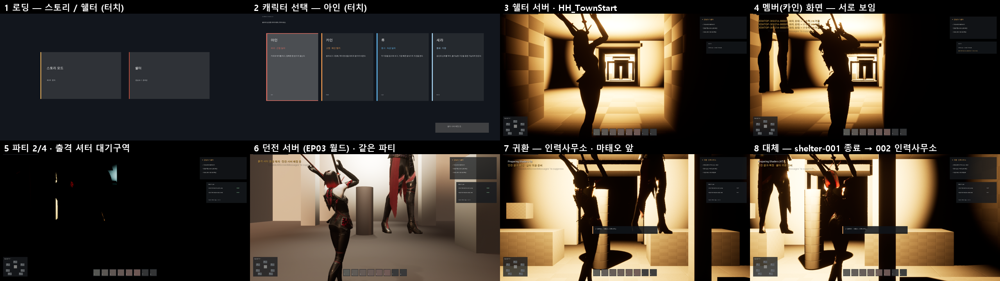

# 154 — 온라인 v6 «시작 마을» 통합: 로딩 → 캐릭터 선택 → 쉘터 서버 → 파티 → 던전 서버 → 인력사무소 귀환 (2026-09-29)

디렉터가 올린 `Hwanghon_Claude_Handoff_UE5.8_v6_StartingTown`(GPT 제작 `HwanghonShelter` v6)을 실제 프로젝트에 붙이고,
**전용 서버 2대 + 실제 클라이언트 2개**로 한 바퀴를 돌려 확인했다. 감사·결정은 문서 153.

## 1. 결정 (디렉터 2026-09-29)

- 앱 첫 화면 = **로딩 화면에서 «스토리 모드» / «쉘터»** 를 고른다. 스토리 = 제1부 EP01(오프라인), 쉘터 = 캐릭터 선택 → 온라인 B-1.
- 쉘터 = 시작 마을(v6): 처음 접속은 `HH_TownStart`, 던전에서 돌아오면 **인력사무소**(`HH_ManpowerOffice_Return`, 마태오 앞).
- Android(UE)는 세팅이 끝나고 다른 유저와 시험할 때. 소스 엔진은 검토 중 → 서버는 **에디터를 전용 서버로**(`-server`) 띄운다.
- 던전 전투의 서버 권한화는 다음 단계(문서 153 §8 권고 ②). 지금 던전은 입장·완료·귀환까지.

## 2. 구성

| 무엇 | 어디 |
|---|---|
| 플러그인 v6 (+ 이쪽 수정 §3) | `Plugins/HwanghonShelter/` |
| 로딩 화면(스토리/쉘터 카드, 터치·클릭) | `Game/HWLoadingFlow.*` — `AHWLoadingGameMode`, `AHWLoadingHUD` |
| 온라인 쉘터·던전 게임모드 | `Game/HWOnlineGameModes.*` — 네 영웅 C++ 클래스(아인·카인·류·세라), 원문 NPC 대사(서버+클라), 휴대폰 터치 |
| 원문 NPC 대사 공용화 | `Game/HWShelterCanon.*` (오프라인 `HWShelterGameMode` 와 같이 씀) |
| 맵 | `Scripts/ue_online_frontend.py` → `/Game/Hwanghon/Frontend/L_Loading`, `L_CharacterSelect`; `Scripts/ue_shelter_hub.py` → v6 빌더 + 동선 보정 |
| 던전 서버 맵 | 스토리 EP03 월드(원문 «강남 지하광장») + `?game=HWDungeonOnlineGameMode`, 미션 `GangnamStation_B2` |
| 매치메이커 | `tools/online/gateway.mjs` (v6 + 보안 §3.3), 시험 `tests/online-gateway.test.mjs` |
| 한 바퀴 실행 | `Scripts/run_online_loop.ps1` (`-Fallback`, `-Story`), QA `-HWQA=onlineloop` (`Tests/HWOnlineLoopQA.cpp`) |
| 설정 | `DefaultEngine.ini`: `GameDefaultMap=L_Loading`, `ServerDefaultMap=L_GangnamBunker_B1` (이 두 줄만) |

서버는 맵에 `?game=` 로 온라인 게임모드를 준다. 맵 자체는 오프라인 게임모드를 유지해 쉘터 QA·스토리 월드가 그대로 돈다.

## 3. v6 에서 고친 것 (GPT 전달: `docs/handoff-gpt-online-v5-2026-09-29.md` §10)

### 3.1 돌지 않던 것 — 재서 찾았다

| 증상 | 원인 | 조치 |
|---|---|---|
| **쉘터 서버가 뜨자마자 죽음** | 전용 서버는 글자판·조명 컴포넌트를 싣지 않는다 → `AHHShelterStation::OnConstruction` 널 접근 | 스테이션·NPC 이름판·셔터 상태글에 널 확인 |
| **접속한 누구도 못 움직임** (속도 0, 클라 몸 역할 1 = SimulatedProxy) | `RestartPlayer` 가 빙의 **뒤** `SetReplicates(true)` — UE 5.8 은 이때 RemoteRole 을 SimulatedProxy 로 되돌린다(엔진 `AActor::SetReplicates`) | 그 줄 제거(빙의가 이미 복제·AutonomousProxy 설정) |
| **귀환자가 인력사무소가 아니라 마을 입구에** (표시는 ManpowerOfficeReturn, 거리 19.7 m) | 시작 지점을 로그인 때(입장권 전) 골라 `StartSpot` 에 저장, 스폰 때 재사용 | `ShouldSpawnAtStartSpot=false` — 입장권 확인 뒤 다시 고른다 |
| 같은 PC 의 두 클라가 **같은 계정** | 계정 id 가 `Saved/Hwanghon/client_id.txt` 하나 | `-HHClientProfile=<이름>` 이면 프로필별 파일(개발용) |
| PC 에서 캐릭터 카드 **마우스 클릭 무반응** | HUD 히트박스는 `bEnableClickEvents` 가 있어야 클릭을 받는다(터치는 됨) | 켬 |
| UE 5.8 컴파일 오류 7 | `Engine/GameSession.h`·`Engine/GameStateBase.h` 경로, `GetGameState()` 템플릿, JSON 키 타입, 변수 가림 2 | 수정. 폐기 API(`NetUpdateFrequency` 직접 대입)도 setter 로 — 경고 0 |
| v2 에서 고친 것이 또 되돌아옴 | `Engine/SoftObjectPtr.h`, 파이썬 `Rotator(0, yaw, 0)` | 다시 수정 |

### 3.2 보안

- 매치메이커: `/v1/match/dungeon`·`/v1/match/return-shelter`(귀환 입장권 발급 = 파티장 위조 가능)·`/v1/status` 를 서버 전용(비밀키)으로.
  비밀이 없거나 `change-me` 면 **기동 거부**. 서버도 비밀이 없으면 매치메이커에 등록하지 않는다. 실행기는 실행마다 새 비밀(파일에 안 씀).
- 던전 개발용 완료(H 키)는 던전 서버를 `-AllowDevComplete` 로 띄웠을 때만.
- `tests/online-gateway.test.mjs`: 비밀 없이 기동 거부 / 입장권 1회·인스턴스 한정 / 서버 호출에 비밀 / 귀환권 = 인력사무소·파티·리더.
  던전 예약의 비밀 검사를 빼면 실패함을 확인했다.

## 4. 검증 — 전용 서버 2 + 클라이언트 2 (`run_online_loop.ps1`)

매치메이커 + 쉘터 서버(7777) + 던전 서버(7780, EP03) + 클라 2개(리더 아인 / 멤버 카인, 1280×720).
화면 조작은 모두 **터치**(`InputTouch` → HUD 히트박스, 휴대폰과 같은 길). 파티 조작은 플레이어 컨트롤러 RPC, 셔터까지는 **걸어서**.

| 게이트 | 리더 | 멤버 |
|---|---|---|
| 로딩 «쉘터» 카드 → 캐릭터 선택 → 카드 터치 | 아인 | 카인 |
| 첫 생성 `HH_TownStart` (shelter-001) | 0 cm | 84 cm |
| 서로 보임 | 84 cm | 84 cm |
| 파티 생성·초대·수락 (같은 파티 id, 리더 1/0) | PASS | PASS |
| 준비 → 걸어서 셔터 대기구역 | 3 s | 3 s |
| 출정 → 셔터 개방 → **같은 던전 서버**·같은 파티 | PASS | PASS |
| 던전 완료 → 귀환 `HH_ManpowerOffice_Return` | **0 cm** | **84 cm** |
| 파티·리더 복원, 귀환 표시 ManpowerOfficeReturn | PASS | PASS |
| 마태오가 화면 안·가리는 것 없음 | 8°, 4.1 m | 19°, 4.3 m |

- **원래 쉘터 우선**: 귀환 인스턴스 = shelter-001.
- **대체(`-Fallback`)**: 두 사람이 shelter-001 에 들어온 뒤 shelter-002 를 띄우고, 던전 중 shelter-001 을 끔 →
  둘 다 **shelter-002 의 인력사무소**(0 / 84 cm), 파티·리더 복원. FINISH ok=1 ×2.
- **스토리(`-Story`)**: 로딩 «스토리 모드» 카드 터치 → EP01. ok=1.
- 회귀: 오프라인 쉘터 QA 실패 0(도달 440 m², NPC 7/7, 시설 7/7, 대화·터치), UE Automation 38/38, npm 647/647.

## 5. 남은 것 (검증하지 않은 것 포함)

| 무엇 | 상태 |
|---|---|
| 부하 8/16/24/32 명(서버 프레임·메모리·대역폭) | **안 했다** — 다음 배치(`-nullrhi` 봇 클라) |
| 패키징 전용 서버·리눅스·원격 접속 | 안 됨 — 런처 엔진(문서 153 차단 요소 1). 같은 PC 에서만 확인 |
| 던전 전투(보스·판정) 서버 권한 | 안 함 — 지금 던전은 입장·완료·귀환만. 다음 단계 |
| 매치메이커 배정 | 가장 한가한 쉘터로 **나눈다** — 빈 쉘터 2대면 두 친구가 서로 다른 마을에. «채워서 모으기» 여부는 결정 필요 |
| 끊긴 쉘터가 목록에서 빠지기까지 15 s | 그 사이 귀환하면 죽은 서버로 보낸다(시험은 완료를 45 s 늦춰 피함). 귀환 실패 시 재배정 필요 |
| 화면 | 셔터 앞 외부 통로가 거의 까맣다(블록아웃에 조명 없음). 생성 직후 몇 초 등장 자세(팔을 든) — 오프라인과 같음 |
| 휴대폰 조작 | 파티(P/I/Y/R)·출정(G) 에 터치 버튼이 없다, 프롬프트가 «F» |
| 두호·오정길 | 디자인 시트 없음 → 외형 없음(원기둥 프록시) |
| 엔진 경고 | `-InstanceId=` 가 엔진 자체 인자와 겹쳐 «Invalid InstanceId» 경고(동작은 정상) |

## 6. 롤백

- 이 배치는 커밋 하나. 되돌리기 = `git revert <커밋>`.
- 플러그인은 폴더 통째(이전 커밋 = v2 + 수정 2).
- 맵은 커밋하지 않는다(`Content/` 는 `Data` 만). `ue_online_frontend.py`·`ue_shelter_hub.py` 로 다시 만든다.
- 설정은 `GameDefaultMap`/`ServerDefaultMap` 두 줄만 바뀌었다 — 되돌리면 EP01 로 시작.
