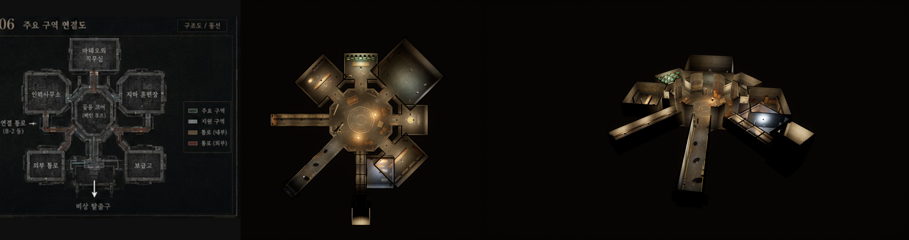
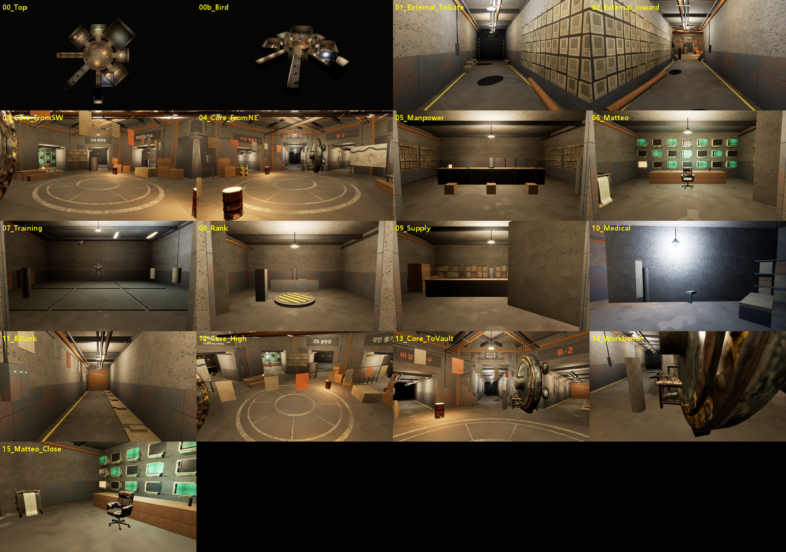
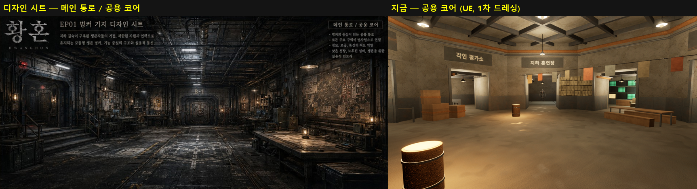
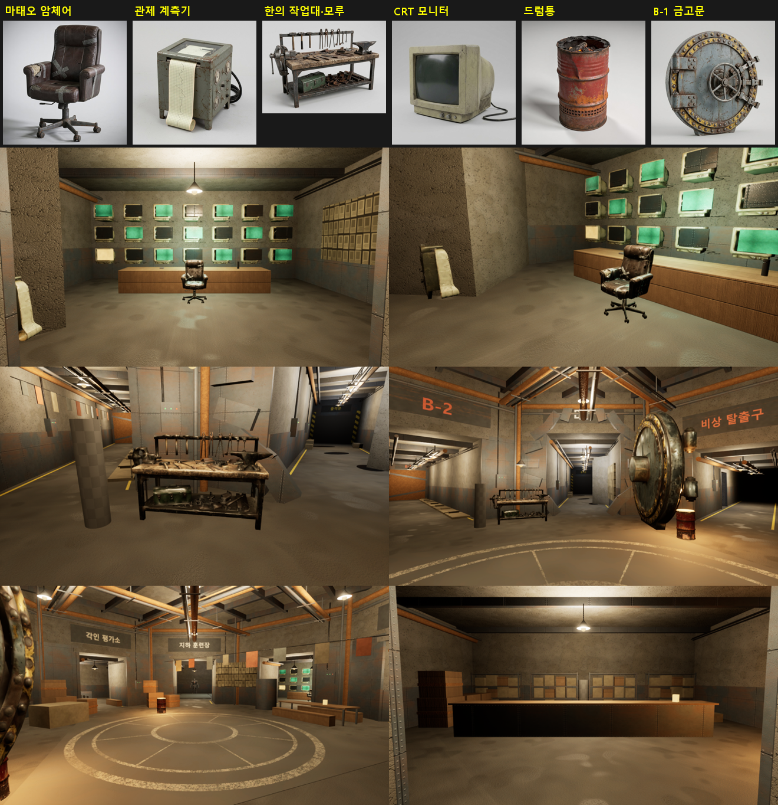

# 155 — 강남 벙커 쉘터: 디자인 시트 연결도 + 원문 시설로 다시 짓기, 1차 드레싱 (2026-09-29)

디렉터: «쉘터를 구현해보자» → 배치는 **EP01 벙커 디자인 시트 + 원문**, 겉모습은 **UE 안에서 먼저, 핵심 소품만 Hi3D**(선택 2026-09-29).
GPT 플러그인의 블록아웃(방 7개 + 이쪽 동선 보정, 문서 152) 대신 우리 빌더로 새로 지었다. 플러그인의 스테이션·NPC·허브·출격 셔터·온라인 흐름은 그대로 쓴다.

## 1. 배치 — 시트 §06 «주요 구역 연결도»

8각 공용 코어(지름 18 m, 높이 7 m)의 여덟 면에 한 갈래씩. 시트에 없는 원문 시설(각인 평가소·의무실)은 «지원 구역»으로 붙였다.

| 방향 | 구역 | 원문 / 시트 | 시설·NPC |
|---|---|---|---|
| 북 | 마태오 직무실 | CRT 벽 «절반은 죽어», 한 화면만 반복 영상, 암체어(L576-L596), 관제 계측기(L7368) | — |
| 북서 | 인력사무소 | 시트 02 «STAFFING OFFICE», 게시판·기록 보관함 | 01 파티(마태오), 05 의뢰판(두호), **귀환 지점 4** |
| 북동 | 지하 훈련장 | «낡은 매트와 깨진 형광등이 전부»(L658), 시트 03 허수아비 | 04 훈련(오정길), 허수아비 = EP01 훈련 보스 몸 |
| 동 | 각인 평가소 | «발판 위로»(L425), 평가소 앞 줄(L8777) | 02 평가(유진) |
| 남동 | 보급고 | 배급 줄(L277), 드럼통 불(L261) | 07 배급(수희) |
| 남 | 비상 탈출구 + 옆방 의무실 | 시트 «비상 탈출구», 물 자국 천장의 의무실(L4624) | 06 의무실(닥터 진) |
| 남서 | 외부 통로 → 출격문 | 시트 04, 출격문(L3966), 실종자 벽보(L285) | 셔터, **첫 생성 4** |
| 서 | B-2 연결 통로 | 시트 05 «B-2», 통로에서 사는 사람들(L261) | 막힌 철문, 침낭·빨래 |
| 코어 | 공용 코어 | 한 장인의 작업대 «통로 한쪽»(L295), 벽의 도면(L6632) | 03 제작(한) |



**좌우 뒤집힘 (고침)**: 처음 지은 평면은 시트와 거울상이었다. UE 는 왼손 좌표계라 위에서 보면 +X 가 오른쪽일 때 +Y 가 **아래**인데,
배치를 +Y = 북(위)으로 적었다. 도달 지도(PPM)는 +Y 를 위로 그려 맞아 보였고, 천장을 걷은 위 시점 사진에서 드러났다.
빌더의 `Frame` 이 배치를 월드로 옮길 때 뒤집는다(`MIRROR`, 방 안의 좌우는 그대로). HUD 미니맵도 +Y 를 위로 그려 실제 월드와
거울상이었다 — 위에서 본 그대로(+Y 아래) 그리게 고쳤다.

## 2. 겉모습 — 1차 드레싱 (외부 생성 0)

- **재질**: `tools/shelter/make_textures.py` 가 시트의 «재질 / 색감»(노후 콘크리트·도장 철판·녹슨 금속·고무 바닥·거친 천)과
  원문(«물 자국이 지도처럼»)으로 반복 텍스처를 만든다(주기 FFT 노이즈, 이음매 없음). `M_HW_B1_Env` 하나가
  **월드 좌표 투영**(면의 법선 축으로 평면 선택)이라 늘린 상자에도 늘어나지 않는다. 맵마다 1 샘플(모바일 지시서 P9).
- **디테일**(시트 «주요 디테일»): 모든 벽 안쪽 철판 띠, 문틀, 천장 보, 통로·방의 배관과 케이블, 조명마다 등기구(케이블·갓·전구),
  경고 줄무늬, **손으로 칠한 표지**(«B-1», «B-2», «인력사무소 STAFFING OFFICE», «보급고», «의무실», «각인 평가소», «지하 훈련장», «출격문», «비상 탈출구»).
- **생활**: 드럼통 불, 빨래줄, 긴 탁자·벤치, 상자, 선반, 침낭, 줄 로프, 커튼.
- 조명 36개(점광원, 그림자 끔), 노출은 어두운 쪽으로 고정(히스토그램 EV 2–5, -0.8), 옅은 안개.
- 플러그인의 3D 이름판은 한글 글꼴이 없어 □ 로 그려져 숨겼다(이름은 HUD 와 칠한 표지).





### 2.1 2차 — 밀도 (디렉터 «진행해», 같은 날)

- 코어 천장을 가로지르는 배관 다발(동서·남북·대각, 걸이와 띠), 코어 벽 철판을 4.2 m 까지, 모서리마다 수직 배관,
  면마다 배전함(빨강·초록 표시등과 전선관)
- 바닥: 코어의 칠한 원형 문양(8각 코어의 여덟 살, 발에 닳음 — 로고는 지어내지 않음), 모든 통로 양쪽 노란 통행선
- **B-1 원형 금고문**: 외부 통로 입구에 원형 문틀, 문짝은 코어 쪽으로 열려 있다(바퀴 핸들)
- 손으로 그린 지도판(강·길·격자·빨간 표시 — 실제 지리를 주장하지 않는다), 물탱크, 가스통, 덮개 더미, 탁자 등불
- 방: 인력사무소 서류·의자·등불, 직무실 재떨이·병, 훈련장 샌드백·원판, 평가소 대기 벤치, 보급고 포대·통, 의무실 선반·링거대,
  외부 통로 쓰러진 배관·물웅덩이
- 액터 847 → 1160, 조명 36 그대로(추가 광원은 발광 재질만). 도달 895 → 799 m²(소품), NPC·시설 모두 닿음

**남은 차이**: 시트는 여전히 더 어둡고 잡동사니가 많다. 소품이 상자·원기둥 조합이라 형태가 단순하다 — 핵심 소품은 Hi3D(§5).

### 2.2 3차 — Hi3D 핵심 소품 6 (디렉터 «6개 만들어서 배치해보고 보여줘»)

| 소품 | 근거 | 게임 크기 | 면 / 텍스처 |
|---|---|---|---|
| 마태오 암체어 | «암체어가 돌아갔다»(L596), 화면을 등지고 앉음 | 높이 120 cm | 12k / 1K |
| 관제 계측기 | «바늘이 종이 위에 선을 긋는… 종이가 한 칸씩 밀려 나왔고»(L7368) | 115 cm | 10k / 1K |
| 한의 작업대·모루 | «통로 한쪽에 작업대… 쇠를 두드린다»(L295) | 길이 260 cm | 20k / 2K |
| CRT 모니터 ×21 | «CRT 모니터가 벽 한 면을 채운 방»(L576) — 화면 유리는 우리 발광판(켜짐·꺼짐·반복 영상) | 70 cm | 3k / 512 |
| 드럼통 ×6 | «드럼통에 지핀 불»(L261) | 90 cm | 5k / 1K |
| B-1 금고문 | 시트 메인 통로의 원형 «B-1» 문 | 지름 480 cm | 20k / 2K |

- 길: Hi3D **텍스트→이미지**(Nano Banana 2 / Seedream 4.5, 장당 3–4 크레딧)로 단색 배경 소품 사진 → **이미지→3D**(v3.0 극한 디테일,
  지오메트리+텍스처, 비공개, 65 크레딧) → `tools/shelter/prep_prop.py`(실제 크기, 바닥 중앙 피벗, 모바일 면 예산 P8, JPEG 텍스처) →
  `Scripts/ue_shelter_props.py`(상자 충돌, Nanite 끔) → 빌더가 대역 상자 자리에 놓는다(`hero()`, 없으면 대역 그대로).
- 앞 방향: 여섯 모델 모두 GLB 의 -Y 가 앞(미리보기로 확인) — UE 에서는 +Y, 보스 몸과 같은 이유로 -90°.
- 크레딧: 이미지 약 30 + 3D 6×65 = 약 420 (잔액 7,459 → 7,035). Seedream 대기열이 한 번에 여러 장을 받자 99% 에서 멈춰
  Nano Banana 2 로 다시 뽑았다(멈춘 것은 과금 없음).
- 입력 사진: `art/shelter/props/inputs/`, 게임용 GLB: `art/shelter/props/*.glb`(합계 4.5 MB). Hi3D 원본(각 60 MB)은 커밋하지 않는다.



## 3. 동작 확인

| 검사 | 결과 |
|---|---|
| 오프라인 쉘터 QA (`-HWQA=sheltershow`) | 도달 826 m²(뒤집은 뒤), NPC 7/7·시설 7/7, 7명 원문 대사·시설 메뉴·터치, 실패 0 |
| 온라인 한 바퀴 (`run_online_loop.ps1`) | 두 클라 ok=1 — 마을 입구 생성 0 cm, 셔터, 던전, **인력사무소 귀환 0 cm**, 마태오 6.7–7.8 m 앞 정면 |
| 투어 (`run_shelter_tour.ps1`, `-HWQA=sheltertour`) | 시점 17 곳 (위·비스듬한 전경은 3.3 m 위를 숨기고 찍는다) |

이번에 같이 고친 것: 파티가 함께 돌아오면 두 번째 몸이 첫 번째 위로(그다음 카운터 위로) 밀려났다 — v6 가 태그가 같은 시작 지점 중
**첫 번째만** 골랐다. 시작 지점을 태그마다 넷 두고 비어 있는 것을 고른다(플러그인 `ChoosePlayerStart`). HUD 미니맵은 고정 그림 대신
실제 스테이션 위치와 내 위치를 그린다.

## 4. 만드는 법

```
python tools/shelter/make_textures.py                                   # art/shelter/tex (커밋 안 함, 다시 만든다)
UnrealEditor-Cmd <uproject> -ExecutePythonScript="Scripts/ue_shelter_materials.py" -unattended -nullrhi
UnrealEditor-Cmd <uproject> -ExecutePythonScript="Scripts/ue_shelter_b1.py" -unattended -nullrhi
.\Scripts\run_shelter_tour.ps1 -Out <dir>
```

`ue_shelter_hub.py`(플러그인 블록아웃 + 보정)는 기록으로 남는다 — 같은 맵을 덮으니 둘 중 하나만 쓴다.

## 5. 다음

1. ~~밀도~~ (§2.1). 남은 것: 코어 왼쪽 계단(시트), 천장 조명의 깜빡임(«발전기가 늙었다» L253, 실행 중 효과).
2. ~~핵심 소품 Hi3D~~ (§2.2). 다음 후보: 배급대, 침상·침낭, 선반, 산업용 등기구, 허수아비(시트 03 의 칼 꽂힌 훈련 허수아비).
3. 모바일: 액터 847 → 같은 재질끼리 묶기(ISM/병합), 정적 조명 굽기, Android 실기 측정.
4. NPC 몸 — 디자인 시트 턴어라운드 → Hi3D → 보스와 같은 리깅(문서 151). 지금은 원기둥.
