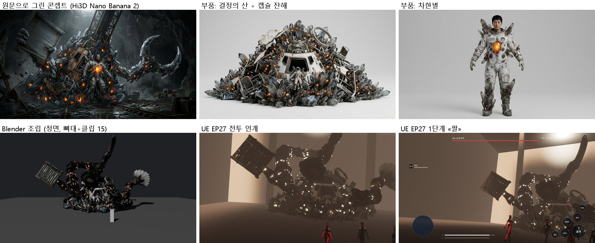
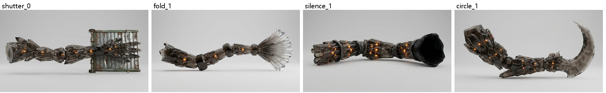

# 156 — 나노-노바 코어 (EP27): 원문의 «결정의 산»으로 새로 만들기 (2026-09-29)

디렉터: «나노 노바 있을거야. 프로젝트내에 대화를 찾아보자» → «나눠서 하자. 문맥에 맞게 만들어»

## 1. 찾은 것과 결정

- UEIntroProject(8/25 세션, GPT 아레나 킷 v3.0 §19.14)는 **EP27·EP28 을 한 보스로 합쳤다**:
  «고흥 갱도·증폭 탑의 구조물 보스», 코어 잠금 → 증폭 탑 앵커 4기, 거짓 종료 뒤 남은 신호가 탑을 무너뜨림.
  그 도감 그림 `T_BossArt_NanoNovaCore` 와 킷 메시(4×4×9 m)는 **우리 `amplifier_tower.jpg` 와 같은 탑 디자인**이다.
- 원문은 두 싸움이다. EP27 은 발사대 아래 지하의 «결정의 산»(차한별)이고, EP28 은 지상의 탑이다
  («이 년의 마지막 적은, 괴물이 아니라 탑이었다»).
- **결정: 나눈다.** 탑 그림은 EP28 증폭 탑의 것으로 두고(이미 만든 정적 몸), EP27 은 원문 묘사로 새로 디자인한다.
  `docs/story/BOSS_CANON_INDEX.md` 에 적었다.

## 2. 원문 → 디자인

| 원문 (EP27) | 디자인 |
|---|---|
| «지하 공간의 절반을 채운 결정의 산. 노바 1호의 귀환 캡슐 잔해가 그 산의 골격… 찢긴 내열판과 좌석 프레임이 결정 사이로 화석처럼» (L14532) | 연기색 결정 더미. 속에 캡슐 잔해(해치 링, 좌석 프레임, 내열판)가 보인다 |
| «코어들… 산의 표면 아래서 층층이 맥동» (L14532) | 표면 아래 호박색 코어 수백 개. 기본 색에서 뽑은 발광 맵으로 표현하고, 심장 박동에 맞춰 부푼다 |
| «산의 중심, 캡슐 잔해의 조종석이 있던 자리에, 사람의 형태가 박혀… 우주복의 잔해… 얼굴만은 온전한» (L14536-L14538) | 앞 가운데 조종석 구멍에 선 차한별. 찢긴 우주복, 결정이 박힌 몸, 가슴의 코어(심장) |
| «산의 사면에서 팔들이 자라났다» 셔터 / 공간의 주름 / 소리 지우기 (L14700-L14734) | 사면의 팔 셋. 셔터를 쥔 팔(경첩 소켓), 주름 막 부채 팔, 빛을 삼키는 검은 두건 팔 |
| «산의 중심이 열리며… 원을 그리는 팔… 팔꿈치 관절» (L14760-L14807) | 꼭대기(중심)에서 나오는 초승달 날의 팔. 팔꿈치 공(류가 꿰는 곳)이 있다 |
| «팔들이 무너져 도로 산의 사면이 되었고» (L14869) | death 클립: 팔이 사면으로 쓰러져 가라앉고 심장이 잦아든다 |

- 원문에 수치가 없어 설계값으로 정한 것(TBD_CANON): 산 폭 18 m·높이 8.9 m, 차한별 1.8 m, 팔 10–15 m, 호박색 코어(허수아비 «주황 결정»과 같은 계열).
- 무음 팔의 두건, 접힘 팔의 부채는 원문 기능(«소리를 지웠다», «공간의 주름을 접었다»)을 형태로 옮긴 해석이다.

## 3. 만든 길

1. Hi3D 텍스트→이미지(Nano Banana 2)로 원문 콘셉트 1장과 부품 6개(산, 차한별, 팔 넷)를 단색 배경으로 뽑았다
   → `art/3d/src/part1_views/nano_nova/*.jpg`.
2. 이미지→3D(v3.0 극한 디테일, 비공개) 6개 × 65 크레딧. 산은 첫 시도가 목록에서 사라져(환불) 다시 넣었다. 원본은 `art/3d/src/part1_hi3d/nano_nova/`(커밋 안 함).
3. `tools/3d/build_nano_nova.py`(Blender):
   - 크기를 맞추고 면을 줄인다: 산 3만, 차한별 1.2만, 팔 8천–1만 → 합계 7.6만 면. 텍스처는 산·차한별·원의 팔 2K, 나머지 1K, JPEG.
   - 호박색 텍셀을 발광 맵으로 만든다.
   - 팔 방향을 맞춘다: 긴 가로축을 X 로 돌리고(주성분), 단면이 작은 쪽을 뿌리로 본다. 접힘·원의 팔은 뒤집혀 있었다.
   - 팔을 산 표면(레이캐스트)에 0.9 m 묻는다.
   - **원점 = 차한별.** 전투 사거리(200–300 cm)는 보스 원점까지 잰다. 원문의 결정타는 «차한별의 가슴»에 떨어지므로(L14827-L14857) 산은 그 뒤에 놓인다.
   - 뼈대: Root / Mountain / Heart / 팔마다 3마디, 그리고 전투 코드가 땅을 재는 발 뼈(움직이지 않음).
   - 클립 15개는 사람 뼈대 보스와 이름이 같다(`ue_boss_training_setup.build` 가 그대로 패턴 표를 만든다). 접점도 그 표에 맞췄다.
     atk_charge 0.22(셔터 팔 밀치기) · atk_spin 0.29–0.535(원의 팔이 앞을 가로지른다, 반경이 산의 곱절이라 «원의 안쪽»이 안전하다) ·
     atk_hammer 0.48(접힘·무음 팔 내려찍기 + 심장 크게) · atk_slam 0.31(모든 팔 회수 낙하, L14829) · hit / stagger / down / death.
   - 기본 자세는 팔을 옆·뒤로 벌린다. 첫 판은 셔터 팔이 일행 머리 위를 덮어 카메라를 가렸다.
4. `art/3d/part1/nano_nova_core.glb`(6.6 MB)를 `DefaultGame.ini` 에 `boss_nano_nova_core` 로 등록했다(MeshYaw -90).
   `build_story_episodes.py` 의 BODIES 에 넣었다(kind «built»). UE 에는 `ue_boss_part1_setup.py`(HW_BOSSES=nano_nova_core)로 가져와 `DA_Boss_nano_nova_core` 12 패턴을 만들었다.
5. EP27 전장: 천장 900 → **2600 cm**(`ceiling_cm`, 산 9 m + 팔). 몸이 있으면 임시 «결정 산» 구체를 짓지 않는다(`ue_story_world.py`).

## 4. 확인

- `run_story_qa.ps1 -Episodes EP27`: **FINISH ok=1**. 6단계(팔 → 원 → «지금……» 류 → «지금……» 카인 → 회수 → 박동)를 거쳐
  250 cm 에서 결정타, «서걱. 한 번이었다.»까지 갔다.
- 첫 캡처는 텍스처 스트리밍 전이라 회색이다(QA 가 로딩을 기다리지 않는다).

## 5. 남은 것

1. **거대 보스 카메라**: 사거리가 2–3 m 라 전투 카메라가 차한별 발밑에서 산을 올려다본다. 산 전체와 원의 팔이 읽히게 뒤로 빼고 올려야 한다(카메라 거리를 보스 크기에 비례시킨다).
2. 산에는 아직 충돌이 없다. 일행이 산 속으로 걸어 들어갈 수 있으니 단순 충돌 몇 개를 넣어야 한다.
3. 코어 발광이 노출에서 하얗게 뜬다. 호박색이 남게 세기와 노출을 조정한다.
4. 원문 «탑의 뿌리가 내려와 박힌 지하의 방»(L14521): 천장에서 산으로 내려오는 탑 뿌리. EP28 탑과 이어지는 장면이다.
5. EP27 끝 → EP28: «심장은… 껐다… 신호는… 심장이… 아니다» 뒤 «지상의 탑이 켜짐». GPT 설계의 «남은 신호»를 이 연결로 쓴다.
