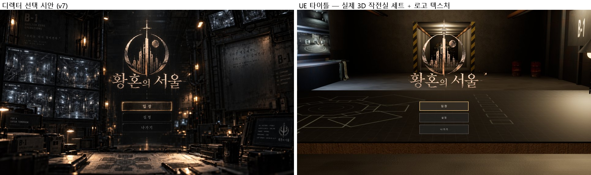
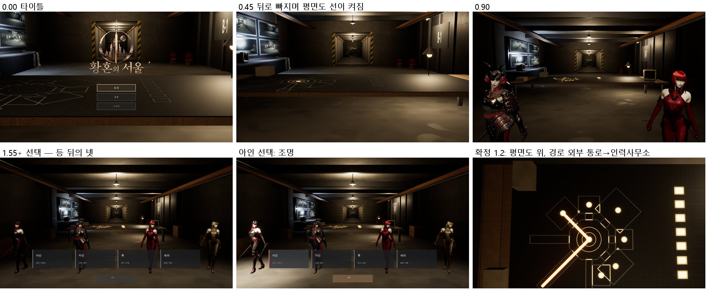

# 158 — 황혼의 서울 타이틀과 입장 연출 (v7 + 참고 영상, 2026-09-29)

디렉터: «그거 하고 로그인화면 유투브 영상보고 참고 해서 만들자» + GPT 핸드오프 v7(EntryCinematic).
영상 학습과 연출 주문서 틀은 문서 157.

## 1. 무엇을 받아 무엇을 했나

| v7 요구 | 한 것 |
|---|---|
| 정식 타이틀 «황혼의 서울», 부제 금지, 장문 금지 | 로고 = 선택 시안에서 잘라 낸 투명 텍스처 `T_HW_FE_Logo`(배경에 굽지 않음). 화면 글자는 입장·설정·나가기와 카드 이름·역할 두 단어뿐 |
| 실제 UE 3D 작전실로 선택 시안 구도 재현 | `Scripts/ue_frontend_set.py` 가 `L_CharacterSelect` 를 작전실로 짓는다. 쉘터 재질(MI_HW_B1_*)과 Hi3D 소품(CRT, 계측기, 드럼, 금고문)을 쓰고, 액터 126·조명 15로 가볍게 유지 |
| `AHHFrontEndCinematicDirector`, 4단계 HUD, 이동 보류, 0.38 s 도착 페이드 | v7 코드 통합. 우리 수정(클릭 이벤트, RoleLabel, 클라 프로필, 개발용 완료 게이트)은 다시 얹었다 |
| 캐릭터 선택: 실제 3D 캐릭터 + 이름 + 역할 두 단어 | 넷이 방에 서 있다(프로젝트 현재 몸, Idle_Relaxed). 고른 캐릭터는 조명이 올라간다(측정 12 → 41) |
| 서버 응답이 먼저 와도 연출이 끝날 때까지 이동 보류 | `SetTravelDeferred` / `ReleaseDeferredTravel`(v7). 온라인 한 바퀴로 확인했다 |

## 2. 연출 주문서 («자세히», 문서 157 틀)

```
[무엇]      타이틀 → 입장 → 캐릭터 선택 → 쉘터 연결. UE 카메라 + 세트 안의 2D 그래픽(탁자 위 B-1 평면도)
[길이·크기] 입장 1.55 s, 연결 1.20 s, 도착 페이드 0.38 s. 모바일 가로 우선
[장면 순서]
  타이틀  카메라 (-400, 0, 160) FOV 50, 아래로 8°. 가운데 복도 끝 금고문 위에 로고, 왼쪽 CCTV 벽, 오른쪽 B-1 철벽,
          전경은 탁자와 B-1 평면도(선이 꺼진 도면)
  0.00    입장 누름 → UI 즉시 사라짐, 입력 잠금
  0.00~1.55  카메라가 (-1250, 0, 205) FOV 72 로 뒤로 빠진다. 타이틀 카메라 등 뒤에 서 있던 넷이 드러난다
  0.16~1.32  평면도 선이 코어부터 바깥 갈래로 켜지고, 시설 핀 7개와 범례 칸이 차례로 뜬다   («평면도 → 3D 세우기» S08)
  1.55    캐릭터 선택: 카드 넷(이름 + 역할 두 단어) + «선택»
  확정 0.00~1.20  카메라가 평면도 위로 내려간다(-86°, FOV 74). 0.30~1.20 경로가 그어진다:
          외부 통로 → 코어 → 인력사무소 (첫 입장 HH_TownStart 와 귀환 인력사무소의 길)          («찾아오는 길 경로 그리기» M03)
  연결    서버 배정 + 연출 종료 둘 다 끝나야 ClientTravel. 쉘터 도착 0.38 s 검정 → 화면
[볼거리 한 컷] 뒤로 빠지는 카메라와 함께 탁자 위 도면에 불이 번져 가는 순간
[모양]      호박색 선과 핀(코어 색), 도면은 차가운 청회색 종이 + 격자, 글자 없음
[움직임]    smoothstep. 도면은 카메라와 같은 시계로 움직인다(MPC_HW_FrontEnd: HH_Reveal / HH_Route)
[하지 말 것] 장문·슬로건·«사신의 각인», 과한 네온, 원본에 없는 로비, 배경 이미지에 글자 굽기
```

- v7 기준값(타이틀 FOV 34 → 58)은 프록시 세트 기준이었다. 선택 시안이 넓은 화면이라 타이틀을 FOV 50 으로 시작하고, 72 로 빠진다.
  «최종 카메라 수치는 실제 B-1 세트에 맞춰 재조정»(v7)에 따랐다.
- v7 은 연결 때 «B-1 내부 방향으로» 카메라를 옮긴다. 여기서는 탁자 위 B-1 평면도로 내려가 도착할 길을 그린다
  (참고 영상의 지도·경로 연출). 도착 지점(외부 통로)과 경로 시작이 같은 곳이라 이어진다.
- 흐름: 로딩(스토리 / 쉘터, 디렉터 결정 2026-09-29) → 쉘터를 고르면 이 타이틀. 스토리 모드는 로딩 화면에 남긴다.




## 3. 만든 것

- `tools/frontend/make_frontend_tex.py` → `art/frontend/`
  - `T_HW_FE_Plan_C/M`: 쉘터 빌더의 실제 배치(ARMS)로 그린 도면. 마스크는 R 선 · G 켜지는 순서 · B 핀 · A 경로 진행
  - `T_HW_FE_Feed_0..3`: 우리 쉘터 투어 화면을 CCTV 처리(회색, 차가운 색, 주사선, 노이즈, 비네트, 자막 없음)
  - `T_HW_FE_Logo`: 시안에서 잘라 낸 로고
- `Scripts/ue_frontend_set.py`: 텍스처, `MPC_HW_FrontEnd`, `M_HW_FE_Plan`(켜짐 게이트), `M_HW_FE_Screen` + MI 4, 작전실·복도·탁자·CCTV·B-1 철벽, 영웅 넷과 키 라이트, 디렉터(카메라 값), 노출 고정·비네트·그레인
- 플러그인: `HHFrontEndCinematicDirector`(+ 세트 파라미터 구동), `HHCharacterSelectHUD`(시안 버튼 세 개 + 로고 텍스처 + 영웅 조명), `HHOnlineFlowSubsystem`(이동 보류), `HHShelterOnlinePlayerController`(도착 페이드)
- QA: `-HWQA=frontend`(타임라인대로 캡처, 단계 확인). `-HWQA=onlineloop` 은 새 화면을 따라 입장 → 카드 → 선택을 누르고 관문 `entry_reveal` 을 추가했다

## 4. 확인

| 검사 | 결과 |
|---|---|
| `-HWQA=frontend` | FINISH ok=1. 입장 뒤 단계 Selection, 연결 뒤 Hold |
| 온라인 한 바퀴(서버 2 + 클라 2, `run_online_loop.ps1`) | 두 클라 ok=1, 실패 0. entry_reveal, 선택, 마을 입구 0 cm, 서로 보임, 파티, 던전 2명, 인력사무소 귀환 0 cm, 파티 복원, 마태오 2°/4° |
| entry_reveal 일부러 깨기(전환 중인 1.0 s 에 검사) | 두 클라 모두 `ok=0 title 입장 reveal` → 되돌림 |
| Automation | 38/38 |
| npm test | 647 통과 |

- 온라인 QA 의 타이틀·선택 캡처(`02a_title`, `02_select`)에는 HUD 가 안 찍힌다. HUD 로그로는 그 시각에 1280×720 으로 그리고 있다.
  같은 맵을 바로 띄운 `-HWQA=frontend` 캡처에는 로고·버튼·카드가 나온다. 두 창이 겹치는 온라인 실행에서 UI 포함 캡처가
  HUD 를 놓치는 것으로 보이는데, 원인은 미확정이다.

## 5. 남은 것

1. 모바일: 세트를 안드로이드에서 재기(조명 15 는 모두 움직이는 점광원·스포트 — 굽기 후보)
2. 설정 화면 연결(지금은 v7 과 같은 자리 표시)
3. 로고는 시안 해상도(490 px 를 2 배)다. 최종 로고는 벡터나 고해상도로 다시 만든다
4. v7 부하 시험 8 → 16 → 24 → 32(미실시)
5. 연결 중 카메라가 0.6 s 쯤 바닥을 비춘다. 회전을 위치보다 먼저 끝내면 탁자가 더 일찍 잡힌다
