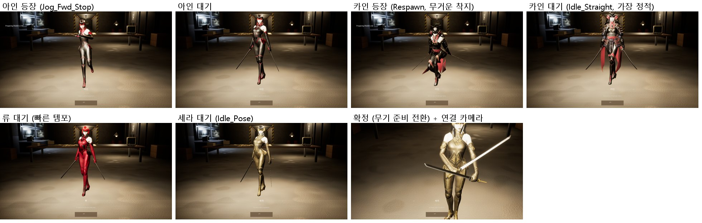
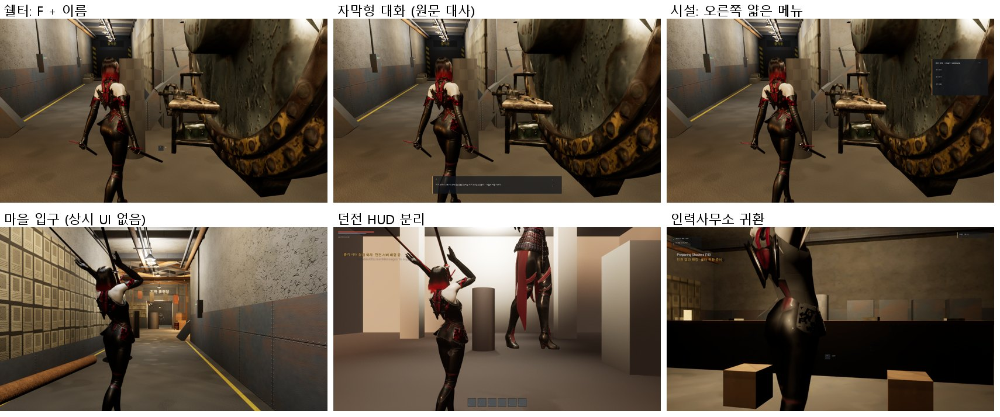

# 159 — v9 캐릭터 소개 스탠드 + v8 최소 UI 통합 (2026-09-29)

디렉터가 GPT 핸드오프 v9(CharacterPresentation, v8 Minimal UI 포함)와 두 번째 참고 영상을 줬다(영상은 문서 157 §5).

## 1. 받은 것 → 한 것

| v8/v9 | 통합 |
|---|---|
| 캐릭터 선택: 카드 4장 폐기, 실제 3D 캐릭터 한 명 + ‹ › + 이름 · 역할 두 단어 · 한 문장 + 선택 | `AHHCharacterSelectStand` 가 작전실에서 네 명이 서 있던 자리(-700, 0)에 있다. 입장 연출이 끝나면 아인이 등장한다 |
| 캐릭터별 Intro / Idle / Confirm, BP 인터페이스 `UHHCharacterPresentationInterface`, 없으면 앵커 fallback | 이 프로젝트에는 캐릭터별 BP 가 없다(몸 = 메시 + 애니, DefaultGame.ini). 스탠드에 `FHHSelectionBody`(메시 + 세 박자 클립 + 속도)를 더했다. BP 클래스가 지정되면 v9 대로 그쪽이 우선한다 |
| «비슷한 idle/ready 모션이 있으면 새 몽타주부터 만들지 말고 재사용» | 기존 Paragon Countess 클립으로 캐릭터마다 다르게 맞췄다(아래 표) |
| 쉘터 상시 UI 제거(스킬바 · 미니맵 · 퀘스트 · 솔로 파티 패널), NPC «F + 이름», 자막형 대화, 오른쪽 얇은 시설 메뉴 | v9 `AHHShelterHUD` 를 그대로 받았다. 우리 수정은 미니맵(실제 스테이션 위치)뿐이었는데 v8 이 미니맵을 없앴다 |
| 던전 HUD 분리 `AHHDungeonHUD` | 받았다. `HHDungeonOnlineGameMode` 는 우리 수정본(include, 인스턴스 비밀 헤더, 개발용 완료 게이트)에 HUD 클래스 두 줄만 바꿨다 — v9 파일을 통째로 덮었다가 이전 수정이 사라진 것을 빌드 오류로 발견해 되돌렸다 |
| 타이틀: 입장 하나 + 구석의 작은 ⚙ / × | 로고 텍스처(문서 158)는 유지하고 설정 · 나가기를 구석의 작은 글자로 뒀다(⚙ × 기호는 캔버스 글꼴에 없다) |

## 2. 캐릭터별 세 박자 (재사용한 클립)

| | 등장 Intro | 대기 Idle | 확정 Confirm | v9 연출 언어 |
|---|---|---|---|---|
| 아인 | Jog_Fwd_Stop ×1.0 (걸어 들어와 멈춤) | Idle_Relaxed ×1.0 | Ability_Q_target_transition (무기 준비 0.83 s) | 정밀하고 절제된 준비 |
| 카인 | Respawn ×0.9 (무거운 착지) | Idle_Straight ×0.8 (가장 정적) | Ability_E_target_transition ×0.85 | 가장 무겁고 정적 |
| 류 | Jog_Fwd_Stop ×1.45 | Idle_Relaxed ×1.3 | Ability_R_target_transition ×1.2 | 가장 빠른 탄성 |
| 세라 | Jog_Fwd_Stop ×0.9 | Idle_Pose (흔들림 최소) | Ability_E_target_transition ×0.9 | 흔들림이 적은 정밀 제어 |

- 세라 확정은 처음에 `Cast` 였다. 캡처에서 팔을 높이 드는 자세가 v9 «마법사/성녀식 포즈 금지»에 걸려 바꿨다.
- 박자 길이는 클립 길이 / 속도다(v9 fallback 0.62 / 0.72 s 대신). 앵커 fallback 은 등장 때 짧은 진입(뒤·옆 → 제자리)만 겹친다.
- 선택 카메라는 (-1130, 0, 150), FOV 55, 아래로 12°다. 캐릭터가 화면 위 3/4 를 차지하고 이름은 발밑에 온다
  (첫 판은 이름이 무릎 위에 겹쳤다).

## 3. 확인

| 검사 | 결과 |
|---|---|
| `-HWQA=frontend` | ok=1. 입장 → Selection, 네 명이 차례로 스탠드에서 Idle 에 정착(아인 → › 카인 → › 류 → › 세라), 확정 → Hold |
| 온라인 한 바퀴(2 서버 + 2 클라) | 두 클라 ok=1, 실패 0. 선택은 › 를 필요한 만큼 누른다(리더 아인 0 번, 멤버 카인 1 번) |
| 오프라인 쉘터 QA(`-HWQA=sheltershow`) | ok=1, 실패 0 — 도달 826 m², NPC 7명 원문 대사, 시설 메뉴(오른쪽 레일), 터치 |
| Automation / npm | 38/38 / 647 |

## 4. 남은 것

1. **몸이 디자인과 다르다.** v9 문서의 네 명(아인: 낫 + 오른쪽 생체기계 건틀릿, 카인: 대검, 류: 후드 + 쌍단검, 세라: 흑발 단발 · 안경 ·
   가죽 롱코트 · 금속 봉)과 달리, 지금 UE 몸은 넷 다 Paragon Countess 스킨이다. 디자인 시트(`ain_design_sheet_9132.png` 등) →
   Hi3D → 리깅으로 실제 몸을 만들어야 v9 연출이 의도대로 읽힌다.
2. 몸이 생기면 박자마다 전용 몽타주(v9: 낫 그립 확인, 대검 무게, 단검 교차, 봉 정렬)를 붙인다. 참고 영상(문서 157 §5)대로 Blender 에서 직접 키를 잡을 수 있다.
3. Common UI + UMG 이관(v8 COMMONUI_MIGRATION): 지금은 C++ Canvas HUD 다.
