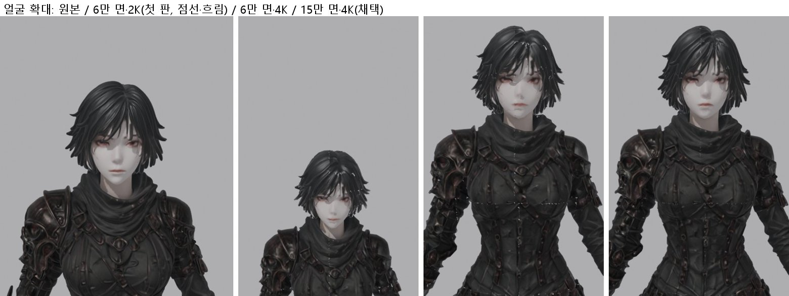
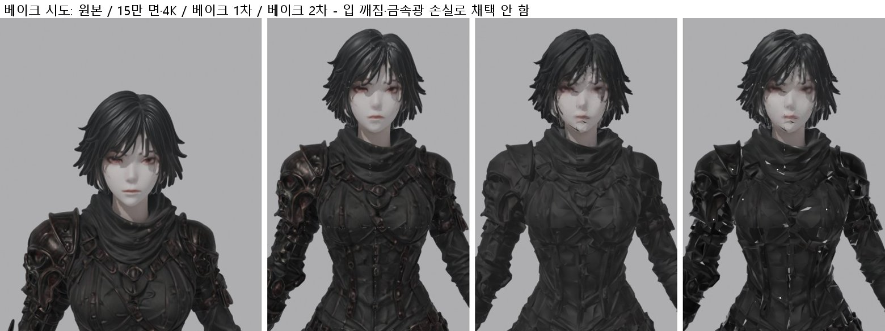
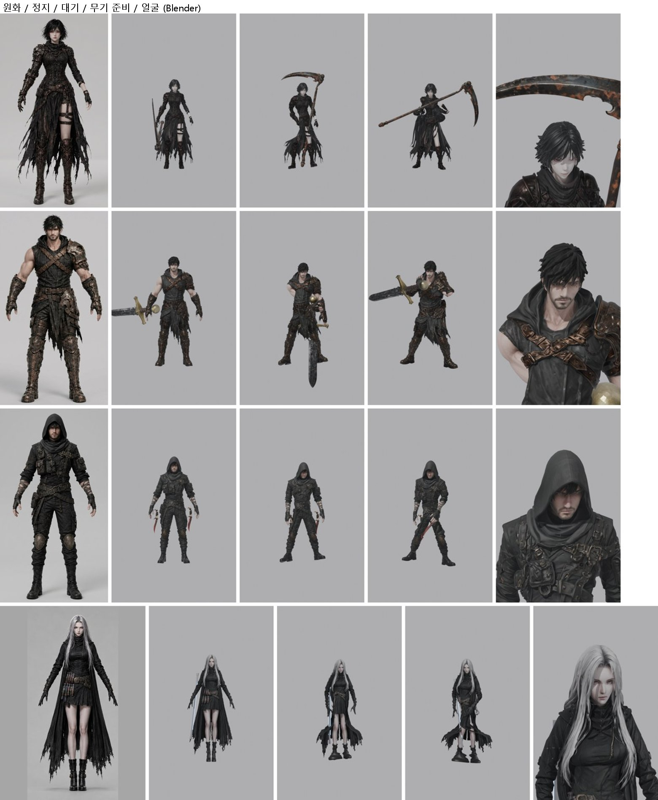
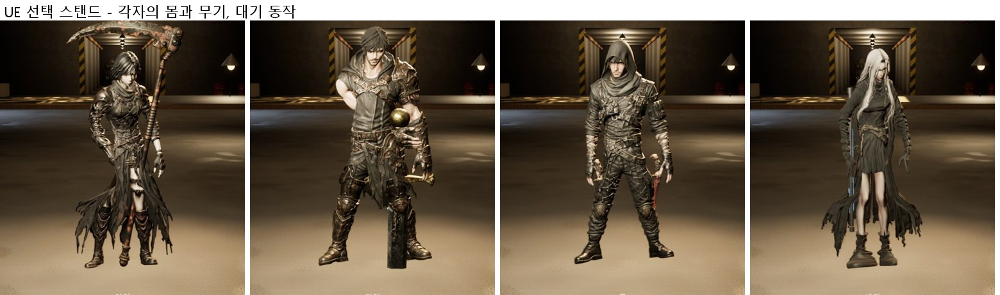

# 160 — 네 주인공의 실제 몸 + 폰 빌드 준비 (2026-09-29)

디렉터: «그래 진행해. 그리고 모바일로 한번 볼수 있게 업데이트도 해줘» → 확인 중 «확대해서 봐봐 제대로 안나왔어. 그리고 세라는 다른 사람이야»
→ «세라는 이거잖아»(턴어라운드) → «다른 사람들은 어떻게 하나 조사한번 해보고 적용할래? 크레딧 날리는 것보다 나을거 같은데»

## 1. 몸

| | 입력 | 키 | 무기 | 클립 |
|---|---|---|---|---|
| 아인 | 웹판 원화(시트와 같음) → Nano Banana 2 로 A 자세·무기 없이 | 168 cm(시트) | 사신의 낫 `ain_scythe_tex.glb`(날 위) | 웹판 `ain_anim.glb` 29 개 |
| 카인 | 웹판 원화(시트와 같음) | 188 cm(시트) | 모루의 대검(칼끝 아래 - 무게) | `kain_anim.glb` 29 |
| 류 | 웹판 원화 + 원문 후드 | 176 cm(설계) | 쌍아 쌍단검(양손) | `ryu_anim.glb` 29 |
| 세라 | **디렉터 턴어라운드 `sera_turnaround.png` 정면·좌면·후면 → Hi3D 멀티뷰 + 초상화 모드** | 172 cm(설계) | 원문의 금속 봉(여기서 만든 1.1 m 봉 + 청색 회로) | `sera_anim.glb` 29 |

- 처음 세라는 원문 L10384(흑발 단발·안경)로 만들었는데, 디렉터가 정한 세라는 턴어라운드의 은발 장발이다(BOSS_CANON_INDEX §1.5).
- 길: Hi3D 이미지→3D(v3.0) → `tools/3d/rig_boss_template.py`(`HW_RIG_TEMPLATE=art/3d/<id>_anim.glb`, 뼈대 높이는 템플릿 몸에서 잰다)
  → `tools/3d/arm_hero.py`(무기를 idle 한 순간의 손에 세워 손뼈 가중치 1.0 으로 합침 - 정지 자세 기준으로 세웠더니 idle 에서 누웠다)
  → `art/3d/heroes/<id>.glb` → `Scripts/ue_hero_bodies_setup.py` → `/Game/Heroes/<id>` → 선택 스탠드.

### 1.1 확대해서 본 문제와 원인 (잰 것)

| 증상 | 원인 | 조치 |
|---|---|---|
| 몸 한가운데·머리의 흰 점선 | 200만 → 6만 면으로 줄이며 UV 이음매가 무너짐(원본에는 없음) | **15만 면**(선택 화면엔 한 명만 나온다) |
| 흐린 얼굴 | 8K → 2K 텍스처 축소 | **4K** |
| 옷 전체가 크롬처럼 번쩍(UE) | Hi3D 가 가죽·천에도 높은 금속값을 굽는다 | 몸 재질 MetallicFactor 0.25(무기는 그대로) |

### 1.2 조사와 시도 (크레딧 없이)

- 다른 팀들의 방식: AI 메시는 «고해상도 원본»으로 두고, 정리된 저해상도 메시(리토폴로지) + 새 UV 에 원본의 색·법선·거칠기를 **베이크**한다.
  면 줄이기(decimate)는 UV 를 망가뜨린다. 베이크는 케이지·여백을 주고 조명 성분을 뺀다. 얼굴엔 텍셀을 더 준다.
  리깅은 A 자세 입력이 유리하고, 자동 리거 중 AccuRig(무료, GUI) 품질이 가장 좋다는 비교가 있다.
- 시도: 6만 면 + 새 UV(머리 ×2.5) + 원본에서 색·법선·거칠기·금속 베이크(Cycles OptiX, 1 분). 점선은 사라졌지만 입이 깨지고 붉은 장식·금속광이
  빠졌다 — AI 원본 표면이 울퉁불퉁해 줄인 메시와의 거리 차가 커서 광선이 빗나간다. 이 방식은 사람이 한 리토폴로지를 전제로 한다.
  **채택하지 않았다**(15만 면 + 4K 가 원본에 가장 가깝다).

### 1.3 선택 스탠드

- 스탠드의 몸이 Countess 스킨에서 각자의 몸으로 바뀌었다(가져오지 않았으면 Countess 로 돌아간다). 박자: 등장 walk, 대기 idle, 확정 guardUp/guard/counter(캐릭터별 속도).
- `-HWQA=frontend` ok=1(넷 다 Idle 정착, 확정 → Hold).

### 1.4 남은 것

1. UE 에서 옷 톤이 원화보다 회색으로 뜬다(금속을 낮춰도, 조명을 낮춰도 크게 안 바뀜) — 재질(스페큘러·거칠기) 쪽을 잰다.
2. 세라의 부츠가 뭉툭하다(Hi3D 형상). 카인 대검은 정지·무기 준비 자세에서 수평이 된다(idle 기준으로 세움).
3. 전투 중 몸은 아직 Countess 다(전투 애니 세트가 Paragon 뼈대). 새 몸으로 옮기려면 전투 클립을 mixamo 뼈대로 옮겨야 한다.

## 2. 폰 빌드

- 이 PC 의 UE 5.8 에 **Android 빌드 구성요소가 없다**(`Engine/Binaries/Android` 없음, UBT: «Enable Android as an optional download component
  in the Epic Games Launcher»). 9월 6일 UEIntro 는 같은 5.8 로 APK 를 만들었다 — 엔진 갱신 때 빠진 것으로 보인다. **디렉터가 런처에서 켜야 한다.**
- 준비해 둔 것:
  - `Scripts/package_android_phone.ps1`: ASTC arm64 APK. 이 PC 의 LAN 주소로 매치메이커를 가리키는 `Config/Android/AndroidGame.ini` 를 만든다(커밋 안 함). `-Install` 은 USB 폰에 `adb install -r`.
  - `Scripts/run_phone_servers.ps1`: 매치메이커 + 쉘터 + 던전을 LAN 주소로 광고. Windows 방화벽 허용 창은 디렉터가 누른다(스크립트는 보안 설정을 건드리지 않는다).
  - `DefaultGame.ini` 쿡: 로딩·타이틀·쉘터 맵, `/Game/Bosses`, `/Game/Animation`, Countess 폴더(이름으로만 불리는 에셋).
