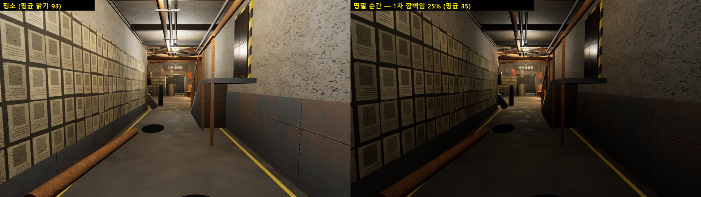
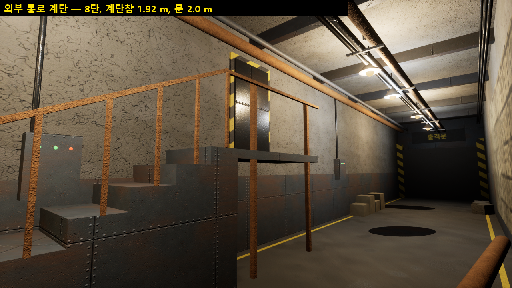
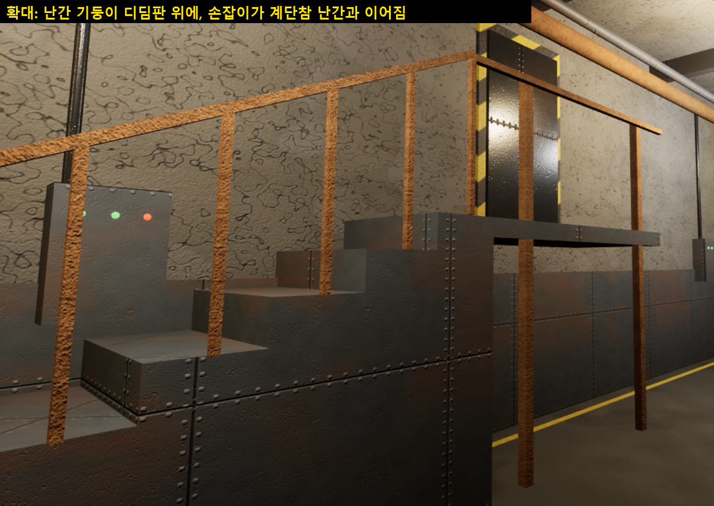
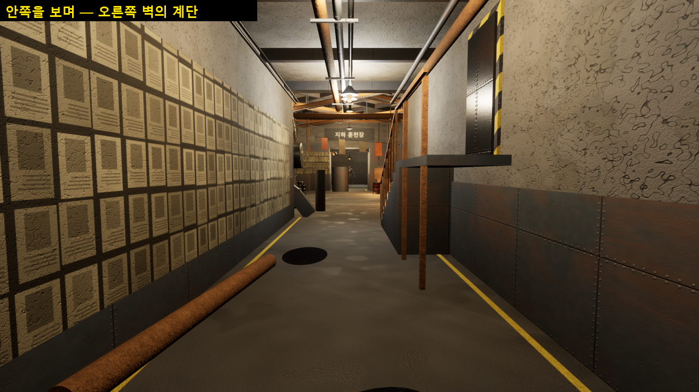

# 161 — 쉘터 남은 일: 외부 통로 계단 · 조명 명멸

문서 155(강남 벙커 쉘터)의 남은 항목 중 두 가지. 디렉터 작업 순서(2026-09-29):
«지금 작업은 쉘터를 구현하는 작업» → 쉘터 마무리 → 보스·던전(+ v10).

## 1. 조명 명멸 — 원문 그대로

> 나선 계단을 내려가는 동안 조명이 일정 간격으로 명멸했다. 발전기가 늙었다는 뜻이었다.
> — 제1부 통합본 L253 (소설 EP01 L213)

- `UHWLampFlickerSubsystem` (`Source/.../Game/HWLampFlicker.h/.cpp`): `HW_Flicker` 태그가 붙은 액터의 조명을
  **6.5초마다 0.42초 두 번 깜빡**(25% → 복귀 → 45% → 복귀) 한다. 램프마다 위상이 고정으로 달라서 통로 전체가
  한꺼번에 꺼지지 않고, 같은 램프는 늘 같은 박자로 깜빡인다(«일정 간격»). 그림 전용이라 전용 서버에서는 돌지 않는다.
- 어느 조명이 깜빡이나: **통로만** — 각 날개 복도 조명과 외부 통로 조명, 16개. 방·코어 조명은 그대로(사람이 사는 곳까지
  깜빡이면 «늙은 발전기»가 아니라 고장).
- 간격 6.5초·길이 0.42초는 원문에 없는 수치라 연출값이다(원문은 «일정 간격»만). 바꾸려면 헤더의 두 값만 고친다.

잰 값 (`-HWQA=sheltertour`, 실제 시간으로 47초 동안):

| 항목 | 값 |
|---|---|
| 깜빡이는 램프 | 16 |
| 어두워져 있던 비율 | **3.19%** (195,648 램프-샘플) — 설계값 0.21 s / 6.5 s = 3.2% |
| 명멸 순간 화면 평균 밝기 | 93 → 35 |

투어는 이 비율이 0이거나 10%를 넘으면 실패한다(깜빡임이 없음 / 고장 난 램프).
자동화 테스트 `Hwanghon.Shelter.LampFlicker` 가 깜빡임 모양을 고정한다. **일부러 깨 봤다**: 주기 정규화(`/ Blink`)를
빼면 «두 깜빡임 사이 복귀 1.0 인데 0.25», «두 번째 45% 인데 1.0» 으로 실패. (처음 깬 방식 — 깜빡임 창을 20배로 —
은 끝의 `return 1.f` 가 같은 결과를 내서 통과했다. 테스트가 아니라 깨는 방법이 틀렸던 것이라 다른 방법으로 다시 깼다.)

## 2. 외부 통로 계단 (시트 «메인 통로»)

EP01 디자인 시트의 B-1 입구 옆 계단. 외부 통로 벽을 따라 강철 계단 → 계단참 → 닫힌 문.

확대해서 보고 고친 것:

| 처음 | 고침 |
|---|---|
| 문이 안 보임 — 해저드 문틀이 문 **앞**에 있어 가렸다 | 문을 문틀 앞으로 |
| 맨 위 디딤판(695)과 계단참(745) 사이 50 cm 틈 | 계단참을 맨 위 디딤판 끝에서 시작 |
| 10단(2.4 m) + 문 2.1 m = 4.5 m → 천장(4.6 m) 배관에 문이 박힘 | 8단(1.92 m), 문 2.0 m — 문 위 3.9 m |
| 난간 기둥이 디딤판 위 20 cm 떠 있음, 계단참 난간은 기둥 없이 공중 | 기둥을 디딤판 위에, 계단참 기둥을 난간 높이까지 |

- 투어에 `02b_External_Stair` 자리를 더했다(계단·문을 정면에서).
- 도달 검사(`-HWQA=sheltershow`): NPC 7 · 시설 7 전부 도달, 실패 0. 자동화 39/39.

## 3. 남은 것

- 모바일 최적화(ISM 병합 · 조명 굽기): **기기에서 재고** 한다. 태블릿(R5KL30AA5CF)이 `unauthorized` — 태블릿 화면의
  «USB 디버깅 허용»을 눌러야 하고, UE 5.8 에 Android 구성 요소가 없어 Epic 런처에서 켜야 한다(문서 160).
- NPC 몸: 캐릭터 방식(A 메타휴먼) 결정과 함께 보류.
- 다음: 보스·던전 (+ v10 BossIntroCinematics).
