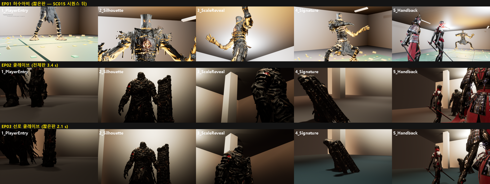
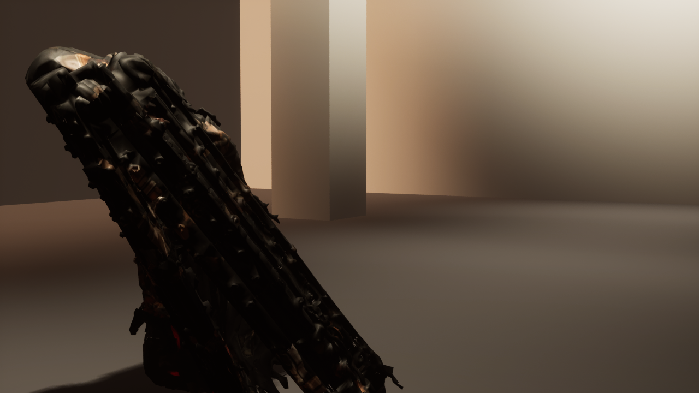

# 162 — v10 보스 등장 시네마틱: 공통 시스템 + 파일럿 2종(허수아비·클레이브)

디렉터가 올린 v10(`Hwanghon_Claude_Handoff_UE5.8_v10_BossIntroCinematics`, GPT 제작)의 Phase 0–2.
작업 순서(디렉터 2026-09-29): 쉘터 → **보스·던전(+ v10)**.

## 1. 한 것

| Phase | 내용 | 결과 |
|---|---|---|
| 0 조사 | 우리 보스·아레나·HUD·입력 구조(읽기 전용) | 아래 §4 |
| 1 통합 | v10 C++ 9 파일(`HHBossIntroDirector/Anchor/Trigger/Types`, `HHBossPresentationInterface`)을 플러그인에 그대로 추가 | 컴파일 오류 0 |
| 2 파일럿 | `TUTORIAL_SCARECROW`(EP01), `CLAVE_GANGNAM`(EP02 전체판, EP03 광장·선로 짧은판) | 스토리 QA 3 에피소드 통과 |



### 흐름

스토리 디렉터(`AHWStoryDirector`)의 «핸드오프» 자리에 등장씬이 들어간다.

```
컷신(원문 장면) → [BossIntro: PlayerEntry → Silhouette → ScaleReveal → SignatureMotion → Handback] → 전투
```

- 아레나마다 `AHHBossIntroDirector`(태그 `<Prefix>BossIntro`) + 앵커 카메라 5 개. `Scripts/ue_boss_intro_set.py` 가
  아레나 표식(`<Prefix>BossSpawn`/`AinStart`)에서 자리를 잡는다. 다시 돌려도 된다(자기 것만 지우고 새로 놓는다).
  **맵은 git 에 없으므로 아레나를 다시 지으면 이 스크립트도 다시 돌린다.**
- 등장 중: 보스 **대기**(AI 정지·피해 무시·광폭화 시계 정지), 규칙 비활성, 아인 입력 끔, 전투 HUD 숨김. 이름 카드·HP 바·레터박스 없음(v10 UI 원칙).
- 끝: 카메라가 아인 뒤로 0.18 s 블렌드, 보스 해제, HUD·입력 복귀, 규칙 가동 → 첫 패턴.
- 전체판/짧은판(v10 `StartBossIntro(bShort)`):
  - 짧은판: 재도전, 보스 모드(`?HWStory=0`), 이미 만난 보스(`HW_IntroShort` — EP03 두 클레이브).
  - 짧은판: 바로 앞 장면이 등장 시퀀스인 경우(EP01 SC015 9.5 s 가 각성을 이미 보여 준다).
- 안전장치: 12 s 안에 안 끝나면 잘라서 전투로 간다(앵커가 깨져도 플레이어가 갇히지 않게). 스킵 버튼으로도 넘길 수 있다.

## 2. v10 샷 설계와 원문이 다른 곳 — 원문을 따랐다

| 보스 | v10 샷 노트 | 원문 | 적용 |
|---|---|---|---|
| 허수아비 | 2.2 m, 꺼진 관절 장갑, 교체식 훈련 무기, «관절 잠금음» | EP01 «짚단 사이를 뚫고 나온 나노 강선이 근육처럼 뒤엉켜… 키는 3미터» «붉은 안광 두 점» «그드득… 그드득», 시트도 짚·사슬 | 발 → 머리(안광) → 긴 팔을 올려다봄 → 회전 공격 준비 자세 |
| 클레이브 | 223 cm, «무기팔»을 셔터에 박음, 힘 전달축 | 통합본 «2.5미터… 오른손에 장검… 왼손에 철제 셔터 한 장… 걸을 때마다 셔터 아래쪽이 바닥을 긁었다… 그리고 놈이 멈췄다» | 바닥을 긁는 셔터 끝 → 걸어 나오는 실루엣 → 장검 쪽 → 멈춰 셔터를 세움(실제 «셔터 밀어내기» 패턴의 준비 자세) |

SignatureMotion 은 v10 원칙대로 **실제 전투의 동작**이다. 그 보스 첫 패턴의 준비 자세를 타격 직전(접점의 85 %)까지만 보여 준다.
가짜 약점이나 가짜 기믹은 쓰지 않았다.

## 3. 확대해서 보고 고친 것

| 처음 | 고침 |
|---|---|
| 박자 사이 블렌드(직선)가 보스 앞을 스쳐, 시그니처에서 머리가 화면을 채움(v10 «보스 내부 관통 금지») | 박자는 **컷**. 마지막 플레이어 복귀만 블렌드 |
| 클레이브 첫 컷에 전신이 다 보임(v10·원문 모두 «소리·흔적이 먼저») | 바닥 높이에서 셔터 끝과 발만 |
| EP01 첫 박자(0.12 s)가 통째로 사라짐 — 등장 시작의 셰이더 준비 한 프레임이 박자 시계를 먹었다(플레이어도 못 봄) | v10 디렉터의 박자 시계를 한 프레임 최대 1/30 s 로(v10 Phase 5 «컷신 직전 끊김»의 실제 사례) |
| 클레이브는 예상(1.8 m)보다 더 걸어와(2.1 m) 머리가 잘림, 돌진 준비 자세는 머리가 1.3 m 로 내려가 등만 보임 | 잰 값으로 시그니처 카메라 재배치 |
| QA 사진이 블렌드 도중을 찍음 | 박자마다 **마지막 프레임**을 찍는다(`GetBeatRemaining`) |



## 4. 검증

| 항목 | 값 |
|---|---|
| 스토리 QA EP01 / EP02 / EP03(2 전투) | 전부 `ok=1`. 등장 중 held=1, no_damage=1, hud_hidden=1, input_off=1. 끝난 뒤 boss_live=1, hud=1, input=1, camera_on_ain=1 |
| 길이 | EP02 전체판 3.4 s, EP03 짧은판 2.1 s, EP01 짧은판 1.5 s |
| 자동화 | 40/40. 새 테스트 `Hwanghon.Combat.BossIntroHold`는 등장 중 무적·공격 취소·광폭화 정지와 해제, 길이 2–4 s, 파일럿 연출 매핑을 검사한다. **일부러 깨 봤다**: 대기 중 피해 무시를 빼면 «280000 이어야 하는데 275000» 으로 실패 |

## 5. 플러그인(v10)에 손댄 것 — 되돌리기 쉬운 세 줄

- `HHBossPresentationInterface`: `BlueprintImplementableEvent` → `BlueprintNativeEvent`. C++ 보스(`AHWBossCharacter`)가 구현하려면 필요하고, BP 구현은 그대로 된다.
- `HHBossIntroDirector::Tick`: 박자 시계를 한 프레임 최대 1/30 s 로(§3).
- `HHBossIntroDirector::GetBeatRemaining()` 읽기 함수(QA 용).

되돌리기: 위 세 곳과 `AHWStoryDirector::StartBossIntro` 호출 한 줄을 빼면 이전 핸드오프로 돌아간다.

## 6. 열린 것 — 디렉터 결정 필요

**v10 보스 목록·장소가 원문과 다르다**(`docs/story/BOSS_CANON_INDEX.md`):

| v10 | v10 장소 | 원문 |
|---|---|---|
| `AEGIS07_SDC` | 수도방위사령부 지하 | EP06·07 **여의도 금융가 빌딩 협곡** |
| `SHADOWFANG_GWANAK` | 관악산 폐터널, 단독전 | EP16 물류창고 앞마당 · EP17 골짜기 |
| `IRONWARDEN_YEOUIDO` | 여의도 | **1부 원문에 없음**(TBD_CANON) |
| `LEE_FINAL_LINE` | 최종 방어선 | **1부 원문에 없음**(«중장» 0 회) |
| `NANONOVA_GOHEUNG` | 고흥 갱도·증폭 탑, «두 신호/증폭 링» | 디렉터 결정(2026-09-29 «나눠서 하자»): EP27 나노-노바 ≠ EP28 **증폭 탑**. v10 목록에 탑이 없다 |

v10 은 이것을 «잠금 목록»이라 부르지만, 원문과 디렉터의 앞선 결정과 부딪힌다. 파일럿 두 보스는 원문과 맞아서 진행했고,
03–12 는 이 표의 결정 뒤에 한다.

그 밖:

- **네트워크**: 우리 스토리 전투는 로컬이다(보스 복제 없음). 온라인 던전 서버(EP03 + `HWDungeonOnlineGameMode`)는 보스를 스폰하지 않는다.
  v10 디렉터의 멀티캐스트는 들어와 있지만 «서버 권한·전 클라이언트 동일 인트로» 검증은 온라인 던전에 보스가 들어온 뒤에 할 수 있다.
- **안드로이드 측정**(v10 Phase 5): 태블릿 `unauthorized` + UE 5.8 Android 구성 요소 없음(문서 160).
- 등장 첫 프레임에 셰이더 컴파일(«Preparing Shaders»)이 보인다. 쿠킹된 빌드에서는 PSO 캐시로 없어져야 한다 — 폰 빌드 때 확인.
- 카메라는 그레이박스 아레나 기준이다. 최종 보스룸이 생기면 `SHOTS` 표만 고쳐 다시 돌린다(v10 도 «자동 배치 카메라는 시작점»).
