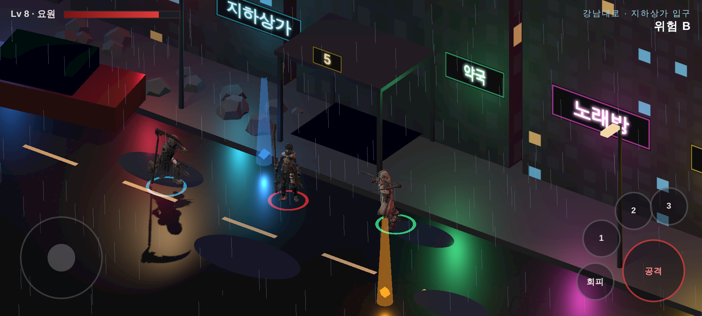
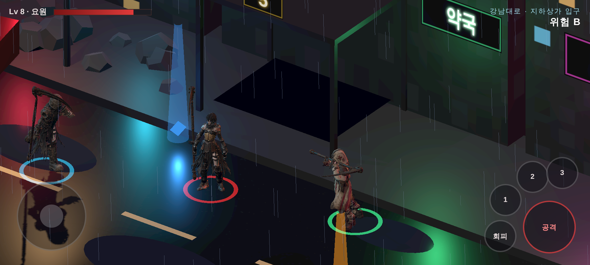
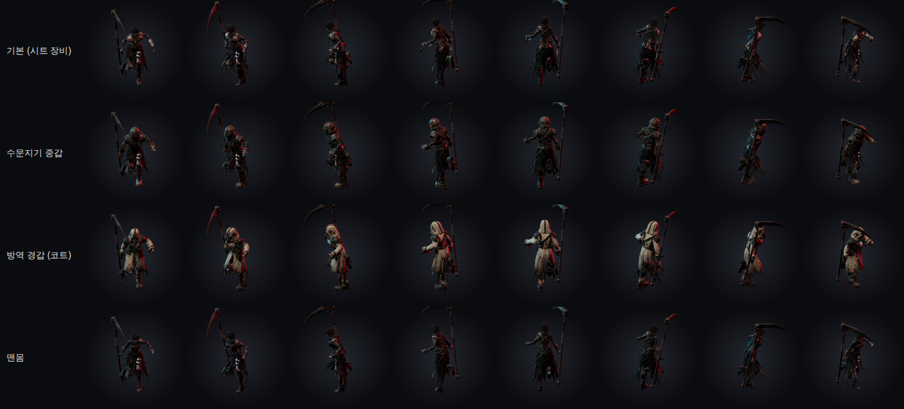
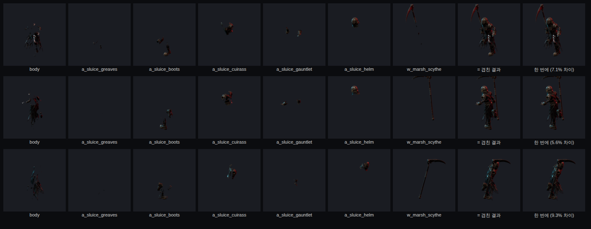

# 185 — 황혼 2D MMORPG 기획 v1 (2026-10-05)

디렉터 결정 (2026-10-05):

- 3D 보다 **2D 쿼터뷰 MMORPG 를 먼저** 만든다. 리니지식 — 넓은 필드, 마을, 사냥, 성장, 혈맹.
- 그래픽은 **디아블로식**. «고급화된 리니지».
- **모바일 우선.**
- **자동사냥 없음.**
- **PvP 는 나중.**

우선순위는 그대로다: 확정 소설 > 디자인 시트 > 소설→게임 마스터 > 게임 시스템 > UI.
아래에서 **(가안)** 이라고 쓴 것은 원문·시트에 없어 채운 값이다.

## 1. 한 줄

황혼 이후의 한반도. 강남 벙커에서 각인을 받은 요원이 되어 원문의 길(강남 → 남산 → 여의도 →
한강 → 판교 → 계룡 → 고흥)을 따라 내려가며, 감염체를 사냥하고, 보스의 부위를 꺾어 재료를 얻고,
한 장인의 공방에서 장비를 만드는 2D 쿼터뷰 MMORPG.

## 2. 무엇을 어디서 가져오나

| 출처 | 가져오는 것 | 버리는 것 |
|---|---|---|
| 리니지 | 넓은 필드와 마을, 사냥터 레벨 구간, 강화, 혈맹, 필드 보스 | 자동사냥, 강화 실패 시 장비 증발 |
| 디아블로 | 어둡고 무거운 화면, 광원 반경, 바닥 드롭과 등급 빛기둥, 타격 피드백 | 핵앤슬래시식 몹 물량 |
| 황혼 (기존) | 원문 세계와 지도, 카운터 3단(문서 51), 부위 파괴, 자세·처형, 원문 전투 문법(문서 150), 아이템·강화·제작 데이터, 쉘터·길드·파티 서버 | 캐릭터 교대 |

## 3. 지도 — 원문의 길이 곧 지도

제1부의 장소 131곳(마스터 §3)을 존 10개로 묶는다. 레벨 구간은 전부 **(가안)**.

| # | 존 | 원문 장소 | Lv | 필드 적 (원문 비보스 전투) | 보스 던전 (인스턴스 1~4인) |
|---|---|---|---|---|---|
| 1 | **강남 벙커** (허브, 안전지대) | 인력사무소(마태오) · 평가소(유진) · 공방(한 장인) · 의무실(닥터 진) · 배급(수희) · 출격문 | — | — | 지하 훈련장: 허수아비 (튜토리얼) |
| 2 | 강남대로 · 강남역 지하상가 | 5번 출구, 침수 통로, 중앙 광장, 2호선 침수 선로 | 1~10 | 쇼윈도 리퍼, 광장의 감염체 | 클레이브 |
| 3 | 남산 | 소월로, 계단, 케이블카 승강장, 전망대 | 10~18 | 케이블카 드로퍼 | 셀레스티얼 (첫 조우는 후퇴) |
| 4 | 여의도 금융가 | 안개 협곡, 지하 공동구, 지하주차장 | 18~25 | (가안) | 에이지스-07 |
| 5 | 한강 침수 터널 | 터널 입구, 수몰 구간, 기계실, 차수문 | 25~30 | 감염된 현 중위 | 레비아탄 (가두기 — 차수문 제한 시간) |
| 6 | 남태령 · 국도 | 지상 국도, 중계소, 폐주유소, 폐차장 | 30~35 | 탈영병, 클레이브 둘, 방호복 병사 | — (필드 전용 존) |
| 7 | 판교 연구단지 | 시가지, 봉인 건물, 연구소 지하 | 35~40 | (가안) | 실험체 09호 |
| 8 | 남행 국도 · 골짜기 | 물류창고 앞마당, 골짜기 | 40~45 | (가안) | 섀도우 팽, 셀레스티얼 (격파) |
| 9 | 계룡 | 능선, 철책, 정비창, 격납고, 표본 보관실 | 45~52 | 정비창 기계들 | 아스널 오버로드, 박 준장 |
| 10 | 고흥 발사장 | 방파제, 활주로, 정비 갱도, 발사대 | 52~60 | 집행관 의장대 | 정 장관, 나노-노바 코어, 발사대 탑 |

- 실제 지형을 축소하고 다듬어서 만든다. 존은 출격문과 길잡이(오정길)의 빠른 이동으로 잇는다.
- **메인 퀘스트 = 원문 EP 순서.** 원문이 퇴각·봉쇄로 끝나는 싸움은 첫 진입(스토리)에서 원문대로
  끝나고, 반복 진입부터는 격파할 수 있다 (가안 — D3).
- 한 장인은 EP18 에서 죽는다(`SF_NPC_HanJanginAlive`). 그 뒤 공방이 바뀌는 것도 메인 퀘스트 진행으로 보여 준다.

## 4. 캐릭터 — 직업제 (확정, D1)

MMO 에서 100명이 모두 아인이면 몰입이 깨진다. 플레이어는 **자기 캐릭터**를 만들고 네 계열 중 하나를 고른다.
아인·카인·류·세라는 메인 퀘스트에 나오는 원문 인물(NPC)이다.

| 계열 | 무기 | 역할 | 원본 |
|---|---|---|---|
| 사신 | 대형 낫 | 근접 딜러, 결정타 | 아인 |
| 대검 | 대검 | 탱커, 부위 파괴 | 카인 |
| 추적자 | 쌍단검 | 기동 딜러, 정찰 | 류 |
| 촉매사 | 금속 봉 + 촉매 병 | 회복, 정제 | 세라 |

- 성장 지표는 원문의 **각인 등급**이다. 평가소에서 유진이 측정한다.
- 계열 이름은 (가안).

### 4.1 캐릭터 만들기와 외형 — 디렉터 결정 2026-10-05

**리니지와 달리 입은 장비가 필드 캐릭터 모습에 그대로 보여야 한다.** 이것이 외형 설계의 첫 조건이다.

아이온식 슬라이더(얼굴뼈 조절)는 넣지 않는다. 휴대폰 쿼터뷰에서 캐릭터 키는 100px 안팎이고 얼굴은 10px 남짓이라
필드에서 차이가 보이지 않는다. 그리고 2D 캐릭터는 동작을 미리 구워 두는데, 경우의 수가 무한하면 구울 수가 없다.

| 층 | 어디서 보이나 | 무엇을 고르나 | 방식 |
|---|---|---|---|
| **필드 캐릭터** | 필드·마을·던전 | 성별 2 · 체형 2~3 · 헤어 · 머리색 · 피부톤 · **입은 장비 전부** · 장비 염색 | 부위별 레이어를 따로 구워 게임에서 겹쳐 그린다 (§6). 색은 칠만 바꾼다 |
| **초상화** | 캐릭터 창 · 대화 · 파티 카드 · 프로필 | 얼굴형 프리셋 8~12 · 눈 · 눈썹 · 입 · 흉터·문신·안대 | 얼굴 부위를 미리 만들어 조합 (MPFB 파이프라인, 문서 81) |

- 레이어 순서(가안): 몸 → 하의 → 장화 → 상의 → 장갑 → 머리카락 → 머리 장비 → 무기.
  각 레이어는 **다른 레이어를 깊이로만 그려 가린 채** 굽는다. 그래야 몸 뒤로 돌아간 팔·무기가 겹쳐 그릴 때 앞으로 튀어나오지 않는다.
- 염색은 기존 외형 화면(문서 34)의 16색 + 자유색을 그대로 쓴다.
- **각인 문양은 넣지 않는다.** 대신 **길드 문양**을 나중에 넣는다 — 망토·등판·방패 같은 자리에 길드가 정한 문양을 찍는다 (2차 이후).
- 첫 버전: 성별 2 × 체형 2, 헤어 6, 방어구는 지금 있는 5종 + 염색. 방어구 세트를 늘리는 것은 생성·구매 비용 승인 뒤 (문서 35 — 절차 생성은 네 판 실패).

## 5. 전투 — 자동사냥 없는 리니지

**휴대폰 조작 (가로 고정)**

| 왼손 | 오른손 |
|---|---|
| 가상 조이스틱 이동 | 공격 (= 타이밍 카운터), 길게 누르면 스매시 |
| | 회피 · 방어 |
| | 스킬 4 + 궁극기 |
| | 조준 부위 전환 (보스 부위를 탭해도 됨) |
| | 물약 퀵슬롯 2 |

- 공격 버튼은 가까운 적을 **조준 보조**한다. 이건 자동사냥이 아니다. 손을 떼면 캐릭터가 멈춘다.
- 전투 규칙은 기존 서버 `server/raid.cjs` 를 그대로 쓴다 — 이미 2D 좌표로 돌고, 카운터 3단·자세·부위·처형·부활을 서버가 판정한다.
- 히트스톱은 **카운터에만** 건다 (문서 51 — 평타에 걸면 회피 입력 계약이 깨진다).
- 파티 역할은 원문 전투 문법(문서 150)에서 나온다: **누군가 순간을 열고 → 다른 누군가 낫 한 자루 거리에서 결정타.**
  대검이 열고 사신이 끝내는 식이다.
- 일반 몹은 리니지처럼 몇 대 만에 쓰러진다. 그래도 큰 공격은 예고를 띄운다. 정예와 보스는 카운터 없이는 어렵다.
- 자동사냥이 없으니 한 번 출격은 **10~20분** 으로 맞춘다 (기존 의뢰 시간과 같다). 출퇴근길 한 판이 단위다.

## 6. 그래픽 — 디아블로식

| 항목 | 방식 |
|---|---|
| 시점 | 2:1 아이소메트릭 쿼터뷰 (리니지·디아블로2) |
| 캐릭터·보스 | **기존 3D 모델을 8방향으로 렌더해 스프라이트 시트로 굽는다** (디아블로2 방식). 프레임마다 모양이 달라지는 생성 이미지 문제가 없고, 3D 에 들인 작업이 그대로 쓰인다 |
| 조명 | 기본은 어둡게. 플레이어 주변 광원 반경, 횃불·코어·네온 같은 점광원, 노멀맵 2D 조명 |
| 분위기 | 여의도 안개, 한강 물, 남산 바람, 계룡 지하 어둠 — 존마다 하나 |
| 팔레트 | 기존 토큰 그대로 (`--c-void #0B0C0F`, `--c-red #A51C1C` …) |
| 타격 | 피·파편, 카운터 히트스톱, 결정타 0.25배 슬로(문서 150) |
| 전리품 | 바닥에 떨어지고, 등급 색 빛기둥과 등급별 효과음. 등급 색은 기존 레어도 토큰 |
| 휴대폰 예산 | 스프라이트 아틀라스, 화면 안 광원 수 제한, 중급기 60fps / 저사양 30fps 프로필 (`js/graphics-profile.js` 의 tier 를 따른다) |

### 6.1 외형 시험 — 휴대폰 화면에서 장비가 보이나 (2026-10-05)

디렉터: «2D 지만 사이버펑크 같은 게임 느낌은 나와야 한다. 한국 전체를 돌아다니니 보는 맛이 없으면 안 된다.»

같은 몸(아인 `ain_anim.glb`)에 장비 세 벌을 `js/looks.js` 로 입히고, 고정 쿼터뷰 정사영(내려다보는 각 30°)으로
밤의 강남대로(한글 네온 간판, 젖은 길, 비, 지하상가 5번 출구)에 세워 Pixel 7 가로(915×412, 2배)로 찍었다.
배경은 절차로 만든 임시 3D 다 — 실제는 존마다 그린(프리렌더) 배경이 들어간다.

| 배율 | 화면 높이 대비 인물 | 결과 |
|---|---|---|
| 1.0 | 약 18% | 세 벌이 구별된다(투구·흉갑·코트 실루엣). 장식 디테일은 안 보인다 |
| 1.6 | 약 29% | 투구 모양·흉갑 금속·코트 자락까지 읽힌다 |

- **거리는 화면에 대각선으로 놓는다**(`?diag=1`). 정면으로 놓으면 횡스크롤처럼 보였다.
- **캐릭터 전용 빛**(주광 + 붉은·푸른 림)이 없으면 어두운 네온 배경에서 장비가 묻힌다. 스프라이트로 구울 때도 같은 빛으로 굽는다.
- 장비 세트 × 8방향 굽기: 

**레이어 굽기 검증** (`tools/2d/bake-layer-test.mjs`): 레이어 7장(몸·각반·장화·흉갑·장갑·투구·낫)을 따로 구워 겹친 그림과
한 번에 그린 그림의 차이 — 방향 1·3·6 에서 캐릭터 픽셀의 **7.1% · 5.6% · 9.3%** 가 24/255 넘게 다르다.
대부분 테두리(안티에일리어싱이 두 번 섞임)와 반투명 천이다. 2배로 굽고 줄이기 · 미리 곱한 알파로 줄일 일이다.

**스프라이트 메모리 — 장비가 보이게 하려면 비싸다.** 배율 1.6 이면 인물이 240px 남짓이라 프레임이 256px 은 돼야 한다.
8방향 × 동작 18 × 평균 10프레임 × 레이어 7 = **캐릭터 한 벌에 프레임 10,080장**. 채움 40% 로 잡아 RGBA 원본 약 1 GB,
ASTC 8×8 압축으로도 약 63 MB 다. 장비가 다른 플레이어 20명이 한 화면에 있으면 1 GB 를 넘는다.
반면 3D 캐릭터는 장비 텍스처를 모두가 나눠 쓰고, 이미 태블릿에서 GPU 8.5 ms 로 돈다(커밋 d4c2230, 의상 LOD).

→ **D5**: 화면은 2D 쿼터뷰(리니지식 고정 카메라) 그대로, 캐릭터만 실시간 3D 로 그리는 방식(디아블로3·이모탈·로스트아크 방식)을
검토한다. 이 시험 화면이 바로 그 방식으로 그린 것이다. 스프라이트 굽기 도구(`tools/2d/sprite-bake.html`)는 몬스터·NPC·
먼 거리 LOD·아이콘에 계속 쓴다.

## 7. 성장 · 경제

- **강화**: `items.js` 의 +1~+10 표 그대로. 실패하면 단계 유지 또는 하락, 증발 없음 (가안).
- **제작**: 한 장인 공방. 재료는 보스 부위 파괴에서 나온다.
- **정제**: 하급 재료 → 상급 재료. 촉매사 보너스.
- **거래**: 1차는 NPC 보급소만. 플레이어 거래는 봇·현금거래 대비를 갖춘 뒤 (가안).

## 8. 함께하기

- 인력사무소: 의뢰 게시판, 파티 모집 (기존 `recruit`).
- 길드: 기존 쉘터 서버의 길드·채팅·귓속말·차단을 그대로 쓴다 (문서 27~29).
- 필드 보스: 정해진 시간에 나오고, 기여도로 보상을 나눈다 (기존 정산 화면).
- **PvP: 나중.** 1차는 PvE 만. 데이터만 PvP 를 막지 않게 짠다.

## 9. 기술

| 층 | 무엇 | 지금 있는 것 |
|---|---|---|
| 클라이언트 | Phaser 4 + 기존 UI 화면을 DOM 오버레이로 | `vendor/phaser.min.js`, `js/rig-phaser.js`, UI 20화면 |
| 전투 서버 | 기존 Node 서버 권한형 전투 | `server/raid.cjs`, `rpg-*.cjs` |
| 필드 서버 | **새로 만든다**: 존 단위 방, 관심 영역(AOI) 동기화, 존당 동시접속 | 쉘터 서버 (100 동접 측정됨, `docs/validation/party-load-100.json`) |
| 저장 | 계정·캐릭터·인벤토리·길드 | SQLite (`rpg-store.cjs`) |
| 앱 | 안드로이드 | Capacitor (`android/`) |
| 맵 | Tiled 타일맵 | `maps/d01.json` |

## 10. 1차 목표 — 첫 플레이 버전

- 존: **강남 벙커**(허브) + **강남대로·강남역 지하상가**(필드) + 보스 던전 2 (허수아비, 클레이브)
- 메인 퀘스트 EP01~EP03
- 계열 4, Lv 1~10
- 카운터 3단, 부위 파괴, 처형
- 디아블로식 조명, 바닥 드롭 빛기둥
- 기존 계정·길드·채팅·파티 연결

**합격 기준 (재서 보여 준다)**

- 안드로이드 실기기(Pixel 7 급) 가로 화면에서 필드 60fps, 보스전 50fps 이상
- 한 존에 50명이 있을 때 위치 동기화 지연 150ms 이하
- `npm test` 통과
- 모든 화면을 휴대폰 가로·세로로 찍어 첨부

## 11. 단계

1. **기술 시제품**: 강남대로 한 블록 타일맵 + 아인 모델을 8방향으로 구운 스프라이트 + 광원 반경 + 여러 명 이동 동기화. 실기기에서 찍어 보여 준다.
2. **1차 목표** (§10)
3. 남산 · 여의도 · 한강 확장
4. PvP, 플레이어 거래, 거점전

## 12. 결정 필요

| # | 질문 | 추천 |
|---|---|---|
| D1 | 캐릭터: 직업제 vs 네 영웅 중 고르기 | **확정 2026-10-05: 직업제 + 장비가 보이는 레이어 외형 (§4.1)** |
| D2 | 3D(UE5) 작업: 보류 vs 병행 | 2D 출시까지 보류. 3D 모델은 스프라이트 원본으로 계속 쓴다 |
| D3 | 원문의 지는 싸움: 첫 진입은 원문대로, 반복은 격파 가능 | 그렇게 |
| D4 | 레벨 구간, 계열 이름 등 (가안) 값 | 1차 목표에 필요한 것만 먼저 확정 |
| D5 | 캐릭터를 구운 스프라이트로 그릴지, 고정 쿼터뷰 카메라 아래 실시간 3D 로 그릴지 (§6.1) | 실시간 3D (화면·조작은 2D 쿼터뷰 그대로). 실기기 프레임을 재서 확정 |
