# 185 — 황혼 2D MMORPG 기획 v1 (2026-10-05)

디렉터 결정 (2026-10-05, 2026-10-06 보정 — §4·§6):

- 3D 보다 **2D 맵 MMORPG 를 먼저** 만든다. 리니지식 — 넓은 필드, 마을, 사냥, 성장, 혈맹.
- 그래픽은 **디아블로식**, «고급화된 리니지». 2026-10-06: **«LoL 와일드리프트를 MMORPG 로»** — 맵만 2D, 캐릭터·몬스터·NPC 는 3D (§6).
- 캐릭터는 **아인·카인·류·세라** 중에서 고른다 (2026-10-06, §4).
- **모바일 우선.**
- **자동사냥 없음.**
- **PvP 는 나중.**

우선순위는 그대로다: 확정 소설 > 디자인 시트 > 소설→게임 마스터 > 게임 시스템 > UI.
아래에서 **(가안)** 이라고 쓴 것은 원문·시트에 없어 채운 값이다.

## 1. 한 줄

황혼 이후의 한반도. 강남 벙커에서 각인을 받은 요원이 되어 원문의 길(강남 → 남산 → 여의도 →
한강 → 판교 → 계룡 → 고흥)을 따라 내려가며, 감염체를 사냥하고, 보스의 부위를 꺾어 재료를 얻고,
한 장인의 공방에서 장비를 만드는 2D 쿼터뷰 MMORPG.

## 2. 무엇을 어디서 가져오나

| 출처 | 가져오는 것 | 버리는 것 |
|---|---|---|
| 리니지 | 넓은 필드와 마을, 사냥터 레벨 구간, 강화, 혈맹, 필드 보스 | 자동사냥, 강화 실패 시 장비 증발 |
| 디아블로 | 어둡고 무거운 화면, 광원 반경, 바닥 드롭과 등급 빛기둥, 타격 피드백 | 핵앤슬래시식 몹 물량 |
| 황혼 (기존) | 원문 세계와 지도, 카운터 3단(문서 51), 부위 파괴, 자세·처형, 원문 전투 문법(문서 150), 아이템·강화·제작 데이터, 쉘터·길드·파티 서버 | 캐릭터 교대 |

## 3. 지도 — 원문의 길이 곧 지도

제1부의 장소 131곳(마스터 §3)을 존 10개로 묶는다. 레벨 구간은 전부 **(가안)**.

| # | 존 | 원문 장소 | Lv | 필드 적 (원문 비보스 전투) | 보스 던전 (인스턴스 1~4인) |
|---|---|---|---|---|---|
| 1 | **강남 벙커** (허브, 안전지대) | 인력사무소(마태오) · 평가소(유진) · 공방(한 장인) · 의무실(닥터 진) · 배급(수희) · 출격문 | — | — | 지하 훈련장: 허수아비 (튜토리얼) |
| 2 | 강남대로 · 강남역 지하상가 | 5번 출구, 침수 통로, 중앙 광장, 2호선 침수 선로 | 1~10 | 쇼윈도 리퍼, 광장의 감염체 | 클레이브 |
| 3 | 남산 | 소월로, 계단, 케이블카 승강장, 전망대 | 10~18 | 케이블카 드로퍼 | 셀레스티얼 (첫 조우는 후퇴) |
| 4 | 여의도 금융가 | 안개 협곡, 지하 공동구, 지하주차장 | 18~25 | (가안) | 에이지스-07 |
| 5 | 한강 침수 터널 | 터널 입구, 수몰 구간, 기계실, 차수문 | 25~30 | 감염된 현 중위 | 레비아탄 (가두기 — 차수문 제한 시간) |
| 6 | 남태령 · 국도 | 지상 국도, 중계소, 폐주유소, 폐차장 | 30~35 | 탈영병, 클레이브 둘, 방호복 병사 | — (필드 전용 존) |
| 7 | 판교 연구단지 | 시가지, 봉인 건물, 연구소 지하 | 35~40 | (가안) | 실험체 09호 |
| 8 | 남행 국도 · 골짜기 | 물류창고 앞마당, 골짜기 | 40~45 | (가안) | 섀도우 팽, 셀레스티얼 (격파) |
| 9 | 계룡 | 능선, 철책, 정비창, 격납고, 표본 보관실 | 45~52 | 정비창 기계들 | 아스널 오버로드, 박 준장 |
| 10 | 고흥 발사장 | 방파제, 활주로, 정비 갱도, 발사대 | 52~60 | 집행관 의장대 | 정 장관, 나노-노바 코어, 발사대 탑 |

- 실제 지형을 축소하고 다듬어서 만든다. 존은 출격문과 길잡이(오정길)의 빠른 이동으로 잇는다.
- **메인 퀘스트 = 원문 EP 순서.** 원문이 퇴각·봉쇄로 끝나는 싸움은 첫 진입(스토리)에서 원문대로
  끝나고, 반복 진입부터는 격파할 수 있다 (가안 — D3).
- 한 장인은 EP18 에서 죽는다(`SF_NPC_HanJanginAlive`). 그 뒤 공방이 바뀌는 것도 메인 퀘스트 진행으로 보여 준다.

## 4. 캐릭터 — 네 영웅 중 고르기 (확정 2026-10-06, D1)

디렉터 2026-10-06: «캐릭터는 그냥 아인·카인·류·세라가 다 나오는 게 낫겠어.»
2026-10-05 의 직업제를 뒤집는다. 플레이어는 **네 영웅 중 하나**를 골라 논다 — 현행 온라인 v6(문서 126 «플레이어 1명 = 캐릭터 1명»)과 같다.
같은 영웅을 여러 명이 고를 수 있다. 서로를 가르는 것은 **장비 외형·염색·이름·길드 문양**이다.

| 영웅 | 무기 | 역할 |
|---|---|---|
| 아인 | 대형 낫 | 근접 딜러, 결정타 |
| 카인 | 대검 | 탱커, 부위 파괴 |
| 류 | 쌍단검 | 기동 딜러, 정찰 |
| 세라 | 금속 봉 + 촉매 병 | 회복, 정제 |

- 메인 퀘스트는 원문 그대로 네 사람의 이야기다. 내가 고른 영웅이 그 장면의 주인공 자리에 선다 (가안 — 장면별 처리는 스토리 작업 때).
- 성장 지표는 원문의 **각인 등급**이다. 평가소에서 유진이 측정한다.

### 4.1 외형 — 장비가 그대로 보인다 (디렉터 결정 2026-10-05, 2026-10-06 보정)

**리니지와 달리 입은 장비가 필드 캐릭터 모습에 그대로 보여야 한다.** 디렉터가 보여 준 기준 그림(검정·빨강 테크웨어, 매듭 장식, 전투화)
수준의 외형이 «어느 정도는» 보여야 한다 — «2D 지만 사이버펑크 같은 게임 느낌».

- 캐릭터는 실시간 3D 라 장비는 `js/looks.js` 로 입힌 그대로 보인다(§6). 굽는 경우의 수 문제가 없다.
- 고르는 것: **영웅 · 입은 장비 전부 · 장비 염색**(문서 34 의 16색 + 자유색) · 의상 세트(가안 — 영웅별 의상 40벌 후보가 `art/3d/src/gpt/outfit40_bonebound_v02` 에 있으나 강체 바인딩 시안이라 품질 미달).
- 아이온식 얼굴 슬라이더는 없다 (영웅이 정해져 있다).
- **각인 문양은 넣지 않는다.** 대신 **길드 문양**을 나중에 넣는다 — 망토·등판·방패 같은 자리에 길드가 정한 문양을 찍는다 (2차 이후).
- 방어구 세트를 늘리는 것은 생성·구매 비용 승인 뒤 (문서 35 — 절차 생성은 네 판 실패).

## 5. 전투 — 자동사냥 없는 리니지

**휴대폰 조작 (가로 고정)**

| 왼손 | 오른손 |
|---|---|
| 가상 조이스틱 이동 | 공격 (= 타이밍 카운터), 길게 누르면 스매시 |
| | 회피 · 방어 |
| | 스킬 4 + 궁극기 |
| | 조준 부위 전환 (보스 부위를 탭해도 됨) |
| | 물약 퀵슬롯 2 |

- 공격 버튼은 가까운 적을 **조준 보조**한다. 이건 자동사냥이 아니다. 손을 떼면 캐릭터가 멈춘다.
- 전투 규칙은 기존 서버 `server/raid.cjs` 를 그대로 쓴다 — 이미 2D 좌표로 돌고, 카운터 3단·자세·부위·처형·부활을 서버가 판정한다.
- 히트스톱은 **카운터에만** 건다 (문서 51 — 평타에 걸면 회피 입력 계약이 깨진다).
- 파티 역할은 원문 전투 문법(문서 150)에서 나온다: **누군가 순간을 열고 → 다른 누군가 낫 한 자루 거리에서 결정타.**
  대검이 열고 사신이 끝내는 식이다.
- 일반 몹은 리니지처럼 몇 대 만에 쓰러진다. 그래도 큰 공격은 예고를 띄운다. 정예와 보스는 카운터 없이는 어렵다.
- 자동사냥이 없으니 한 번 출격은 **10~20분** 으로 맞춘다 (기존 의뢰 시간과 같다). 출퇴근길 한 판이 단위다.

## 6. 그래픽 — 2D 맵 + 3D 캐릭터, 와일드리프트식 카메라 (확정 2026-10-06, D5)

디렉터 2026-10-06: «맵을 2D 로 쓰는 거지. 다른 건 다 각기 방향이 보여야 되니깐.» «LoL 와일드리프트를 MMORPG 로 한다 생각하자.»

- **맵 = 2D 그림.** 고정 카메라 각도에서 미리 그린(구운) 그림을 깐다. 깊이 그림을 같이 두어 캐릭터가 건물·기둥 뒤로 들어가면 가려진다.
- **캐릭터·몬스터·NPC = 실시간 3D.** 모든 방향이 보이고, 장비가 입은 그대로 보인다.
- **카메라 = 와일드리프트식**: 위에서 비스듬히 내려다보는 고정 각도(55°), 회전 없음, 내 캐릭터를 따라간다. 수동 카메라 없음(문서 111 §1).
  맵이 그림이라 카메라는 정사영이다 — 원근이면 카메라가 움직일 때 그림과 3D 가 어긋난다.

아래 표는 2026-10-05 «디아블로식» 안에서 남는 것이다.

| 항목 | 방식 |
|---|---|
| 시점 | 와일드리프트식 고정 내려다보기 55°, 정사영 |
| 캐릭터·보스 | 실시간 3D (D5). 굽기 도구(`tools/2d/sprite-bake.html`)는 아이콘·먼 거리 LOD 용 |
| 조명 | 기본은 어둡게. 플레이어 주변 광원 반경, 횃불·코어·네온 같은 점광원, 노멀맵 2D 조명 |
| 분위기 | 여의도 안개, 한강 물, 남산 바람, 계룡 지하 어둠 — 존마다 하나 |
| 팔레트 | 기존 토큰 그대로 (`--c-void #0B0C0F`, `--c-red #A51C1C` …) |
| 타격 | 피·파편, 카운터 히트스톱, 결정타 0.25배 슬로(문서 150) |
| 전리품 | 바닥에 떨어지고, 등급 색 빛기둥과 등급별 효과음. 등급 색은 기존 레어도 토큰 |
| 휴대폰 예산 | 스프라이트 아틀라스, 화면 안 광원 수 제한, 중급기 60fps / 저사양 30fps 프로필 (`js/graphics-profile.js` 의 tier 를 따른다) |

### 6.1 외형 시험 — 휴대폰 화면에서 장비가 보이나 (2026-10-05)

디렉터: «2D 지만 사이버펑크 같은 게임 느낌은 나와야 한다. 한국 전체를 돌아다니니 보는 맛이 없으면 안 된다.»

같은 몸(아인 `ain_anim.glb`)에 장비 세 벌을 `js/looks.js` 로 입히고, 고정 쿼터뷰 정사영(내려다보는 각 30°)으로
밤의 강남대로(한글 네온 간판, 젖은 길, 비, 지하상가 5번 출구)에 세워 Pixel 7 가로(915×412, 2배)로 찍었다.
배경은 절차로 만든 임시 3D 다 — 실제는 존마다 그린(프리렌더) 배경이 들어간다.

| 배율 | 화면 높이 대비 인물 | 결과 |
|---|---|---|
| 1.0 | 약 18% | 세 벌이 구별된다(투구·흉갑·코트 실루엣). 장식 디테일은 안 보인다 |
| 1.6 | 약 29% | 투구 모양·흉갑 금속·코트 자락까지 읽힌다 |

- **거리는 화면에 대각선으로 놓는다**(`?diag=1`). 정면으로 놓으면 횡스크롤처럼 보였다.
- **캐릭터 전용 빛**(주광 + 붉은·푸른 림)이 없으면 어두운 네온 배경에서 장비가 묻힌다. 스프라이트로 구울 때도 같은 빛으로 굽는다.
- 장비 세트 × 8방향 굽기: 

**레이어 굽기 검증** (`tools/2d/bake-layer-test.mjs`): 레이어 7장(몸·각반·장화·흉갑·장갑·투구·낫)을 따로 구워 겹친 그림과
한 번에 그린 그림의 차이 — 방향 1·3·6 에서 캐릭터 픽셀의 **7.1% · 5.6% · 9.3%** 가 24/255 넘게 다르다.
대부분 테두리(안티에일리어싱이 두 번 섞임)와 반투명 천이다. 2배로 굽고 줄이기 · 미리 곱한 알파로 줄일 일이다.

**스프라이트 메모리 — 장비가 보이게 하려면 비싸다.** 배율 1.6 이면 인물이 240px 남짓이라 프레임이 256px 은 돼야 한다.
8방향 × 동작 18 × 평균 10프레임 × 레이어 7 = **캐릭터 한 벌에 프레임 10,080장**. 채움 40% 로 잡아 RGBA 원본 약 1 GB,
ASTC 8×8 압축으로도 약 63 MB 다. 장비가 다른 플레이어 20명이 한 화면에 있으면 1 GB 를 넘는다.
반면 3D 캐릭터는 장비 텍스처를 모두가 나눠 쓰고, 이미 태블릿에서 GPU 8.5 ms 로 돈다(커밋 d4c2230, 의상 LOD).

→ **D5**: 화면은 2D 쿼터뷰(리니지식 고정 카메라) 그대로, 캐릭터만 실시간 3D 로 그리는 방식(디아블로3·이모탈·로스트아크 방식)을
검토한다. 이 시험 화면이 바로 그 방식으로 그린 것이다. 스프라이트 굽기 도구(`tools/2d/sprite-bake.html`)는 몬스터·NPC·
먼 거리 LOD·아이콘에 계속 쓴다.

### 6.2 시제품 — 2D 맵 위의 3D 영웅 (`mmo.html`, 2026-10-06)

| 무엇 | 어디 |
|---|---|
| 맵 원본 장면 (강남대로 블록: 한글 네온 간판·세로 간판·5번 출구·가로등·버려진 차·네온 경계 띠) | `js/mmo/env-gangnam.js` |
| 맵 굽기 — 고정 각도 정사영으로 타일마다 색(webp) + 깊이(png, 16비트를 R·G 에) | `tools/2d/bake-map.html` · `node tools/2d/bake-map.mjs gangnam` → `maps/2d/gangnam/` |
| 맵 렌더러 — 타일을 굽던 카메라 면에 놓고, 조각 깊이 + 구운 깊이로 `gl_FragDepth` 를 쓴다 | `js/mmo/map2d.js` |
| 게임 화면 — 왼쪽 스틱·WASD 이동, 공격(J)·회피(K), 장비 바꾸기(G), 다른 영웅 셋이 돌아다님, 이름표, 발밑 그림자, 가까운 간판·가로등 빛 4개가 캐릭터를 물들임 | `mmo.html?char=ain\|kain\|ryu\|sera&zoom=1&debug=1` |
| 찍기 (Pixel 7 가로·세로) | `node tools/2d/shoot-mmo.mjs <이름> [쿼리] [s,t,yaw]` · `MOBILE=port` |

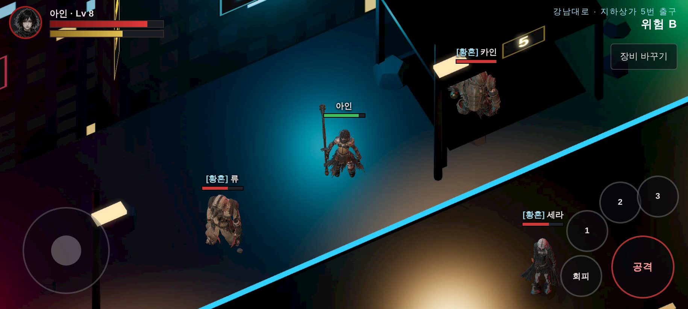
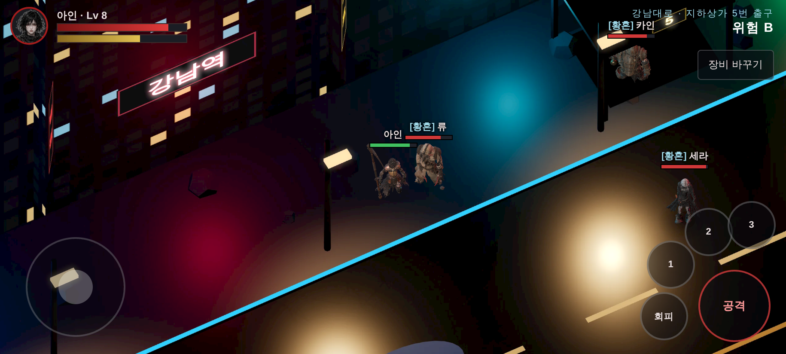
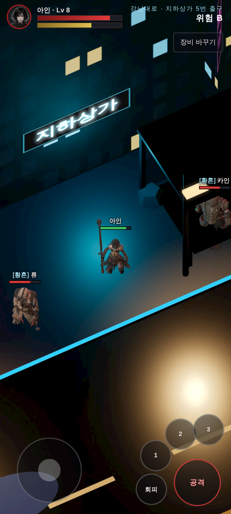
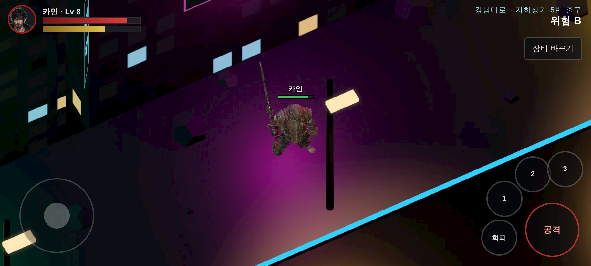

잰 것 (헤드리스 swiftshader — 시간은 못 잰다, CLAUDE.md §1):

- 맵: 144 px/m, 타일 1024px **8×6 = 48장, 5.3 MB**. 80 px/m 로 굽자 휴대폰에서 1.8배 늘어나 차선이 뭉개졌다.
- 한 프레임 **콜 45~52 · 삼각형 55.8만**. 삼각형은 거의 영웅 넷(`*_anim.glb` 한 명 약 14만)이다.
  문서 111 의 모바일 권장(정점 10만)을 크게 넘는다 → **폰에서는 의상 LOD(커밋 d4c2230, 50.6만 → 6.1만)를 써야 한다.**
- 블룸을 켜면 캔버스 안티에일리어싱이 안 먹어 캐릭터 테두리가 계단졌다 → `js/bloom.js` 에 `samples` 옵션(기본 0 — 기존 게임 동작 그대로), 시제품은 4.

남은 것 (순서대로):

1. **실기기 프레임** — 디렉터 안드로이드에서 `mmo.html?debug=1` 의 fps·콜·삼각형. `?lod=0` 과 견준다 (LOD 는 §6.3).
2. ~~여러 명 동기화~~ → §6.4. 남은 것: 100명 부하 측정, Render 재배포.
3. ~~맵 타일 스트리밍~~ → §6.5.
4. 원화 — 지금 맵은 실측 데이터로 세운 장면을 구운 것이다(§6.5). 원화가 같은 각도·같은 높이 규약으로 그리면 그대로 갈아 끼운다.

### 6.3 휴대폰용 가벼운 영웅 (LOD, 2026-10-06)

`tools/2d/make-lod.mjs` → `art/3d/lod/` (15 MB). meshoptimizer 로 삼각형 약 1/4, 텍스처 긴 변 512 px webp. 뼈·스킨 무게·클립은 그대로.
`mmo.html` 은 휴대폰(터치)이면 자동으로 쓴다 (`?lod=0|1` 로 강제).

- Hi3D·Tripo 장비는 삼각형마다 정점이 따로라 보통 축소가 거의 안 먹었다(흉갑 3만 → 2.8만). 위치로만 묶는 «엉성한» 축소를 더했다.
- **처음 판은 확대해 보니 망가져 있었다** — 엉성한 축소를 영웅 몸(스킨 메시)에도 걸었더니 아인 어깨 갑주·머리카락에 구멍, 0.25 로 줄인 흉갑에 구멍.
  → 스킨 메시는 빼고, 엉성한 축소는 0.5 까지만. 다시 확대해서 구멍이 없는 것을 봤다.
- 결과: 한 화면 **삼각형 55.8만 → 19.4만 (−65%)**, 콜 50 그대로. 아인 7.4만 → 2.4만, 카인·류 6만 → 1.5만, 세라 7.6만 → 1.9만.

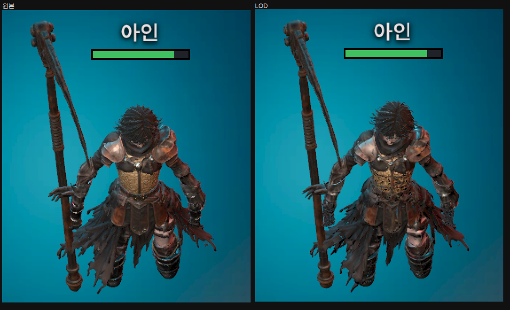

### 6.4 필드 동기화 — 같은 지역의 실제 사람들 (2026-10-06)

| 무엇 | 어디 |
|---|---|
| 서버 필드 방 — 위치·방향·동작을 초당 10번 받고, 속도(7.5 m/s)·걷는 띠를 검사, 관심 반경 28 m 안만 초당 10번 돌려준다. 이름·영웅·장비·외형 프리셋은 처음 보일 때·바뀔 때만 | `server/field.cjs` (파티 서버 `/party-socket` 에 붙음) |
| 걷는 띠·출발점 | 맵 굽기 결과 `maps/2d/<zone>/map.json` 을 서버도 그대로 읽는다 |
| 클라이언트 — 파티 서버 계정(토큰 공유)으로 접속, 영웅은 계정의 영웅, 다른 사람은 받은 위치로 부드럽게 따라감 | `mmo.html?online=1` (파티 서버가 서빙할 때) · `mmo.html?server=<주소>` (GitHub Pages) |
| 시험 | `tests/field-server.test.cjs` — 속도 제한·관심 반경을 일부러 빼면 실패하는 것 확인 |
| 휴대폰 두 대 시나리오 (서버까지 한 프로세스) | `node tools/2d/field-scenario.mjs` |

휴대폰 두 대(아인·카인): 서로가 서로의 화면에 나오고, B 가 본 A 위치와 A 자신의 위치 차이 **0.03 m**.

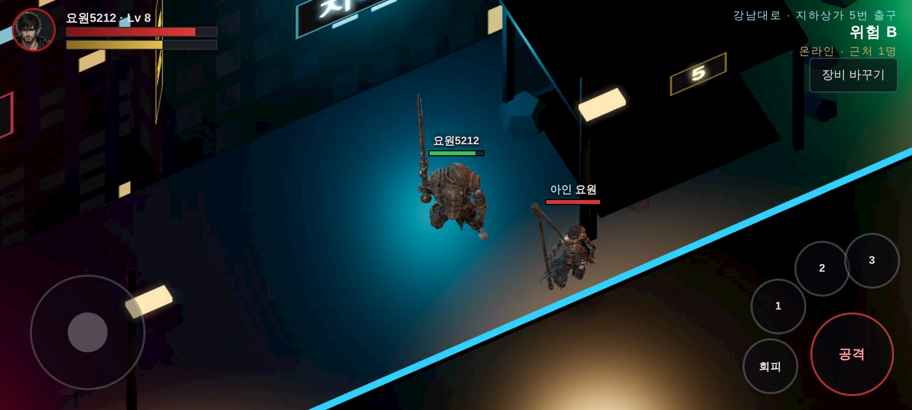
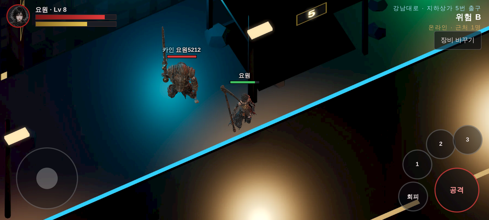

- 외형 프리셋(`look` 0~3)은 시제품용이다. 무기는 계정 장비(`equipment`)를 따른다. 방어구 외형은 외형 화면(문서 34)의 저장 체계로 옮길 것.
- 한 지역 100명이면 초당 메시지가 사람당 10 × 근처 인원이다. 관심 반경과 위치 압축(정수 cm)으로 줄일 여지 — 부하 측정은 다음.
- **Render 재배포가 필요하다** (`docs/DEPLOY-PENDING.md`).

### 6.5 실제 공간 — 강남역 일대 (2026-10-06)

디렉터: «맵은 조사해서 실제 공간을 구현하자.»

**조사한 것**

- **OpenStreetMap 실측** (`docs/licenses/osm.md`): 강남역 사거리 둘레 약 670 × 660 m — 건물 357동(층수·높이 있는 것 다수: GT타워 130 m 등),
  도로 200개(강남대로 편도 4~5차로 + **중앙버스전용차로**, 테헤란로), 지하철 출구 **12개 전부 실제 좌표**, 횡단보도 56, 신호등 7, 상가 645(업종만 쓴다).
- **원작 묘사** (제1부 통합본 EP02 §2~§6, L1199~L1356) — 맵을 꾸미는 규칙이 이것이다:

| 원문 | 맵에서 |
|---|---|
| «강남대로는 부서지지 않았다 … 무너진 게 아니라 멈춰 있었다» | 건물은 온전하다. **잔해·무너진 벽 없음** (첫 시제품의 폐허는 원작과 어긋나 뺐다) |
| «차들은 차선을 지킨 채 멈춰 있었다 … 사람들은 마지막까지 신호를 지켰다» | 차선마다 선 차, **횡단보도 위에는 차가 없다**, 문 열린 차·트렁크 열린 차(짐이 반쯤) |
| «전기가 아직 들어온다 … 신호등, 전광판, 몇몇 간판» | 신호등 초록, 대피 안내 전광판, 간판은 35% 만 켜짐 |
| «건물 외벽을 타고 주황색 결정 … 죽은 가로수 자리 … 무릎 높이로» | 먼 쪽 건물 벽을 타는 결정, 인도 가로수 자리에 결정 반·죽은 나무 반 |
| «보라와 핏빛이 뒤엉킨 황혼» | 보랏빛 하늘빛 + 서쪽 낮은(14°) 노을, 긴 그림자를 구워 넣는다 |
| «강남역 5번 출구는 반쯤 무너져 있었다» | 12개 출구 중 **5번만** 지붕이 내려앉았다 (실측 위치: 사거리 남쪽 약 290 m) |

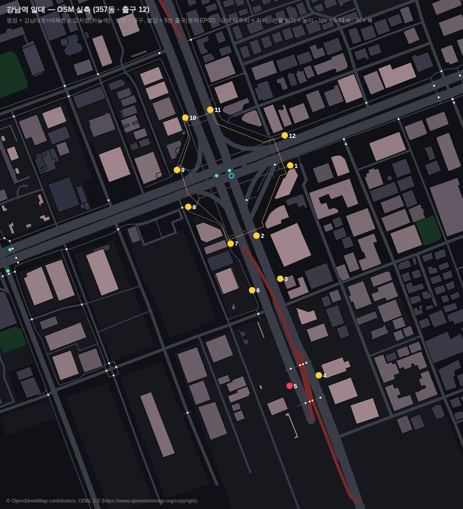

**만든 것**

| 무엇 | 어디 |
|---|---|
| Overpass 원본 → 로컬 미터 좌표(원점 = 강남대로×테헤란로 교차점), 상호 제거 | `tools/2d/osm-extract.mjs` → `maps/2d/gangnam/osm.json` |
| 평면도로 검수 | `tools/2d/osm-plan.mjs` |
| 실측 + 원작으로 장면 세우기 — 건물 윤곽 그대로 돌출, 강남대로를 화면 대각선으로 돌림, **가까운 쪽 건물은 1층 높이로 잘라** 길을 가리지 않게 | `js/mmo/env-osm.js` |
| 굽기 전 한 장면 미리보기 | `tools/2d/preview-map.mjs` |
| 굽기 — 빈 타일은 굽지 않는다(격자 1144 중 574), **깊이 대신 «보이는 면의 높이»** 를 굽는다 | `tools/2d/bake-map.*` |
| 타일 스트리밍 — 화면 + 한 장 둘레만 올리고 두 장 넘게 벗어나면 내린다 | `js/mmo/map2d.js` |
| 건물 윤곽 충돌, 가장 가까운 출구 표시(«강남역 N번 출구 m»), 지도 출처 표기 | `mmo.html` |

**휴대폰 화면 (Pixel 7, `mmo.html`)** — 타일 574장 · 31.4 MB, 한 화면 콜 44 · 삼각형 19.4만(LOD). `npm test` 648 통과.

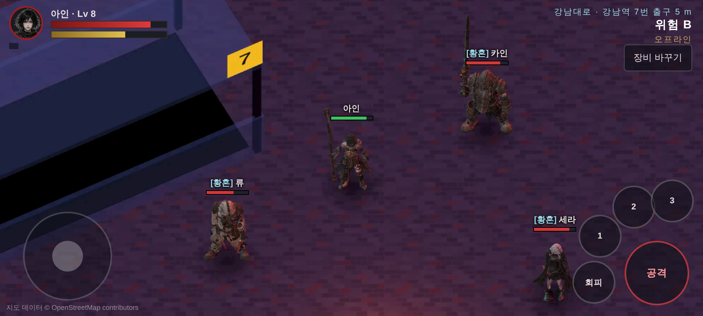
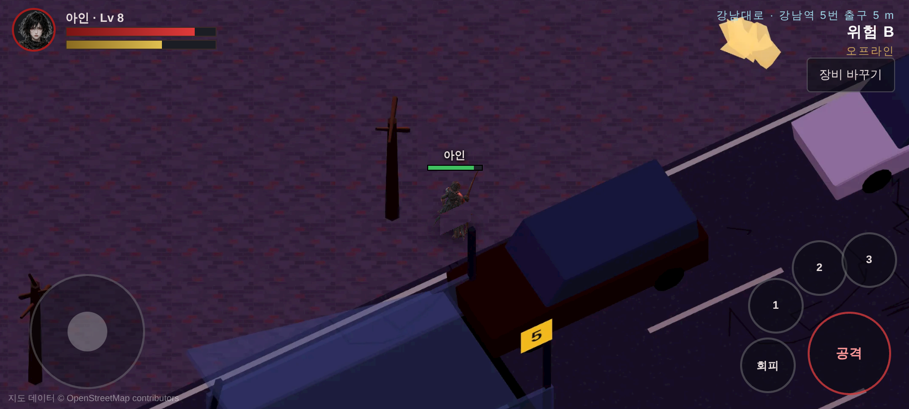
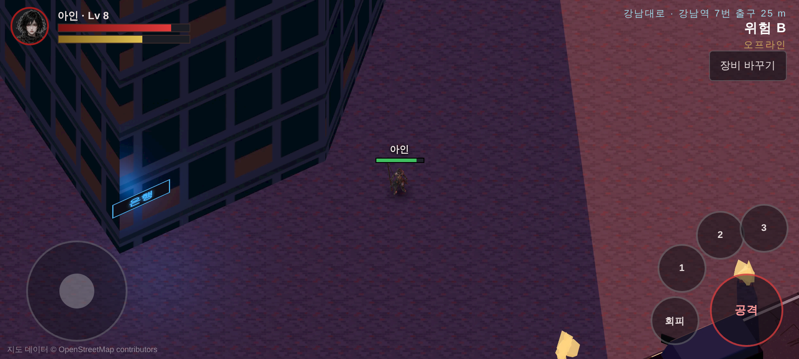
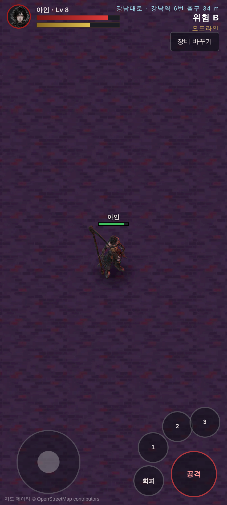

**고친 것 (재서 찾았다)**

| 증상 | 원인 | 조치 |
|---|---|---|
| 2번 출구가 차도 한가운데(t = −3 m), 반대편 인도가 걷는 띠 밖 | 원점이 강남대로 한쪽 차로 위 → 띠가 7~15 m 치우침 | 마주 선 출구 쌍(2·7, 3·6, 4·5, 10·11) 가운데로 0.97° 회전·중심 t = 12.6 m (잔차 2.5 m). 시험: 길 양쪽 출구 6개 모두 띠 안 |
| 출발점이 띠 밖 | 12번 출구는 테헤란로 쪽 | 강남대로 인도 출구 중 사거리 가까운 것(7번) 옆 |
| 게임에서 맵이 통째로 안 보임 | 타일 면 L=200 인데 카메라는 150 m 뒤 → 타일이 카메라 뒤 | 카메라 거리 = L + 150 |
| 보도블록이 사람 머리만 함 (세로 화면) | 한 장 4 m | 1.6 m (블록 20 × 10 cm), 대비 낮춤 |

- **높이로 굽는 이유**: 고정 각도 정사영에서는 땅에 닿는 깊이가 화면 줄마다 정해져 있어서 `깊이 = 땅 깊이 − 높이/sin(55°)` 로 정확히 되살아난다.
  땅은 전부 0 이라 깊이 그림이 작아진다 (벽 타일 150 KB → 50 KB, 한 칸 2 cm).
- 걷는 띠: 사거리 북쪽 55 m ~ 5번 출구 남쪽 18 m (길이 약 366 m), 강남대로 양쪽 인도까지. 1:1 실측이라 끝에서 끝까지 달려서 약 75초.
- 실제 공간을 1:1 로 그리면 지역 하나가 수십 MB 다. 10개 지역이면 GitHub Pages 한도(1 GB)에 닿는다 → 지역이 늘면 타일을 별도 저장소(CDN)로 옮겨야 한다.

### 6.6 지역 · 문 · 보이는 경계 · 던전과 보스 구역 (2026-10-06)

디렉터: «다른 맵들도 구현해서 넣고 못 들어가는 경계를 확실히 하자. 그리고 보스 구역도. 강남지역 던전 입구라던가. 리니지에 글루디오 던전처럼.»

**지역 셋 — 문으로 잇는다**

| 지역 | 무엇 | 실측 · 원작 | 문 |
|---|---|---|---|
| `gangnam` 강남대로 (필드) | §6.5 | OSM 강남역 일대 · EP02 | **5번 출구 → 지하상가 던전** · 북쪽 끝 → 남산 |
| `gangnam_b1` 강남역 지하상가 B1 (**던전**) | 5번 출구 계단 → 강남대로 밑 상가 통로 → 사거리 밑 중앙 광장 | OSM «강남역지하쇼핑센터» 실측 윤곽(약 144 × 173 m) · EP02 §6~§10 | 5번 출구 계단 → 지상 |
| `namsan` 남산 케이블카 길 (필드) | 하부역(회현동) → 상부역 → 반파된 N서울타워 광장 | OSM 케이블카 실측 · EP04~05 | 남쪽 끝 → 강남 |

- 리니지처럼 **필드에 문이 서 있다**: 바닥에 빛나는 원 + 빛기둥 + 이름표. 원 안에 서면 «⚔ 들어가기 / ➜ 이동» 단추(64 px, 키보드 E).
  누르면 `mmo.html?zone=<지역>&gate=<도착 문>` — 도착한 지역에서는 짝 문 앞에 선다(온라인이면 서버 `fieldJoin.gate` 가 그 자리에 세운다).
- 문은 **양쪽 지역에 짝**이 있어야 한다 — 시험 `tests/zones-gates.test.cjs` 가 모든 `map.json` 의 문을 따라가 본다.

**보이는 경계** — 실제로 막는 건 걷는 띠(클라이언트·서버 둘 다 자른다)지만, 이제 **눈으로 보인다**.

- 강남: 띠 가장자리에서 건물이 막지 않는 곳은 전부 콘크리트 방호벽 + 철망 + 붉은 띠 + «통제구역» 판. 끝에는 «통제구역 — 양재 방면 / 신논현 방면» 큰 판. 문 자리만 비운다.
- 지하상가: 실측 윤곽의 벽 (카메라 쪽 벽은 1 m 로 잘라 안이 보이게).
- 남산: 나무 난간 + 붉은 밧줄 + «출입금지», 그 밖은 **붉은 안개** 비탈(원작 «40 m 아래는 붉은 안개»). 타워 너머는 «낭떠러지 — 붉은 안개».

**던전 — 강남역 지하상가 B1** (`js/mmo/env-dungeon.js`, 땅 위와 같은 좌표틀이라 상가가 실제 강남대로·사거리 **바로 밑**에 놓인다)

| 원문 (제1부 통합본 EP02) | 던전에서 |
|---|---|
| «지하 1층 상가 통로는 허리까지 잠겨 있었다» | 물 높이 0.9 m — 구운 높이에 들어가 인물의 허리 아래가 가려진다. 발밑엔 그림자 대신 물결 |
| «천장의 형광등 … 3초 켜짐. 1초 꺼짐» | `map.json flicker` — 게임이 화면을 3초/1초로 깜빡이고 캐릭터 빛도 같이 죽는다 |
| «깨진 한글 네온 「생맥주」 — 마지막 글자만 살아서» | «주» 만 켜진 간판 |
| «벽에 긁힌 자국 … 세 줄씩» · «쇼윈도 리퍼 — 유리 뒤에서 기다린다» | 세 줄 긁힘, 유리 뒤 웅크린 그림자 |
| «스크린도어 옆에 시 액자» · «전광판 「잠시 후 열차가 도착합니다」» | 광장 북쪽 2호선 쪽. 승강장(B2)은 셔터로 막힘 — 다음 층 |
| «중앙 광장 — 지하 1층과 2층을 튼 2층 높이 … 크리스마스 장식 … 뒤집힌 진열대» | **보스 구역 · 클레이브** (반지름 19 m) |

- 상가 안쪽은 «등을 맞댄 가게 두 줄» 섬이 바둑판으로, 큰 통로 둘(강남대로 밑 · 테헤란로 밑)은 비운다. 출발점(5번 출구 계단) → 광장까지 약 260 m.

**보스 구역** — `map.json bosses[]` (자리 · 반지름 · 모델). 들어서면 화면 위 «보스 구역 · 이름» + 붉은 테두리, 보스가 천천히 돌아본다.
전투는 다음 단계 — 지금은 «어디에 무엇이 있는가» 를 맵에 박는다.

| 지역 | 보스 | 자리 | 원작 |
|---|---|---|---|
| 지하상가 B1 | 클레이브 «셔터 끄는 놈» (3.2 m) | 사거리 밑 중앙 광장 | EP02 §10 |
| 남산 | 셀레스티얼 «내려오지 않는 놈» (6.5 m 위에 떠 있다) | 타워 앞 광장 | EP04 — 첫 조우는 후퇴 |

## 7. 성장 · 경제

- **강화**: `items.js` 의 +1~+10 표 그대로. 실패하면 단계 유지 또는 하락, 증발 없음 (가안).
- **제작**: 한 장인 공방. 재료는 보스 부위 파괴에서 나온다.
- **정제**: 하급 재료 → 상급 재료. 촉매사 보너스.
- **거래**: 1차는 NPC 보급소만. 플레이어 거래는 봇·현금거래 대비를 갖춘 뒤 (가안).

## 8. 함께하기

- 인력사무소: 의뢰 게시판, 파티 모집 (기존 `recruit`).
- 길드: 기존 쉘터 서버의 길드·채팅·귓속말·차단을 그대로 쓴다 (문서 27~29).
- 필드 보스: 정해진 시간에 나오고, 기여도로 보상을 나눈다 (기존 정산 화면).
- **PvP: 나중.** 1차는 PvE 만. 데이터만 PvP 를 막지 않게 짠다.

## 9. 기술

| 층 | 무엇 | 지금 있는 것 |
|---|---|---|
| 클라이언트 | Phaser 4 + 기존 UI 화면을 DOM 오버레이로 | `vendor/phaser.min.js`, `js/rig-phaser.js`, UI 20화면 |
| 전투 서버 | 기존 Node 서버 권한형 전투 | `server/raid.cjs`, `rpg-*.cjs` |
| 필드 서버 | **새로 만든다**: 존 단위 방, 관심 영역(AOI) 동기화, 존당 동시접속 | 쉘터 서버 (100 동접 측정됨, `docs/validation/party-load-100.json`) |
| 저장 | 계정·캐릭터·인벤토리·길드 | SQLite (`rpg-store.cjs`) |
| 앱 | 안드로이드 | Capacitor (`android/`) |
| 맵 | Tiled 타일맵 | `maps/d01.json` |

## 10. 1차 목표 — 첫 플레이 버전

- 존: **강남 벙커**(허브) + **강남대로·강남역 지하상가**(필드) + 보스 던전 2 (허수아비, 클레이브)
- 메인 퀘스트 EP01~EP03
- 계열 4, Lv 1~10
- 카운터 3단, 부위 파괴, 처형
- 디아블로식 조명, 바닥 드롭 빛기둥
- 기존 계정·길드·채팅·파티 연결

**합격 기준 (재서 보여 준다)**

- 안드로이드 실기기(Pixel 7 급) 가로 화면에서 필드 60fps, 보스전 50fps 이상
- 한 존에 50명이 있을 때 위치 동기화 지연 150ms 이하
- `npm test` 통과
- 모든 화면을 휴대폰 가로·세로로 찍어 첨부

## 11. 단계

1. **기술 시제품**: 강남대로 한 블록 타일맵 + 아인 모델을 8방향으로 구운 스프라이트 + 광원 반경 + 여러 명 이동 동기화. 실기기에서 찍어 보여 준다.
2. **1차 목표** (§10)
3. 남산 · 여의도 · 한강 확장
4. PvP, 플레이어 거래, 거점전

## 12. 결정 필요

| # | 질문 | 추천 |
|---|---|---|
| D1 | 캐릭터: 직업제 vs 네 영웅 중 고르기 | **확정 2026-10-06: 네 영웅 중 고르기** (10-05 직업제에서 바뀜) · 장비가 보이는 외형 (§4.1) |
| D2 | 3D(UE5) 작업: 보류 vs 병행 | 2D 출시까지 보류. 3D 모델은 스프라이트 원본으로 계속 쓴다 |
| D3 | 원문의 지는 싸움: 첫 진입은 원문대로, 반복은 격파 가능 | 그렇게 |
| D4 | 레벨 구간, 계열 이름 등 (가안) 값 | 1차 목표에 필요한 것만 먼저 확정 |
| D5 | 무엇을 2D 로, 무엇을 3D 로 | **확정 2026-10-06: 맵만 2D, 캐릭터·몬스터·NPC 는 3D, 와일드리프트식 카메라 (§6)** |
