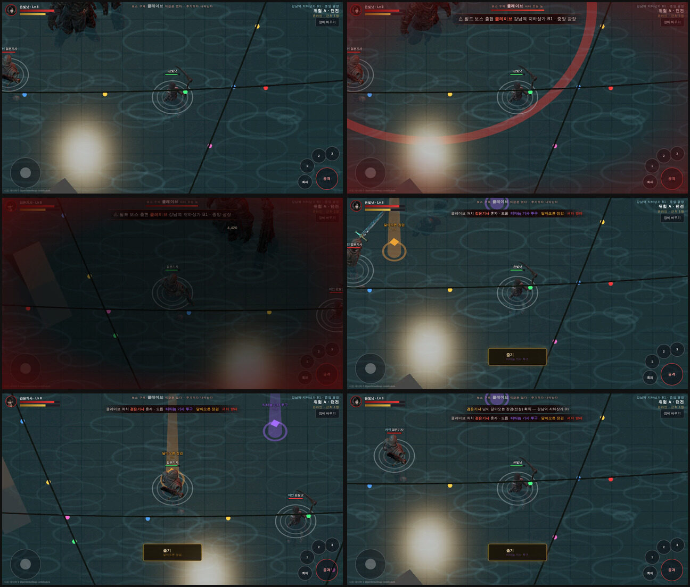
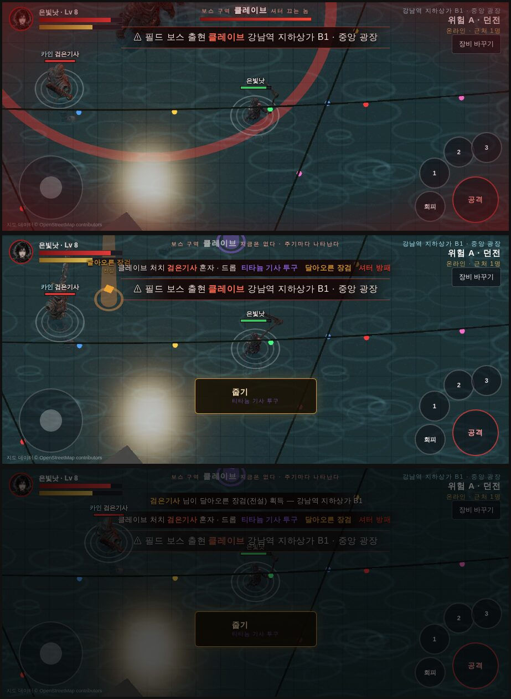

# 189 · 필드 보스 — 주기 출현 · 서버가 굴리는 피해 · 바닥 드롭 · 서버 전체 알림 (2026-10-06)

디렉터: «확률적으로 그 몬스터의 장비를 획득하고 또 그 장비를 착용해야 남들한테 자랑이 되고 그게 로망이 되서 거기에 목숨 거는 게임이 되는거지»
설계: 문서 186 §3 (리니지 주기 창) · 188 (사냥의 맛). 이 문서는 «만든 것» 의 기록이다.

## 1. 흐름

```
주기 창 안 무작위 시각 ─▶ 출현 (서버 전체 알림 · 땅에서 솟음 · 붉은 고리 · 화면 흔들림)
   ─▶ 모두가 때린다 (피해는 서버가 굴린다) ─▶ 처치 (서버 전체 알림 · 기록 · 재료)
   ─▶ 바닥에 장비 (등급 색 빛기둥 · 1위 10초 먼저) ─▶ 줍기 (전설·신화면 서버 전체 «… 획득»)
   ─▶ 다음 주기 창에서만 다시 (같은 창에 두 번은 없다)
```

## 2. 서버

| 파일 | 하는 일 |
|---|---|
| `server/boss-cycle.cjs` | `period · start~end · chance` → 다음 출현 시각. 죽으면 다음 주기부터. `BOSS_TIME_SCALE` 로 시험 때 시간을 줄인다 |
| `server/boss-table.cjs` | 13자리의 체력·주기·드롭을 **한 곳에서** (운영 중에 바꾸는 곳) |
| `server/boss-store.cjs` | DB 표 `field_bosses`(다음 출현 시각·살아 있나) · `boss_kills`(누가·언제·몇 명·무엇이 떨어졌나) |
| `server/field.cjs` | `fieldHit` · `fieldLoot`, `field` 메시지에 `bosses`(체력 비율) · `loot`(바닥 장비) |

- 피해 = (기본 공격력 + 무기 공격력 × 0.6) × 0.9~1.1 × 치명타. **클라가 보낸 숫자는 쓰지 않는다.**
- 닿는 거리 = 2.5 m + 보스 키 × 0.4 (최대 4 m) — 클라와 같은 식. 0.35초보다 빠른 연타는 버린다.
- 재료(심장 결정)는 기여도 5% 이상 전원에게 바로. 장비는 바닥에 — 기여도 1위가 10초 먼저, 3분 뒤 사라진다.
- 장비는 종류별 하나 — 이미 가진 사람은 못 줍고 다른 사람이 주울 수 있다.
- **보스 장비는 상점에 없다.** (`rpg-store.cjs` shop 에서 `src:'boss'` 를 뺐다)
- 재시작: 기다리던 보스는 약속한 시각을 지키고, 살아 있던 보스는 체력을 채워 다시 선다.

### 2.1 출현 주기 (가안 — `boss-table.cjs`)

| 보스 | 체력 | 주기 · 창 · 확률 |
|---|---|---|
| 케이블카 드로퍼 (정예) | 42만 | 30분 · 5~20분 |
| 클레이브 | 120만 | 2시간 · 30분~1시간 30분 |
| 클레이브 (마무리) | 160만 | 3시간 · 1~2시간 · 90% |
| 셀레스티얼 · 섀도우 팽 | 150만 · 140만 | 3시간 · 1시간~2시간 30분 |
| 에이지스-07 | 180만 | 3시간 · 30분~2시간 |
| 레비아탄 · 실험체 09호 · 박 준장 | 200만 · 160만 · 120만 | 4시간 · 1~3시간 |
| 셀레스티얼 (날개 넷) · 아스널 오버로드 | 220만 · 300만 | 6시간 · 2~5시간 (셀레스티얼 80%) |
| 정 장관 | 250만 | 8시간 · 3~7시간 |
| 나노-노바 코어 | 600만 | 24시간 · 18~23시간 · 70% |

### 2.2 드롭 (188 §6)

세트 방어구 한 조각 12% · 전설 무기 1.5% · 신화 0.2% (마무리 보스는 ×1.5, 노바 코어의 신화 낫은 1%).
보스 고유 장비 28종은 `js/items.js` 끝(`src:'boss'`, `boss:<id>`).

## 3. 화면 (`mmo.html`)



휴대폰 가로(Pixel 7 · 915×412):



- 서버 전체 알림은 위 가운데 띠 — 최대 3줄, **게임 시간으로** 지운다(벽시계면 느린 기기에서 보기 전에 사라진다).
- 피해 숫자는 보스와 나 사이 허리 높이 — 큰 보스의 머리 위는 화면 밖이었다(재 보니 y=26px).
- 바닥 장비: 등급 색 빛기둥(영웅 보라 · 전설 금 · 신화 빨강) + 이름표. 남이 먼저인 동안은 흐리게 «1위가 먼저».
- 줍기: 3.5 m 안에서 단추(또는 F). 장비를 고르게 흩어 떨어뜨린다 — 붙어 있으면 이름표가 겹치고 엉뚱한 걸 주웠다.
- 혼자(오프라인)일 때는 늘 서 있고 쓰러지면 30초 뒤 다시 선다(드롭 없음).

## 4. 확인

- `tests/field-boss.test.cjs` 5개 — 규칙 다섯(같은 창 재출현 · 거리 · 1위 우선 · 상점 · 연타)을 하나씩 깨뜨려 각각 실패하는 것을 봤다.
- `node tools/2d/boss-scenario.mjs [폴더] [보스]` — 서버를 한 프로세스에서 띄우고 두 사람이 끝까지 밟는다.

## 5. 아직 아닌 것

- **보스가 반격하지 않는다.** 필드에 플레이어 체력·사망이 아직 없다 — 다음 단계(보스 AI · 예고 · 연계, 문서 18).
- 보스 장비가 **캐릭터에 보이는 것**(고유 빛·불티)은 Hi3D 로 장비 모델을 뽑은 뒤.
- 강화 빛(+7·+9·+10), 칭호(«클레이브 사냥꾼»), 살펴보기.
- 온라인 반영: Render 재배포 + 지속 디스크(`docs/DEPLOY-PENDING.md` §5) — GPT 몫.
