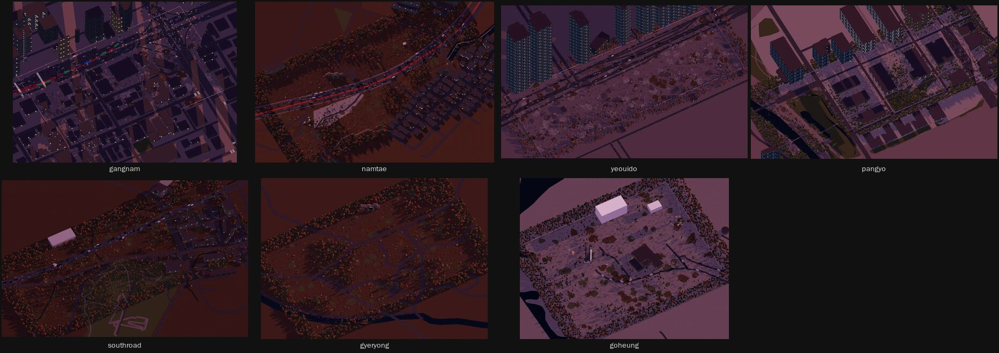
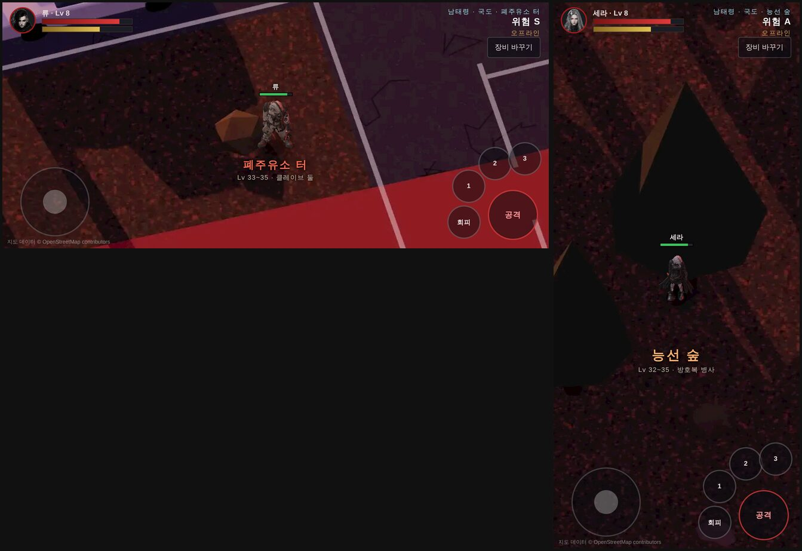
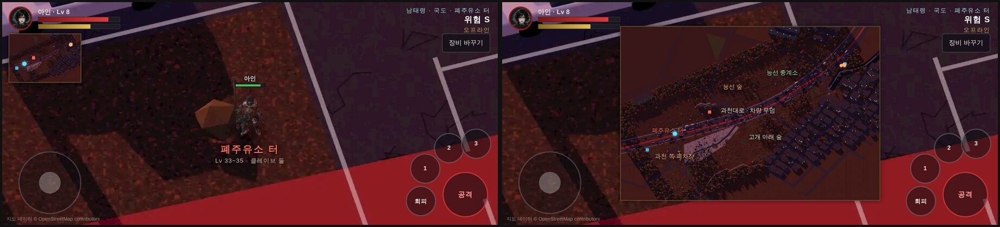

# 190 · 필드를 넓게 — 띠에서 «사냥터» 로 (2026-10-06 밤)

디렉터: «맵제작하던걸 이어가자» → (무엇을?) «필드를 넓게» · «아침 6시까지 조사하면서 계속 진행해».

## 1. 왜

지금까지 필드 9곳은 길 하나를 따라가는 **띠**였다 — 길이 365~777 m × 폭 48~160 m.
휴대폰 화면(가로)은 그림 면 5.6 m × 12.4 m 라서, 폭 60 m 띠면 위아래로 열 화면이 안 된다. 길을 따라 왕복만 한다.
리니지 필드는 사방으로 돌아다니는 땅이다 — 마을 둘레의 «숲 · 고요한 숲 · 거친 황야 · 묘지» 처럼 **하위 구역**이 있고,
구역마다 몬스터 계열과 위험도가 다르다(§4).

## 2. 잰 것 — 용량과 해상도

| | 값 |
|---|---|
| 휴대폰 가로(Pixel 7) 화면 | 그림 면 높이 5.6 m 에 1081 기기 픽셀 → **약 190 px/m** 로 보인다 |
| 굽는 해상도 | 필드 90 px/m (강남·남산은 120 이었다) — 이미 2배쯤 늘려 보고 있다. **더 낮추지 않는다** |
| 땅 1 m² 당 용량 | 90 px/m 필드 0.14~0.29 KB · 120 px/m 0.57~0.65 KB (색 + 깊이) |
| 깊이 그림 | 캔버스 PNG 가 필터를 고르지 않아 컸다(강남 깊이 18 MB > 색 15 MB) |

**깊이 그림 다시 압축** (`tools/2d/repack-depth.mjs`): 같은 픽셀, 행마다 가장 작은 필터 + zlib 9 → **104 MB → 30 MB**.
무손실 WebP 는 12% 까지 가지만 시험(`tests/map-height`)이 PNG 를 직접 풀어 읽어서 형식은 그대로 뒀다(다시 풀어 픽셀이 다르면 멈춘다).
이 74 MB 가 넓힐 자리다. GitHub Pages 1 GB 안에서 필드 9곳을 2~4배로 넓혀도 들어간다.

## 3. 넓히면 생기는 문제와 답

| 문제 | 답 |
|---|---|
| 빈 바닥이 넓게 드러난다(첫 남태령: 분홍 평면에 나무 몇 그루) | **땅 꾸미기** `L.dress` — 흙·풀·낙엽 얼룩, 바위·덤불(무릎 높이)·쓰러진 통나무, 도시는 콘크리트 덩이·드럼통·폐타이어 |
| 고르게 뿌리면 벽지 같다 | **값잡음**으로 숲과 빈터를 뭉친다(`L.noise2`) — 빈터가 곧 사냥 공터 |
| 걷는 구역 안 고층이 그 뒤를 통째로 가린다(55° 에서 높이 × 0.7 m) | 걷는 구역 안 건물은 **무너진 저층**(4.5~11 m, 지역마다) — 원작의 폐허 서울. 먼 쪽 풍경(여의도 IFC 등)은 그대로 |
| 나무·건물 뒤로 걸어가면 내가 안 보인다 | **가려진 인물 실루엣** — 맵(renderOrder −2) 다음, 인물(0) 앞에 «맵보다 뒤일 때만» 그리는 복제본(−1). 보이는 부분은 인물이 덮는다 |
| OSM 군사 구역(남태령)이 콘크리트 판으로 드러났다 | 실재 군 시설은 그리지 않는다 — `military` 는 숲 바닥으로 |
| 띠 끝 문이 «띠 가운데» 라 넓히면 블록 속으로 들어간다 | 강남 끝 문은 `t: 'road'` — 길 위에 |

넓히는 방향: 대개 **카메라 쪽(화면 아래)** — 먼 쪽(화면 위)의 고층 벽·능선 풍경을 살린다.

| 지역 | 걷는 띠 폭 (전 → 후) | 타일 (전 → 후) | 용량 (전 → 후) |
|---|---|---|---|
| 남태령 | 94 → 250 m | 637 → 1208 | 22 → 42 MB |
| 여의도 | 80 → 224 m | 743 → 1385 | 31 → 33 MB |
| 판교 | 68 → 210 m | 617 → 1219 | 18 → 25 MB |
| 남행 국도 | 84 → 232 m | 661 → 1288 | 28 → 42 MB |
| 계룡 | 130 → 270 m | 684 → 1143 | 32 → 44 MB |
| 고흥 | 160 → 305 m | 686 → 1105 | 15 → 22 MB |
| 강남 | 60 → 220 m (120 → 90 px/m) | 574 → 795 | 33 → 19 MB |
| 남산 | 48 → 150 m (120 → 90 px/m) | 1006 → 1183 | 51 → 59 MB |

(«전» 용량은 깊이 다시 압축 전. 넓이는 2~4배인데 용량은 0.6~2배 — 깊이 압축과 90 px/m 덕.)

굽다가 시험(`tests/map-height`)이 잡은 것 — 전부 «넓혀서 새로 생긴» 가림이다:

| 지역 | 잡힌 것 | 고친 것 |
|---|---|---|
| 남태령 | 배수 터널 둔덕(최고 13 m) 뒤 칸 10곳 — 원래 띠 끝(경계)이었다 | 둔덕 뒤 산비탈을 막이로 (`replan` — 다시 굽지 않음) |
| 남행 국도 | 중부대로 트럭 행렬 뒤 칸 2곳 | 정체 구간 막이 `jams` (`replan`) |
| 강남 | 북쪽 끝 문 고리 안에 멈춘 승용차 | 끝 문 자리에 차를 세우지 않는다 → 다시 굽기 |
| 남산 | 타워 문 위 — 처음엔 숲 갓으로 봤으나 비워도 높이가 한 자리도 안 바뀌었다. 시선 광선을 쏘니 **무너진 전망대 콘크리트 덩이** — «띠 안에만» 놓던 덩이가 넓어진 띠에 들어왔다 | 덩이·숲이 문 둘레(10 m)를 피한다 → 다시 굽기 |

## 4. 조사 — 리니지 필드는 어떻게 짜였나

리니지 클래식 필드 사냥터(인벤 안내 정리):

| 필드 | Lv | 짜임 |
|---|---|---|
| 말하는 섬 | 10 전후 | 북섬 · 중앙 · 동쪽 — 마을과 붙어 있어 상점·안전지대가 가깝다 |
| 글루디오 | 10~25 | 글루딘 ~ 켄트 사이 평야. **묘지 근처에 언데드가 밀집** — 같은 필드 안에서 위험한 구석 |
| 은기사 | 중급 | 마을 둘레 숲(늑대인간·라이칸) · 고요한 숲(오크) · 거친 황야(가스트·좀비) · 평원·묘지. 선공 몬스터가 많아 포션·귀환 필수 |
| 윈다우드 | — | 켄트 ~ 기란 사이 산악. 선공이 많고 **오아시스에서 정비** |
| 용의 계곡 | 고급 | 바위·협곡, 밀집도가 높아 파티 사냥 |

MMO 구역 설계 일반론(Bakharev «World Design & Level Architecture»):
구역 = **구(district)** — 고유한 생태·색·소리 / **결절점(node)** — 문·정비 장소·던전 입구 / **랜드마크** — 멀리서도 보이는 기준점.
좋은 구역은 **긴장과 쉼이 번갈아** 온다 — 넓은 빈 땅 사이에 특별한 곳을 박는다.

### 황혼 필드에 옮기면 (다음 단계 — 몬스터 자리)

| 리니지 | 황혼 |
|---|---|
| 필드 안 하위 구역마다 몬스터 계열 | 넓힌 필드를 OSM·원작 장소로 3~5 구역으로 나눈다. 예) 남태령: 과천대로 «차량 무덤» · 능선 숲 · 폐주유소 터 · 폐차장 · 배수 터널 앞 |
| 묘지처럼 «같은 필드의 위험한 구석» | 구역마다 위험도 — 보스 자리 둘레가 가장 위험 |
| 오아시스 = 필드 안 정비 | 중계소·요금소 같은 원작 장소를 안전 구역(`areas` safe)으로 |
| 마을 → 바깥으로 갈수록 강해진다 | 문(강남 벙커 출격문)에서 멀수록 강하게 (OpenMMO «장소가 곧 난이도», 문서 187 §3) |

`map.json areas[]` 에 `{ kind:'hunt', name, mobs, lv }` 를 넣어 서버 출현 표(L1J `spawnlist` 처럼, 문서 186 §4)가 읽게 한다.

## 5. 만든 것 — 하위 구역 · 미니맵

**하위 구역** — 지역 표(`js/mmo/zones.js`) 필드마다 `hunts`: 길 좌표 사각형 `{s:[a,b], t:[c,d]}` 또는 원 `{st, r}`,
`kind` hunt(기본)·rest, `lv`, `mobs`, `danger` 1~3. 굽기(`bake-map.html`)가 `map.json areas` 로 옮긴다 — 그림이 아니라서
`tools/2d/replan-map.mjs` 로 다시 굽지 않고 넣을 수 있다. 게임은 들어서는 순간 가운데(인물 아래)에 «폐주유소 터 · Lv 33~35 · 클레이브 둘»,
오른쪽 위 위험도는 구역마다(위험 B·A·S, 쉬는 곳은 안전 지대).

**미니맵** — `tools/2d/bake-overview.mjs <zone…>` 이 걷는 띠 전체를 게임과 같은 각도로 한 장(`overview.webp`, 1400 px, 필드 ~90 KB·실내 ~25 KB).
그림 좌표가 맵 타일과 같은 틀(u = x, v = −z·sin 55°)이라 내 자리를 바로 찍는다. 왼쪽 위 작은 지도 → 누르면(또는 M) 크게, 구역 이름이 보인다.
실내는 미니맵만 노출을 2.6배로(그대로는 지도로 읽기에 어둡다).

## 6. 출처

- [리니지 클래식 인벤 — 필드 사냥터 안내](https://www.inven.co.kr/board/lineageclassic/6497/47)
- [리니지 플포 — 필드 사냥터 추천](https://www.playforum.net/news/curationView.html?idxno=634150)
- [So You Want to Build an MMO 8/18 — World Design & Level Architecture](https://medium.com/@alexander.bakharev_16063/so-you-want-to-build-an-mmo-8-18-world-design-level-architecture-c07798d17f1c)
