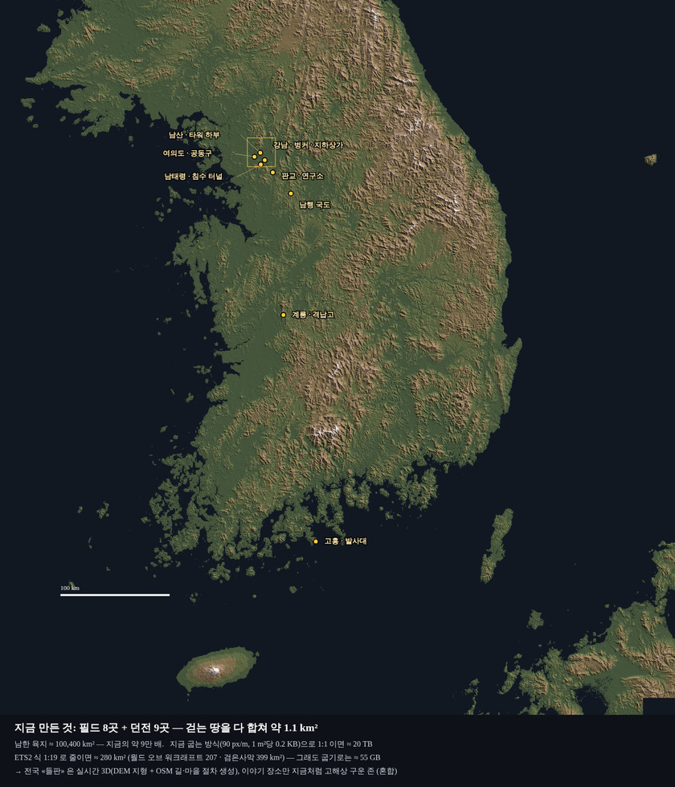

# 191 · 한국 전역을 세계로 — 다들 어떻게 하나 (2026-10-07)

디렉터: «mmorpg니깐 한국 전역을 이용하자. 한국 전체를 넣는다고 생각하자. 조사 더 해보자. 어떻게 다들 하는지»
(보스는 디렉터가 GPT 와 다시 만든다 — 소설과 다른 이미지. 이 문서는 맵만.)

## 1. 지금과 한국의 크기



| | 넓이 |
|---|---|
| 지금 걷는 땅 (필드 8 + 던전 9) | **1.1 km²** |
| 남한 육지 | 약 100,400 km² — 지금의 약 9만 배 |
| 지금 굽는 방식(90 px/m, 1 m² 당 0.2 KB)으로 1:1 | 약 **20 TB** — 불가능 |
| 1:19 로 줄이면(아래 ETS2) | 약 280 km² — 그래도 굽기로는 약 55 GB |
| 참고: 월드 오브 워크래프트(오리지널) · 검은사막 | 207 · 399 km² |

→ **«전부 굽기」로는 안 된다.** 다들 «축척을 줄이고», «들판은 데이터에서 실시간으로 만든다».

## 2. 다들 어떻게 하나

| 게임 | 실제 국토 | 축척 | 방법 |
|---|---|---|---|
| **유로 트럭 시뮬레이터 2** (SCS) | 유럽 | 시골 **1:19**, 영국 1:15, **도시 1:3** | 1:20 으로 시작해 실제 도시 간 거리와 견줘 1:19 로. 도시는 덜 줄여 «알아보게» |
| 아메리칸 트럭 시뮬레이터 (SCS) | 미국 서부 | 1:35 → **1:20 으로 다시** | «너무 줄여 갑갑하다» 는 반응 — 세계를 더 짓기 전에 고쳤다. 몇 달 걸림 |
| 더 크루 2 (유비소프트) | 미국 본토 | 약 **1:36** (약 5,000~7,000 km²) | 자체 «축척 기술» — 거리는 줄이고 지역 특색은 살린다 |
| 마이크로소프트 플라이트 시뮬레이터 | 지구 전체 | **1:1** | 위성사진에서 AI 가 건물·숲을 찾아 **건물 윤곽만으로 3D 를 절차 생성**(Blackshark.ai, 15억 동) — 실시간 스트리밍. 비행이라 1:1 이 된다 |
| 포켓몬 GO · 몬스터 헌터 나우 | 전 세계 | 1:1 (GPS) | OSM(2017~) / 구글 지도. 땅 종류로 출현 몬스터가 바뀐다. 걷는 게 곧 이동 — 우리와 다른 장르 |
| 아르마 (보헤미아) | 실제 섬·지역 | 1:1 (작은 지역) | DEM 으로 지형, 위성사진은 «물체를 놓는 밑그림» 으로만 |
| OpenMMO (송재경, 문서 187) | 가상 | — | 32 km 절차 생성, 64 m 타일 |
| Streets GL (오픈소스, MIT) | OSM 전체 | 1:1 | 브라우저 WebGL2 로 OSM 건물·길·나무 + 지형 타일을 실시간 3D — **«굽지 않고 데이터에서 그린다» 의 웹 사례** |
| MMO 크기 | — | — | WoW 207 · 검은사막 399 km², 큰 쪽 주장 LOTRO 수만 km² · WWII Online 35만 km² |

**배울 점**
1. **축척은 놀이에서 정한다, 기술이 아니다.** 1:1 한국은 서울~부산 325 km — 걸어서(4.8 m/s) 19시간. 1:20 이면 16 km, 70분.
2. **도시는 덜 줄인다**(ETS2 1:3). 강남역처럼 이야기 장소는 지금처럼 1:1 로 구운 «존» 으로 두고 들어간다.
3. **너무 줄이면 갑갑하다**(ATS 1:35 → 1:20). 세계를 다 짓기 전에 정해야 한다.
4. **들판은 데이터에서 만든다**(MSFS · Streets GL) — 지형 DEM + 길·강·해안 + 땅 종류 → 절차 생성. 손으로 다 짓지 않는다.
5. 우리 카메라는 화면에 **12 × 6 m** 만 보인다 — 실시간으로 그릴 범위가 아주 좁다. 휴대폰에서도 «주변만 만들어 그리기» 가 싸다.

## 3. 데이터 — 이 컨테이너에서 실제로 받아 봤다

| 데이터 | 받기 | 라이선스 | 쓰임 |
|---|---|---|---|
| Copernicus DEM GLO-30 / 90 (AWS 공개 버킷) | ✓ (30 m 한 칸 49 MB · 90 m 5.8 MB) | 무료·공개 (출처 표기) | 지형 높이 |
| 국토지리정보원 DEM (공공데이터포털) | — (다음에) | **CC0** | 한국 지형 — 더 정확 |
| 지형 타일 (terrarium, AWS) | ✓ (위 그림 — z9 131장 13 MB) | 출처 표기 | 미리보기·전국 지도 |
| Natural Earth | ✓ | 퍼블릭 도메인 | 해안·국경 |
| OSM 한국 전체 (Geofabrik) | ✗ (프록시가 막음) | ODbL | 길·강·마을 — Overpass(maps.mail.ru) 로 나눠 받기 / BBBike 서울 추출본(52 MB) ✓ |
| 브이월드 | — | **CC BY-NC (비상업)** | **쓰지 않는다** |

## 4. 제안 — 혼합

```
전국 «들판» (1:20 안팎, 연속) ── 실시간 3D: DEM 지형 + 길·강·해안 + 땅 종류 → 숲·논·마을을 절차 생성
      │  (도시·이야기 장소에 서면 문)
      ▼
이야기 «존» (1:1, 지금처럼 구운 고해상) ── 강남역·남산·여의도 … 던전
```

- 축척: **1:20 추천** (남한 약 250~280 km² — 검은사막 정도). 1:10 이면 1,000 km² 로 넓지만 빈 땅이 많아진다.
- 이동: 원작의 차량·길잡이(오정길) 빠른 이동 · 문(출격문).
- 서버: 지금 «지역마다 방» → 들판은 칸(예: 512 m) 단위 관심 영역으로.
- 사냥터: 리니지 하위 구역(문서 190)을 도·시 단위로 — 땅 종류(숲·논·도시·해안)가 몬스터 계열을 정한다(포켓몬 GO 처럼).

## 5. 단계

1. **전국 지도** — 위 음영도를 게임 «지도» 화면으로(지역 표시 · 빠른 이동). 데이터는 이미 있다.
2. **들판 시제품** — 서울 남부~남태령 구간을 1:20 실시간 들판으로, 기존 존(강남·남태령)으로 들어가는 문. 휴대폰 fps 를 잰다.
3. **전국 자동 생성** — 남한 전체 들판 + 도·시별 사냥터·보스 자리 배치표.

## 6. 정할 것

| # | 질문 | 추천 |
|---|---|---|
| K1 | 축척 | 1:20 (도시 존은 1:1) |
| K2 | 범위 | 남한 + 제주 (북한·독도는 나중) |
| K3 | 이동 | 걷기 + 차량 + 빠른 이동 |

## 7. 출처

- [ETS2 축척 1:19 설명](https://racinggames.gg/article/euro-truck-simulator-2-is-roughly-119-and-thats-why-it-works) · [SCS «The Rescale»](https://blog.scssoft.com/2016/06/the-rescale.html)
- [더 크루 2 지도 크기](https://expertbeacon.com/how-big-is-the-crew-2/)
- [MSFS 와 Blackshark.ai — Bellingcat](https://www.bellingcat.com/resources/case-studies/2020/08/24/cleared-for-takeoff-exploring-microsoft-flight-simulator-2020s-research-potential/)
- [Pokémon Go — OSM 위키](https://wiki.openstreetmap.org/wiki/Pok%C3%A9mon_Go) · [Dragon Quest Walk — Google Maps Platform](https://mapsplatform.google.com/resources/blog/square-enix-and-colopl-bring-real-world-dragon-quest-walk/)
- [Arma Reforger 지형 준비](https://community.bistudio.com/wiki/Arma_Reforger:World_Editor:_Terrain_Preparation_Tutorial)
- [Streets GL (GitHub)](https://github.com/StrandedKitty/streets-gl)
- [MMO 세계 크기 비교 — Game Rant](https://gamerant.com/biggest-open-world-mmorpgs-smallest-to-largest/)
- [Copernicus DEM — AWS 공개 데이터](https://registry.opendata.aws/copernicus-dem/) · [국토지리정보원 DEM — 공공데이터포털](https://www.data.go.kr/data/15059920/fileData.do)
- [브라우저 오픈월드 지형 LOD·스트리밍](https://app.cinevva.com/guides/landscape-generation-browser)
