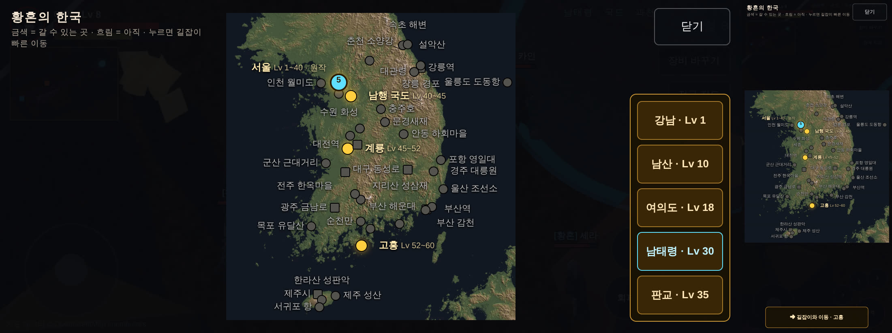
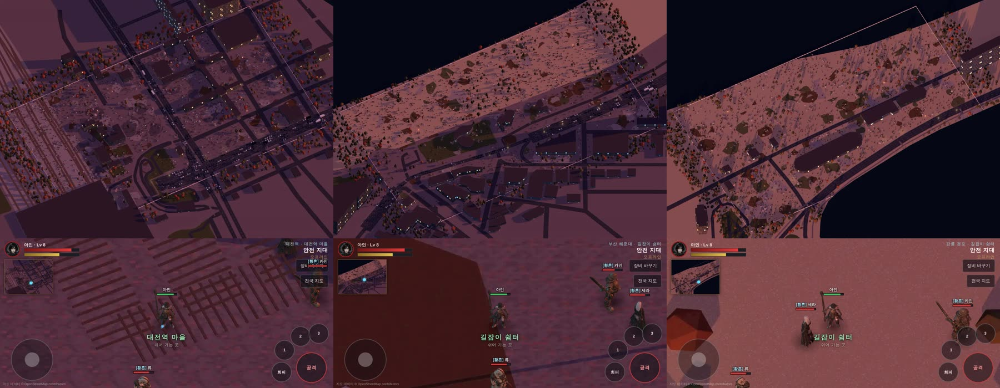
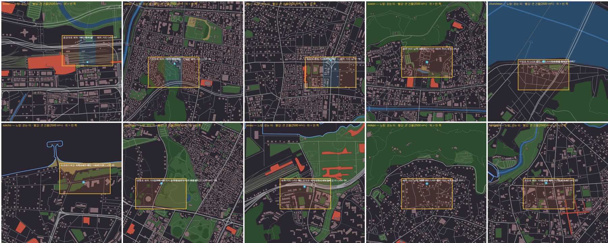

# 192 · 황혼의 한국 — 우리에게 맞는 기획 (2026-10-07)

디렉터: «우리에게 맞는 기획으로 진행해야지» (문서 191 의 조사 뒤).

## 1. 우리 조건

| 조건 | 무엇을 뜻하나 |
|---|---|
| **휴대폰 · 고정 55° 카메라 · 화면에 12 × 6 m** | 한 화면은 좁다 — 넓은 땅보다 «한 지역 안의 밀도» 가 중요하다 |
| **화면 품질 = 구운 노을빛·그림자** | 실시간 3D 들판으로 바꾸면 지금 품질과 굽기 도구를 버린다 |
| **OSM → 지역 하나 자동 굽기 (약 45분, 손 작업 거의 없음)** | 우리 강점 — «지역을 많이» 는 기계 시간이지 사람 시간이 아니다 |
| **리니지식 «지역 + 문», 공유 세계, 필드 보스** | 연속 세계일 필요가 없다. 리니지도 섬·본토·던전 층이 따로였다 |
| **GitHub Pages 1 GB · 맵 지금 311 MB (지역당 20~60 MB)** | 15곳 남짓 더 넣으면 찬다 — 맵 그림은 따로 둘 곳이 필요하다(§5) |

## 2. 결정

1. **연속 세계 대신 «전국에 흩어진 지역»** — 실제 좌표 그대로. 지역 하나 = 지금 크기의 넓은 필드(0.1~0.15 km²).
   축척을 줄이지 않는다 — 지역 «안» 은 1:1 실측, 지역 «사이» 는 이동으로 건너뛴다(트럭 시뮬레이터의 «도시는 덜 줄인다» 를 끝까지 민 것).
2. **이동 = 지도 화면의 빠른 이동** (원작의 길잡이 오정길) + 지역 안의 문(던전·이웃 지역). 문은 양쪽 짝 규칙 그대로.
3. **거점(마을)** — 리니지 마을처럼 안전 지대: 강남 벙커(지금) → 대전 · 대구 · 부산 · 광주 · 강릉 · 전주 · 제주.
4. **장소가 곧 난이도** (OpenMMO, 문서 187) — 강남에서 멀수록 강하다: Lv ≈ 1 + 거리(km)/6. 부산 약 55, 제주 약 75.
   원작 동선(강남 → 고흥)은 메인 퀘스트로 그대로 두고, 그 바깥이 전국.
5. **지역 찍어 내기** — 좌표 하나로: OSM 받기 → 축이 될 큰길 자동 → 걷는 띠·땅 꾸미기·하위 구역 자동 → 굽기 → 미니맵.
   땅 종류(도시·산·해안·섬·농촌·공단)가 꾸미기와 몬스터 계열을 정한다(포켓몬 GO 처럼).
6. **전국 지도** — 실제 지형 음영(DEM) 위에 지역 점. 만든 곳은 밝게, 계획은 흐리게.

## 3. 지역 목록 — `js/mmo/regions.js`

거점 8 · 원작 동선 8 · 전국 필드 후보 약 30. 좌표·종류·거리 레벨을 한 곳에.

## 4. 단계

| 단계 | 무엇 |
|---|---|
| 1 | 지역 목록 + 전국 지도 화면(빠른 이동) |
| 2 | 지역 찍어 내기 도구 (`tools/2d/new-zone.mjs`) + 시험 삼아 3곳 (대전 · 부산 해운대 · 강릉 경포) |
| 3 | 거점 화면(안전 지대·상점), 지역마다 하위 구역·몬스터 계열 |
| 4 | 맵 그림을 따로 두는 곳으로 옮기고(§5) 전국 30곳 굽기 |

## 5. 맵 그림을 둘 곳 (정할 것)

지역 30곳이면 1~1.5 GB — Pages 1 GB 를 넘는다. 저장소도 이미 1.2 GB(굽을 때마다 옛 그림이 이력에 쌓인다).
- GitHub 저장소를 지역 묶음별로 나눠 각자 Pages(1 GB 씩) — 계정 안에서 끝난다
- Cloudflare R2 (10 GB 무료, 내보내기 무료) — 계정·키 필요
- Hugging Face 데이터셋 (OpenMMO 가 쓴 방식) — 계정 필요
게임은 지역마다 `map.json` 의 주소만 바꾸면 된다(타일 주소는 이미 해시가 붙어 있다).

## 6. 1단계 — 만든 것

- `js/mmo/regions.js` — 지역 43곳(원작 동선 8 · 거점 7 · 전국 필드 28), `distKm` · `levelOf`.
- `tools/2d/world-map.cjs` — 지형 타일(terrarium, z9) 받아 음영 → `maps/world/korea.webp`(1600 px, 260 KB) + `korea.json`(메르카토르 틀).
- `mmo.html` 오른쪽 위 «전국 지도» — 금색 = 갈 수 있는 곳, 회색 = 아직, 네모 = 거점, 하늘색 = 지금 여기.
  - 서울 원작 다섯 곳(강남 · 남산 · 여의도 · 남태령 · 판교)은 전국 지도에서 손톱만 해서 **«서울» 점 하나**로 묶었다 — 누르면 다섯 곳 단추.
  - 이름표는 겹치면 자리를 옮기고(오른쪽 · 왼쪽 · 위 · 아래 · 대각선), 그래도 없으면 **계획 지역 이름만** 숨긴다(점은 남아 누를 수 있다). 잰 값: 이름표 39개 중 가로 35 · 세로 34개가 보이고 **서로 겹침 0**, 제목·이동 단추가 지도를 가리지 않는다.
  - 고르면 «➜ 길잡이와 이동 · 고흥» — 지역 이동과 같은 길(`travel`), 캐릭터 · 온라인 서버 설정을 그대로 넘긴다.
- 시험 `tests/world-regions.test.cjs` — zone 이 구운 지역인가 · 모두 지도 안인가 · 멀수록 레벨이 높은가 (일부러 어긋나게 해서 실패 확인).



## 7. 2단계 — 지역 찍어 내기 (`tools/2d/new-zone.mjs`)

```
node tools/2d/new-zone.mjs daejeon haeundae gyeongpo     # → js/mmo/zones-auto.js
node tools/2d/bake-map.mjs <id>  (+ recompress-webp · repack-depth · tile-hashes · bake-overview)
```

| 단계 | 하는 일 |
|---|---|
| OSM | 지역 좌표 둘레 1.4 km 네모를 받는다(없을 때만) |
| 축 | `osm-extract AXIS=auto` — 원점 350 m 안에서 «길 등급 × 원 안 길이» 가 가장 큰 길. 원점을 그 길 위로 옮긴다. 지역 표에 `axis: '중앙로'` 처럼 적으면 그 길 |
| 빈 블록 채우기 | 지방 도시는 OSM 건물이 드물다 — **대전역 둘레 1.4 km 에 143채**. 실측 건물이 20 m 안에 없는 길가에만 2~5층 건물을 길과 나란히(길·물·철길·공원·숲·주차장 위는 피한다). 표시 `gen: true` |
| 땅 세기 | 5 m 격자로 물·큰 건물(2500 m² 넘음)·건물·모래·숲·풀 — 게임과 같은 규칙(해안선 오른쪽 2 km = 바다, 강은 폭) |
| 걷는 띠 | 400 × 240 m. 점수 = −10·물 −6·큰 건물 −2·(건물−20%) + 길 품기 + 해안이면 띠 위 바다. **도시·마을은 띠가 반드시 큰길을 품는다** |
| 먼 쪽 | 해안이면 바다 쪽이 화면 위 — 걷는 땅 너머로 바다가 보이게 |
| 하위 구역 | 띠를 셋으로 — 가운데(출발점)가 쉽고 양 끝이 어렵다. 이름은 그 안의 공원·해변 이름, 없으면 큰길 이름 + 땅 종류. **거점은 가운데가 «마을»(쉼터)**, 필드는 출발점에 «길잡이 쉼터» |
| 꾸미기 | 땅 종류(도시·해안·산·농촌)별 바닥·얼룩·나무·경계 |

처음 돌린 대전은 띠 한가운데에 대전역 지붕(큰 건물)이 막고, 자동 축(대전로)이 역에서 멀어 띠가 철로 위에 놓였다 → 큰 건물 벌점 + `axis: '중앙로'` + 빈 블록 채우기로 고쳤다.

## 8. 거점 점령 — 리니지의 성 대신 (디렉터 2026-10-06)

디렉터: «리니지에서 성을 먹는다면 우리는 거점을 먹는 방법을 쓸거야. 아이온처럼 보스가 거점을 먹고 있는걸 뺐는다는 설정이야»

| | 리니지 공성 | 아이온 요새전 | 황혼 거점 점령 |
|---|---|---|---|
| 대상 | 성(켄트·기란 …) | 요새 | **거점** — 대전역 · 대구 · 부산역 · 광주 · 강릉역 · 전주 · 제주 (강남 벙커는 시작 마을이라 빼는 게 맞을 듯) |
| 처음 주인 | 없음(NPC 성주) | 발라우르(제3 세력) | **보스** — 거점마다 «거점을 먹은» 보스가 마을 한가운데를 차지 |
| 빼앗기 | 혈맹이 수호탑을 부수고 면류관 | 요새 수호신장 처치 | 거점 보스를 잡은 **길드**(기여도 1위 길드)가 거점의 주인 |
| 되찾기 | 다음 공성 시간 | 발라우르가 주기적으로 탈환 | 정해진 주기에 보스가 **거점을 되찾으러 온다**(탈환전) — 막아 내면 주인 유지 |
| 주인의 몫 | 세금 · 성 던전 | 요새 보상 | (정할 것) 거점 상점 세금 · 칭호 · 거점 안 부활 · 거점 이름 옆 길드 표시 |

### 맵 쪽에서 할 일 (내 몫)

- 거점 지역에 **점령 지점** — 마을(쉼터) 한가운데, 원작 장소다운 곳(대전역 광장 · 부산역 광장 …). 지역 찍어 내기가 거점이면 마을 구역 가운데에 자리를 비워 둔다.
- 점령 전에는 마을이 안전 지대가 아니다(보스가 차지) → 점령 뒤 길드의 안전 지대. 지금 «대전역 마을 = 쉼터» 는 점령 «뒤» 모습.
- 전국 지도에 거점 주인 표시(보스 이름 / 길드 이름).

### 서버·보스 쪽 (GPT 몫 — 보스는 GPT 가 다시 만든다)

거점 보스 · 거점 주인 저장(길드) · 탈환 주기 · 주인 혜택. 지금 필드 보스 주기(boss-cycle)와 길드(shelter) 위에 얹으면 된다.

### 만든 것 — 맵·화면 쪽 (2026-10-07)

- **점령 지점**: 거점 지역의 `map.json` areas 에 `{ kind: 'siege', id: 'siege', name: '점령 지점', circle: [x, z, 10] }` — 마을(쉼터) 한가운데 맨땅, 차도 밖, 출발점에서 10 m 넘게.
  `tools/2d/new-zone.mjs` 가 거점이면 만든다(대전역 · 부산역 · 전주 · 제주시). 이미 구운 대전은 `tools/2d/patch-areas.mjs daejeon` 으로 구역만 넣었다(그림은 그대로).
  시험 `auto-zones`: 거점마다 하나 · 마을 안 · 출발점에서 10 m 넘게 · 막이 밖 (일부러 어긋나게 해서 실패 확인).
- **화면**(`mmo.html`): 점령 지점에 깃발(가로 화면에서 곁에 서도 보이게 2.8 m) + 땅에 반지름 10 m 고리, 마을 이름표가 주인을 따른다.

| 주인 | 깃발 | 마을 이름표 | 오른쪽 위 |
|---|---|---|---|
| 모름 (서버가 아직 안 보냄) | 없음 | 쉬어 가는 곳 (지금과 같다) | 안전 지대 |
| 보스 | 붉은 «보스 점령 · 되찾을 거점» | 보스가 차지한 거점 — 되찾으면 길드의 안전 지대 | **위험 S · 보스 점령지** |
| 길드 | 녹색·금색 «[길드] 의 거점» | [길드] 의 거점 · 쉬어 가는 곳 | 안전 지대 |

  전국 지도: 거점 이름 밑에 «보스 점령» / «[길드]». 미리보기: `mmo.html?zone=daejeon&hub=boss` · `&hub=guild:황혼`.

![거점 점령 — 위: 보스가 차지 / 아래: 길드 [황혼] 의 거점 (대전역, 휴대폰 가로)](../img/192-hub-states.jpg)

### 서버가 보낼 것 (GPT 에게 — 화면은 이미 받을 준비가 되어 있다)

```js
// 거점 지역에 fieldJoin 했을 때, 그리고 주인이 바뀔 때 그 지역 사람들에게
{ type: 'hubState', zone: 'daejeon', owner: { kind: 'boss', name: '…' } }          // 또는 { kind: 'guild', name: '길드 이름' }
// 전국 지도용 — 접속(welcome) 뒤 한 번, 주인이 바뀔 때마다 모두에게 (지금은 거점 하나라도 이 꼴로)
{ type: 'hubStates', list: [ { zone: 'daejeon', owner: { kind: 'guild', name: '황혼' } }, … ] }
```

- 거점 보스는 `map.json` 의 `siege` 원 가운데에 세우면 된다(서버가 이미 `maps/2d/<zone>/map.json` 을 읽는다 — `server/field.cjs` loadZone).
- `owner: null` 이면 화면은 «모름» 으로 돌아간다. 이름은 화면이 16자로 자르고 `< > &` 를 지운다.
- 안전 지대(때리기 막기)는 아직 화면 표시뿐이다 — 서버가 막아야 실제로 안전하다. 보스 점령 중에는 마을도 위험(S)으로 보여 준다.
- 강남 벙커는 시작 마을이라 점령 대상에서 뺐다(화면이 무시한다). 다르게 정하면 알려 달라.

## 9. 굽기 버그 — 인스턴스가 깊이에서 원점으로 (2026-10-06 밤, 해운대에서 발견)

해운대 첫 굽기를 게임에서 띄우니 출발점의 아인이 **파란 실루엣**(맵에 가려짐)이었다. `tests/map-height` 도 «출발점 밑 높이 1.28 m» 로 잡았다.
그런데 색 그림의 그 자리는 빈 차도다. 높이 그림만 1.7 m 덩이.

| 잰 것 | 값 |
|---|---|
| 출발점 둘레 높이(±5 m) | 3 × 4 m 안에 0.9~1.7 m 덩이, 둘레는 0 |
| 같은 자리 색 그림 | 차도뿐 |
| 장면에서 그 자리를 덮는 물체 | 없음 (월드 행렬 갱신 뒤) |
| **다른 지역 월드 원점(0,0)** | 고흥 · 남태령 · 계룡 · 남행 국도 **2.2 m**, 남산 **10.8 m**, 강남 0.86 m — 모양까지 같다 |

원인: 깊이 패스는 `scene.overrideMaterial` 하나(높이 셰이더)로 모든 물체를 그리는데, 그 셰이더가 `instanceMatrix` 를 곱하지 않았다.
나무·바위·덤불·통나무(InstancedMesh)가 **전부 월드 원점에 겹쳐** 보이지 않는 덩이로 굽혔고, **제자리의 나무는 높이가 없어 인물을 가린 적이 없다**
(문서 190 의 «나무 뒤로 걸어가면 실루엣» 은 실제로는 건물에서만 됐다).

고침: `#ifdef USE_INSTANCING p = instanceMatrix * p` (`tools/2d/bake-map.html`). 확인: 굽기 장면에 인스턴스 상자(2 m) 하나를 넣고 그 타일을 구우니
상자 자리 **2.00 m**, 원점 **0.00 m**. 시험 `tests/bake-depth-instancing` 이 옛 셰이더를 거부하는 것까지 봤다.

다시 굽기: 새 지역 3 + 기존 필드 8(강남 · 남산 · 여의도 · 남태령 · 판교 · 남행 국도 · 계룡 · 고흥). 던전·벙커는 인스턴스가 없어 그대로.
나무가 이제 인물을 가리므로(실루엣으로 보인다) 출발점·문·보스 자리가 나무 갓 밑이면 `tests/map-height` 가 잡는다.

## 10. 시험 삼아 찍어 낸 3곳 — 대전역 · 부산 해운대 · 강릉 경포

| | 대전역 (거점) | 부산 해운대 | 강릉 경포 |
|---|---|---|---|
| 축 | 중앙로 (지정) | 해운대해변로 (자동) | 해안로 (지정) |
| OSM 건물 / 채운 건물 | 143 / 633 | 682 / 4 | 78 / 45 |
| 걷는 띠 | 400 × 240 m, 길을 품음 | 해수욕장 + 해변로, 바다가 위 | 해변 ~ 경포호 사이 |
| 하위 구역 | 대전역 마을(쉼터) · 대전역지하차도 폐허 거리 · 중앙로 폐허 거리 | 해운대 해수욕장 터 · 동쪽 · 서쪽 + 길잡이 쉼터 | 경포해수욕장 터 · 북쪽 · 경포호 터 + 길잡이 쉼터 |
| Lv (거리) | 23~26 (약 140 km) | 53~58 (약 325 km) | 27~32 (약 165 km) |
| 타일 · 용량 | 943 · 29 MB | 943 · 31 MB | 943 · 32 MB |

손으로 고친 것은 지역 표 두 줄뿐이다 — 대전 `axis: '중앙로'`, 경포 좌표·`axis: '해안로'`(처음 좌표가 경포호 한가운데였다).
나머지(띠 · 출발점 · 구역 이름 · 꾸미기 · 빈 블록)는 도구가 정했다.



## 11. 다음 묶음 10곳 — 찍어 냈고, 굽기는 맵 둘 곳(문서 193)을 정한 뒤

부산역 · 전주 한옥마을 · 제주시(거점) / 수원 화성 · 춘천 소양강 · 속초 해변 · 경주 대릉원 · 여수 항구 · 목포 유달산 · 서귀포 항.
다 구우면 맵이 약 750 MB — Pages 1 GB 에 가까워서 굽기는 문서 193 결정 뒤로 미뤘다.

**만들기만 한 지역은 `js/mmo/zones-pending.js`** (게임은 읽지 않는다 — 전국 지도에 «갈 수 있는 곳» 으로 뜨지 않고 시험도 안 깨진다).
굽기 직전 `node tools/2d/new-zone.mjs --promote <id…>` 로 `zones-auto.js` 로 옮긴다.

평면도로 본 것과 고친 것:
- 춘천: 좌표가 강이 안 보이는 시내였다 → 소양강 처녀상·스카이워크 앞으로(OSM 에서 이름으로 찾음). 이제 의암호가 화면 위(먼 쪽)
- 구역 이름: 같은 «폐허 거리» 가 셋(수원·목포) → 둘째부터 실제 방위(«폐허 거리 남쪽»). «전주 한옥마을 마을» → «전주 한옥마을».
  관청·시설·지하차도 이름(«제주시청_민원실», «충장지하차도»)은 구역 이름으로 쓰지 않는다
- 잘 맞은 곳: 경주는 띠가 대릉원 고분 공원 위, 속초는 해수욕장 + 바다, 수원은 화성행궁 둘레, 목포는 유달산 아래, 여수는 박람회장 옆 바다


