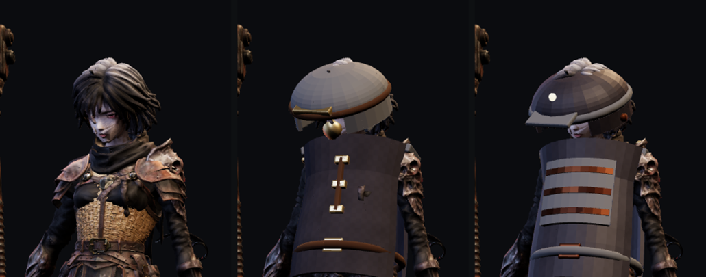

# 갈아입을 방어구 세트 — 절차 생성으로는 못 만들었다

> 기획 3단계 (`docs/design/33` §2). 지금 슬롯마다 방어구가 **하나씩뿐**이라
> 외형 화면에서 상의를 골라도 「이 부위에 넣을 장비가 없습니다」가 뜬다.
> 옷장이 비어 있으면 옷 갈아입는 재미가 성립하지 않는다.

**결론부터: 이번에는 넣지 못했다.** 만들던 것을 되돌렸다. 아래는 왜 그런지와,
다음 사람이 같은 자리에서 다시 시작하지 않도록 남기는 실측값이다.

## 1. 무엇을 하려 했나

던전과 엮인 두 벌 — **하수 정비복**(던전 03, 고무 방수포 + 놋쇠)과
**절연 방호구**(던전 04, 절연 고무 + 구리 땋은 선). 부위 5칸 × 2벌 = 조각 14개.
성능은 기존 조각과 같은 값어치로 쏠림만 다르게(버티는 쪽 / 때리는 쪽),
3점·5점 세트 효과로 «맞춰 입을» 이유를 준다.

## 2. 왜 절차 생성으로 갔나

기존 방어구 5점은 **Hi3D 이미지→3D** 로 뽑은 것이다 (작업 #48). 그런데

- `HI3D_CLIENT_ID` / `HI3D_CLIENT_SECRET` 가 **이 컨테이너에 없다**
- 대체 생성 서비스는 **잔액 0.05 크레딧** — 한 점도 못 뽑는다

쓸 수 있는 것은 bpy 뿐이었다. 무기 6종과 장신구 3종은 절차 생성으로 잘 나왔으니
방어구도 되리라 봤다.

## 3. 네 판을 돌렸고, 네 판 다 실패했다

| 판 | 무엇을 고쳤나 | 결과 |
|---|---|---|
| 1 | 기존 조각의 **경계 상자**에 맞춰 생성 | 통째로 부풀어 «드럼통». 기존 흉갑의 0.55 m 는 늘어진 치맛자락까지 포함한 값이라, 닫힌 관으로 그 상자를 채우면 몸이 사라진다 |
| 2 | **몸을 실측**해 그 치수로 다시 생성 | 크기는 맞았는데 7 cm 가라앉음 — 기존 오프셋을 그대로 쓴 탓 |
| 3 | 오프셋 재계산 + 얼굴·팔 트기 + 값 대비 | 팔은 살아났지만 가슴은 «간판», 머리는 «양동이» |
| 4 | 납작한 상자 → **곡면 판**, 모자 낮추기 | 나아졌지만 여전히 간판이다 |



확대해서 보면 분명하다. 머리는 얼굴을 덮는 버섯이고, 몸통은 가슴에 붙인 널빤지다.
팔다리만 따로 입혀 봐도 **PVC 배관 토막**처럼 보인다.

**판단**: 옷을 «또 사고 싶게» 만들려고 넣는 기능인데, 이걸 넣으면 목적을 해친다.
그래서 아이템·부착·서비스 워커 배선과 GLB 14개를 **전부 되돌렸다.**
지금 저장소는 이 작업 이전과 같고, 검사 196개가 그대로 통과한다.

## 4. 남긴 것 — `tools/3d/build_armor.py`

도구는 남긴다. 실패한 것은 «조형» 이지 «배관» 이 아니다. 이 스크립트에는
다음 판에서 다시 재지 않아도 될 것들이 들어 있다.

### 4.1 몸 실측 (`art/3d/ain_anim.glb`, 지배 관절별 정점 분포)

```
머리    폭 0.240 깊이 0.234 높이 0.192 · 뼈 y 1.520 · 기하 중심 y 1.584 z 0.022
몸통    폭 0.304 깊이 0.258 (Spine1) · 어깨 y≈1.42 · 골반 y 0.979
정강이  수평 반지름 ≈0.054 (LeftLeg 중앙값)
팔뚝    수평 반지름 ≈0.060 (LeftForeArm 중앙값)
발      폭 0.095 깊이 0.125
```

**기존 조각의 경계 상자를 목표로 삼으면 안 된다.** 그 값에는 늘어진 천이 들어 있다.

### 4.2 붙는 자리 — 기존 오프셋을 물려 쓰면 가라앉는다

기존 조각은 어깨까지 덮는 형태라 경계 상자 중심이 아래에 있다. 몸에 딱 맞는
조각은 제 오프셋이 따로 필요하다:

```
머리 = Head 뼈 + [0, 0.064, 0.022]        (기존 후드는 [0, −0.02, 0])
몸통 = Spine1 뼈 + [0, 0.094, 0.020]      (기존 흉갑은 [0, 0.02, 0.02])
```

### 4.3 함정: 세계 좌표 AABB 로 크기를 재지 마라

붙인 조각의 `Box3.setFromObject` 가 0.27 → 0.38 로 나와 «1.4배 커졌다» 고
한참을 헤맸다. **뼈가 돌아 있어 축 정렬 상자가 부푼 것**이다 (√2 만큼).
`fitScale` 은 1.0 이었고 크기는 처음부터 맞았다. GLB 를 직접 재야 한다.

### 4.4 도형 규약

`tube()` / `dome()` 은 `a0`~`a1` 로 각도를 자를 수 있다 — 앞이 트인 모자,
팔구멍 뚫린 몸통판이 여기서 나온다. `plate()` 는 몸을 따라 휘는 판이다.
**납작한 상자를 몸에 붙이면 반드시 간판으로 보인다.**

## 5. 다음 판에 필요한 것

셋 중 하나가 있어야 한다.

1. **`HI3D_CLIENT_ID` / `HI3D_CLIENT_SECRET`** — 기존 방어구를 만든 길.
   컨셉 이미지 → 이미지-3D → `decimate.py` → `gear_post.py` 로 이어진다
2. **대체 생성 서비스 크레딧 충전** — 지금 0.05
3. **손으로 모델링한 GLB** — 규약은 §4 에 다 적혀 있다

그때까지 외형 화면(`looks.html`)의 상의·머리 칸은 «넣을 장비가 없습니다» 로 남는다.
기능은 다 되어 있고, **옷장만 비어 있다.**

---

## 6. 디렉터 레퍼런스 (2026-09-20)

옷 방향이 정해졌다 — **한복·한푸 계열의 겹침**. 원본은
`docs/design/ref/outfits/` 에 있고, 구조상 무엇이 다른지는
`docs/design/37` §2 에 적었다 (넓은 소매 · 겹침 · 늘어진 술).

**이미지→3D 수단이 생기면 이 그림들이 바로 입력이다.**

---

## 7. 뒤늦게 찾은 진짜 원인 (2026-09-20)

§3 에서 조형이 문제라고 적었는데, **절반만 맞았다.**

캐릭터는 메시 하나에 옷이 통째로 구워져 있다. 그래서 흉갑은 «몸에» 입혀지는 게 아니라
**기존 코트 위에** 얹힌다. 아무리 잘 빚어도 옷 위에 판을 대는 그림이 된다.

그 바탕이 되는 «맨몸» 을 `docs/design/40` 에서 만들었다. 다음 방어구는 그 몸에 맞추면 된다.
