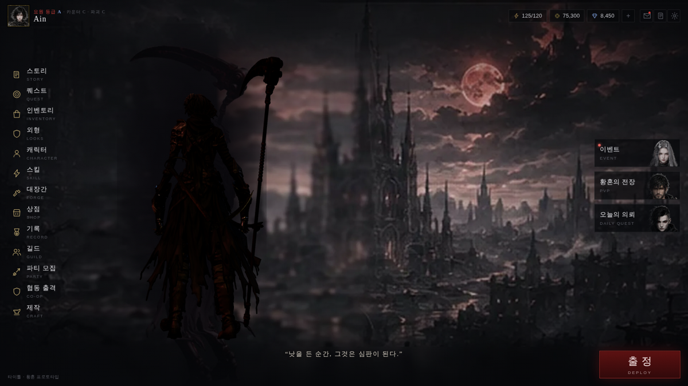
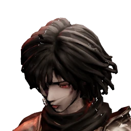
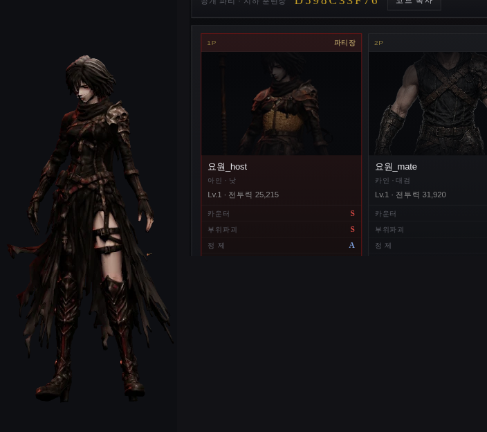

# 로비에 내 캐릭터 — 입힌 옷이 늘 보이게

> 기획 4단계 (`docs/design/33` §2). 로비 캐릭터가 **배경 그림에 구워져** 있어서,
> 장비를 바꿔도 로비에서는 그대로였다. 옷을 사도 평소에 안 보이면 살 이유가 없다.



## 1. 지우지 않고 «덮었다»

먼저 배경에서 인물을 지우려 했다. **세 가지 방법 모두 실패했다.**

| 방법 | 결과 |
|---|---|
| 사각형 영역을 좌우 보간 | 밝은 네모 얼룩 |
| 실루엣만 골라 행 보간 | **가로 줄무늬** |
| 마스크 밖 화소로 정규화 흐림 | 가운데가 **검은 구멍**, 동심원 테두리 |

생성형 인페인팅 없이 크고 대비 센 인물을 지우는 건 무리였다. 그런데 —
그 인물은 **낫을 든 아인의 뒷모습**, 우리가 세우려던 바로 그 구도다.

그래서 **같은 자리에 조금 더 크게(1.12배) 3D 캐릭터를 세워 덮는다.** 둘 다 어두운
실루엣이라 삐져나오는 가장자리도 배경의 일부로 읽힌다. 남는 부분(낫날)은
**되돌릴 수 있는 CSS 타원**으로 밤하늘에 가라앉힌다 — 배포되는 그림 파일은
**한 바이트도 고치지 않았다.**

## 2. 자리 — 눈금을 올려 실측

배경 그림(1920×1080) 안에서 그려진 인물:

```
몸통 중심 x 555 · 머리 꼭대기 y 300 · 발끝 y 930 · 키 630px (화면의 58.3%)
```

## 3. 함정: 「cover 겠거니」

`.lb__bg` 는 `50% 50%/cover` 다. 그래서 cover 셈으로 화면 좌표를 구했다.
**휴대폰에서 인물이 두 명으로 보였다.**

`index.html` 의 좁은 화면 구간이 배경을 바꾼다:

```css
@media (…) { .lb__bg{ background-position:32% 20%; background-size:auto 62% } }
```

짐작하지 말고 `getComputedStyle` 로 **실제 값을 읽어** `background-size`
(`cover` / `contain` / `auto H%` / `W%`)와 `background-position` 퍼센트를 그대로
푼다. 세로 화면에서 cover 로 계산하면 **100px 넘게 어긋난다** — 테스트로 못박았다.

## 4. 화면마다 다른 사정

- **세로 휴대폰**: 배경이 가로로 잘려 그려진 인물이 화면 밖으로 나간다 →
  자리에 얽매일 필요가 없다. 왼쪽 메뉴 오른쪽 끝과 화면 62% 사이로 당긴다
- **가로 휴대폰**(높이 412px): 몸 키만 맞추면 **낫날이 위로 잘린다**.
  무기가 비동기로 붙으므로, 붙은 뒤 «무기까지 포함한 키» 를 다시 재고 배치한다

## 5. 빛 — 캐릭터만 청동빛으로 뜨지 않게

처음엔 달빛을 2.6 으로 줬더니 차갑고 어두운 배경 위에서 **캐릭터만 구리색으로
떠올랐다.** 값과 채도를 배경에 맞춰 내렸다 (달 1.15 · 노출 0.86).

바람은 **고가의 강풍**(`road`) — 로비는 옥외 고지대다. 머리카락과 옷자락이
가만히 서 있어도 흔들린다 (`docs/design/33` §5).

## 6. 안전장치

- WebGL 이 없거나 모델을 못 받으면 **캔버스를 숨긴다** → 그려진 인물이 그대로 보인다
- `prefers-reduced-motion` 이면 아예 띄우지 않는다
- 탭이 가려지면 렌더를 멈춘다
- 돌아올 때(`pageshow`) 저장을 다시 읽고 장비를 다시 입힌다 —
  외형 화면에서 갈아입고 오면 로비에 바로 반영된다 (`docs/design/34` §3 의 함정)

## 7. 검수

`tests/lobby3d.test.cjs` 5 개 (**201/201**). 배치 셈은 DOM 없이도 검증할 수 있어
따로 떼어 검사한다 — 파일의 상수와 어긋나지 않는지도 함께 본다.

---

## 8. 내 초상도 장비를 따라간다 (`js/portrait3d.js`)



로비 왼쪽 위 얼굴과 프로필 신분증의 초상이 **원화 그림**이었다. 로비 캐릭터를
3D 로 바꿔 놓고 얼굴만 옛 그림이면 «내 캐릭터» 라는 느낌이 끊긴다.

### 8.1 한 번만 굽고 돌려 쓴다

로비·프로필이 같은 그림을 쓴다. 자리마다 캔버스를 띄우면 안드로이드에서
WebGL 맥락이 여러 개가 된다. **한 번 구워 `dataURL` 로 `sessionStorage` 에 두고**,
열쇠(캐릭터 + 장착 + 염색)가 바뀔 때만 다시 굽는다. 구운 뒤 렌더러는 바로 버린다.

쓰는 쪽은 `data-portrait="me"` 하나만 달면 된다.

### 8.2 두 번 틀렸다

**(1) 무기만 기다렸다.** `TW_LOOKS.attach` 의 `onMain`(주무기)이 오면 구웠는데,
**방어구 조각은 그 안에서 따로 받아 온다.** 후드를 씌워도 초상이 그대로였다.
전용 `LoadingManager` 를 주고 «전부 끝났다»(`onLoad`)를 기다린다.

**(2) 너무 붙였다.** 거리 0.62 로 잡았더니 **턱이 아래로, 머리카락이 오른쪽으로**
잘렸다. 머리 뼈는 정수리가 아니라 **목**에 있어서(`docs/design/33` §5.2 와 같은
함정) 기준점을 0.042 올리고 거리를 0.82 로 물렸다.

### 8.3 파티 카드는 바꾸지 않았다

두 가지 이유로 **하지 않는 편이 낫다고 판단했다.**

1. 서버가 **다른 사람의 장비를 내려 주지 않는다** (`CHAR_ASSET` 은 캐릭터 id 뿐).
   네 칸 중 내 칸 하나만 바뀐다
2. 파티 카드는 **전신 원화**(`art/full-*.webp`)다. 거기에 3D 얼굴만 끼우면
   네 칸의 그림체가 어긋난다

내 칸을 3D **전신**으로 바꾸는 것은 가능하다 — 다만 네 칸의 결이 갈라지는 문제는
남는다. 디렉터 판단이 필요해 손대지 않았다.

### 8.4 검수

`tests/portrait3d.test.cjs` 6 개 (**207/207**). WebGL 은 node 에서 못 돌리니
«규약» 을 소스에서 검증한다 — 특히 §8.2 의 두 실수가 되돌아오지 않게 못박는다.
실제 동작은 헤드리스로 확인했다: 후드를 씌우고 물들이면 **열쇠가 바뀌고 그림이
다시 구워진다**.

---

## 9. 전신 초상 — 파티 카드와 결과 화면



얼굴만으로는 «내가 입은 옷» 이 안 보인다. 그래서 **전신**도 굽는다
(`TW_PORTRAIT.portrait('body')`, `[data-portrait="me-body"]`).

- **비율을 원화에 맞춘다.** `art/full-*.webp` 가 382×932(0.41) 이라 **256×624** 로 굽는다.
  파티 카드에서 3P·4P 의 원화와 나란히 서야 하기 때문이다
- **몸만 재서 맞춘다.** 무기를 포함해 맞추면 낫이 1.9m 라 **사람이 손톱만 해진다**.
  스킨 메시만 재고, 머리 위 여백을 4.5% 더 둔다 (결과 화면에서 정수리가 칸 위에 붙어 있었다)

### 9.1 파티 카드는 «내 칸만»

`js/recruit.js` 는 이미 `me` 를 알고 있다. 내 칸에만 `data-portrait="me-body"` 를 단다.
남의 장비는 서버가 안 내려 주므로 **원화 그대로**다 (§8.3 의 이유는 그대로 남아 있다 —
다만 둘 다 어두운 전신이라 나란히 놓으면 생각보다 잘 붙는다).

## 10. 로비는 «메뉴» 다 — 성능 안전장치

3D 를 깔았으니 비용을 재 봤다. 소프트웨어 렌더러(SwiftShader) 기준:

```
3D 켬  4.1 fps   →   끔  60.4 fps
```

**이 숫자로 실제 안드로이드를 판단할 수는 없다** — 같은 모델이 던전에서는 보스·환경까지
함께 돌아간다. 그래도 로비는 «메뉴» 라 끊기면 바로 티가 난다. 세 가지를 넣었다.

1. **30fps 로 충분하다** — 느린 대기 동작에 60 을 쓸 이유가 없다
2. **좁은 화면은 화소를 덜 쓴다** — 픽셀 비율 1.75 → 1.25 (힙 54MB → 43MB)
3. **버거우면 정지 화면으로 내려간다** — 90 프레임 중 60 이 느리면 한 장 그려 두고 멈춘다.
   옷은 그대로 보이고 메뉴는 매끄러워진다. 실측: **4.1 fps → 61 fps**

**여기서 한 번 틀렸다.** 느림을 `dt > 0.055` 로 재려 했는데 `dt` 는 바로 위에서
`Math.min(0.05, …)` 로 **잘려 있었다.** 45 초를 기다려도 전환이 안 됐다.
자르기 «전» 값(`raw`)으로 재야 한다 — 테스트로 못박았다.

## 11. 검수

`tests/lobby3d.test.cjs` 7 개 + `tests/portrait3d.test.cjs` 10 개 (**213/213**).
22 화면 모두 952px. 헤드리스로 확인한 것: 파티 카드 1P 만 3D 로 바뀌고 2P 는 원화 유지,
결과 화면 큰 초상이 3D 로 교체, 약한 기기 정지 전환.

**열려 있는 것**: 로비 캐릭터 밝기(노출 0.86)는 일부러 그대로 뒀다 —
장비가 더 잘 보이게 올릴지는 디렉터가 보고 정할 몫이다.
