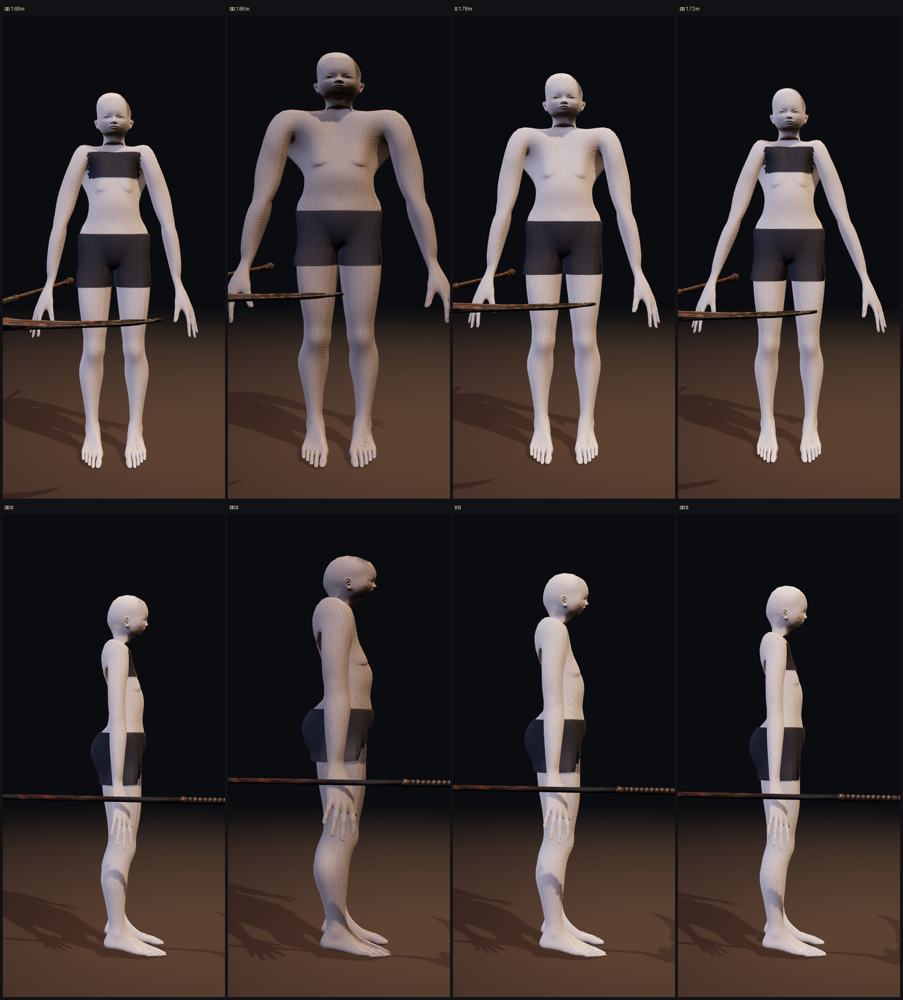
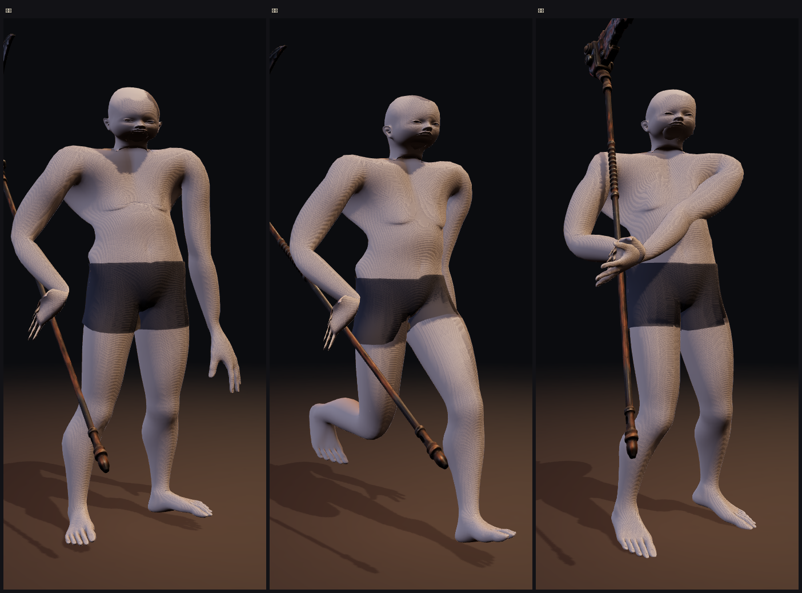
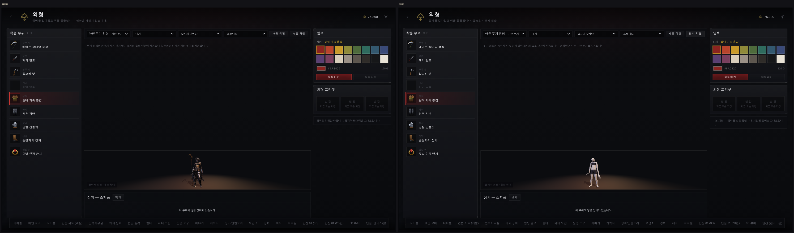

# 속옷 차림 기본 체형 — 옷을 갈아입으려면 먼저 몸이 있어야 한다

> 디렉터: 「옷을 바꿔야되고 체형을 확인해야하기 때문에 속옷만 입은 랜더링도 있어야돼」
> 맞는 지적이고, 생각보다 깊은 지적이다. 지금 이 게임에는 **벗은 상태가 없다.**

## 1. 왜 지금까지 옷이 «얹혀» 보였나

캐릭터 넷은 전부 **메시 하나 · 재질 하나 · 텍스처 한 장**이다.

```
ain_anim.glb    geometry_0 → pbr_material   삼각형 59,999   정점 43,146
kain/ryu/sera   같은 구조
```

옷·머리카락·부츠·목도리가 **살과 같은 삼각형 안에** 구워져 있다. 그래서

- 「방어구를 벗는다」 는 동작이 성립하지 않는다. 벗겨 낼 조각이 없다.
- 새 방어구는 언제나 **기존 옷 위에** 얹힌다. 흉갑을 채우면 코트 위에 판이 하나 붙는다.

작업 #97 에서 방어구가 «가슴에 붙인 널빤지» 로 보인 진짜 이유가 이것이다.
치수를 잘못 잰 게 아니라, 입힐 몸이 없었다.

그래서 이번 작업의 결과물은 «미리보기 한 장» 이 아니라 **앞으로 만들 모든 옷의 바탕**이다.

## 2. 절차 생성으로 빚지 않았다

#97 은 몸에 붙는 것을 bpy 로 «빚어» 보려다 네 판을 내리 실패했다.
사람 몸은 더 어렵지 결코 쉽지 않다. 그래서 이번에는 빚지 않았다.

**CC0 로 풀린 MakeHuman hm08 기본 메시**를 가져와, 캐릭터 골격의 비율로 **옮기기만** 했다.

```
art/3d/base/mh_base.obj   13,380 정점 · 13,378 사각면 · 관절 헬퍼 상자 포함
```

> 2020년 9월 CC0 로 공개. 저작권자: Data Collection AB / Joel Palmius / Jonas Hauquier.
> 파일 머리말에 원문이 그대로 남아 있고, 검사 `base-body.test.mjs` 가 그 머리말을 지킨다.

비율은 **추정하지 않는다.** 골격이 이미 알고 있다:

| | 키 | 어깨 나비(쇄골 길이) | 다리(UpLeg) |
|---|---|---|---|
| 아인 | 1.68 m | 0.117 | 0.449 |
| 카인 | 1.86 m | 0.219 | 0.497 |
| 류   | 1.78 m | 0.171 | 0.476 |
| 세라 | 1.72 m | 0.109 | 0.460 |

기본 메시에도 `joint-pelvis`, `joint-l-knee` 같은 **관절 헬퍼 상자**가 들어 있다.
그 중심을 뽑아 믹사모 뼈와 짝지으면 (`MAP`), 뼈마다
「축 방향은 길이비, 옆면은 둘레비」로 늘리는 변환이 하나씩 나온다. 살은 그 변환들을
거리 가중치로 섞어 따라간다 — 요컨대 **선형 혼합 스키닝을 형태에 쓴 것**이다.

골격이 주지 않는 것은 살집뿐이라 거기만 손으로 잡았다 (`BUILD`):
둘레 배수 · 팔 · 다리 · 허리 조임 · 가슴 부피.

## 3. 다섯 번 틀렸다

| 무엇이 보였나 | 진짜 원인 |
|---|---|
| 몸 전체에 **비늘 무늬** | 기하가 아니었다. 이웃끼리 부호가 뒤집히는 비율 **17 %** — 잡음이 아니라 곡률이다. 기본 메시의 면 크기가 1.8 mm ~ 20.7 mm 로 고르지 않아, 번들거리는 재질에서 가장자리마다 빛을 잡았다. **거칠기 0.62 → 0.80, 반사 0.34 → 0.18** 로 가라앉혔다 |
| 머리가 **납작** | 믹사모 `Head` 뼈는 목에서 8 cm 만 뻗는다. 두개골을 그 길이에 맞춰 눌렀다. 머리뼈 길이는 기본 메시의 두개골로 따로 잡는다 |
| 속옷이 **계단 모양** | 높이로 «면을 골라» 띠를 만들었다. `bmesh.ops.bisect_plane` 으로 자르면 가장자리가 곧다 |
| 가슴 띠가 **어깨까지** 덮임 | 띠를 몸 전체에서 자른 뒤 가장 큰 덩어리만 남겼더니, 어깨에서 팔이 몸통과 이어져 한 덩어리였다. 팔을 **먼저** 떼고 자른다 |
| 발밑에 **널빤지** | 옷 입은 메시에서 «가장 가까운 점» 으로 가중치를 베껴 왔는데, 아인의 **발목까지 내려오는 외투 자락**이 발보다 가까웠다. 발이 엉덩이를 따라갔다 |

마지막 것이 제일 비쌌고, 고치고 나니 방법이 더 단단해졌다:
**가중치는 옷에서 베끼지 않고 골격에서 직접 만든다.** 기본 자세에서는 팔다리가 서로
떨어져 있으므로 「기본 메시 좌표에서 뼈까지의 거리」에 틀릴 여지가 없다. 관절이 각지지
않도록 이웃끼리 네 번 풀어 준다.

## 4. 얼굴은 가져오지 못했다 — 왜인지 적어 둔다

처음 계획은 **캐릭터 자기 머리를 떼어 몸에 얹는 것**이었다. 세 가지로 시도했고 셋 다 실패했다.

1. **뼈 가중치로 머리 고르기** → 턱이 찢어졌다. 자동 리깅이 만든 경계가 얼굴 한가운데를
   지난다. 턱(z 1.49)은 `Head` 뼈(z 1.52 에서 시작)보다 `Spine2` 의 꼬리에 더 가깝기 때문이다.
2. **목이 가장 잘록한 높이에서 평면으로 자르기** → 그런 높이가 없다.
   `Head` 뼈 위아래 13 cm 를 1 cm 간격으로 재 봤다:

   ```
   아인  1.39~1.64 → 340 328 326 299 251 241 176 150 145 173 199 235 … (mm)
   카인  1.55~1.80 → 239 222  37  51 181 148  70 284 272 219 211 179 …
   ```

   아인의 최솟값 145 mm 는 목이 아니라 **목도리**다. 넷 다 목이 옷·머리카락에 덮여 있어
   «드러난 목» 이 없다.
3. **텍스처 색으로 살/천 가르기** → 경계에서 몸과 얼굴의 반지름이 달라 턱이 걸린다.

**결론: 지금 메시로는 캐릭터를 벗길 수 없다.** 그래서 얼굴 없는 **가봉 인형**으로 마감했다.
목적(체형 확인)에는 맞고, 남의 얼굴을 붙인 것보다 정직하다.

얼굴을 얹으려면 캐릭터를 **몸 + 옷 층으로 다시 뽑아야** 한다. 그건 #97 과 같은 문 —
이미지→3D — 이고, 지금 그 열쇠는 지피티 쪽에 있다 (`docs/design/39`).

## 5. 결과



키도 어깨도 다리 길이도 각자 골격에서 나왔다. 카인은 넓고 두껍고 볕에 탔고,
류는 마른 편, 아인과 세라는 가늘다. 살색은 **그 캐릭터 자기 텍스처의 얼굴 화소**에서 읽는다
(수염·머리카락·그늘을 걸러 내고 밝은 쪽 70 % 값을 쓴 뒤, 밝기는 두고 살빛 쪽으로 당긴다 —
그냥 중앙값을 쓰면 카인이 «검은 피부» 로 나왔다).



서기 · 걷기 · 베기 세 장면. 28개 클립이 그대로 따라오므로 외형 화면에서 자세를 고를 수 있다.



외형 화면 오른쪽 위 **「속옷 차림」** — 누르면 몸만, 다시 누르면 장비 차림.
**보기만 바꾼다.** 저장된 장비·염색은 건드리지 않는다 (검사로 못 박아 뒀다).

## 6. 치수 — 다음에 옷을 만들 사람에게

`BUILD` 표가 이 네 사람의 «살집» 이다. 새 옷은 이 몸에 맞추면 네 캐릭터 모두에 맞는다.

```python
'ain':  girth 1.02  arm 1.04  leg 1.02  waist 0.92  bust 0.048   sex f
'kain': girth 1.18  arm 1.38  leg 1.16  waist 1.02  bust 0       sex m
'ryu':  girth 1.06  arm 1.16  leg 1.06  waist 0.96  bust 0       sex m
'sera': girth 1.00  arm 1.00  leg 1.00  waist 0.90  bust 0.052   sex f
```

둘레는 모두 `scale = 캐릭터 Neck z / 기본 메시 Neck z` 에 곱해지는 배수다.

## 7. 남은 것

- **얼굴** — 캐릭터를 몸 + 옷 층으로 다시 뽑아야 한다 (§4).
- **속옷 종류** — 지금은 띠 + 반바지 한 벌뿐. 몸의 껍질을 6 mm 띄운 것이라 항상 맞는다.
- **손가락** — 리그에 손가락 뼈가 없어 손 전체가 한 덩어리로 움직인다. 기본 메시에는
  손가락이 있으니, 뼈만 늘리면 살릴 수 있다.

## 8. 다시 굽기

```
python3 tools/3d/build_body.py            # 넷 다
python3 tools/3d/build_body.py kain       # 하나만
python3 tools/3d/build_body.py ain --no-head   # 목까지 자른 재단용 인형
```
