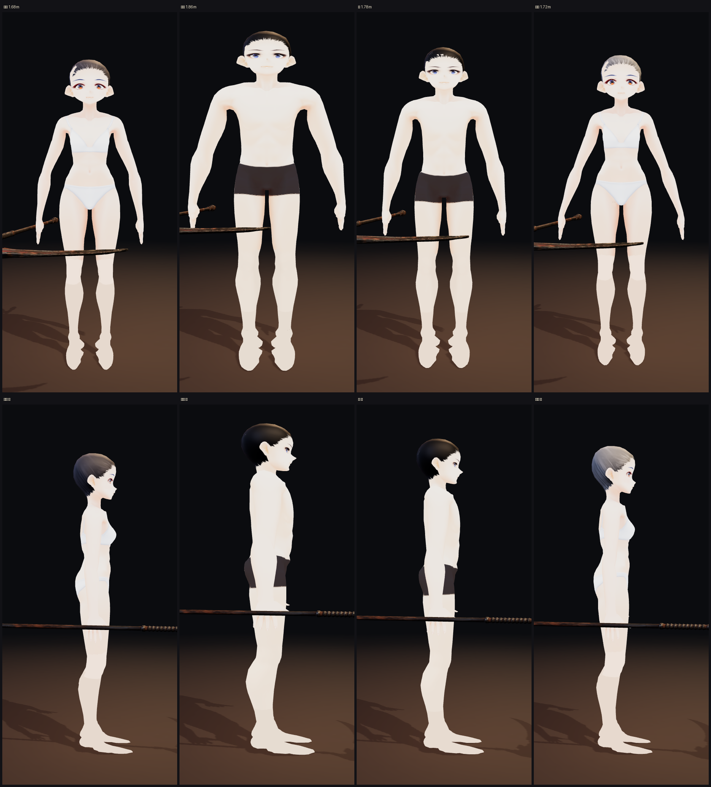
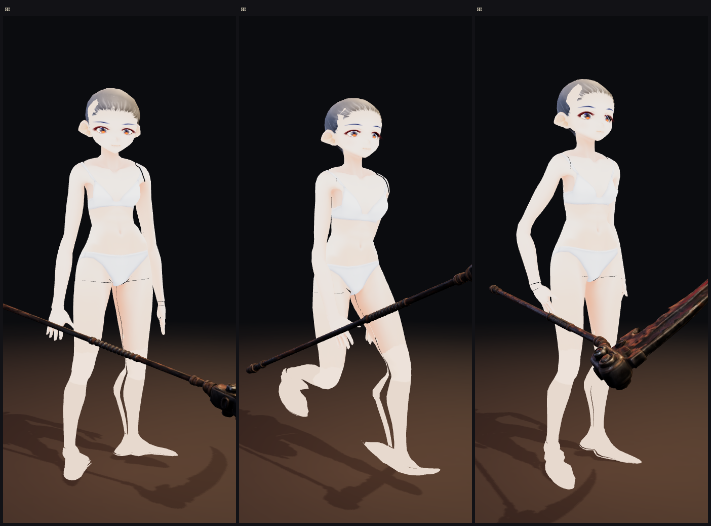
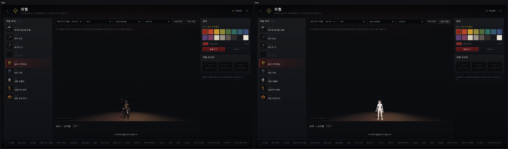

# 기본 체형 v2 — 빚지 말고 «가져와서 적용»

> 디렉터: 「렌더링이 너무 힘들면 늘씬하고 이쁜 에셋을 가져오자. 에셋을 가져와서
> 적용하면 되잖아. 4개 캐릭터 전부」

맞는 말이다. v1(`docs/design/40`)은 MakeHuman 해부 기본형이라 치수는 맞아도
민머리에 얼굴이 없어 «가봉 인형» 이상이 되지 못했다. v2 는 완성된 캐릭터 에셋을 가져온다.

## 1. 무엇을 가져왔나

**VRoid Studio 기본 모델 (CC0)** — `art/3d/base/vroid_female.vrm` · `vroid_male.vrm`

라이선스는 남의 주장이 아니라 **파일 자신이 밝힌다.** VRM 메타데이터:

```
licenseName          CC0
author               VRoidプロジェクト
commercialUssage     Allow      · credit  unnecessary · modification  allow
```

받은 곳은 opengameart.org 의 「VRoid Studio CC0 models」. 출처와 조건은
`art/3d/base/README.md` 에 적었고, 검사가 그 기록을 지킨다.

**이 에셋을 고른 이유는 예뻐서만이 아니다:**

| | 왜 중요한가 |
|---|---|
| 재질 이름이 쓰임을 밝힌다 (`_SKIN` `_FACE` `_EYE` `_HAIR` `_CLOTH`) | 옷을 «지우는» 게 아니라 **안 가져오면** 된다. 우리 캐릭터에 없는 바로 그것 |
| 뼈 이름이 믹사모와 1:1 (`J_Bip_C_Hips` → `Hips`) | 관절을 뒤질 필요 없이 골격끼리 바로 짝지어진다 |
| 몸 6,900 정점 · 텍스처 512² | 전화기에서 부담이 없다 (한 사람 2.1 MB, 클립 28개 포함) |

## 2. 가져온 것은 «생김새» 이지 «체격» 이 아니다

키·어깨 나비·팔다리 길이는 v1 과 똑같이 **캐릭터 골격에서** 나온다.
네 사람은 각자 자기 뼈대 위에 서 있다 (아인 1.68 · 카인 1.86 · 류 1.78 · 세라 1.72).
살집만 `BUILD` 표로 잡는다.

그 위에 **그 사람의 것**을 얹었다:

- **머리색** — 캐릭터 정수리 화소에서 읽어 머리카락 텍스처를 물들인다 (하이라이트를 피해 어두운 쪽 30 % 값)
- **살색** — 얼굴 화소에서 읽어 살 재질에 곱한다
- **양말·구두** — VRoid 기본 몸 텍스처에는 무릎양말과 구두가 **그려져** 있다.
  속옷 차림에 어울리지 않으므로 무릎 아래 자리를 허벅지 살색으로 덮는다

## 3. 네 번 틀렸다

| 무엇이 보였나 | 진짜 원인 |
|---|---|
| 허리가 **한 점으로 오므라듦** | VRoid 는 **+y 를 보고** 선다. 우리 캐릭터는 −y. 그래서 VRoid 의 «왼쪽» 은 우리 기준 오른쪽이고, 왼팔이 오른쪽으로 건너가며 몸통이 꼬였다 |
| 팔이 **90° 비틀림** | 뼈 좌표계의 기준 벡터를 «뼈가 향하는 쪽» 으로 골랐다. T 자세 바탕의 팔은 수평, A 자세 캐릭터의 팔은 45° 라 서로 다른 가지를 탔다. 두 뼈대 모두 −y 를 보므로 **«앞» 을 고정 기준**으로 바꿨다 |
| 개체를 돌렸더니 **메시만 두 번** 돌아감 | 메시가 뼈대의 자식이라 부모 회전을 타고 또 돈다. 좌표를 직접 돌린다 |
| 머리카락이 **계속 청록** | VRM 의 머리색은 텍스처가 아니라 **재질 계수**(0, 0.40, 0.60)에 박혀 있다. 텍스처만 물들이면 그 계수가 도로 청록으로 곱한다. 머리 재질을 «텍스처 + 프린시플드» 로 다시 짰다 |
| 남자 속옷이 **표백됨** | 양말을 지우려고 «어두운 화소» 를 전부 덮었더니 진회색 반바지까지 사라졌다. 무릎 아래 **면을 삼각형 단위로 래스터화**해 그 자리에서만 덮는다 |

## 4. 결과





외형 화면 오른쪽 위 **「속옷 차림」** — 보기만 바꾼다. 저장된 장비·염색은 그대로.

## 5. 디렉터가 정해야 할 것 — 화풍

솔직히 적는다. **이 몸은 애니메이션 화풍이고, 우리 캐릭터는 Hi3D 로 뽑은 반사실
어두운 판타지다.** 같은 화면에 나란히 두면 다른 게임처럼 보인다.

지금 저장소에는 두 갈래가 다 있고, 도구만 바꿔 다시 구우면 된다:

```
python3 tools/3d/build_body_vroid.py     # v2 — 애니메이션 체형 (지금 들어간 것)
python3 tools/3d/build_body.py           # v1 — 해부 가봉 인형 (얼굴 없음)
```

**가장 좋은 답은 셋째 길이다:** 캐릭터를 Hi3D 로 **다시 뽑되 «몸» 과 «옷» 을 따로**
뽑는 것. 그러면 얼굴도 살고 화풍도 맞고 옷 갈아입기가 제대로 된다.
그 열쇠(Hi3D)는 지금 지피티 쪽에 있다 (`docs/design/39`).

## 6. 남은 흠

- 무릎 아래 색이 허벅지보다 살짝 밝다 — 덮은 자리와 원래 살의 경계
- 종아리 뒤에 **실낱 같은 어두운 선** — UV 이음새 바깥 여백에 남은 양말 색
- 발가락 결이 뭉개졌다 (구두 그림을 평평하게 덮으면서)
- 손가락 뼈가 리그에 없어 손은 한 덩어리로 움직인다 (v1 과 같음)
