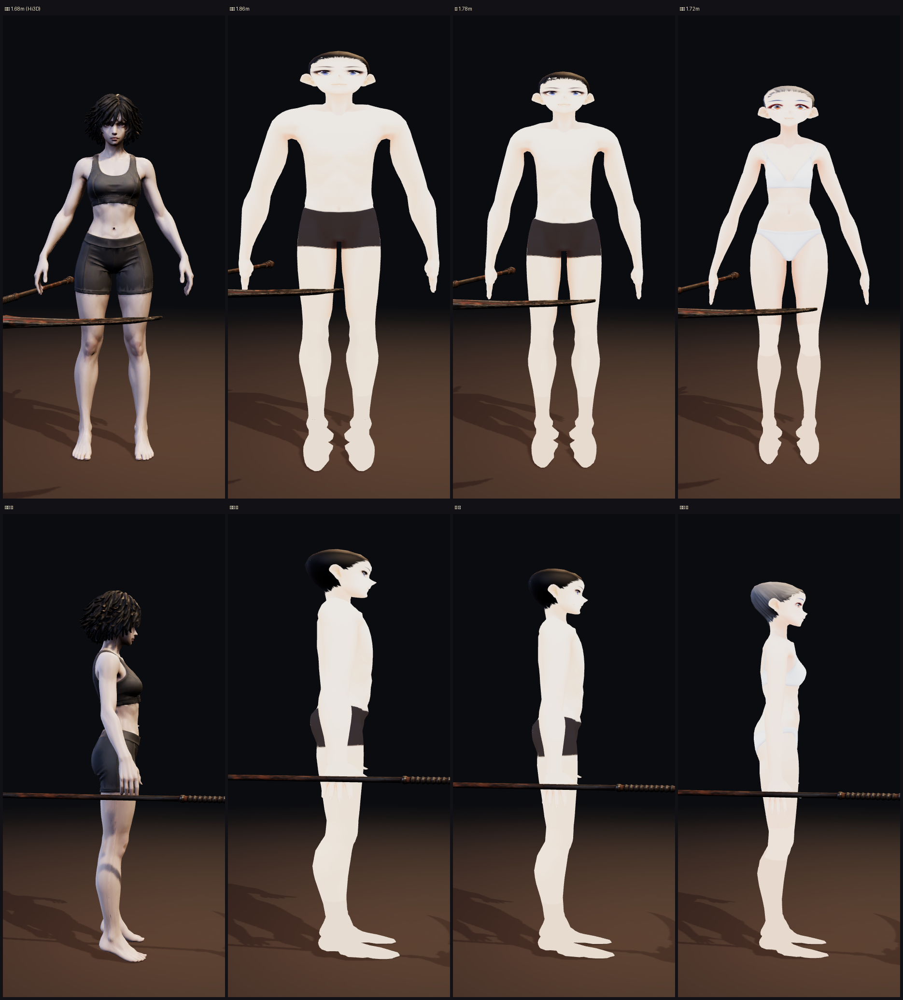
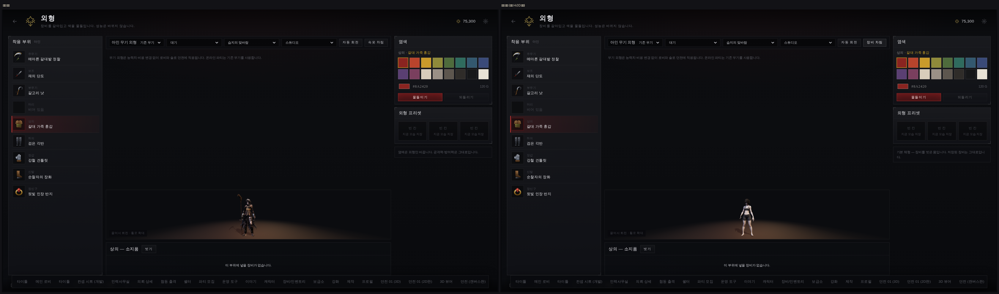

# 아인 몸체를 지피티 것으로 갈아 끼우다 + 내 임시판 키 보정

> 디렉터: 「깃허브에 아인 몸체 한번 확인해봐」 → 「다시 수정해야지」

## 1. 먼저, 내가 잘못 본 것 두 가지

검수하다가 «결함» 이라고 적었던 것 중 둘은 **내 카메라 탓**이었다. 기록해 둔다.

- **「카운터에서 머리가 산산조각 난다」** — 카메라가 머리카락 «안» 으로 들어가 뒷면을
  보고 있었다. 프레임을 바꾸니 멀쩡하다. 원본 아인과 같은 프레임도 대조했다.
- **「idle 첫 프레임에 머리카락이 부풀어 얼굴을 덮는다」** — idle 클립이 고개를 돌린다.
  바인드 자세로 보면 깨끗하다.

정점 좌표로도 확인했다: 정적 후보와 리그 후보의 경계 상자가 같고
(머리 폭 27.3 vs 27.4 cm), 굽는 과정에서 형태가 변하지 않았다.

**남은 진짜 흠**은 왼쪽 볼을 가로지르는 **직선 경계의 옅은 자국** 하나다.
정적 후보에도 있으니 생성 단계에서 들어온 것이고, 줄이는 과정과는 무관하다.

## 2. 지피티 후보 검수 — 통과

| 항목 | 결과 |
|---|---|
| 뼈대 | 24관절 **완전 일치** (빠짐·남음 0) |
| 클립 | 28개 전부 |
| 키 | **168.0 cm** — `ain_anim.glb` 와 소수점까지 같음 |
| 삼각형 | 59,000 |
| 가중치 없는 정점 | 0 |

**그대로 갈아 끼워도 장비 부착·바람·초상·로비 3D 가 다 그대로 돈다.**

## 3. 고친 것 — 무게

후보는 **7.0 MB** 였고 그중 4.4 MB 가 2048² **PNG** 두 장이었다.
그런데 게임에 들어가 있는 아인(`ain_anim.glb`)은 3.7 MB 에 **JPEG** 326+243 KB 다.
이 재질에는 알파가 없으니 같은 방식으로 맞추면 된다.

```
2048 PNG  991 + 735 KB  →  1024 JPEG  82 + 44 KB
7,190 KB  →  2,883 KB
```

확대해서 나란히 봐도 차이를 못 찾겠다 (`docs/img/43-face.png`).

왜 이게 중요한가: 서비스 워커가 **미리 받는 파일이 이미 73.3 MB**(그중 GLB 65.9)다.
네 명을 7 MB 짜리로 바꾸면 92 MB 가 된다. 안드로이드로 받는 걸 생각하면 넘길 수 없다.

지피티 작업 파일(`art/3d/base/ain_modular_rig_candidate.glb`)은 **건드리지 않았다.**
받아서 줄인 결과만 `art/3d/ain_body.glb` 로 굽는다 — `tools/3d/adopt_ain_body.py`.

## 4. 고친 것 — 내 임시판 키 7 cm

`docs/design/42` 의 VRoid 임시판에서 **아인이 175.1 cm** 로 나왔다 (실제 168.0).

원인: 머리뼈 길이를 「바탕 두개골 × 배율」로 잡았는데, VRoid 머리는 애니 비율이라 크고
그 위에 머리카락까지 얹혀 정수리가 7 cm 솟았다. **캐릭터 자기 정수리 높이에 맞춰** 늘리도록 고쳤다.

| | 옷 입은 키 | 맨몸 | 차이 |
|---|---|---|---|
| 아인 | 168.0 | 168.0 | 0.0 |
| 카인 | 186.0 | 186.8 | 0.8 |
| 류 | 178.0 | 178.5 | 0.5 |
| 세라 | 172.0 | 172.3 | 0.3 |

검사의 허용치가 **14 cm** 라 이 오차가 통과했었다. **3 cm** 로 조였고,
뼈 구성 일치·JPEG 강제·「맨몸이 옷 입은 본체보다 무거우면 실패」 검사를 더 걸었다.

## 5. 지금 상태




- **아인** — 지피티의 Hi3D 몸체. 그 사람 얼굴, 게임 화풍, 스포츠 상의 + 반바지. 2.82 MB
- **카인 · 류 · 세라** — CC0 VRoid 임시판. 각 2.0~2.2 MB

## 6. 남은 것

- **셋은 아직 임시다.** 지피티가 아인 방식으로 뽑으면 `adopt_ain_body.py` 를 돌려 같은 자리에 넣으면 된다.
- **옷은 아직 분리 안 됐다.** 아인 몸체도 몸 + 상의 + 반바지가 한 메시 한 재질이다.
  «더 나은 기본 레이어» 이지 옷 갈아입기 구조는 아니다 (`docs/design/41` 4~6단계).
- 볼의 옅은 자국 (§1) — 생성 단계에서 고쳐야 한다.
