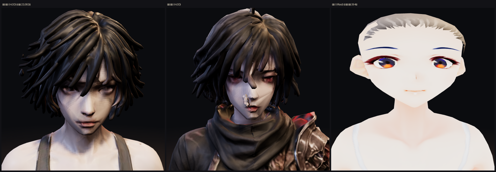

# 머리카락 — 다른 게임은 어떻게 하나, 우리는 지금 어떤가

> 디렉터: 「자료조사해보자. 다른 알피지 게임에서 머리카락 표현을 어떻게 하는지에 대해」

머리카락은 지금 우리에게 세 군데서 걸린다: **옷 갈아입기**(후드를 쓰면 머리는 어디로 가나),
**바람**(`js/wind.js` 는 「네 캐릭터 모두 두피에 붙은 짧은 머리」를 전제로 짜였다),
**용량**(아래 §3 — 아인 맨몸의 **39 %** 가 머리카락이다).

---

## 1. 업계는 세 갈래로 나뉜다

| 방식 | 무엇인가 | 쓰는 곳 | 값 |
|---|---|---|---|
| **가닥(strand)** | 실제 머리카락 한 올씩. UE 의 Groom, TressFX | 시네마틱, 고사양 PC | 매우 비쌈. 가닥마다 안티에일리어싱·자기그림자가 들어간다 |
| **카드(card)** | 머리 «다발» 그림을 알파로 뚫은 판에 붙여 얹는다 | **게임 캐릭터의 표준**. 모바일 포함 | 사실적 머리 한 벌이 **판 200~400장** |
| **통짜(solid)** | 머리카락을 그냥 덩어리 기하로 깎는다 | 양식화된 게임, 저사양 | 알파가 없어 정렬 문제도 없지만 면이 많이 든다 |

카드가 표준인 이유는 단순하다. 가닥은 여러 캐릭터가 동시에 움직이는 상황에서 여전히
감당이 안 되고, 카드는 **곧은 다발이면 삼각형 2장, 굽은 다발이면 4~6장**이면 된다.

### 1.1 그림자·빛 — 「머릿결」은 재질이 만든다

- **Kajiya–Kay**: 머리카락을 가는 원통으로 보고 결 방향으로 하이라이트를 길게 늘이는 모델.
  거의 모든 실시간 헤어 셰이더의 바탕이다.
- **애니 계열(원신·붕괴)**: 물리를 흉내내지 않는다. **텍스처에 하이라이트 띠를 그려 넣고**
  그걸 마스크로 써서 실시간 스펙큘러를 얹는다. 우리 화풍과 가까운 쪽은 이쪽이다.

### 1.2 움직임 — 거의 다 «스프링 본»

가닥 시뮬레이션이 아니라 **머리카락 다발에 뼈를 몇 개 심고 용수철로 따라오게** 한다
(훅의 법칙: 원래 자리에서 벗어난 만큼 반대로 당긴다). 니케는 이걸 프레임마다
계산하되 Burst/Job 으로 돌린다. 애니메이션을 따로 만들지 않아도 흔들린다는 게 요점이다.

**우리는 이미 비슷한 걸 다르게 하고 있다** — `js/wind.js` 는 뼈를 안 심고
꼭짓점 셰이더에서 `aFlex` 로 휘게 한다 (`docs/design/33` §5). 뼈가 없으니 공짜에 가깝지만,
관성(멈출 때 따라 흔들리는 맛)은 안 난다.

### 1.3 모바일에서 진짜 비싼 것은 «면» 이 아니라 «겹쳐 그리기»

- 알파는 **블렌드보다 컷아웃(alpha test)** 이 빠르고 정렬 문제가 없다.
- **alphaToCoverage** 는 가장자리가 부드럽지만 **MSAA 가 켜져 있어야** 한다.
- **alphaHash(디더)** 는 정렬 없이 반투명을 흉내내되 지글거림이 남는다.
- 모바일 주인공 한 명의 권장치는 **1,500~5,000 삼각형**, 화면 전체 5만 삼각형쯤.

### 1.4 후드를 쓰면 머리는 어디로 가나 — 이건 «시스템» 문제다

우리 옷 갈아입기에 바로 걸리는 부분이라 따로 본다. 업계 해법은 대략 셋:

1. **투구용 머리(helmet hair)** — 투구 밑에 들어가도록 납작하게 만든 **별도 헤어**로 바꿔 끼운다 (발더스 게이트 3).
2. **부분 토글** — 헤어를 조각으로 나눠 두고 「뒷머리만 숨기고 앞머리는 남긴다」 (FF14 의 후드).
3. **그냥 다 숨긴다** — 가장 싸고, 플레이어가 가장 싫어한다. 「후드 쓰면 대머리 된다」는 불만이 어느 게임에나 있다.

어느 쪽이든 전제가 하나다: **머리카락이 몸과 분리된 조각이어야 한다.**

---

## 2. 우리 저장소에는 지금 «세 가지» 머리카락이 동시에 있다

| | 방식 | 재질 | 알파 |
|---|---|---|---|
| `ain_anim.glb` (본편 아인) | 통짜, 몸과 한 메시 | `pbr_material` 하나 | 없음(OPAQUE) |
| `ain_body.glb` (맨몸, Hi3D) | 통짜, 몸과 한 메시 | `pbr_material` 하나 | 없음(OPAQUE) |
| `sera_body.glb` (맨몸, VRoid) | **카드**, 전용 재질 | `..._HAIR` 분리 | BLEND |



## 3. 실측 — 아인 맨몸의 39 %가 머리카락이다

머리 관절이 지배하는 삼각형을 세어 봤다:

```
ain_body.glb   전체 59,000 면 · 머리 23,082 면 (39.1 %)   통짜 · 알파 없음
sera_body.glb  전체 11,284 면 · 머리카락 재질    394 면    카드 · BLEND
ain_anim.glb   전체 59,999 면 · 머리  1,302 면 ( 2.2 %)   ※ 아래 주의
```

**같은 «부스스한 단발» 실루엣을 VRoid 는 394 면으로, 우리 Hi3D 는 23,082 면으로 낸다. 58 배다.**

> ※ `ain_anim.glb` 의 2.2 % 는 실제보다 훨씬 작게 나온 값이다. 자동 리깅이 머리
> 상당 부분을 `Spine2` 에 붙여 놨기 때문이다 — 턱(z 1.49)이 `Head` 뼈(1.52 에서 시작)보다
> `Spine2` 의 꼬리에 더 가깝다. `docs/design/40` §4 에서 얼굴이 찢어졌던 것과 같은 원인이다.

### 3.1 화면마다 MSAA 가 다르다 — 카드로 갈 때 걸림돌

```
viewer.html   antialias:true                    → alphaToCoverage 가능
lobby3d.js    antialias:true                    → 가능
portrait3d.js antialias:true                    → 가능
game3d.js     antialias: !MOBILE && !SAFE       → 전화기 던전에선 MSAA 없음
```

즉 **정작 게임 안에서는 alphaToCoverage 를 못 쓴다.** 카드로 가면 던전에서는
컷아웃(alphaTest)이나 디더로 가야 하고, 가장자리가 지금보다 거칠어진다.

---

## 4. 그래서 어떻게 할 것인가 — 값싼 것부터

### ㄱ. 통짜 그대로 두고 «결»만 넣기 — 지금 당장, 파일 안 건드림
머리카락 재질을 분리해 **결 방향 하이라이트(애니식 띠)** 만 얹는다.
지금은 머리와 살이 같은 `pbr_material` 이라 머리에만 다른 빛을 줄 수가 없다.
재질을 쪼개려면 굽는 단계에서 머리 면을 골라내야 한다 — **머리 관절 지배로 골라내면 39 %가 잡히니 가능하다.**
→ **용량 0, 폴리곤 0, 눈에 띄는 개선.** 먼저 해 볼 값어치가 있다.

### ㄴ. 머리카락을 별도 메시로 떼기 — 옷 갈아입기의 전제
후드·투구를 하려면 어차피 해야 한다 (§1.4). 떼어 두면
**후드 쓸 때 뒷머리만 숨기기**가 가능해지고, 바람도 머리에만 따로 걸 수 있다.
지피티의 몸/옷 분리 계획(`docs/design/41`)에 **머리카락도 한 조각으로 넣어 달라고** 요청하는 게 맞다.

### ㄷ. 카드로 다시 만들기 — 23,082 → 1,000면 급
제일 크게 버는 길이지만 **머리카락 텍스처(알파 포함)를 새로 그려야** 하고,
던전에서 MSAA 가 없어 가장자리가 거칠어진다. 지금 판단할 일은 아니고,
성능이 실제로 문제가 될 때 꺼내면 된다.

### ㄹ. 스프링 본 — 관성 주기
`js/wind.js` 는 «바람에 휜다» 까지는 하는데 «멈출 때 따라 흔들린다» 가 없다.
머리카락이 별도 조각이 되면(ㄴ) 다발에 뼈 2~3개를 심어 용수철로 따라오게 할 수 있다.

---

## 5. 지금 당장 걸리는 것 하나 — 재 보니 아니었다

`js/wind.js` 는 주석에 이렇게 적혀 있다: **「네 캐릭터 모두 두피에 붙은 짧은 머리」.**
그 전제로 `HAIR_GAIN = 0.35` 를 잡았다. 새 Hi3D 아인의 머리가 훨씬 크고 헐거워
보여서 계수를 다시 재야 한다고 여기 적어 뒀는데, **실제로 재 보니 그럴 필요가 없다.**

강풍(`road`) 돌풍 정점 기준, `aFlex` 를 cm 로 환산한 값 (`tests/wind.test.mjs` 와 같은 기준):

| 파일 | 머리 최대 | 머리 p95 | 옷 최대 | 머리 높이 |
|---|---|---|---|---|
| `ain_anim.glb` (옛 몸) | 3.7 cm | 3.7 cm | 10.0 cm | 16.0 cm |
| `ain_body.glb` (Hi3D) | 3.7 cm | 3.7 cm | 3.7 cm | 16.0 cm |
| `sera_body.glb` | 3.7 cm | 3.7 cm | 3.7 cm | 16.6 cm |
| `kain_body.glb` | 3.7 cm | 3.7 cm | 3.7 cm | 17.8 cm |

세 가지가 읽힌다.

1. **머리 흔들림 최대치가 어디서나 똑같이 3.7 cm 다.** `aFlex` 가 1.0 에서 포화하기
   때문에, 3.7 cm 는 머리 모양이 아니라 **`HAIR_GAIN` 이 정하는 천장**이다. 메시가
   커져도 천장은 안 움직인다. `tests/wind.test.mjs` 의 허용 구간 2.5~6.0 cm 안이다.
2. **머리 높이가 16.0 → 16.0 cm, 그대로다.** 「Hi3D 아인의 머리가 훨씬 크다」는 내
   눈대중이 틀렸다. 정점 수는 2,579 → 6,568 로 늘었지만 부피는 같다.
3. 옷 흔들림만 10.0 → 3.7 cm 로 줄었는데, 이건 몸체가 스포츠 브라·반바지뿐이라
   펄럭일 옷자락이 없어서다. 장비를 입히면 옛 값으로 돌아온다.

**결론: `HAIR_GAIN` 은 0.35 그대로 둔다.** 다시 재야 할 때는 메시가 커졌을 때가
아니라, 지피티가 머리카락을 **분리해서** 실제로 긴 타래가 생겼을 때다.

## 6. 디렉터가 정할 것

1. **ㄱ(결 하이라이트)** 부터 해 볼까요? 용량·폴리곤 값 0 이고 머릿결이 살아납니다.
2. 지피티에 **「몸·옷 분리할 때 머리카락도 따로」** 를 요청할까요? (후드의 전제)
3. 후드를 썼을 때 — **다 숨김 / 앞머리만 남김 / 후드용 납작 머리** 중 무엇으로 갈까요?

---

## 참고

- [Strand-based Hair Rendering in Frostbite](https://advances.realtimerendering.com/s2019/hair_presentation_final.pdf)
- [Real-time Level-of-Detail Strand-based Hair Rendering](https://arxiv.org/pdf/2405.10565)
- [Strands2Cards: Automatic Generation of Hair Cards from Strands (SIGGRAPH Asia 2025)](https://dl.acm.org/doi/full/10.1145/3757377.3763864)
- [Hair Rendering and Shading — Scheuermann (ATI)](https://web.engr.oregonstate.edu/~mjb/cs557/Projects/Papers/HairRendering.pdf)
- [Ultimate Guide To 3D Hair For Games](https://yelzkizi.org/hair-for-games/) · [Real-Time Hair AAA Workflow](https://yelzkizi.org/real-time-hair-for-aaa-games/)
- [Placing hair cards and fitting the polygon budget](https://www.artstation.com/marizatorska/blog/jZo2/placing-hair-cards-and-fitting-the-polygon-budget-for-realtime-hair)
- [The Hidden Complexity of Realistic 3D Hair for Games and Film](https://vsquad.art/blog/the-hidden-complexity-of-realistic-3d-hair-for-games-and-film-what-studios-get-wrong)
- [Genshin Impact Character Shader Breakdown (Unity URP)](https://www.artstation.com/artwork/wJZ4Gg) · [Genshin-Style Shader in UE5](https://80.lv/articles/breakdown-setting-up-a-genshin-impact-style-shader-in-unreal-engine-5)
- [니케는 머리카락을 프레임마다 계산한다 (인벤)](https://www.inven.co.kr/webzine/news/?news=271573) · [니케 스파인 캐릭터와 헤어·신체 물리 (루리웹)](https://bbs.ruliweb.com/news/read/165920)
- [three.js Material#alphaToCoverage](https://threejs.org/docs/#api/en/materials/Material.alphaToCoverage) · [Alpha test vs alpha hash (포럼)](https://discourse.threejs.org/t/alpha-test-vs-alpha-hash/44493) · [Transparency — AlphaTest (매뉴얼)](https://threejsfundamentals.org/threejs/threejs-transparency-intersecting-planes-alphatest.html)
- [Baldur's Gate 3 — Hair and Beards: Helmet Hair](https://docs.baldursgate3.game/index.php?title=Hair_and_Beards%3A_Helmet_Hair)
