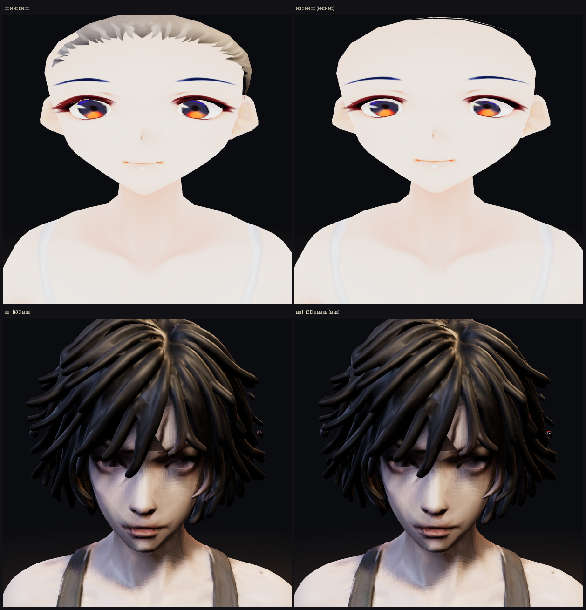

# 머리카락 — 후드 정책 확정, 그리고 지피티에 보내는 파일 계약

> 디렉터: 「지피티에 요청하자. 그리고 후드는 다 가려야지」
> 배경 조사는 `docs/design/44-hair.md`.

## 1. 정한 것 — 머리 칸에 뭐라도 끼면 머리카락을 통째로 숨긴다

앞머리를 남기거나(FF14 식) 후드용 납작 머리를 따로 만드는(발더스 게이트 3 식) 대신
**전부 숨긴다.** 조각을 나눠 만들 필요도, 헤어를 한 벌 더 만들 필요도 없다.

규칙은 `js/hair.js` 에 넣었고 네 화면(뷰어·로비·초상·던전)에 다 걸었다.
머리 말고 다른 칸(가슴·다리·장갑…)은 머리카락을 건드리지 않는다.

```
머리 칸 비어 있음 → 머리카락 보임
머리 칸에 무엇이든 → 머리카락 전부 숨김
```

## 2. 지금 반만 통한다 — 그래서 요청이 필요하다



| | 머리카락 조각 | 후드 쓰면 |
|---|---|---|
| 카인·류·세라 (VRoid 맨몸) | `..._HAIR` 재질로 분리돼 있음 | **숨는다** ✔ |
| 아인 맨몸 (Hi3D) · 본편 넷 | 몸과 한 메시 한 재질 | **못 숨긴다** ✘ |

여덟 개 GLB 를 전부 `TW_HAIR.find()` 로 훑어 확인한 결과 (2026-09-21):

```
ain_anim   메시 1  머리 0  ✘      ain_body   메시  1  머리 0  ✘   ← 지피티 Hi3D
kain_anim  메시 1  머리 0  ✘      kain_body  메시 11  머리 1  ✔
ryu_anim   메시 1  머리 0  ✘      ryu_body   메시 11  머리 1  ✔
sera_anim  메시 1  머리 0  ✘      sera_body  메시 11  머리 1  ✔
```

**본편에서 실제로 입는 `*_anim.glb` 는 넷 다 융합 메시라 아직 하나도 안 숨는다.**
맨몸 셋이 되는 건 VRoid 에셋이 재질별로 나뉘어 들어왔기 때문이고, 그건 임시 대역이다.

`js/hair.js` 는 **찾으면 숨기고 못 찾으면 조용히 넘어간다.**
머리카락이 따로 나오는 순간, **코드는 한 줄도 안 고치고** 그대로 걸린다.

---

## 3. 지피티에게 — 파일 계약

`docs/design/41-ain-modular-production.md` 의 몸/옷 분리 계획에 **머리카락을 한 항목 추가**해 주세요.

### 3.1 머리카락은 별도 조각으로

- **머티리얼 이름을 `_hair` 로 끝나게** 해 주세요 (대소문자 무관). 예: `ain_hair`
  또는 **노드 이름을 `hair` 로 시작**하게. 예: `hair`, `hair_01`, `ain_hair`
  → 런타임은 이 둘 중 하나만 보면 됩니다 (`js/hair.js` 의 `MAT` · `NODE`).
- **살 재질과 절대 공유하지 마세요.** 지금 아인은 `pbr_material` 하나에 머리·살·옷이 다
  들어 있어 숨기지도, 머릿결만 따로 빛나게 하지도 못합니다.
- 같은 **24관절 리그에 스킨**돼 있어야 합니다. 안 그러면 고개를 돌릴 때 머리만 남습니다.

### 3.2 숨겼을 때 드러날 **두피**를 채워 주세요

이게 제일 놓치기 쉬운 부분입니다. 머리카락을 끄면 그 밑이 드러납니다.

- 머리카락에 가려지는 정수리도 **살색으로 칠해진 두피**가 있어야 합니다.
- 구멍이 뚫려 있거나(면 없음), 머리카락 색으로 칠해져 있으면 **후드를 썼을 때
  머리 안쪽이 보이거나 검은 모자를 쓴 것처럼** 됩니다.
- 세라(VRoid)는 이게 되어 있어서 위 그림처럼 깔끔하게 민머리가 됩니다.

### 3.3 알아 두실 것 — 지금 머리카락이 폴리곤의 39 %입니다

```
ain_body.glb   전체 59,000면 · 머리 23,082면 (39.1 %)   통짜·알파 없음
sera_body.glb  전체 11,284면 · 머리카락 재질   394면    카드·BLEND
```

같은 부스스한 단발을 VRoid 는 **394면**으로 냅니다. 58 배 차이입니다.
지금 당장 카드로 바꿔 달라는 요청은 아닙니다 — **분리만 되면** 나중에
머리카락만 따로 줄이거나 갈아 끼울 수 있습니다. 분리가 그 전제입니다.

### 3.4 파일은 건드리지 않았습니다

`art/3d/base/ain_modular_rig_candidate.glb` 는 그대로 두고, 받아서 1024 JPEG 로
줄인 것만 `art/3d/ain_body.glb` 로 굽고 있습니다 (`tools/3d/adopt_ain_body.py`,
`docs/design/43`). 머리카락이 분리된 후보를 올려 주시면 같은 도구를 다시 돌립니다.

---

## 4. 남은 것

- **머리카락이 분리되면** 머릿결 하이라이트(`docs/design/44` §4-ㄱ)를 얹을 수 있습니다.
  지금은 재질이 하나라 머리에만 다른 빛을 줄 수가 없습니다.
- `js/wind.js` 의 `HAIR_GAIN = 0.35` 는 「두피에 붙은 짧은 머리」 전제로 잡은 값입니다.
  새 아인 머리는 더 크고 헐거우니 다시 재야 합니다 (`docs/design/44` §5).
- 후드를 쓴 채로 **바람**이 불면 숨은 머리카락에도 계산이 돌아갑니다.
  숨김 상태에서 바람 계산을 건너뛰는 건, 분리된 뒤에 함께 정리하겠습니다.
