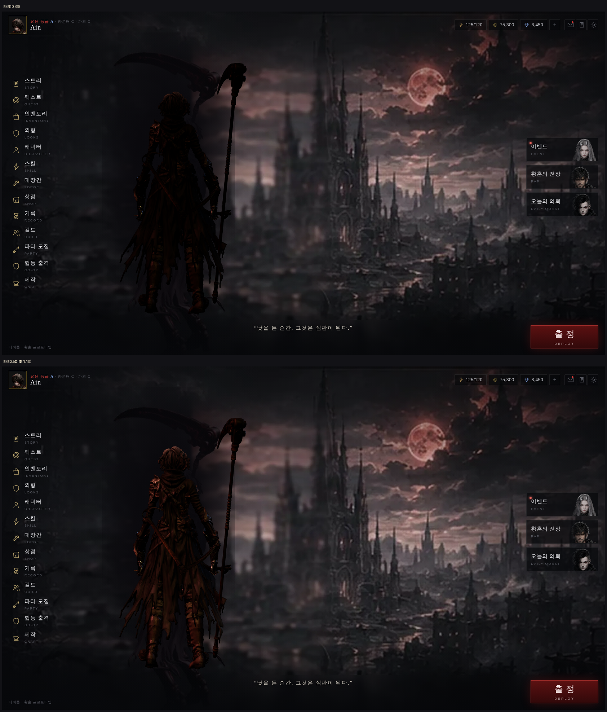

# 로비 밝기 — 노출이 아니라 빛이었다

> 디렉터: 「로비 밝기하자」 (#98 이후 계속 미뤄 둔 판단)

## 1. 먼저 재 봤다

노출(`toneMappingExposure`)만 훑었다. 캐릭터 화소만 골라 내려고 **캔버스를 껐다 켠
두 장을 빼서** 마스크를 만들었다 (배경 그림은 CSS 라 캔버스와 분리된다).

| 노출 | 캐릭터 평균 | 중앙 | 내부 대비 |
|---|---|---|---|
| 0.70 | 10.9 | 0.4 | 34.1 |
| 0.86 (당시) | 11.4 | 1.1 | 34.1 |
| 1.00 | 11.9 | 1.4 | 34.0 |
| 1.15 | 12.5 | 1.9 | 34.0 |
| 1.35 | 13.1 | 2.4 | 33.9 |

**노출을 두 배 가까이 올려도 평균이 10.9 → 13.1 밖에 안 움직인다.** 내부 대비는 아예 안 변한다.
중앙값이 1~2 라는 건 **캐릭터 화소의 절반 이상이 사실상 순검정**이라는 뜻이다.

## 2. 왜 안 오르나

아인의 옷은 반사율(albedo)이 거의 검정이다. 확산광은 `반사율 × 빛` 이므로
**반사율이 0 에 가까우면 빛을 아무리 곱해도 0 에 가깝다.** 노출은 그 위에 한 번 더
곱하는 값이라 마찬가지다.

막다른 길 두 개도 확인해 뒀다:

- **금속도 아니었다.** glTF 기본값이 `metalness=1` 이라 예전에 캐릭터가 쇳덩이로 나온 적이
  있는데(`docs/design/33` §4), `js/mat-fix.js` 가 이미 `metal 0 / rough .75` 로 고쳐 준다.
- **환경광도 아니었다.** 뷰어에는 있고 로비에는 없어서 그 차이인가 싶어
  `TW_ENV` 를 로비에 붙여 0 ~ 1.2 로 훑어 봤다. **평균 11.1 → 10.9, 변화 없음.**
  금속도 0 이라 IBL 반사분이 거의 안 들어온다. 되돌렸다.

## 3. 그래서 빛을 올렸다

| 판 | 하늘빛 · 달빛 · 채움 · 테두리 · 노출 | 캐릭터 평균 | 배경 중앙 대비 |
|---|---|---|---|
| A (당시) | 0.62 · 1.15 · 0.55 · 0.85 · 0.86 | 11.5 | −46 % |
| D | 1.25 · 2.40 · 0.70 · 1.20 · 1.05 | 15.3 | −28 % |
| **E ← 채택** | **1.45 · 2.90 · 0.85 · 1.50 · 1.10** | **17.5** | **−17 %** |
| F | 1.70 · 3.40 · 1.00 · 1.80 · 1.15 | 19.9 | −6 % |

**E 로 정했다.** F 는 배경과 밝기가 거의 같아져(−6 %) 캐릭터가 도시에서 떠 보인다.
E 는 주변보다 여전히 어두워 «밤 도시를 내려다보는 실루엣» 은 유지하면서,
어깨 견갑·외투 결·낫 끈·부츠·머리카락이 읽힌다.



휴대폰(915×412)에서도 확인했다 — 메뉴와 겹치지 않고 잘 읽힌다.

## 4. 되돌려지지 않게

`tests/lobby3d.test.cjs` 에 빛의 하한을 못 박았다. 누가 「너무 밝다」며
**노출만** 내리면 캐릭터는 다시 검은 덩어리가 되는데 검사에는 안 걸리기 때문이다.

```
달빛 ≥ 2.0 · 하늘빛 ≥ 1.2 · 테두리빛 ≥ 1.2 · 노출 1.0~1.3
```

`js/lobby3d.js` 에도 이유를 주석으로 남겼고, 검사가 그 주석의 존재까지 확인한다.

## 5. 남는 것

- 어둡게 다시 가고 싶으면 **노출이 아니라 달빛**을 내려야 한다.
- 캐릭터가 바뀌면(지피티의 Hi3D 아인이 본편에도 들어오면) 반사율이 달라지므로 다시 재야 한다.
  재는 방법은 §1 그대로다 — 캔버스를 껐다 켠 두 장의 차이가 곧 캐릭터 마스크다.
