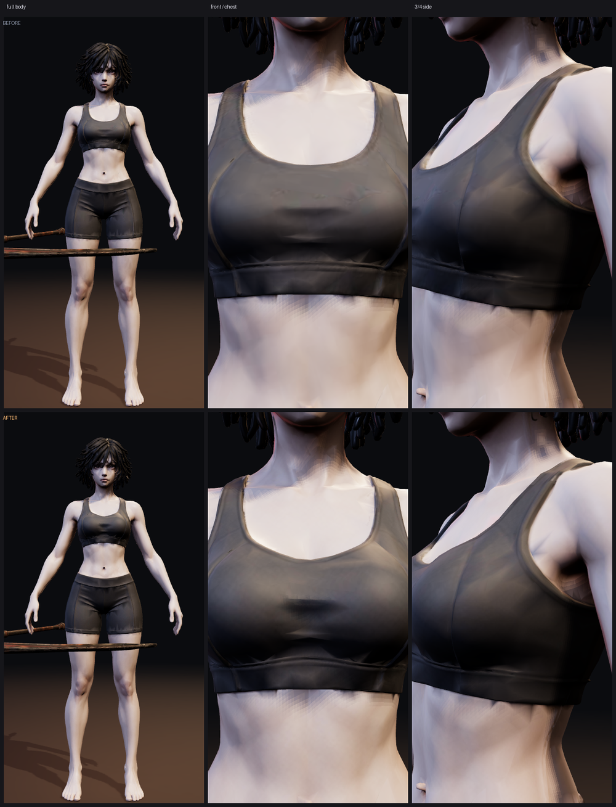
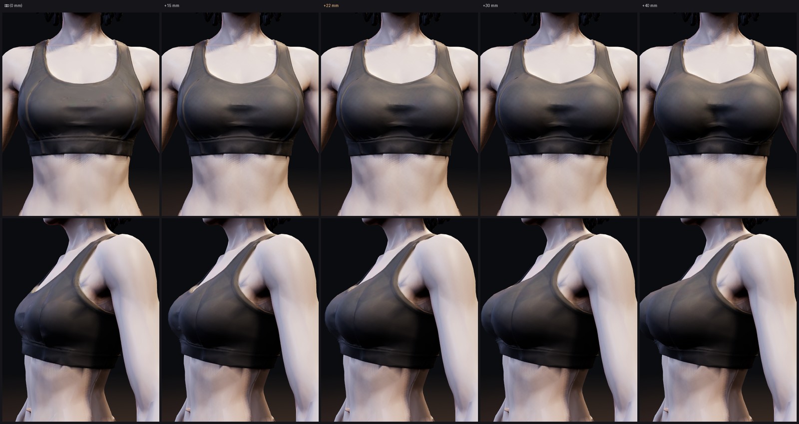
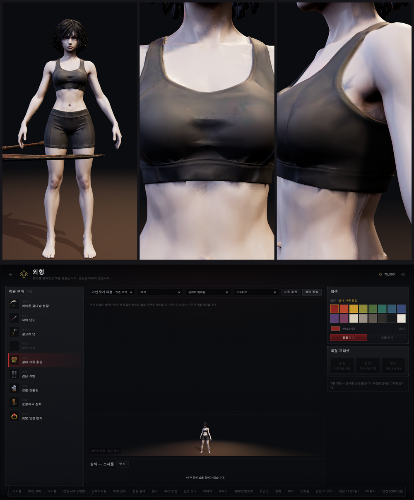
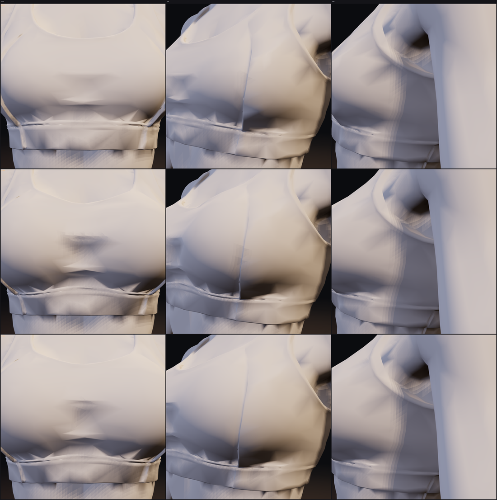
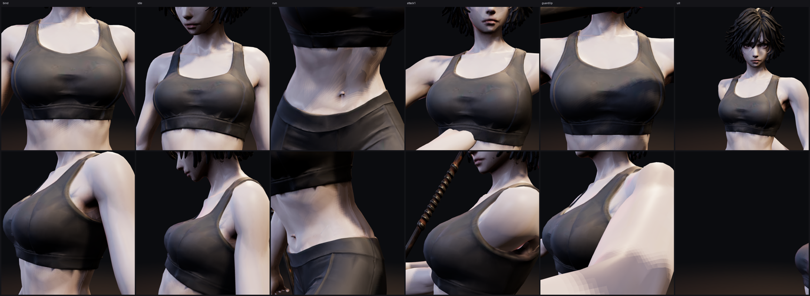

# 아인 체형 — 가슴을 «도입 단계» 에서 키운다

디렉터 지시: 컨셉 그림(스포츠 브라·반바지)에서 **가슴만 조금 더 크게** 해서 직접 만들 것.

지피티가 새 후보를 굽기를 기다릴 일이 아니었다. 그 그림으로 뽑은 몸이 이미
`art/3d/ain_body.glb` 로 들어와 있으니, **그 메시를 고치면 된다** — 얼굴도, 24관절
리그도, 28개 클립도 건드리지 않고.



---

## 1. 원래 어땠나

```
가슴 정점  z 1.23~1.24, 앞면 y −0.131   (척추 −0.022 기준 10.9 cm)
밑가슴     z 1.16,      앞면 y −0.115   ( 9.3 cm)
```

**갈비뼈 위로 올라온 높이가 1.6 cm 뿐**이었고, 좌우 봉우리 구분도 없었다 —
x = +0.06 과 x = 0 의 앞면 y 가 같은 값으로 나왔다. 한 덩어리였다는 뜻이다.

## 2. 한 번 틀렸다 — 정점 법선으로 밀면 메시가 찢어진다

처음에는 **정점 법선 방향**으로 밀었다. 그럴듯해 보였는데 렌더를 뜨니
브라 한가운데에 **검은 금**이 그어져 있었다.

원인: 이 메시는 UV 이음매에서 정점이 **같은 자리에 겹쳐서** 들어 있다. 겹친
정점들은 서로 다른 면에 속하므로 **법선이 다르다.** 법선 방향으로 밀면 같은
자리에 있던 둘이 서로 다른 쪽으로 가고, 꿰매 놓은 자리가 벌어진다.

**고친 방법: 변위를 «위치만» 의 함수로 만든다.** 같은 좌표면 같은 변위다.

```python
FWD = Vector((0, -1, 0))          # 아인은 −y 를 본다
BUST_C = (0.058, -0.105, 1.245)   # 좌우 봉우리 중심
BUST_R = (0.070, 0.078, 0.082)    # x 를 좁게 잡아야 가운데가 갈라진다

w  = (1 − ‖(p − c)/r‖²)²                       # 봉우리마다, 타원 밖은 0
u  = normalize(0.62·FWD + 0.38·normalize(p−c))  # 앞으로 밀되 조금 둥글게
Δp = clamp(Σ w·u, ‖·‖ ≤ 1) · amp
```

`RX = 0.070` 에 중심을 ±0.058 로 두면 x = 0 에서 두 봉우리의 가중치 합이 0.2 밖에
안 된다 — 그래서 가운데가 파인다. 반지름을 넓게 잡으면 가슴 하나로 뭉친다.

변형 뒤에는 glTF 가 심어 준 **커스텀 분할 법선을 지운다.** 안 그러면 새로 생긴
볼륨이 낡은 법선으로 칠해져 평평해 보인다.

## 3. 세기 — +22 mm 로 정했다



| | 가슴 앞으로 | 밑가슴 대비 | 가운데 파임 |
|---|---|---|---|
| 원래 | 10.9 cm | +1.6 cm | 0 |
| **+22 mm (채택)** | **12.5 cm** | **+3.2 cm** | 1.8 cm |

「조금 더 크게」에 맞는 폭이다. +40 mm 는 브라 밴드가 당겨 보이기 시작한다.
값 하나만 바꾸면 되므로 언제든 한 단계 올리거나 내릴 수 있다.

## 4. 어디에 넣었나 — 파일이 아니라 «파이프라인» 에

손으로 고친 메시를 들고 있으면, 지피티가 머리카락 분리된 후보를 올리는 순간
사라진다. 그래서 **도입 도구의 한 단계**로 넣었다.

```
python3 tools/3d/adopt_ain_body.py [--tex 1024] [--bust 0.022]
```

원본 `art/3d/base/ain_modular_rig_candidate.glb` 는 여전히 **건드리지 않는다.**
후보가 새로 오면 같은 명령을 다시 돌리면 가슴도 같이 따라온다.

`tests/base-body.test.mjs` 에 **이 단계를 빠뜨리면 걸리는 검사**를 넣었다 —
가슴 앞으로 0.140 m 초과, 가운데 파임 10 mm 초과.

## 5. 결과



```
정점 33,707 · 뼈 24 · 클립 28 · 2,881 KB   (바뀌기 전 2,952 KB)
키 1.680 m — 그대로
옮긴 정점 961 개 · 최대 18.1 mm
```

리그·클립·키·파일 크기 모두 그대로고, 외형 화면의 「속옷 차림」에도 바로 나온다.

## 6. 아직 아닌 것

**옷 입은 아인(`ain_anim.glb`)은 예전 몸 그대로다.** 지금은 몸체와 본편 모델이
서로 다른 메시라, 「속옷 차림」을 껐다 켜면 체형이 살짝 다르다. 본편 모델까지
맞추는 건 지피티의 몸/옷 분리(docs/design/41)가 끝난 뒤에 한 번에 하는 게 맞다 —
지금 두 번 손대면 그때 다시 해야 한다.

---

## 7. 지피티 리웨이팅(v3) 을 받고 — 확대해서 보정

지피티가 `ain_22mm_reweighted_v3.glb` 를 보내 왔다. 내 +22 mm 결과에 **스키닝을
다시 물린 것**이다. 가슴 모양·키·클립 28개·뼈 24개는 그대로고, 정점만 51개 늘었다.

**받은 값어치가 분명하다: `attack1` 에서 오른 어깨가 찢어지던 게 고쳐졌다.**
내 버전은 그 자세에서 어깨 위로 검은 조각이 튀어나왔는데 v3 는 깨끗하다.

### 7.1 무광으로 보고서야 알았다

확대해 보니 가슴 한가운데에 **검은 얼룩**이, 밑가슴 밴드에 **접힌 능선**이 있었다.
처음엔 텍스처 얼룩인 줄 알고 베이스 컬러를 뒤졌는데, 좌우 휘도가 0.723 / 0.728 로
차이가 없었다. 재질을 **무광 단색으로 갈아 끼우고 렌더**하니 답이 나왔다 —
**텍스처가 아니라 진짜 기하 함몰**이고, 변형 전 원본에는 없다. 내가 만든 것이다.



원인은 둘 다 **변형장의 가장자리가 급해서**다. 22 mm 를 4 cm 안에 세우니
테두리에서 기울기가 꺾인다. 그리고 한가운데는, 두 봉우리가 미는 방향이 서로
반대쪽으로 갈라져 **상쇄**되는 바람에 의도보다 깊게 팼다.

### 7.2 평활화는 실패했다 — 부피를 먹는다

라플라스 평활화로 펴려고 했다. 결과: 봉우리가 −0.147 → −0.137 로 주저앉고
가운데 파임이 **1.8 → 0.3 cm 로 사라졌다.** 가슴을 도로 없앤 셈이다.

### 7.3 빼지 않고 더했다

```
치마  = 넓은 방울(1.75×) − 좁은 방울   → 테두리에서만 1 인 «고리»
        봉우리(둘 다 1)와 바깥(둘 다 0)에서는 0 → 가슴 크기는 안 변한다
가운데 = (0, −0.100, 1.270) 에 반지름 (0.045, 0.070, 0.072), 앞으로 7 mm
```

| | 봉우리 앞으로 | 가운데 파임 |
|---|---|---|
| v3 (받은 것) | 12.5 cm | 18 mm — 그중 상당 부분이 «함몰» |
| **보정 후** | **12.8 cm** | **9.6 mm — 파임만 남고 함몰은 메워짐** |

### 7.4 원본이 두 갈래가 됐다

`tools/3d/adopt_ain_body.py` 는 이제 `ain_22mm_reweighted_v3.glb` 가 있으면 그걸
쓰고 **다듬기만** 한다. 없으면 후보에서 처음부터 키우고 다듬는다. 지피티의 리웨이팅을
잃지 않으면서도, 한 명령으로 다시 구울 수 있다.


