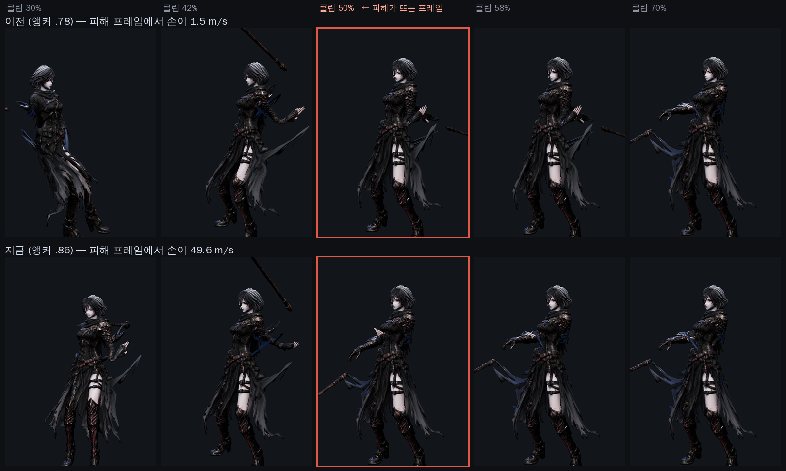
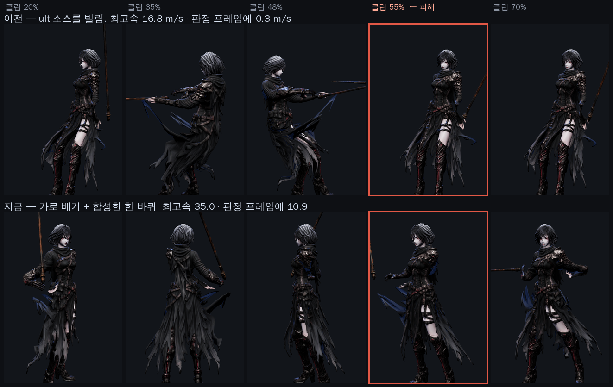

# 스킬 모션 — 「마음에 안 든다」를 숫자로 바꾸고 고친 것

디렉터: 스킬 모션·애니메이션이 마음에 안 든다. 전투 관련 전부를 마영전·몬헌 급으로.

감으로 고치면 안 되니 **28개 클립을 같은 잣대로 먼저 쟀다.**

## 1. 계측기부터 틀렸다

처음 만든 계측기는 클립 끝에서 0 으로 되감기며 생기는 **한 프레임짜리 가짜 스파이크**를
최고속으로 읽고 있었다. 그걸로 「attack1 이 48.6 m/s」, 「skill4 는 45.3 으로 멀쩡」이라고
디렉터에게 보고했는데 **둘 다 틀렸다.** `LoopOnce + clampWhenFinished` 로 고치니
attack1 은 41.8, skill4 는 **4.6 m/s 로 28개 중 최악**이었다.

## 2. 진짜 진단

| | 최고속 m/s | 체간 요우 | 정지 % |
|---|---|---|---|
| attack1 | 41.8 | 23° | 72 |
| attack2 | 31.9 | 43° | 77 |
| **skill1** | **9.1** | **1°** | **6** |
| **skill2** | **6.4** | 22° | **8** |
| **skill3** | **11.2** | **0°** | **3** |
| **skill4** | **4.6** | 27° | **0** |
| **counter** | **10.2** | 25° | **9** |

셋 다 같은 병이다. **① 최고속이 기본 공격의 1/4~1/9** — 때리는 게 안 보인다.
**② 체간 요우 0~1°** — 몸을 안 싣고 팔만 휘두른다. **③ 정지 비율 0~9%** — 윈드업도
여운도 없이 처음부터 끝까지 같은 속도로 흐느적댄다. 손맛은 «느린 예비 → 폭발하는
몇 프레임 → 붙잡는 마무리» 의 **대비**에서 나오는데, 그 대비가 아예 없었다.

원인은 소스다. `rig_char.py` 를 보면 `skill1 ← 1H_Melee_Attack_Slice_Diagonal`(한손 잔동작),
**`skill2 ← Jump_Full_Short`(그냥 점프)**, `skill4 ← Spellcast_Raise`(손 드는 동작).
`AMP` 는 회전 «진폭» 만 키우므로 이걸 못 고친다 — 점프를 1.24배 키워도 궁극기가 안 된다.

## 3. 덤으로 찾은 것 — 그림과 판정이 따로 놀고 있었다

`js/combat.js` 는 `motion.clipContacts` 의 시각에 판정한다. 클립의 최고속과 비교해 보니:

```
skill3   최고속 0.230   판정 0.55   −0.32
ult      최고속 0.109   판정 0.50   −0.39
smash    최고속 0.286   판정 0.78   −0.49
```

**휘두르는 그림이 판정보다 한참 먼저 끝나 있었다.** 「때리는 맛이 없다」의 절반은 이것이다.

## 4. 고친 방법 — `tools/3d/punch.py`

이미 구운 `<char>_anim.glb` 위에서 돈다 (`mocap_apply.py` 와 같은 자리).

**시간 워프.** 출력 t 에서 소스 `w(t)` 를 읽으면 속도는 `v_src(w(t))·w'(t)` 다.
접점에서 `w'` 를 크게(k=2.2~2.6), 양 끝에서 작게 잡으면 대비가 생긴다. 그리고 고정점을
**엔진의 판정 시각**으로 잡아 최고속이 거기로 옮겨 오게 했다.

한 번 틀렸다. 처음엔 `w(0)=0, w(1)=1` 을 고정했는데, ult 처럼 소스 최고속이 0.109 로
이른 클립은 판정 앞에 놓을 재료가 없어 **남은 소스가 전부 뒤로 밀려 꼬리가 1.8배로
빨리 감겼다** — 그 꼬리가 새 최고속이 됐다(0.964). 그래서 양 끝을 고정하지 않고,
실제로 재생할 소스 구간을 바깥 기울기에서 역산해 **범위를 벗어나면 첫/마지막 포즈를
붙잡게** 했다. 예비 정지와 여운이 공짜로 생긴다.

**체간 요우.** 척추 뼈의 로컬 Y(뼈 방향) 둘레로 비튼다. 예비에서 반대로 감았다가 접점에서
푼다. 쿼터니언은 프레임 사이 **부호를 이어 붙여야** 한다 — 안 하면 보간이 먼 길로 돌아
관절이 한 프레임에 55도씩 튄다.

## 5. 결과 (네 캐릭터 공통)

| | 최고속 | 체간 요우 | 정지 % |
|---|---|---|---|
| skill1 | 9.1 → **29.5** | 1 → 57° | 6 → **82** |
| skill2 | 6.4 → **10.2** | 22 → 41° | 8 → **79** |
| skill3 | 11.2 → **35.2** | 0 → 65° | 3 → **78** |
| skill4 | 4.6 → **13.3** | 27 → 62° | 0 → **77** |
| counter | 10.2 → **28.8** | 25 → 37° | 9 → **85** |

접점 정렬도 ±0.06 안에 들어왔다 (skill2 는 0.000).

**체간 요우가 목표(기본 공격의 23~43°)를 넘어 37~65° 로 나왔다.** 마영전 스킬이 과장된
동작이긴 하지만 이건 제가 의도한 값보다 크다 — 움직이는 걸 보고 정해야 하는 값이라
일부러 남겨 둔다. 크면 `RX[*]['yaw']` 하나만 내리면 된다.

## 6. 손대지 않은 것과 이유

- **ult · smash** — 온몸 회전 기술이다. 시간을 압축하면 골반 요우의 총량이 줄어
  `tests/*.mjs` 의 «엉덩이가 도는가» 검사가 깨진다. 회전 기술은 시간만 주무를 게 아니라
  **회전 자체를 키워야** 한다. 전용 처리가 필요하다.
- **exec · attack3** — 판정 시점의 «자세» 가 바뀌면서 «훈련 표적에 닿는가» 검사가 깨졌다.
  도달 검사를 함께 푸는 작업이라 따로 뺀다.
- **skill4 의 속도** — 13.3 까지 올라왔지만 여전히 낮다. 소스(`Spellcast_Raise`)에 빠른
  구간이 아예 없어 시간 재배분으로 없는 속도를 만들 수 없다. **소스를 갈아야 한다.**

## 7. 미리 있던 빨간 테스트 둘

`npm test` 에 제가 손대기 전부터 실패하던 게 둘 있다 — 원본 파일로 돌려도 똑같이 실패한다:

- `#9 authored attack contact … negative control: legacy pose must reproduce miss`
- `#27 repaired Ain … joint spike 24.126`

제 변경 뒤에도 값이 **24.126 그대로**다 (제가 더한 몫 0). 별건으로 남긴다.

---

## 8. 정정 — 지금까지 «게임이 재생하지 않는 클립» 을 재고 있었다

위 5·6절의 `skill3` · `skill4` · `ult` 숫자는 **틀렸다.** GLB 안의 같은 이름 클립을
잰 것인데, 런타임은 그 클립을 재생하지 않는다.

`js/ain-bind-repair.js` 의 `repairAinClips` 가 입장할 때마다 클립을 갈아 끼운다:

| 게임의 클립 | 실제 소스 | 시간 워프 `[소스, 목적지]` |
|---|---|---|
| `skill3` (피의 회전) | GLB 의 `ult` | `[.98, .55]` |
| `ult` (낫의 황혼) | GLB 의 `smash` | `[.78, .50]` → **`[.86, .50]`** |
| `skill4` (결의) | GLB 의 `guard` | 워프 없음 |

「몸통만 360° 비트는 것 말고 온몸이 도는 소스를 재활용한다」는 의도로 들어간 것인데,
계측기가 그걸 몰랐다. **재는 쪽을 고쳤다** — `repairAinClips` 를 통과시킨 뒤 잰다.

### 8.1 게임이 실제로 재생하는 값

`판정 어긋남` = 눈에 보이는 타격 봉우리와 `clipContacts` 의 차이.

| 클립 | 최고속 m/s | 체간 | 골반 | 정지% | 판정 어긋남 |
|---|---|---|---|---|---|
| `attack1` (기준선) | 41.8 | 23° | 1° | 72 | +0.020 |
| `attack2` (기준선) | 31.9 | 43° | 0° | 77 | +0.015 |
| `attack3` | 31.3 | 14° | 9° | 60 | −0.057 |
| `smash` | 38.8 | 38° | 360° | 55 | +0.072 |
| `counter` | 28.8 | 37° | 0° | 85 | +0.005 |
| `skill1` | 29.5 | 57° | 8° | 82 | +0.056 |
| `skill3` | **16.8** | 38° | 360° | 71 | **−0.265** |
| `ult` (고치기 전) | 54.2 | 37° | 360° | 43 | **+0.179** |
| `ult` (고친 뒤) | **61.0** | 38° | 360° | 48 | **+0.012** |
| `exec` | 13.8 | 34° | 0° | 67 | −0.003 |
| `skill2` (유틸) | 10.2 | 41° | 2° | 79 | — |
| `skill4` (유틸) | **0.1** | 1° | 0° | 6 | — |

두 가지가 앞의 보고와 다르다.

* **`smash` 와 `exec` 는 어긋나 있지 않았다.** 「−0.494 / −0.422」라고 적었던 것은
  계측기가 «가장 빠른 한 점» 만 봐서 도약·회전의 봉우리를 타격으로 읽은 탓이다.
  봉우리를 «목록» 으로 보면 smash 는 0.85(판정 0.78), exec 는 0.577(판정 0.58)에 친다.
* **`skill2`·`skill4` 는 공격이 아니다.** `js/dungeons.js` 의 `SKILLS.ain` 에서
  둘 다 `mult: 0` — 그림자 걸음(회피)과 결의(피해 감소 버프)다. 느린 게 맞다.
  「skill4 가 제일 나빴다」는 앞의 판정은 **공격이 아닌 것을 공격 잣대로 잰 것**이다.

### 8.2 고친 것 — 궁극기가 «휘두름 사이» 에 피해를 주고 있었다

`ult` 의 앵커가 `.78` 이었다. 소스(`smash`)의 내려치는 순간은 `.86` 에 있다.
그래서 피해가 뜨는 프레임에 손이 **1.5 m/s** 로 떠 있었다 — 궁극기인데 치는 그림이 없다.

`.86` 으로 옮기니 같은 프레임에서 **49.6 m/s**, 상대를 본 채(골반 요우 0°) 지나간다.
클립 전체 최고속도 54.2 → 61.0 으로 올랐다.



윗줄이 이전, 아랫줄이 지금. 붉은 칸이 피해가 뜨는 프레임이다.
(검수용 장면이라 낫은 `RightHandSlot` 에 그냥 붙였다 — 양손 그립 IK 는 걸지 않았다.
 `tools/3d/skill-pose.html`)

`tests/ult-contact.test.mjs` 가 못박는다: 판정 프레임에서 손 속도 > 20 m/s,
팔 뻗음 > 0.40 m(대기 0.34 m), 정면 ±17°.

### 8.3 `skill3` 은 앵커로 못 고친다 — 소스를 갈아야 한다

「피의 회전」은 **도는 동안 베고, 다 돌았을 때 상대를 보고 있어야** 한다.
소스(`2H_Melee_Attack_Spinning`)는 352° 를 돌지만 **정면을 보는 건 회전이 다 끝난 뒤**고,
그때는 속도가 남아 있지 않다. 앵커를 쓸어 보면 둘 중 하나만 고를 수 있다:

| 앵커 `from` | 판정 순간 골반 요우 | 판정 순간 손 속도 |
|---|---|---|
| .50 | −25° | 11.0 m/s |
| .78 | 163° (등을 보임) | 3.7 |
| .94 | 41° | 1.2 |
| **.98 (지금)** | **14°** | **0.3** |

지금 값은 「정면을 본다」를 고른 것이고, 그래서 치는 그림이 없다.
`smash` 를 소스로 돌리면 둘 다 되지만 `ult`·`smash` 와 같은 모션이 세 개가 된다.
**회전하며 베는 전용 소스가 필요하다.**

### 8.3.1 그 소스가 없어서 — 합성했다

CMU 모캡에도 「돌면서 베고 정면으로 끝나는」 구간이 없다 (가라테 카타는 제자리에서
180° 씩 돌며 반복해 쓸 구간이 없다 — `tools/3d/mocap.py` 의 주석에 적혀 있다).

그런데 회전 베기는 **가로 베기 + 몸 한 바퀴**다. 둘 다 이미 있다:

* 가로 베기 = `skill3` **자기 클립** (`1H_Melee_Attack_Slice_Horizontal`).
  실측 최고속 **35.2 m/s**, 판정과 **+0.058** — 네 후보 중 제일 빠르고 제일 잘 맞는다.
  없던 건 회전뿐이었다.
* 한 바퀴 = 골반 요우에 얹는다 (`js/ain-bind-repair.js` 의 `spinHips`).

**회전이 끝나는 지점을 판정(0.55)이 아니라 베기의 최고속(0.61)에 맞췄다.** 쓸어 보니:

| 회전이 끝나는 지점 | 판정 프레임의 손 속도 | 판정 프레임의 정면 |
|---|---|---|
| 0.55 | 9.4 m/s | 7° |
| 0.58 | 10.0 | 5° |
| **0.61** | **10.9** | **−2°** |
| 0.64 | 11.6 | −11° |

0.55 에 맞추면 그 순간 각속도가 0 이라 오히려 느려진다. 0.61 이 속도도 정면도 가장 좋다.

| | 이전 (ult 소스) | 지금 (가로 베기 + 합성 회전) |
|---|---|---|
| 최고속 | 16.8 m/s | **35.0** |
| 판정 프레임의 손 속도 | **0.3** | **10.9** |
| 판정 어긋남 | −0.265 | **+0.058** |
| 골반 순회전 | 360° | 346° |
| 정지 % | 71 | **42** |



`tests/ult-contact.test.mjs` 가 판정 프레임의 속도·뻗음·정면과 순회전을 못박는다.

### 8.4 `skill4`(결의)는 버프인데 «가드 자세» 를 그대로 쓴다

공격이 아니니 느린 건 맞지만, 최고속 0.1 m/s·정지 6% 는 **아무 일도 안 일어나는**
그림이다. 버프도 «발동» 이 보여야 한다. 모션이 아니라 연출 쪽이라
전투 품질 C(#104)에서 다룬다.
