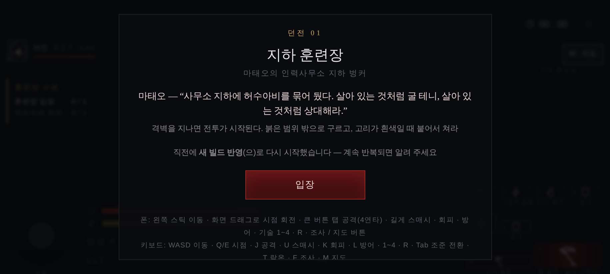

# 52 · 「들어가면 밖으로 나갔다가 다시 시작」 — 재시작 버그

디렉터 보고 (안드로이드 APK):

> 허수아비는 시작해서 들어가면. 또 밖으로 나갔다가 다시 시작하네.

던전에 들어간 직후 화면이 입장 화면으로 되돌아가 처음부터 다시 시작된다.
이 문서는 **원인을 추측으로 닫지 않고**, 재시작 경로를 전부 찾아 막고,
다음에 또 나면 **이유가 화면에 남도록** 만든 기록이다.

---

## 1. 스스로 새로 시작하는 경로는 두 개다

`location.reload()` 를 부르는 곳을 전부 훑었다 (죽음 후 재도전·설정 초기화 같은
«사용자가 누른» 경로 제외).

| # | 위치 | 언제 | 증상 |
|---|---|---|---|
| A | `js/game3d.js` `blackWatch()` → `safeMode('black')` | 시작 후 25초 안에 화면이 «비었다» 고 4초 연속 판정 | 전투 전(`explore`)이면 곧장 리로드 |
| B | `js/ui.js` `swUpdates()` → `reloadOnce()` | 서버 `version.json` 의 빌드가 내 빌드와 다를 때 | 던전 한복판이라도 리로드 |

B 는 **내가 배포할 때마다** 걸린다. 디렉터가 플레이하는 동안 커밋을 올리면
그 다음 앱 복귀·입장에서 한 번 리로드된다 — 증상과 정확히 같다.

## 2. A 는 헤드리스에서 재현되지 않았다 (실측)

`blackWatch` 는 화면 네 곳(32×32)을 읽어 **네 곳이 모두 균일하면** 빈 프레임으로 셌다.
어깨 너머 카메라(3.9 m)로 바꾼 뒤 어두운 벙커에서 이게 걸리는지 실제로 쟀다.

측정: 915×412, `?d=d01`, 대사창을 끝까지 넘기고 `explore` 로 24초, 1초마다
게임 루프 «안에서» 읽은 값 (readPixels 는 프레임 밖에서 읽으면 빈 값이 나온다).

```
      가운데        좌상           우상          하단
 0s   22~ 58      32~ 65       21~ 62       16~212
 5s   25~ 59      32~ 65       21~ 62       16~ 74
10s   28~ 57      32~ 65       20~ 62       16~ 63
15s   26~ 59      32~ 65       21~ 61       16~211
```

네 곳 어디도 균일하지 않다 (패치 안 편차 30 이상). **옛 판정 연속 0회.**
즉 이 환경에서는 A 가 원인이라고 말할 수 없다. 원인 후보로 남기고 규칙만 고친다.

> 한계: 여기는 GPU 가 없어 SwiftShader 로 그린다. 디렉터의 S25 와 픽셀이 같지 않다.
> 「A 는 아니다」 가 아니라 「A 를 재현하지 못했다」 가 정확한 서술이다.

## 3. 판정을 «어둡기» 가 아니라 «고름» 으로 바꿨다

처음엔 «균일하고 게다가 거의 검을 때» 로 좁히려 했는데, 그러면 진짜 실패를 놓친다 —
던전 배경색 `0x10161a` 만 남은 화면은 휘도가 20.6 이라 «검지» 않다.

바른 구분은 **화면 전체가 한 색인가** 이다. 그려진 벽은 어두워도 네 곳의 색이 서로 다르다
(위 실측: 22~58 / 32~65 / 21~62 / 16~212). 아무것도 안 그려지면 네 곳이 같은 색이다.

`js/blackwatch.js` 로 떼어 내고 시험으로 못박았다 (`tests/blackwatch.test.mjs`).

```
빈 프레임 = 패치마다 편차 < 3  그리고  네 패치를 통틀어 편차 < 4
```

같이 고친 것:
* **대사창(`#dlg`)이 떠 있는 동안은 보지 않는다.** 가운데 패치를 대사창이 덮는다.
  (실측 중 발견 — 대사창이 켜진 동안 감시가 도는 구조였다)

## 4. B 는 «출격 중 갈아타지 않기» 로 막았다

`js/ui.js` 에 `window.TW_BUSY` 약속을 뒀다. 화면이 바쁘다고 답하면 새 빌드를
**미뤄 두고** 20초마다 다시 본다. `js/game3d.js` 는 `battle || state==='fight' || state==='explore'`
동안 바쁘다고 답한다. 던전을 나가면 그때 반영된다.

## 5. 다음에 또 나면 이유가 보인다

재시작 직전에 `sessionStorage['tw:restart']` 에 한 줄 남긴다 (이유·레벨·상태·경과).
다음 입장 화면에 그대로 뜬다:

> 직전에 **새 빌드 반영**(으)로 다시 시작했습니다 — 계속 반복되면 알려 주세요



진단 화면(일시정지 → 진단)의 오류 목록에도 같은 줄이 남는다.
이유가 `검은 화면 감지` 로 뜨면 A, `새 빌드 반영` 이면 B 다.

## 6. 남은 것

* 실제 기기에서 한 번 더 확인 — 위 안내 문구가 어느 이유로 뜨는지.
* 카메라 회전 다듬기는 디렉터 지시로 뒤로 미룸 (「아직 좀 어색한데 나중에하고」).
