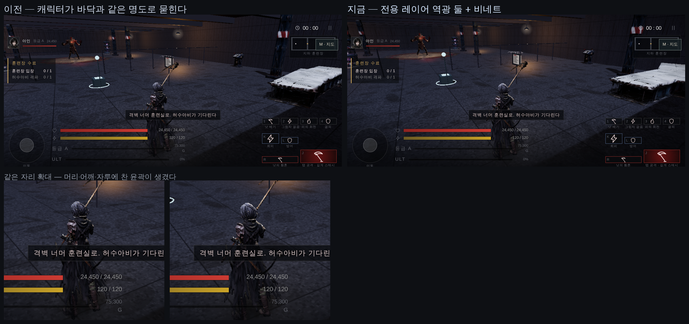

# 53 · 전투 그래픽 — 캐릭터가 배경에 묻히지 않게

디렉터: **「이펙트·그래픽 품질 등 전투 관련 모든 걸 마영전·몬헌 급으로 올려야 돼」**
그리고 **「우리는 다른 거 다 포기하고 캐릭터와 전투에 올인하는 게임이야」**

그래서 먼저 **지금 그림을 한 장 찍어 놓고** 무엇이 제일 나쁜지 봤다.

## 1. 제일 나쁜 것 — 주인공이 안 보인다

왼쪽이 이전이다. 어두운 벙커에서 **캐릭터의 명도와 바닥의 명도가 거의 같다.**
캐릭터와 전투에 올인하는 게임인데 주인공이 배경에 녹아 있었다.

조명은 이미 여럿 있었다 — 반구광, 달빛 방향광(그림자), 플레이어를 따라다니는 점광,
램프 여럿, 보스 스포트. 없던 것은 **역광(rim light)** 이다. 몬헌·마영전 둘 다
주인공 뒤에서 빛을 넣어 윤곽선을 살린다. 앞에서 비추는 빛만으로는 실루엣이 안 선다.

## 2. 한 번 틀렸다 — 방향광은 «장면 전체» 를 밝힌다

그냥 `DirectionalLight` 를 하나 더 넣었더니 벙커가 통째로 밝아져서
**어두운 지하 훈련장이 사라졌다.** 방향광은 대상을 가리지 않는다.

그래서 **전용 레이어**(`RIM_LAYER = 2`)에 올렸다. three.js 는 물체의 레이어와
조명의 레이어가 겹칠 때만 그 조명을 먹인다. 아인과 보스만 레이어 2를 켠다 —
바닥·벽·소품은 그대로 어둡다.

장비·머리카락은 나중에 붙으므로 매 프레임 `traverse` 로 레이어를 다시 켠다
(물체 60여 개에 비트 OR — 51만 삼각형에 비하면 없는 비용이다).

## 3. 값

| | 각도(카메라 축 기준) | 색 | 세기 | 높이 |
|---|---|---|---|---|
| 주 역광 | **+58°** | `0x9FC0FF` (찬색) | 3.0 | 3.6 m |
| 보조 역광 | **−68°** | `0xFFB98A` (더운색) | 1.5 | 2.6 m |

정면 «바로» 뒤(0°)에 두면 등만 밝아지고 윤곽선이 안 산다. 좌우로 비틀어 3/4 역광
둘을 쓰는 것이 실사 조명의 기본이고, 두 색을 대비시키면 실루엣이 더 선다.
둘 다 그림자는 끈다 — 윤곽만 필요하다.

## 4. 비네트

가장자리를 눌러 눈이 화면 가운데로 가게 한다. **CSS 한 장**이라 GPU 비용이 없다
(`game3d.html` 의 `.vignette` — 선언만 해 두고 안 쓰던 클래스를 이제 실제로 붙였다).
이미 어두운 방이라 과하면 답답해지므로 약하게: 55% 지점부터 시작해 모서리에서 0.50.

## 5. 정직하게 — 이건 «한 급» 이 아니라 «반 급» 이다

위 사진에서 보이듯 나아졌지만 **극적이지는 않다.** 남은 큰 지렛대는 **블룸**이다.
지금 램프·불꽃·궤적은 전부 가산 스프라이트인데, 블룸이 없으면 «빛» 이 아니라
«밝은 그림» 으로 보인다. 몬헌·마영전의 타격이 눈부신 건 대부분 블룸 덕이다.

**아직 안 했다.** 이유:
* `vendor/three` 에 `EffectComposer` 가 없다 — 렌더 타깃 두 장과 셰이더 패스 셋을
  직접 짜야 한다 (렌더 경로 전체가 바뀐다).
* **이 컨테이너에는 GPU 가 없다.** SwiftShader 로 19~24 fps 가 나오는 환경에서
  「S25 에서 몇 ms 더 든다」를 잴 수 없다. 재지 못하는 성능 변경을 디렉터 폰에
  바로 올리고 싶지 않다.
* 포스트 패스가 깨지면 **검은 화면**이다 — 방금 고친 그 증상이다.

그래서 블룸은 **되돌리기 쉬운 설정 토글과 함께** 별도로 올리는 것이 맞다.
디렉터가 폰에서 지금 상태를 보고 「더」라고 하면 그때 한다.

## 6. 안 한 것

* **바닥 자국(데칼).** 큰 타격이 바닥에 흔적을 남기지 않는다.
* **다운·기절 연출.** 경직 단계가 둘뿐이다 (docs/design/50 §4).
* **블룸** — 위 참조.
