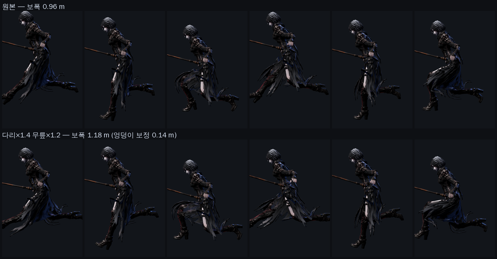

# 54 · 달리기가 미끄러지고 있었다

디렉터: **「모션의 정확도. 애니메이션의 시원함.」**

전투 클립만 재고 로코모션은 **한 번도 재 본 적이 없었다.** 재 보니 제일 큰 구멍이 거기 있었다.

## 1. 숫자

제자리 클립이므로 클립이 «낼 수 있는» 지면 속도는 이렇게 정해진다:

```
지면 속도 = 보폭 × 두 걸음 × 초당 사이클
```

| | 값 |
|---|---|
| 엔진이 캐릭터를 옮기는 속도 | **4.60 m/s** (`js/dungeon.js` `player.speed` 230 px ÷ 50 px/m) |
| run 클립의 보폭 | 0.96 m |
| run 클립 길이 · 배속 | 0.83 s · 1.15 |
| **클립이 내는 지면 속도** | **2.64 m/s** |
| **차이 = 미끄러짐** | **1.96 m/s — 이동의 43%** |

**이동의 43% 동안 발이 땅을 딛지 않고 흐르고 있었다.** 액션 게임에서 제일 먼저
싸구려로 읽히는 지점이다. 걷기는 더 나빴다 (2.83 m/s 차이).

## 2. 고친 방법 둘

### 2.1 보폭을 키운다 — `tools/3d/stride.py`

배속만 올리면(1.15 → 2.0) 빨리감기처럼 보인다. 보폭 자체를 키워야 한다.
다리 관절의 **회전 각**을 키우고, 키운 만큼 **디딤발이 원래 높이에 그대로 닿도록**
엉덩이를 매 프레임 내린다.

**한 번 크게 틀렸다.** 처음엔 basis 쿼터니언의 «절대 각» 을 배수했다. 그랬더니
보폭이 1.27 m 에서 멈춰 `--leg` 를 1.9 에서 3.0 까지 올려도 꿈쩍하지 않았다.
달리기의 고관절 회전은 «일정한 굽힘 + 앞뒤 스윙» 인데, 절대 각을 키우면 굽힘까지
같이 커져 다리가 한쪽으로 고정될 뿐 **스윙 폭은 안 는다.** 보폭을 만드는 건
평균이 아니라 **평균에서 벗어난 양**이다. 한 사이클의 평균 자세를 먼저 구하고
«평균으로부터의 흔들림» 만 배수하도록 고쳤다.

**두 번째로 크게 틀렸다.** 엉덩이 보정이 수렴하지 않고 9.87 m 까지 튀어 캐릭터가
화면 밖으로 날아갔다. 원인은 **액션을 붙인 채로 고치려 한 것**이다 —
`view_layer.update()` 가 F커브로 포즈를 되돌려서, 「고치고 → 다시 재고 → 또 고치는」
되먹임이 매번 원점으로 돌아갔다. 소스를 미리 다 떠 놓고 액션을 떼어 낸 뒤
수동 포즈로만 작업하도록 바꿨다.

적용값 `--leg 1.4 --knee 1.2 --arm 1.35`. 더 키울 수도 있지만 엉덩이가 그만큼
내려간다(다리×1.8 이면 0.31 m — 쭈그린 자세가 된다). 1.4 에서 0.14 m 다.

| | 이전 | 지금 |
|---|---|---|
| 보폭 (아인, 모델 배율 포함) | 1.09 m | **1.35 m** |
| 엉덩이 보정 | — | 0.14 m |



### 2.2 배속을 «클립에서 역산» 한다 — `js/locomotion.js`

상수로 박으면 캐릭터마다 다리 길이가 달라 또 어긋난다 (아인 보폭 1.35 m,
카인 1.50 m — 같은 배속이면 카인이 «앞질러» 간다). 그래서 로드할 때 실제 클립의
보폭을 재서 계산한다:

```
배속 = 이동 속도 × 클립 길이 ÷ (2 × 보폭)
```

아인은 1.42 가 나왔다. 그리고 **스틱을 살살 밀면 배속도 같이 줄인다** — 반쯤 민
상태에서 실제 속도는 절반인데 다리만 전속으로 돌면 그때 또 미끄러진다.

`tests/locomotion.test.mjs` 가 네 캐릭터 모두에 대해 ① 배속이 상·하한에 걸리지
않는지 ② 지면 속도가 엔진 속도와 0.05 m/s 안에 드는지 ③ 보폭이 다시 줄지 않았는지를
못박는다.

## 3. 덤으로 잡은 버그 — 로컬 변수가 «레벨» 을 가렸다

`measureRunRate()` 안에서 발 위치 배열을 `L` 로 썼는데, 그게 모듈의 «레벨» `L` 을
가려서 `L.player.speed` 가 터졌다. 로더 콜백이 통째로 죽어 **로드 2/4 에서 멈춘 채
검은 화면**이 됐다. GLTFLoader 의 콜백은 프라미스 안이라 `pageerror` 로도 안 보인다.
`LF/RF` 로 바꾸고, 그 호출을 `try/catch` 로 감싸 다음에 또 던져도 로딩은 끝나게 했다.

## 4. 남은 것

* **회전(턴) 모션이 없다.** 제자리에서 홱 도는 대신 발을 딛고 도는 클립이 필요하다.
* **가속·감속.** 출발은 즉시, 정지는 브레이크 클립 하나뿐이다.
* ~~`skill3` 전용 소스~~ — **합성으로 풀었다** (docs/design/49 §8.3.1).
  CMU 에도 맞는 구간이 없어서, 가로 베기에 골반 한 바퀴를 얹었다.
* **exec(13.8 m/s)·skill2(10.2)** — 기본 공격(32~42)에 한참 못 미친다. 다음 차례.
